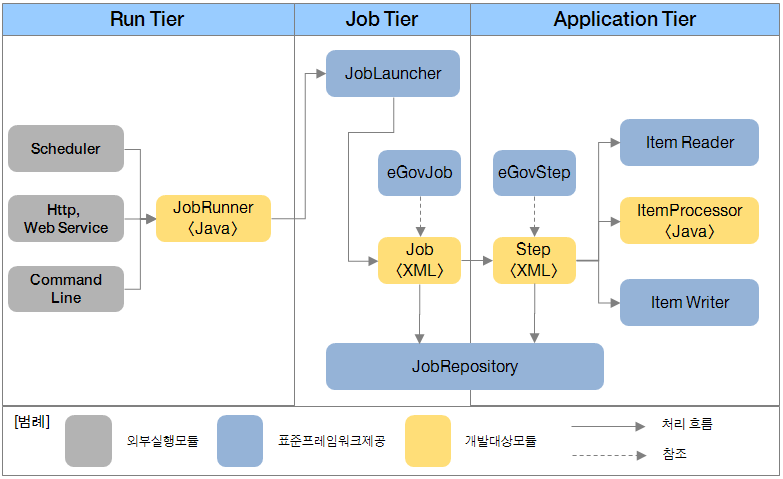
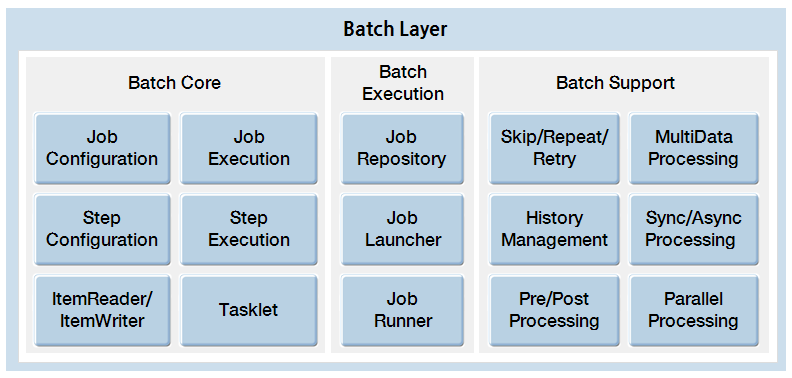

# 배치 실행환경 소개

## 개요

전자정부 표준프레임워크는 대용량 데이터 처리 지원을 위해 작업 수행, 결과 관리, 스케줄링 관리 기능을 제공한다. 배치 실행환경은 **Spring Batch**를 기반으로 하며, [Spring Batch 5.2 Reference](https://docs.spring.io/spring-batch/reference/5.2/index.html)(5.2.3 호환)의 배치 도메인 및 아키텍처와 정합성을 유지한다.

엔터프라이즈 환경에서 많은 애플리케이션은 대량 처리를 통해 비즈니스 작업을 수행한다. 예를 들면 다음과 같다.

- **자동화된 대용량 처리**: 사용자 개입 없이 효율적으로 처리하는 대량 정보의 복잡한 처리(월말 계산, 통지, 서신 등 시점 기반 이벤트)
- **복잡한 비즈니스 규칙의 주기적 적용**: 매우 큰 데이터 집합에 반복 적용(보험 급부 결정, 요율 조정 등)
- **시스템 간 연계**: 내·외부 시스템에서 수신한 정보의 포맷 변환, 검증, 트랜잭션 단위 처리

Spring Batch는 스케줄링 프레임워크가 아니다. Quartz, Cron 등 스케줄러와 **함께 동작**하도록 설계되어 있으며, 스케줄러를 대체하지 않는다. Spring Batch는 대용량 레코드 처리에 필요한 **로깅·추적, 트랜잭션 관리, Job 처리 통계, Job 재시작, Skip, 리소스 관리** 등 재사용 가능한 기능을 제공하고, 최적화·파티셔닝을 통한 고성능 배치 Job도 지원한다.

## 목표

배치 실행환경은 대용량 데이터 처리를 위한 기반 환경을 제공함으로써 배치 실행에 필요한 핵심 기능을 제공한다.

### 비즈니스 시나리오(Spring Batch 5.2.3 기준)

- 주기적 커밋 배치 처리
- 동시 배치 처리(Job의 병렬 처리)
- 단계별 메시지 기반 처리
- 대규모 병렬 배치 처리
- 실패 후 수동·스케줄 재시작
- 의존 Step의 순차 처리(워크플로 기반 배치 확장)
- 부분 처리: Skip(롤백 시 일부 레코드 스킵 등)
- 소규모 배치 또는 기존 저장 프로시저·스크립트를 사용하는 전체 배치 트랜잭션

### 기술 목표(Spring Batch 5.2.3 기준)

- Spring 프로그래밍 모델 사용: 비즈니스 로직에 집중하고 인프라는 프레임워크에 위임
- 인프라, 배치 실행 환경, 배치 애플리케이션 간 관심사 분리
- 모든 프로젝트가 구현할 수 있는 공통 핵심 실행 서비스 인터페이스 제공
- 기본 구현을 통한 즉시 사용 가능한(out of the box) 구성
- Spring 프레임워크를 모든 계층에서 사용하여 설정·커스터마이징·확장 용이
- 기존 핵심 서비스를 인프라 계층에 영향 없이 교체·확장 가능
- 애플리케이션과 아키텍처 JAR 완전 분리, Maven 기반의 단순한 배포 모델

## 일반적인 배치 프로그램(Spring Batch 5.2.3 기준)

일반적인 배치 프로그램은 다음 흐름을 따른다.

1. **데이터베이스, 파일, 큐** 등에서 많은 레코드를 읽는다.
2. **어떤 방식으로든** 데이터를 처리한다.
3. **변형된 형태로** 데이터를 다시 쓴다.

Spring Batch는 이 기본 배치 반복을 자동화하며, 오프라인 환경에서 사용자 개입 없이 유사한 트랜잭션을 집합 단위로 처리할 수 있게 한다. Spring Batch는 엔터프라이즈 규모의 견고한 배치 솔루션을 제공하는 대표적인 오픈소스 프레임워크이다.

## 배치 실행환경 수행 과정  

전자정부 표준프레임워크 실행환경에 추가된 배치 실행환경은 3-Tier(Run, Job, Application Tier)로 구성되며, 대용량 데이터 처리를 위한 기반 환경을 제공한다.  

## Run Tier
Run Tier는 배치 응용 프로그램의 실행을 담당한다. 실행 방식에 따라 **Scheduler**, **Http/Web service**, **CommandLine**으로 나눌 수 있다.  

✔ Spring 배치에서는 Scheduler 실행을 위해 **Quartz**나 **Cron**을 이용하도록 권고하고 있다.

Run Tier에서의 동작 순서는 다음과 같다:

1. **Job Configuration**은 XML 또는 Java 설정으로 Job을 수행하는 데 필요한 설정 정보를 담는다.
2. **Scheduler**, **Http/Web service**, **CommandLine** 등의 외부 모듈이 **JobRunner**를 호출한다.
3. **JobRunner**는 **JobExplorer**를 통해 Job Configuration에 등록된 **Application Context** 정의를 참조하여, **Job Tier**의 **JobLauncher**가 Job을 실행할 수 있도록 정보를 전달한다.

---

## Job Tier
Job Tier는 전체적인 Job 수행을 책임지며, 각 Step을 지정된 상태와 정책에 따라 순차적으로 수행한다.

Job Tier에서의 동작 순서는 다음과 같다:

1. **Job**과 **Step**은 Spring Batch의 Job·Step을 참조하며, XML 또는 Java 설정으로 정의한다.
2. **JobLauncher**는 **JobRunner**로부터 전달받은 Job 설정 정보와 정의된 내용을 바탕으로 실제 Job을 수행한다.
3. **JobRepository**는 수행되는 Job의 정보를 담고 있으며, Job 수행 단계에 따라 상태 정보를 저장한다.

---

## Application Tier
Application Tier는 Job과 Step을 수행하는 데 필요한 컴포넌트로 구성된다.

Application Tier에서의 동작 순서는 다음과 같다:

1. **Step**은 Spring Batch의 Step을 참조하며, XML 또는 Java 설정으로 기술한다. 하나의 Job은 하나 이상의 Step으로 구성된다.
2. **ItemReader** / **ItemWriter**는 Chunk 기반 Step에서 데이터 읽기·쓰기를 담당하며, 일반적인 Step 동작에 사용된다.
3. Step은 **ItemReader**를 이용해 **File/DB**에서 데이터를 읽고, **ItemProcessor**로 데이터를 가공한 후, **ItemWriter**를 통해 가공된 데이터를 다시 **File/DB**로 쓴다.

---

## 배치 실행환경 기술 요소 구성
전자정부 표준프레임워크 실행환경에 포함된 대용량 데이터 처리 계층은 Job 구조를 정의하는 **Batch Core**, Job 실행을 지원하는 **Batch Support**, 다양한 실행환경을 지원하는 **Batch Execution**으로 구성되어 있다. 배치 실행환경의 기술 요소와 기능은 다음 그림과 같다.

---

## 배치 실행환경 지원

- [Spring Batch 5.2 신규 기능 ↑](./batch-core-whatsnew_5.2.md)  
Spring Batch 5.2에서 도입된 주요 변경 사항(의존성 업그레이드, MongoDB Job Repository, Resourceless Job Repository, Composite Item Reader, java.util.function 어댑터 등)을 설명한다.

- [SQLite ↑](./batch-core-sqllite.md)  
**SQLite**를 사용한 경량화된 Repository 사용법을 설명한다.

- [Logback logging ↑](./batch-support-logback_logging.md)  
**SQLite**를 사용한 경량화된 로깅 처리의 기본 사용법을 설명한다.

## 참고 문서

- [Spring Batch 5.2 Reference](https://docs.spring.io/spring-batch/reference/5.2/index.html)  
- [Spring Batch Introduction](https://docs.spring.io/spring-batch/reference/5.2/spring-batch-intro.html)  
- [The Domain Language of Batch](https://docs.spring.io/spring-batch/reference/5.2/domain.html)
