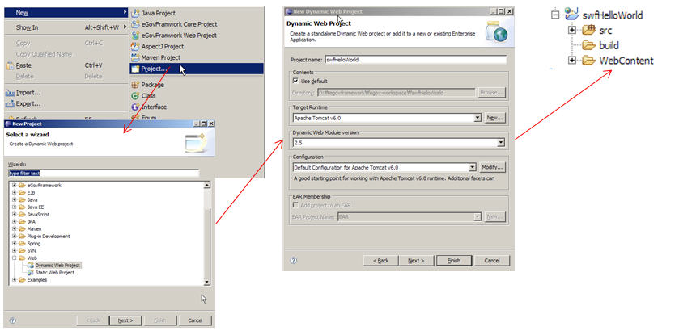
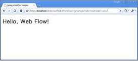

# Hello, World

## 개요

처음으로 접하므로 여기서는 Hello World 를 찍어 보면서 실행하는 것을 살펴 보도록 하겠다.
Hello World 는 두가지 버전으로 입력되는 값이 없이 단지 Hello, Web Flow 화면을 호출 하는 것과 입력값을 가지고 분기처리등 서비스 메소드를 실행후 결과를 화면으로 보여주는 버젼으로 나누어 설명하도록 하겠다. 실행하여 보고자 하는 화면결과는 아래와 같다.


## 설명

Spring Web Flow 는 사용자와 Service를 제공하는 서버간의 대화하듯한 화면의 이동을 정의 하는 것이다.
SWF(Spring Web Flow)는 사용자와 화면간의 대화형태로 웹 대화형 시나리오를 중심으로 접근한다.



## web.xml

webContent/WEB-INF 아래 web.xml을 아래와 같이 작성한다.
contextConfigLocation 의 값으로 /WEB-INF/config/web-application-config.xml 을 설정한다.
servlet 으로 org.springframework.web.servlet.DispatcherServlet 를 등록하고 /spring/* URL 정보를 매핑해준다.

```xml
<?xml version="1.0" encoding="ISO-8859-1"?>
<web-app xmlns="http://java.sun.com/xml/ns/j2ee" xmlns:xsi="http://www.w3.org/2001/XMLSchema-instance"
	xsi:schemaLocation="http://java.sun.com/xml/ns/j2ee http://java.sun.com/xml/ns/j2ee/web-app_2_4.xsd"
	version="2.4">
 
	<!-- Spring Web 어플리케이션을 위한 메인 설정파일을 등록한다. -->
	<context-param>
		<param-name>contextConfigLocation</param-name>
		<param-value>
			/WEB-INF/config/web-application-config.xml
		</param-value>
	</context-param>
 
	<!-- Spring Web 어플리케이션 컨테스트를 로딩한다. -->
	<listener>
		<listener-class>org.springframework.web.context.ContextLoaderListener</listener-class>
	</listener>
 
	<!-- Spring Web 어플리케이션의 맨 앞단 Controller(DispatcherServlet) 를 등록한다. -->
	<servlet>
		<servlet-name>Spring MVC Dispatcher Servlet</servlet-name>
		<servlet-class>org.springframework.web.servlet.DispatcherServlet</servlet-class>
		<init-param>
			<param-name>contextConfigLocation</param-name>
			<param-value></param-value>
		</init-param>
		<load-on-startup>0</load-on-startup>
	</servlet>
 
	<!-- 모든 spring 요청에 대한되는 request를 DispatcherServlet 와 매핑하여 처리 할 수 있도록 한다. -->
	<servlet-mapping>
		<servlet-name>Spring MVC Dispatcher Servlet</servlet-name>
		<url-pattern>/spring/*</url-pattern>
	</servlet-mapping>
 
	<welcome-file-list>
		<welcome-file>index.html</welcome-file>
	</welcome-file-list>
 
</web-app>
```

### web-application-config.xml

Spring MVC 와 Spring Web Flow 를 위한 설정파일은 아래와 같다.


먼저 web-application-config.xml 를 살펴보겠다.
  
```java
<?xml version="1.0" encoding="UTF-8"?>
<beans xmlns="http://www.springframework.org/schema/beans"
       xmlns:xsi="http://www.w3.org/2001/XMLSchema-instance"
       xmlns:context="http://www.springframework.org/schema/context"
       xsi:schemaLocation="
           http://www.springframework.org/schema/beans
           http://www.springframework.org/schema/beans/spring-beans-2.5.xsd
           http://www.springframework.org/schema/context
           http://www.springframework.org/schema/context/spring-context-2.5.xsd">
 
	<!-- 어플리케이션 소스를 스캔하여 로딩 하도록 한다. -->
	<context:component-scan base-package="org.egovframe.swf.sample.service" />
 
 
	<!-- 편의를 위하여 Spring MVC 설정과 Spring Web Flow 를 위한 설정을 별도록 분리하여 가져오도록 한다.--> 
	<import resource="webmvc-config.xml" />
	<import resource="webflow-config.xml" />
 
</beans>
```

#### webmvc-config.xml

Spring MVC 를 위한 설정파일.
  
```java
<?xml version="1.0" encoding="UTF-8"?>
<beans xmlns="http://www.springframework.org/schema/beans"
	xmlns:xsi="http://www.w3.org/2001/XMLSchema-instance"
	xsi:schemaLocation="
           http://www.springframework.org/schema/beans
           http://www.springframework.org/schema/beans/spring-beans-2.5.xsd">
 
	<!--
	  flowRegistry 에 등록된 flow 와 요청되는 path 와 매핑해주는 역할을 수행한다. 
		예제에선 요청되는 .../swfHelloWorld/spring/sample/hello  URL 정보를 이용하여 flow 내에서 sample/hello ID로 찾음.
	-->
	<bean class="org.springframework.webflow.mvc.servlet.FlowHandlerMapping">
		<property name="order" value="0" />
		<property name="flowRegistry" ref="flowRegistry" />
	</bean>
 
	<bean
		class="org.springframework.web.servlet.mvc.support.ControllerClassNameHandlerMapping">
		<property name="order" value="1" />
		<property name="defaultHandler">
		  <!-- UrlFilenameViewController 는 spring/start 으로 접근하는 path 정보를 이용하여 
		   View 이름을 추출하여 View 를 반환하게 된다. 여기서는 tiles 의 view 반환하게 된다. -->
			<bean class="org.springframework.web.servlet.mvc.UrlFilenameViewController" />
		</property>
	</bean>
 
	<!--
	  Controller 에 의해 반환된 View 명을 tiles 로 보내어 tiles 에 미리 정의된 화면을 보여주도록 한다.
	-->
	<bean id="tilesViewResolver" class="org.springframework.js.ajax.AjaxUrlBasedViewResolver">
		<property name="viewClass"
			value="org.springframework.webflow.mvc.view.FlowAjaxTilesView" />
	</bean>
 
	<!-- tiles 설정 정보를 정의한다. -->
	<bean id="tilesConfigurer" class="org.springframework.web.servlet.view.tiles2.TilesConfigurer">
		<property name="definitions">
			<list>
				<value>/WEB-INF/layouts/layouts.xml</value>
				<value>/WEB-INF/views.xml</value>
				<value>/WEB-INF/sample/views.xml</value>
				<value>/WEB-INF/sample/hello/views.xml</value>
			</list>
		</property>
	</bean>
 
 
	<!-- Dispatches requests mapped to POJO @Controllers implementations-->
	<bean class="org.springframework.web.servlet.mvc.annotation.AnnotationMethodHandlerAdapter" />
 
	<!--
		Dispatches requests mapped to
		org.springframework.web.servlet.mvc.Controller implementations
	-->
	<bean class="org.springframework.web.servlet.mvc.SimpleControllerHandlerAdapter" />
 
	<!--
		requests 에 맞는 등록된 FlowHandler 구현부를 연결해준다. 
	-->
	<bean class="org.springframework.webflow.mvc.servlet.FlowHandlerAdapter">
		<property name="flowExecutor" ref="flowExecutor" />
	</bean>
 
	<!-- Custom FlowHandler for the hello flow-->
	<bean name="sample/hello" class="org.egovframe.web.HelloFlowHandler" />
 
 
</beans>
```

#### webflow-config.xml

Web Flow 관련된 설정 파일.
  
```java
<?xml version="1.0" encoding="UTF-8"?>
<beans xmlns="http://www.springframework.org/schema/beans"
	xmlns:xsi="http://www.w3.org/2001/XMLSchema-instance" xmlns:webflow="http://www.springframework.org/schema/webflow-config"
	xsi:schemaLocation="
           http://www.springframework.org/schema/beans
           http://www.springframework.org/schema/beans/spring-beans-2.5.xsd
           http://www.springframework.org/schema/webflow-config
           http://www.springframework.org/schema/webflow-config/spring-webflow-config-2.0.xsd">
 
	<webflow:flow-executor id="flowExecutor" />
 
	<!-- flow 를 정의한 파일을 가져와 flow registry 구성한다. -->
	<webflow:flow-registry id="flowRegistry"
		flow-builder-services="flowBuilderServices" base-path="/WEB-INF">
		<webflow:flow-location-pattern value="/**/*-flow.xml" />
	</webflow:flow-registry>
 
	<!-- Web Flow views 에  커스터마이징 할 수 있도록 확장하여 사용한다. -->
	<webflow:flow-builder-services id="flowBuilderServices"
		view-factory-creator="mvcViewFactoryCreator" conversion-service="conversionService"
		development="true" />
 
 
	<!-- Web Flow 에서  tiles 를 사용할 수 있도록 설정한다. -->
	<bean id="mvcViewFactoryCreator"
		class="org.springframework.webflow.mvc.builder.MvcViewFactoryCreator">
		<property name="viewResolvers" ref="tilesViewResolver" />
	</bean>
 
</beans>
```

상세 : [Web Flow views 에 커스터마이징 할 수 있도록 확장하여 사용한다](./setting_system.md)

#### tiles

URL : http://localhost:8080/swfHelloWorld 으로 처음 접근할 때 index.html 파일이 열리게 된다.

**index.html**

```html
<html>
  <head>
    <meta http-equiv="Refresh" content="0; URL=spring/start">
  </head>
</html>
```

위에서 보는 것처럼 “spring/start” URL 을 호출한다.
**spring/start** 에 해당하는 화면은 먼저 설정된 tiles 설정정보에서 찾게 된다.
  
```java
<tiles-definitions>
	<definition name="start" extends="standardLayout">
		<put-attribute name="body" value="/WEB-INF/main.jsp" />
	</definition>
</tiles-definitions>
```

tiles 관련된 것은 [http://tiles.apache.org/](http://tiles.apache.org/)를 참조하시길 바랍니다.
등록된 tiles 설정파일은 앞 설정에서 나왔다. 다시 보면

```xml
...
	<!-- tiles 설정 정보를 정의한다. -->
	<bean id="tilesConfigurer" class="org.springframework.web.servlet.view.tiles2.TilesConfigurer">
		<property name="definitions">
			<list>
				<value>/WEB-INF/layouts/layouts.xml</value>
				<value>/WEB-INF/views.xml</value>
				<value>/WEB-INF/sample/views.xml</value>
				<value>/WEB-INF/sample/hello/views.xml</value>
			</list>
		</property>
	</bean> 
...
```

### Hello, Web Flow

다시 돌아와서 Hello , Web Flow 를 화면에 찍어 보도록 하겠다.
Web Flow 로 해당 화면의 흐름을 작성한 예를 보자.
hello-flow.xml
  
```xml
<?xml version="1.0" encoding="UTF-8"?>
<flow xmlns="http://www.springframework.org/schema/webflow"
	xmlns:xsi="http://www.w3.org/2001/XMLSchema-instance"
	xsi:schemaLocation="http://www.springframework.org/schema/webflow 
	http://www.springframework.org/schema/webflow/spring-webflow-2.0.xsd">
 
	<view-state id="hello">
		<transition on="say" to="helloworld" />
	</view-state>
 
	<view-state id="helloworld">
		<transition on="return" to="return" />
	</view-state>
 
	<end-state id="return"	view="externalRedirect:servletRelative:/start" />
 
</flow>
```

자세한 설명은 flow 정의 에서 다루고 있다.
간단하게 보면 .
view-state , end-state 로 나눠져 있는 것을 볼 수 있다. 처음으로 존재하는 view-state 는 시작점이라고 생각해도 무방하다. 또한 문자 그대로 end-state 는 마지막점이다. hello 라는 화면이 맨처음 나오고 거기서 helloworld 화면이 보이고 다음은 return 이라는 마지막실행을 하는 것이다.
view-state 안쪽의 transition 는 화면에서 클릭하여 이동하게 하는 버튼의 실행이라고 할 수 있다. 여기선 say 를 눌러서 실행하면 helloworld 라는 view-state 로 이동하는 것이다. 마찬가지로. return 을 누르면 externalRedirect:servletRelative:/start 으로 이동하는 것이다.

- 참조 : [externalRedirect, servletRelative](./with_spring_mvc.md)
  
view-state 에서 별도의 view 를 정의하지 않은 경우 id 를 가지고 view 를 가져오게 된다. 여기서는 hello 라는 id 가 곧 view 명이 되게 된다.
default는 flow.xml 과 같은 디렉토리에 있는 화면소스(JSP, xhtml, 등)을 찾게 된다. 여기선 tiles 로 정의된 부분을 참조한다.
…/hello/views.xml 파일 내용을 살펴보면,

```xml
...
	<definition name="hello" extends="standardLayout">
		<put-attribute name="body" value="/WEB-INF/sample/hello/hello.jsp" />
	</definition> 
...
```

로 화면에 해당되는 hello.jsp 를 가져오는 것을 확인 할 수 있다.

그렇다면 transition 은 화면에서 발생한 이벤트와 매핑을 할까? hello.jsp 소스를 잠시 보겠다.

```xml
<%@ taglib prefix="form" uri="http://www.springframework.org/tags/form"%>
<!DOCTYPE html PUBLIC "-//W3C//DTD XHTML 1.0 Transitional//EN"
"http://www.w3.org/TR/xhtml1/DTD/xhtml1-transitional.dtd">
<html>
<head>
<title>Welcome to Spring Web Flow</title>
</head>
<body>
<h1>Welcome to Spring Web Flow</h1>
<form:form id="start">
	<input type="submit" name="_eventId_say" value="Click to say hello!" />
</form:form>
</body>
</html>
```


보는 봐와 같이 form으로 둘러싸인 곳에 해답은 있다. <input type=“submit” name=“_eventId_say” …. /> 에서 name 을 보면 _eventId_say 로 답을 찾을 수 있다.
_eventId 가 답이다. say는 transition 의 on 과 같음을 확인 할 수 있다. eventId 에 정의된 특정위치의 문자열을 가지고 transition 를 분석하다.
transition 에 대한 내용은 flow 정의에서 자세히 살펴보길 바란다. eventId 가 “say”를 가지고 form 이 전달되면 [flow 정의](./flow_definition.md) flow 정의에 따라 transition 을 찾고 그에 맞는 state 로 넘어가게 된다.
결과는 별로의 값을 가지고 보여주는 화면은 아니고 단지 아래와 같은 화면을 보여주도록 되어 있다.



다음은 입력값이 있는 예를 살펴 보도록 하겠다.

### Hello, Web Flow with input value

먼저 flow 정의 파일인 hello2-flow.xml 을 보도록 하자.
실행 시나리오는 on-start ⇒ view-state ⇒ action-state ⇒ decision-stat ⇒ end-state 이다. ***hello2-flow.xml***

```xml
<?xml version="1.0" encoding="UTF-8"?>
<flow xmlns="http://www.springframework.org/schema/webflow"
	xmlns:xsi="http://www.w3.org/2001/XMLSchema-instance"
	xsi:schemaLocation="http://www.springframework.org/schema/webflow 
	http://www.springframework.org/schema/webflow/spring-webflow-2.0.xsd">
 
 
	<on-start>
		<evaluate expression="helloService.sayMessage()" result="flowScope.message" />
	</on-start>
 
	<view-state id="hello2" model="message">
		<binder>
			<binding property="str" required="true" />
		</binder>
		<transition on="proceed" to="actionHello" />
		<transition on="return" to="return" />
	</view-state>
 
	<action-state id="actionHello">
		<evaluate expression="helloService.addHello(message)" />
		<transition on="yes" to="moreDecision" />
		<transition on="no" to="hello" />
	</action-state>
 
	<decision-state id="moreDecision">
		<if test="helloService.getDecision(message)" then="helloworld2" else="return" />
	</decision-state>
 
	<view-state id="helloworld2">
		<transition on="return" to="return" />
	</view-state>
 
 
	<end-state id="return"	view="externalRedirect:servletRelative:/start" />
</flow>
</xml>
```

보여주고자하는 것은 hello2 화면(view-state) 에서 입력데이타를 객체에 바인딩하고,
helloService 서비스 객체를 통해 addHello 메소드 실행, 그후 결과에 따라 분기문(decision-state) 를 통과하여 helloworld2 화면으로 가는 것이다.
간략하게 설명드리면,
on-start 는 flow 를 처음 실행할 때 선행하여 실행된다. 여기서는 helloService의 sayMessage 를 실행하여 flowScope 내의 message 객체로 저장한다.

***HelloService .java***
  
```java
...
@Service("helloService")
public class HelloService implements Iservice {
 
	public Message sayMessage() {
		return new Message();
	}
	...
 
}
```

flow가 시작할 때 첫번째로 만나는 view-state 는 시작점으로 인식한다. 따라서 view-state “hello2” 는 시작점에 해당한다.
hello2.jsp 를 화면에 보여주는데 앞단의 예제와 같다. Spring MVC 의 tiles 를 이용하여 보여주게 된다.

***views.xml***

```xml
...
	<definition name="hello2" extends="standardLayout">
		<put-attribute name="body" value="inhello2.body" />
	</definition>
 
	<definition name="inhello2.body" template="/WEB-INF/sample/hello2/main.jsp">
		<put-attribute name="helloSection" value="/WEB-INF/sample/hello2/hello.jsp" />
	</definition> 
...
```

*** hello.jsp ***

```xml
...
<form:form method="post" >
	<p>
       to Who : <input type="text" id="str" name="str" value=" World ~*"/>
				<script type="text/javascript">
					Spring.addDecoration(new Spring.ElementDecoration({
						elementId : "str",
						widgetType : "dijit.form.ValidationTextBox",
						widgetAttrs : { promptMessage : "for who ? ", required : true }}));
				</script>
				<br>
	</p>
 
  <input id="proceed" type="submit" class="button" 
      name="_eventId_proceed" value="say">
      <script type="text/javascript">
      Spring.addDecoration(new Spring.ValidateAllDecoration({elementId:'proceed', event:'onclick'}));
      </script>
  <input type="submit" class="button" 
      name="_eventId_return" value="index"> 
 
</form:form>
...
```

상단의 화면은 아래 hello2-flow.xml 내의 view-state 와 매핑된다.
여기서 봐야 할 부분은 화면내의 str 이름의 input 데이터를 message 라는 객체로 바인딩하는 부분인다.

```xml
...
	<view-state id="hello2" model="message">
		<binder>
			<binding property="str" required="true" />
		</binder>
 
		<transition on="proceed" to="actionHello" />
		<transition on="return" to="return" />
	</view-state>
...
```

이벤트에 해당하는 proceed 버튼을 클리하면 다음 state 로 이동하게된다.

```xml
...
<transition on="proceed" to="actionHello" /> 
...
```

actionHello 은 아래와 같다. 하는 기능은 helloService 객체의 addHello 메소드 호출이다.

```xml
...
	<action-state id="actionHello">
		<evaluate expression="helloService.addHello(message)" />
		<transition on="yes" to="moreDecision" />
		<transition on="no" to="hello" />
	</action-state>
...
```

addHello 메소드는 아래와 같다. 반환되는 값이 boolean 인 것을 주목할 필요가 있다. 리턴되는 boolean 값은 transition 의 yes, no 와 매핑된다.

```java
...
	public boolean addHello(Message msg){
		try{
		msg.setStr("Hello,"+msg.getStr());
		}catch (Exception e) {
			return false;
		}
		return true;
	}
...
```

다음 나오는 decision-state는 아래와 같이 분기문의 기능을 수행한다.

```xml
...
	<decision-state id="moreDecision">
		<if test="helloService.getDecision(message)" then="helloworld2" else="return" />
	</decision-state>
...
```

helloworld2 화면으로 이동하게 되면 아래와 같은 jsp 소스를 확인할 수 있다. message 객체의 str 값을 EL 을 이용하요 ${message.str} 으로 보여주고 있다.

```xml
<%@ taglib prefix="form"   
    uri="http://www.springframework.org/tags/form" %>
 
<h2>Hello Message?</h2>
<form:form>
  <b>Step two :</b> 
	<fieldset>
		<div class="field">
			<div class="label">
				<label>${message.str}</label>
			</div>		
 
		</div>
		<div class="buttonGroup">
			  <input type="submit" class="button"  name="_eventId_return" value="index"> 
		</div>	
 
    </fieldset>
</form:form>
```

화면을 다시 보면


say 버튼을 누르면,


Hello , 뒷에 넣었던 문장이 붙어서 나오게 된다.

