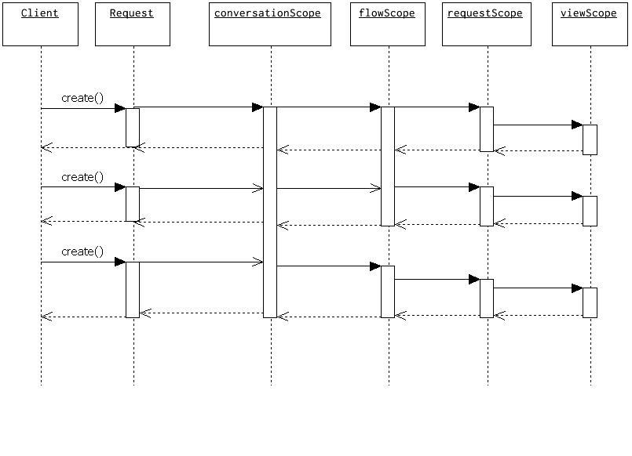

# Expression Language

## 개요

Web Flow는 데이터 모델 및 action 실행을 위해 EL을 이용한다. 우리는 EL에 대해 알아보면서 flow 정의를 해보도록 하겠다.

## 설명

### 지원하는 EL 구현체

#### Unified EL

기본으로는 Unified EL을 사용한다. jboss-el이 기본 구현체로 되어 있다.

```
참고 : web 컨테이너에서는 대게 el-api 를 지원해준다. 톰캣 6의 경우처럼 말이다.
```

#### OGNL

OGNL은 SWF2에서 제공하는 또 다른 EL이다. 클래스패스에만 추가하면 자동으로 찾아서 사용한다.

#### EL 호환성

Unified EL과 OGNL은 비슷한 문법을 가지고 있다. 가능하면 Unified EL만 사용하자.

### EL 사용법

Flow에서 EL 사용하는 경우

- 클라이언트에서 제공되는 데이터에 접근하는 경우. 입력 속성이나 요청 파라미터
- flowScope처럼 내부 데이터 구조에 접근하는 경우
- 스프링 빈에 있는 메소드 호출
- 생성자 결정할 때

Flow에 의해서 보여지는 뷰는 EL을 사용해서 Flow 데이터 구조에 접근하게 됨

#### 표현 타입

##### 표준 eval 표현

가장 일반적인 방법은 eval 표현으로, 이 경우 ${}나 #{}을 사용하면 안 된다. 이 예는 searchCriteria에 있는 nextPage() 호출.

```xml
<evaluate expression="searchCriteria.nextPage()" />
```

##### 표현 템플릿

다음은 “template” 표현식으로 아래와 같은 형태로 ${} 을 사용할 수 있다.

```xml
<view-state id="error" view="error-${externalContext.locale}.xhtml" />
```

externalContext 에 세팅되어 있는 locale 결과를 대체하여 error-결과.xhtml 로 생성된

#### 특별한 EL 변수

##### Scope

- flowScope: flow 변수에 할당되며, Flow 범위를 가진 객체. 기본적으로 Flow 범위에 저장되는 모든 객체는 Serializable 이어야 함.

```xml
<evaluate expression="searchService.findHotel(hotelId)" result="flowScope.hotel" />
```

 - viewScope: view 변수에 할당되며, view-state 내 범위를 갖음. 그러므로 view-state 내에서만 참조 가능. 역시 모든 객체는 Serializable 이어야 함.

```xml
<on-render>
  <evaluate expression="searchService.findHotels(searchCriteria)" result="viewScope.hotels" result-type="dataModel" />
</on-render>
```

- requestScope: request 변수에 할당. 한 번의 Flow 내에서 공유

```xml
<set name="requestScope.hotelId" value="requestParameters.id" type="long" />
```

- flashScope: flash 변수에 할당. Flow가 시작될 때 할당되고, 뷰가 보여지고 난 후 clear 됐다가, Flow가 종료되면 정리되는 범위. 객체는 Serializable 해야 함.

```xml
<set name="flashScope.statusMessage" value="'Booking confirmed'" />
```

- conversationScope

convesation 변수에 할당. 최상위 Flow가 시작할 때 할당되며, 최상위 Flow가 종료될 때 정리. 최상위 Flow의 자식 Flow에서 공유. HTTP session에 저장되며, 세션 복제를 할 경우를 대비해 Serizalizable를 구현해야 함.

```xml
<evaluate expression="searchService.findHotel(hotelId)" result="conversationScope.hotel"/>
```

##### context

- flowRequestcontext: 현재 Flow 요청을 표현. RequestContext API.
- messageContext: 에러나 성공 메세지를 포함해서 Flow 실행 메세지를 받아오고, 만드는데 대한 context에 접근할 수 있음. MessageContext 참조.

```xml
<evaluate expression="bookingValidator.validate(booking, messageContext)" />
```

- flowExecutionContext: 현재 Flow 상태를 표현. FlowExecutionContext API.
- externalContext: 사용자 세션 속성 등 외부 환경에 접근할 수 있음. ExternalContext API.

```xml
<evaluate expression="searchService.suggestHotels(externalContext.sessionMap.userProfile)" result="viewScope.hotels" />
```

##### 그 외

- requestParameters: 사용자로부터 넘어온 request 매개변수 접근

```xml
<set name="requestScope.hotelId" value="requestParameters.id" type="long" />
```

- currentEvent: 현재 Event 객체에 접근

```xml
<evaluate expression="booking.guests.add(currentEvent.guest)" />
```

- currentUser: 인증된 Principal에 접근

```xml
<evaluate expression="bookingService.createBooking(hotelId, currentUser.name)" result="flowScope.booking" />
```

- resourceBundle: message 자원 관리

```xml
<set name="flashScope.successMessage" value="resourceBundle.successMessage" />
```

- flowExecutionUrl: 현재 flow execution view-state에 대한 context-relative URI에 접근

#### 범위 검색 알고리즘

특정 범위에 변수를 할당할 때는 반드시 범위를 명시해야 한다.

```xml
<set name="requestScope.hotelId" value="requestParameters.id" type="long" />
```

특정 범위에 있는 변수에 접근할 때는 꼭 범위를 명시할 필요는 없다.

```xml
<evaluate expression="entityManager.persist(booking)" />
```

booking처럼 범위를 명시하지 않은 경우, 범위 검색 알고리즘(scope searching algorithm)이 동작하며,
이 알고리즘은 request→flash→view→flow→conversation 범위의 순서로 찾게 된다. 없을 경우 EvaluationException 발생.
아래그림은 검색되는 Scope 순서를 잘 보여주고 있다.

 

## 참고자료 

- [Spring Web Flow reference 2.0.x](http://static.springframework.org/spring-webflow/docs/2.0.x/reference/html/index.html) (링크 만료됨)
- Spring Web-Flow Framework Reference beta with Korean (by 박찬욱)
- Pro Spring 2.5(Apress) - Chapter 18 Spring Web Flow