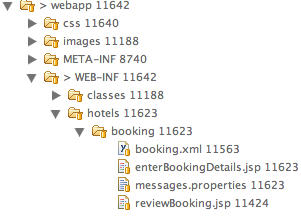

# 뷰(View) 보여주기

## 개요

view-state는 flow 내에서 화면을 생성하는 요소이다.
여기서는 view-state 에 대해서 알아보도록 하자.

## 설명

### 뷰 상태(view state) 정의하기

view-state는 기본적으로 해당 뷰를 생성하여 보여준 후, 사용자가 화면을 통해 응답을 하는 것을 기다린다.
아래는 view-state는 enterBookingDetails라는 ID 를 가지고 있으며 또한 별도의 view 설정이 없기 때문에 ID 가 곧 view를 뜻한다

```xml
<view-state id="enterBookingDetails">
	<transition on="submit" to="reviewBooking" />
</view-state>
```

따라서. 디렉토리 상의



booking.xml(or booking-flow.xml) 이 존재하는 디렉토리에 있는 enterBookingDetails.jsp 이 자동으로 view로 동작한다.
또는 절대 경로를 이용하여 명시적으로 view=”/WEB-INF/hotels/booking/enterBookingDetails.jsp” 설정할 수도 있다.
아래에서 다시 설명하겠다.

### 뷰 식별자 지정하기

뷰 속성을 여러 방법으로 지정할 수 있다.

- 상대 경로 사용

```xml
<view-state id="enterBookingDetails" view="bookingDetails.xhtml">
```

- 절대 경로 사용

```xml
<view-state id="enterBookingDetails" view="/WEB-INF/hotels/booking/bookingDetails.jsp>
```

- 논리적인 경로 사용: Spring MVC 등과 통합 시

```xml
<view-state id="enterBookingDetails" view="bookingDetails">
```

### 뷰 범위

view-state 내부에서 유지되는 변수. Ajax 요청처럼 동일한 뷰를 여러 번 보여줘야 하는 경우 유용.

- var 태그를 사용해서 view 변수 선언.

```xml
<var name="searchCriteria" class="com.mycompany.myapp.hotels.SearchCriteria" />
```

- viewScope 변수에 할당하기

```xml
<on-render>
	<evaluate expression="bookingService.findHotels(searchCriteria)" result="viewScope.hotels"/>
</on-render>
```

#### 뷰 범위내에서 Object 다루기

아래 코드는 화면 ID가 searchResults인 view-state 화면을 그리되
그리기 전 bookingService.findHotels(searchCriteria) 메소드를 호출한 후 그 결과를 viewScope내의 hotels로 저장한 후 화면을 보여주고 있다.
그리고 화면상에 next 또는 previous 이벤트 발생시 eval(searchCriteria.nextPage()/previousPage()) 이 발생
그 결과를 fragments으로 지정된 영역에 뿌려주고 있다.

```xml
<view-state id="searchResults">
	<on-render>
		<evaluate expression="bookingService.findHotels(searchCriteria)"
			result="viewScope.hotels" />
	</on-render>
	<transition on="next">
		<evaluate expression="searchCriteria.nextPage()" />
		<render fragments="searchResultsFragment" />
	</transition>
	<transition on="previous">
		<evaluate expression="searchCriteria.previousPage()" />
		<render fragments="searchResultsFragment" />
	</transition>
</view-state>
```

자세한 것은 아래에서 다시 설명하도록 하겠다.

### 화면을 보여줄 때 액션 실행

뷰를 보여주기 전에 특정 액션을 실행하려면 on-render를 사용한다.

```xml
<on-render>
  <evaluate expression="bookingService.findHotels(searchCriteria)" result="viewScope.hotels" />
</on-render>
```

### Model Binding

```xml
<view-state id="enterBookingDetails" model="booking">
```

뷰 이벤트가 발생했을 때 지정된 모델에 대해서 다음 행동이 일어난다.

1. view-to-model binding.
2. 모델 유효성 검증.

### 타입 변환 수행

#### 변환기(Converter) 구현

org.springframework.binding.convert.converters.TwoWayConverter을 구현하면 된다. StringToObject를 구현하는게 더 좋다.

```java
protected abstract Object toObject(String string, Class targetClass) throws Exception;
protected abstract String toString(Object object) throws Exception;
```

구현 예.

```java
public class StringToMonetaryAmount extends StringToObject {
	public StringToMonetaryAmount() {
	super(MonetaryAmount.class);
  }
  @Override
  protected Object toObject(String string, Class targetClass) {
  	return MonetaryAmount.valueOf(string);
  }
  @Override
  protected String toString(Object object) {
  	MonetaryAmount amount = (MonetaryAmount) object;
  	return amount.toString();
  }
}
```

org.springframework.binding.convert.converters에 이미 구현된 변환기가 위치.

#### 변환기 등록하기

org.springframework.binding.convert.service.DefaultConversionService을 상속해서 addDefaultConverters() 메소드를 재정의 하면 된다.
자세한 것은 시스템 설정에서 ConversionService 확장을 이용하여 설정하는 곳에서 다루고 있다.

### 바인딩 금지하기

bind 속성으로 특정 뷰 이벤트에서 모델 바인딩과 유효성 검증을 안 하게 할 수도 있다.

```xml
<view-state id="enterBookingDetails" model="booking">
	<transition on="proceed" to="reviewBooking">
	<transition on="cancel" to="bookingCancelled" bind="false" />
</view-state>
```

### 명시적으로 바인딩 지정하기

아래와 같이 binder 속성으로 바인딩 할 프로퍼티를 명시적으로 지정할 수 있다.

```xml
<view-state id="enterBookingDetails" model="booking">
	<binder>
		<binding property="creditCard" />
		<binding property="creditCardName" />
		<binding property="creditCardExpiryMonth" />
		<binding property="creditCardExpiryYear" />
	</binder>
	<transition on="proceed" to="reviewBooking" />
	<transition on="cancel" to="cancel" bind="false" />
</view-state>
```

binder로 지정하지 않으면 모든 프로퍼티를 바인딩된다. converter를 이용하여 변환기 지정이 가능하다.

```xml
<view-state id="enterBookingDetails" model="booking">
	<binder>
		<binding property="checkinDate" converter="shortDate" />
		<binding property="checkoutDate" converter="shortDate" />
		<binding property="creditCard" />
		<binding property="creditCardName" />
		<binding property="creditCardExpiryMonth" />
		<binding property="creditCardExpiryYear" />
	</binder>
	<transition on="proceed" to="reviewBooking" />
	<transition on="cancel" to="cancel" bind="false" />
</view-state>
```

### Model 유효성 검증

Model 유효성 검사에 대한 부분은 Web flow에서는 프로그래밍적으로 제약사항을 강제화하는 형태로 지원하고 있다.

#### 프로그램 내에서 유효성 검증

첫 번째 방법으로 유효성 검증 로직을 모델 객체 내에 정의하는 방법이다.
Web Flow 는 view-stat에서 모델로 넘어간 시점(view-state postback lifecycle)에서 자동적으로 validate 메소드를 자동으로 호출한다.

```xml
<view-state id="enterBookingDetails" model="booking">
	<transition on="proceed" to="reviewBooking">
</view-state>
```

Booking class 내의 validate(view-state 명) 코드는 아래와 같이 볼 수 있다.(메소드명 : validate + EnterBookingDetails)

```java
public class Booking {
	private Date checkinDate;
	private Date checkoutDate;
  ...
	public void validateEnterBookingDetails(ValidationContext context) {
		MessageContext messages = context.getMessages();
		if (checkinDate.before(today())) {
			messages.addMessage(new MessageBuilder().error().source("checkinDate").
 
			defaultText("Check in date must be a future date").build());
		} else if (!checkinDate.before(checkoutDate)) {
			messages.addMessage(new MessageBuilder().error()
			                                        .source("checkoutDate")
			                                        .defaultText("Check out date must be later than check in date")
			                                        .build());
		}
	}
}
```

enterBookingDetails에 대한 이벤트가 발생했을 때 자동으로 validateEnterBookingDetails이 호출 된다.
메소드 이름을 validate$<state> 로 정의하면 된다.

#### Validator 구현

Validator로 불리는 별도의 객체로 정의할 수도 있다. 클래스 이름을 $<model>Validator 로 지정하면 된다.
메소드 이름은 역시 validate$<state>로 한다.
아래 클래스명은 Booking + Validator 이며 메소드 이름은 validate + EnterBookingDetails 임을 볼 수 있다.

```java
@Component
public class BookingValidator {
	public void validateEnterBookingDetails(Booking booking, ValidationContext context) {
		MessageContext messages = context.getMessages();
		if (booking.getCheckinDate().before(today())) {
			messages.addMessage(new MessageBuilder().error()
			                                        .source("checkinDate")
			                                        .defaultText("Check in date must be a future date")
			                                        .build());
		} else if (!booking.getCheckinDate().before(booking.getCheckoutDate())) {
			messages.addMessage(new MessageBuilder().error()
			                                        .source("checkoutDate")
			                                        .defaultText("Check out date must be later than check in date")
			                                        .build());
		}
	}
}
```

spring mvc의 Error 객체도 받을 수 있다.

#### ValidationContext

유효성 검증 동안에 MessageContext에 접근할 수 있게 해주며, 다양한 객체에 접근 가능하게 해준다.

### 유효성 검증 하지 않기

validate=“false”로 설정하면 유효성 검사를 하지 않을 수 있다.

```xml
<view-state id="chooseAmenities" model="booking">
	<transition on="proceed" to="reviewBooking">
	<transition on="back" to="enterBookingDetails" validate="false" />
</view-state>
```

### 뷰 transition 실행

전이 대상은 (1)다른 뷰, (2)현재 뷰를 다시, (3)action을 실행, (4)Ajax 이벤트를 제어할 때
'fragments'로 불리는 일부 뷰를 보여주라는 요청일 수도 있다.

#### 전이 액션(Transition actions)

```xml
<transition on="submit" to="bookingConfirmed">
	<evaluate expression="bookingAction.makeBooking(booking, messageContext)" />
</transition>
```

```java
public class BookingAction {
	public boolean makeBooking(Booking booking, MessageContext context) {
		try {
			bookingService.make(booking);
			return true;
		} catch (RoomNotAvailableException e) {
			context.addMessage(builder.error().defaultText("No room is available at this hotel").build());
			return false;
		}
	}
}
```

#### 글로벌 전이(Global transitions)

```xml
<global-transitions>
	<transition on="login" to="login">
	<transition on="logout" to="logout">
</global-transitions>
```

#### 이벤트 핸들러(Event handlers)

```xml
<transition on="event">
	<!-- Handle event -->
</transition>
```

#### 프레그먼트 보여주기(fragments)

현재 뷰 중 일부만을 다시 보여줄 수 있는 방법으로, Ajax 기반일 때 주로 사용한다.

```xml
<transition on="next">
	<evaluate expression="searchCriteria.nextPage()" />
	<render fragments="searchResultsFragment" />
</transition>
```

','로 구분해서 다수의 fragment를 지정할 수도 있다.

### 메세지 사용하기

MessageContext는 플로우 실행 동안에 메세지를 저장하는 데 사용되는 API다.
일반 메세지나 국제화가 지원된 메세지 모두 사용 가능하다.
메세지 수준도 지정 가능하며, 지원되는 수준은 info, warning, error이 있다. 메세지를 추가할 때는 MessageBuilder를 사용하자.

- 일반 메세지 추가

```java
MessageContext context = ...
MessageBuilder builder = new MessageBuilder();
context.addMessage(builder.error().source("checkinDate").defaultText("Check in date must be a future date").build());
context.addMessage(builder.warn().source("smoking").defaultText("Smoking is bad for your health").build());
context.addMessage(builder.info().defaultText("We have processed your reservation - thank you and enjoy your stay").build());
```

- 국제화가 지원되는 메세지 추가

```java
MessageContext context = ...
MessageBuilder builder = new MessageBuilder();
context.addMessage(builder.error().source("checkinDate").code("checkinDate.notFuture").build());
context.addMessage(builder.warn().source("smoking").code("notHealthy").resolvableArg("smoking").build());
```

#### 메세지 번들 사용하기

스프링의 MessageSource를 사용해서 메세지 번들 정의가 가능하다. 간단히 프로퍼티 파일로 관리하면 된다.

```
#messages.properties
checkinDate=Check in date must be a future date
notHealthy={0} is bad for your health
reservationConfirmation=We have processed your reservation - thank you and enjoy your stay
```

뷰나 플로우에서는 resourceBundle EL 변수로 접근도 가능하다.

```xml
<h:outputText value="#{resourceBundle.reservationConfirmation}" />
```

#### 시스템 생성 메세지 이해하기

시스템에서 발생한 예외에 대해 메세지 지정할 수 있다. 예를 들어 타입 변환 시 예외가 발생하면 typeMismatch를 통해서 메세지 지정할 수 있다.

```
booking.checkinDate.typeMismatch=The check in date must be in the format yyyy-mm-dd.
```

### 팝업 띄우기

모달 팝업 다이얼로그를 뷰로 렌더링하고 싶다면, view-state 내에 popup=“true”로 설정하면 된다.

```xml
<view-state id="changeSearchCriteria" view="enterSearchCriteria.xhtml" popup="true">
```

특히 스프링 자바 스크립트와 함께 사용하면, 팝업을 보여주는데 클라이언트 코드가 전혀 필요 없다.
SWF가 클라이언트 요청을 팝업으로 재전송(redirect)해준다.

### 뷰 백트랙킹(View backtracking)

기본적으로 브라우저의 백 버튼으로 이전 view-state로 돌아갈 수 있다. history를 사용해서 이에 대한 설정이 가능하다.

- 'discard'로 설정하면 백트랙킹(backtracking)을 방지할 수 있다.

```xml
<transition on="cancel" to="bookingCancelled" history="discard">
```

- 'invalidate'로 설정하면 이전에 보여줬던 모든 뷰뿐만 아니라 현재 뷰까지도 백트랙킹을 방지한다.

```xml
<transition on="confirm" to="bookingConfirmed" history="invalidate">
```

## 참고자료

- [Spring Web Flow reference 2.0.x](http://static.springframework.org/spring-webflow/docs/2.0.x/reference/html/index.html) (링크 만료)
- Spring Web-Flow Framework Reference beta with Korean (by 박찬욱)