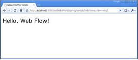

# Hello, World

## 개요

처음으로 접하므로 여기서는 Hello World를 찍어 보면서 실행하는 것을 살펴보도록 하겠다.<br/>
Hello World는 두 가지 버전으로 입력되는 값이 없이 단지 Hello, Web Flow 화면을 호출하는 것과 입력값을 가지고 분기 처리 등 서비스 메소드를 실행 후 결과를 화면으로 보여주는 버젼으로 나누어 설명하겠다. 실행하여 보고자 하는 화면 결과는 아래와 같다.


## 설명

Spring Web Flow는 사용자와 Service를 제공하는 서버 간의 대화하듯한 화면의 이동을 정의하는 것이다.<br/>
SWF(Spring Web Flow)는 사용자와 화면 간의 대화 형태로 웹 대화형 시나리오를 중심으로 접근한다.


## web.xml

webContent/WEB-INF 아래 web.xml을 아래와 같이 작성한다.<br/>
contextConfigLocation의 값으로 /WEB-INF/config/web-application-config.xml을 설정한다.<br/>
servlet으로 org.springframework.web.servlet.DispatcherServlet를 등록하고 /spring/* URL 정보를 매핑해준다.

```xml
<?xml version="1.0" encoding="ISO-8859-1"?>
<web-app xmlns="http://java.sun.com/xml/ns/j2ee" xmlns:xsi="http://www.w3.org/2001/XMLSchema-instance"
	xsi:schemaLocation="http://java.sun.com/xml/ns/j2ee http://java.sun.com/xml/ns/j2ee/web-app_2_4.xsd"
	version="2.4">
 
	<!-- Spring Web 어플리케이션을 위한 메인 설정파일을 등록한다. -->
	<context-param>
		<param-name>contextConfigLocation</param-name>
		<param-value>
			/WEB-INF/config/web-application-config.xml
		</param-value>
	</context-param>
 
	<!-- Spring Web 어플리케이션 컨테스트를 로딩한다. -->
	<listener>
		<listener-class>org.springframework.web.context.ContextLoaderListener</listener-class>
	</listener>
 
	<!-- Spring Web 어플리케이션의 맨 앞단 Controller(DispatcherServlet) 를 등록한다. -->
	<servlet>
		<servlet-name>Spring MVC Dispatcher Servlet</servlet-name>
		<servlet-class>org.springframework.web.servlet.DispatcherServlet</servlet-class>
		<init-param>
			<param-name>contextConfigLocation</param-name>
			<param-value></param-value>
		</init-param>
		<load-on-startup>0</load-on-startup>
	</servlet>
 
	<!-- 모든 spring 요청에 대한되는 request를 DispatcherServlet 와 매핑하여 처리 할 수 있도록 한다. -->
	<servlet-mapping>
		<servlet-name>Spring MVC Dispatcher Servlet</servlet-name>
		<url-pattern>/spring/*</url-pattern>
	</servlet-mapping>
 
	<welcome-file-list>
		<welcome-file>index.html</welcome-file>
	</welcome-file-list>
 
</web-app>
```

### web-application-config.xml

Spring MVC와 Spring Web Flow를 위한 설정 파일은 아래와 같다.


먼저 web-application-config.xml를 살펴보겠다.
  
```java
<?xml version="1.0" encoding="UTF-8"?>
<beans xmlns="http://www.springframework.org/schema/beans"
       xmlns:xsi="http://www.w3.org/2001/XMLSchema-instance"
       xmlns:context="http://www.springframework.org/schema/context"
       xsi:schemaLocation="
           http://www.springframework.org/schema/beans
           http://www.springframework.org/schema/beans/spring-beans-2.5.xsd
           http://www.springframework.org/schema/context
           http://www.springframework.org/schema/context/spring-context-2.5.xsd">
 
	<!-- 어플리케이션 소스를 스캔하여 로딩 하도록 한다. -->
	<context:component-scan base-package="org.egovframe.swf.sample.service" />
 
 
	<!-- 편의를 위하여 Spring MVC 설정과 Spring Web Flow 를 위한 설정을 별도록 분리하여 가져오도록 한다.--> 
	<import resource="webmvc-config.xml" />
	<import resource="webflow-config.xml" />
 
</beans>
```

#### webmvc-config.xml

Spring MVC를 위한 설정 파일
  
```java
<?xml version="1.0" encoding="UTF-8"?>
<beans xmlns="http://www.springframework.org/schema/beans"
	xmlns:xsi="http://www.w3.org/2001/XMLSchema-instance"
	xsi:schemaLocation="
           http://www.springframework.org/schema/beans
           http://www.springframework.org/schema/beans/spring-beans-2.5.xsd">
 
	<!--
	  flowRegistry에 등록된 flow와 요청되는 path와 매핑해주는 역할을 수행한다. 
		예제에선 요청되는 .../swfHelloWorld/spring/sample/hello  URL 정보를 이용하여 flow 내에서 sample/hello ID로 찾음.
	-->
	<bean class="org.springframework.webflow.mvc.servlet.FlowHandlerMapping">
		<property name="order" value="0" />
		<property name="flowRegistry" ref="flowRegistry" />
	</bean>
 
	<bean
		class="org.springframework.web.servlet.mvc.support.ControllerClassNameHandlerMapping">
		<property name="order" value="1" />
		<property name="defaultHandler">
		  <!-- UrlFilenameViewController 는 spring/start 으로 접근하는 path 정보를 이용하여 
		   View 이름을 추출하여 View를 반환하게 된다. 여기서는 tiles의 view를 반환하게 된다. -->
			<bean class="org.springframework.web.servlet.mvc.UrlFilenameViewController" />
		</property>
	</bean>
 
	<!--
	  Controller에 의해 반환된 View 명을 tiles로 보내 tiles에 미리 정의된 화면을 보여주도록 한다.
	-->
	<bean id="tilesViewResolver" class="org.springframework.js.ajax.AjaxUrlBasedViewResolver">
		<property name="viewClass"
			value="org.springframework.webflow.mvc.view.FlowAjaxTilesView" />
	</bean>
 
	<!-- tiles 설정 정보를 정의한다. -->
	<bean id="tilesConfigurer" class="org.springframework.web.servlet.view.tiles2.TilesConfigurer">
		<property name="definitions">
			<list>
				<value>/WEB-INF/layouts/layouts.xml</value>
				<value>/WEB-INF/views.xml</value>
				<value>/WEB-INF/sample/views.xml</value>
				<value>/WEB-INF/sample/hello/views.xml</value>
			</list>
		</property>
	</bean>
 
 
	<!-- Dispatches requests mapped to POJO @Controllers implementations-->
	<bean class="org.springframework.web.servlet.mvc.annotation.AnnotationMethodHandlerAdapter" />
 
	<!--
		Dispatches requests mapped to
		org.springframework.web.servlet.mvc.Controller implementations
	-->
	<bean class="org.springframework.web.servlet.mvc.SimpleControllerHandlerAdapter" />
 
	<!--
		requests에 맞는 등록된 FlowHandler 구현부를 연결해준다. 
	-->
	<bean class="org.springframework.webflow.mvc.servlet.FlowHandlerAdapter">
		<property name="flowExecutor" ref="flowExecutor" />
	</bean>
 
	<!-- Custom FlowHandler for the hello flow-->
	<bean name="sample/hello" class="org.egovframe.web.HelloFlowHandler" />
 
 
</beans>
```

#### webflow-config.xml

Web Flow 관련된 설정 파일
  
```java
<?xml version="1.0" encoding="UTF-8"?>
<beans xmlns="http://www.springframework.org/schema/beans"
	xmlns:xsi="http://www.w3.org/2001/XMLSchema-instance" xmlns:webflow="http://www.springframework.org/schema/webflow-config"
	xsi:schemaLocation="
           http://www.springframework.org/schema/beans
           http://www.springframework.org/schema/beans/spring-beans-2.5.xsd
           http://www.springframework.org/schema/webflow-config
           http://www.springframework.org/schema/webflow-config/spring-webflow-config-2.0.xsd">
 
	<webflow:flow-executor id="flowExecutor" />
 
	<!-- flow 를 정의한 파일을 가져와 flow registry 구성한다. -->
	<webflow:flow-registry id="flowRegistry"
		flow-builder-services="flowBuilderServices" base-path="/WEB-INF">
		<webflow:flow-location-pattern value="/**/*-flow.xml" />
	</webflow:flow-registry>
 
	<!-- Web Flow views 에  커스터마이징 할 수 있도록 확장하여 사용한다. -->
	<webflow:flow-builder-services id="flowBuilderServices"
		view-factory-creator="mvcViewFactoryCreator" conversion-service="conversionService"
		development="true" />
 
 
	<!-- Web Flow 에서  tiles 를 사용할 수 있도록 설정한다. -->
	<bean id="mvcViewFactoryCreator"
		class="org.springframework.webflow.mvc.builder.MvcViewFactoryCreator">
		<property name="viewResolvers" ref="tilesViewResolver" />
	</bean>
 
</beans>
```

상세 : [Web Flow views 에 커스터마이징 할 수 있도록 확장하여 사용한다](./setting_system.md)

#### tiles

URL : http://localhost:8080/swfHelloWorld 으로 처음 접근할 때 index.html 파일이 열리게 된다.

**index.html**

```html
<html>
  <head>
    <meta http-equiv="Refresh" content="0; URL=spring/start">
  </head>
</html>
```

위에서 보는 것처럼 “spring/start” URL을 호출한다.<br/>
**spring/start** 에 해당하는 화면은 먼저 설정된 tiles 설정 정보에서 찾는다.
  
```java
<tiles-definitions>
	<definition name="start" extends="standardLayout">
		<put-attribute name="body" value="/WEB-INF/main.jsp" />
	</definition>
</tiles-definitions>
```

tiles 관련된 것은 [http://tiles.apache.org/](http://tiles.apache.org/)를 참조하시길 바랍니다.<br/>
등록된 tiles 설정 파일은 앞 설정에서 나왔다. 다시 보면

```xml
...
	<!-- tiles 설정 정보를 정의한다. -->
	<bean id="tilesConfigurer" class="org.springframework.web.servlet.view.tiles2.TilesConfigurer">
		<property name="definitions">
			<list>
				<value>/WEB-INF/layouts/layouts.xml</value>
				<value>/WEB-INF/views.xml</value>
				<value>/WEB-INF/sample/views.xml</value>
				<value>/WEB-INF/sample/hello/views.xml</value>
			</list>
		</property>
	</bean> 
...
```

### Hello, Web Flow

다시 돌아와서 Hello , Web Flow 를 화면에 찍어 보도록 하겠다.<br/>
Web Flow로 해당 화면의 흐름을 작성한 예를 보자.<br/>

hello-flow.xml
  
```xml
<?xml version="1.0" encoding="UTF-8"?>
<flow xmlns="http://www.springframework.org/schema/webflow"
	xmlns:xsi="http://www.w3.org/2001/XMLSchema-instance"
	xsi:schemaLocation="http://www.springframework.org/schema/webflow 
	http://www.springframework.org/schema/webflow/spring-webflow-2.0.xsd">
 
	<view-state id="hello">
		<transition on="say" to="helloworld" />
	</view-state>
 
	<view-state id="helloworld">
		<transition on="return" to="return" />
	</view-state>
 
	<end-state id="return"	view="externalRedirect:servletRelative:/start" />
 
</flow>
```

자세한 설명은 [flow 정의](./flow_definition.md)에서 다루고 있다.<br/>
간단하게 보면 view-state, end-state로 나눠져 있는 것을 볼 수 있다. 처음으로 존재하는 view-state는 시작점이라고 생각해도 무방하다. 또한 문자 그대로 end-state는 마지막점이다. hello 화면이 맨 처음 나오고 거기서 helloworld 화면이 보이고 다음은 return이라는 마지막 실행을 하는 것이다.<br/>
view-state 안쪽의 transition는 화면에서 클릭하여 이동하게 하는 버튼의 실행이라고 할 수 있다. 여기선 say를 눌러서 실행하면 helloworld 라는 view-state로 이동하는 것이다. 마찬가지로 return을 누르면 externalRedirect:servletRelative:/start으로 이동하는 것이다.

- 참조 : [externalRedirect, servletRelative](./with_spring_mvc.md)
  
view-state에서 별도의 view를 정의하지 않은 경우 id를 가지고 view를 가져오게 된다. 여기서는 hello 라는 id가 곧 view 명이 되게 된다.<br/>
default는 flow.xml과 같은 디렉토리에 있는 화면소스(JSP, xhtml, 등)을 찾게 된다. 여기선 tiles로 정의된 부분을 참조한다.<br/>
…/hello/views.xml 파일 내용을 살펴보면,

```xml
...
	<definition name="hello" extends="standardLayout">
		<put-attribute name="body" value="/WEB-INF/sample/hello/hello.jsp" />
	</definition> 
...
```

로 화면에 해당되는 hello.jsp 를 가져오는 것을 확인할 수 있다.

그렇다면 transition은 화면에서 발생한 이벤트와 매핑을 할까? hello.jsp 소스를 잠시 보겠다.

```xml
<%@ taglib prefix="form" uri="http://www.springframework.org/tags/form"%>
<!DOCTYPE html PUBLIC "-//W3C//DTD XHTML 1.0 Transitional//EN"
"http://www.w3.org/TR/xhtml1/DTD/xhtml1-transitional.dtd">
<html>
<head>
<title>Welcome to Spring Web Flow</title>
</head>
<body>
<h1>Welcome to Spring Web Flow</h1>
<form:form id="start">
	<input type="submit" name="_eventId_say" value="Click to say hello!" />
</form:form>
</body>
</html>
```


보는 바와 같이 form으로 둘러싸인 곳에 해답은 있다. <input type=“submit” name=“_eventId_say” …. /> 에서 name 을 보면 **_eventId_say**로 답을 찾을 수 있다.<br/>
_eventId가 답이다. say는 transition의 on과 같음을 확인할 수 있다. eventId 에 정의된 특정 위치의 문자열을 가지고 transition을 분석하다.
transition에 대한 내용은 flow 정의에서 자세히 살펴보길 바란다. eventId 가 “say”를 가지고 form 이 전달되면 [flow 정의](./flow_definition.md) flow 정의에 따라 transition을 찾고 그에 맞는 state로 넘어가게 된다.<br/>
결과는 별로의 값을 가지고 보여주는 화면은 아니고 단지 아래와 같은 화면을 보여주도록 되어 있다.



다음은 입력값이 있는 예를 살펴 보도록 하겠다.

### Hello, Web Flow with input value

먼저 flow 정의 파일인 hello2-flow.xml 을 보도록 하자.
실행 시나리오는 on-start ⇒ view-state ⇒ action-state ⇒ decision-stat ⇒ end-state 이다. 

**hello2-flow.xml**

```xml
<?xml version="1.0" encoding="UTF-8"?>
<flow xmlns="http://www.springframework.org/schema/webflow"
	xmlns:xsi="http://www.w3.org/2001/XMLSchema-instance"
	xsi:schemaLocation="http://www.springframework.org/schema/webflow 
	http://www.springframework.org/schema/webflow/spring-webflow-2.0.xsd">
 
 
	<on-start>
		<evaluate expression="helloService.sayMessage()" result="flowScope.message" />
	</on-start>
 
	<view-state id="hello2" model="message">
		<binder>
			<binding property="str" required="true" />
		</binder>
		<transition on="proceed" to="actionHello" />
		<transition on="return" to="return" />
	</view-state>
 
	<action-state id="actionHello">
		<evaluate expression="helloService.addHello(message)" />
		<transition on="yes" to="moreDecision" />
		<transition on="no" to="hello" />
	</action-state>
 
	<decision-state id="moreDecision">
		<if test="helloService.getDecision(message)" then="helloworld2" else="return" />
	</decision-state>
 
	<view-state id="helloworld2">
		<transition on="return" to="return" />
	</view-state>
 
 
	<end-state id="return"	view="externalRedirect:servletRelative:/start" />
</flow>
</xml>
```

보여 주고자 하는 것은 hello2 화면(view-state)에서 입력 데이터를 객체에 바인딩하고, helloService 서비스 객체를 통해 addHello 메소드 실행, 그 후 결과에 따라 분기문(decision-state)을 통과하여 helloworld2 화면으로 가는 것이다.<br/>
간략하게 설명하면, on-start는 flow를 처음 실행할 때 선행하여 실행된다. 여기서는 helloService의 sayMessage를 실행하여 flowScope 내의 message 객체로 저장한다.

**HelloService .java**
  
```java
...
@Service("helloService")
public class HelloService implements Iservice {
 
	public Message sayMessage() {
		return new Message();
	}
	...
 
}
```

flow가 시작할 때 첫 번째로 만나는 view-state는 시작점으로 인식한다. 따라서 view-state “hello2”는 시작점에 해당한다.<br/>
hello2.jsp 를 화면에 보여주는데 앞단의 예제와 같다. Spring MVC의 tiles를 이용하여 보여주게 된다.

**views.xml**

```xml
...
	<definition name="hello2" extends="standardLayout">
		<put-attribute name="body" value="inhello2.body" />
	</definition>
 
	<definition name="inhello2.body" template="/WEB-INF/sample/hello2/main.jsp">
		<put-attribute name="helloSection" value="/WEB-INF/sample/hello2/hello.jsp" />
	</definition> 
...
```

**hello.jsp**

```xml
...
<form:form method="post" >
	<p>
       to Who : <input type="text" id="str" name="str" value=" World ~*"/>
				<script type="text/javascript">
					Spring.addDecoration(new Spring.ElementDecoration({
						elementId : "str",
						widgetType : "dijit.form.ValidationTextBox",
						widgetAttrs : { promptMessage : "for who ? ", required : true }}));
				</script>
				<br>
	</p>
 
  <input id="proceed" type="submit" class="button" 
      name="_eventId_proceed" value="say">
      <script type="text/javascript">
      Spring.addDecoration(new Spring.ValidateAllDecoration({elementId:'proceed', event:'onclick'}));
      </script>
  <input type="submit" class="button" 
      name="_eventId_return" value="index"> 
 
</form:form>
...
```

상단의 화면은 아래 hello2-flow.xml 내의 view-state와 매핑된다.<br/>
여기서 봐야 할 부분은 화면 내의 str 이름의 input 데이터를 message라는 객체로 바인딩하는 부분인다.


```xml
...
	<view-state id="hello2" model="message">
		<binder>
			<binding property="str" required="true" />
		</binder>
 
		<transition on="proceed" to="actionHello" />
		<transition on="return" to="return" />
	</view-state>
...
```

이벤트에 해당하는 proceed 버튼을 클리하면 다음 state로 이동하게 된다.

```xml
...
<transition on="proceed" to="actionHello" /> 
...
```

actionHello은 아래와 같다. 하는 기능은 helloService 객체의 addHello 메소드 호출이다.

```xml
...
	<action-state id="actionHello">
		<evaluate expression="helloService.addHello(message)" />
		<transition on="yes" to="moreDecision" />
		<transition on="no" to="hello" />
	</action-state>
...
```

addHello 메소드는 아래와 같다. 반환되는 값이 boolean인 것을 주목할 필요가 있다. 리턴되는 boolean 값은 transition의 yes, no 와 매핑된다.

```java
...
	public boolean addHello(Message msg){
		try{
		msg.setStr("Hello,"+msg.getStr());
		}catch (Exception e) {
			return false;
		}
		return true;
	}
...
```

다음 나오는 decision-state는 아래와 같이 분기문의 기능을 수행한다.

```xml
...
	<decision-state id="moreDecision">
		<if test="helloService.getDecision(message)" then="helloworld2" else="return" />
	</decision-state>
...
```

helloworld2 화면으로 이동하게 되면 아래와 같은 jsp 소스를 확인할 수 있다. message 객체의 str 값을 EL 을 이용하여 ${message.str} 으로 보여주고 있다.

```xml
<%@ taglib prefix="form"   
    uri="http://www.springframework.org/tags/form" %>
 
<h2>Hello Message?</h2>
<form:form>
  <b>Step two :</b> 
	<fieldset>
		<div class="field">
			<div class="label">
				<label>${message.str}</label>
			</div>		
 
		</div>
		<div class="buttonGroup">
			  <input type="submit" class="button"  name="_eventId_return" value="index"> 
		</div>	
 
    </fieldset>
</form:form>
```

화면을 다시 보면


say 버튼을 누르면,


Hello , 뒤에 넣었던 문장이 붙어서 나오게 된다.

