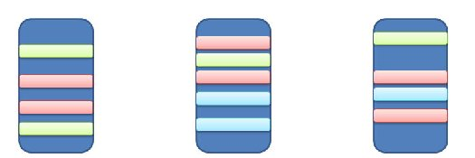
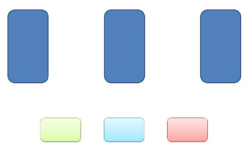
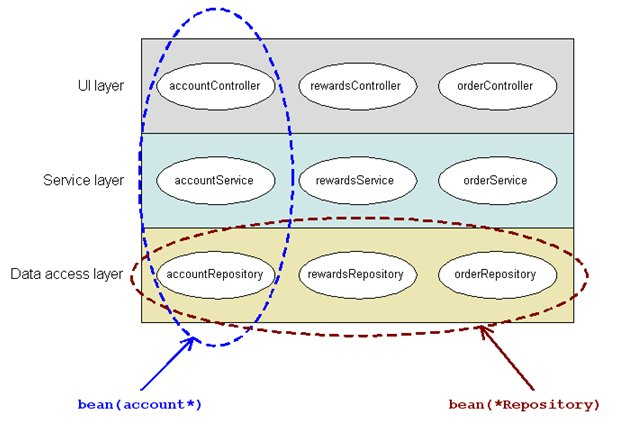

# AOP 서비스

## 개요

 AOP 서비스는 관점지향 프로그래밍(Aspect Oriented Programming: AOP) 사상을 구현하고 지원한다. 실행환경 AOP 서비스는 Spring AOP를 사용한다. 본 장에서는 AOP의 개요 및 Spring의 AOP 지원을 중심으로 살펴본다.

## 설명

### AOP 개요

 개별 프로그래밍 언어는 프로그램 개발을 위해 고유한 관심사 분리(Separation of Concerns) 패러다임을 갖는다. 예를 들면 절차적 프로그래밍은 상태값을 갖지 않는 연속된 함수들의 실행을 프로그램으로 이해하고 모듈을 주요 분리 단위로 정의한다. 객체지향 프로그래밍은 일련의 함수 실행이 아닌 상호작용하는 객체들의 집합으로 보며 클래스를 주요 단위로 한다.  
객체지향 프로그래밍은 많은 장점에도 불구하고, 다수의 객체들에 분산되어 중복적으로 존재하는 공통 관심사가 존재한다. 이들은 프로그램을 복잡하게 만들고, 코드의 변경을 어렵게 한다.  
관점 지향 프로그래밍(AOP, Aspect-Oriented Programming)은 이러한 객체지향 프로그래밍의 문제점을 보완하는 방법으로 핵심 관심사를 분리하여 프로그램 모듈화를 향상시키는 프로그래밍 스타일이다. AOP는 객체를 핵심 관심사와 횡단 관심사로 분리하고, 횡단 관심사를 관점(Aspect)이라는 모듈로 정의하고 핵심 관심사와 엮어서 처리할 수 있는 방법을 제공한다.

- 관점(Aspect)은 프로그램의 핵심 관심사에 걸쳐 적용되는 공통 프로그램 영역을 의미한다. 예를 들면 로깅, 인증, 권한확인, 트랜잭션은 비지니스 기능 구현시에 공통적으로 적용되는 요소이며 하나의 관점으로 정의될 수 있다.
- 핵심 관심사(Core concern)는 프로그램을 작성하려는 핵심 가치와 목적이 드러난 관심 영역으로 보통 핵심 비지니스 기능에 해당한다.
- 횡단 관심사(Cross-cutting concern)는 핵심 관심에 영향을 주는 프로그램의 영역으로, 로깅과 트랜잭션, 인증처리와 같은 시스템 공통 처리 영역이 해당된다.

다음 그림은 객체지향 프로그래밍 개발에서 핵심 관심사와 횡단 관심사가 하나의 코드로 통합되어 개발된 사례를 보여준다.  

  

객체지향 프로그래밍 코드에 AOP를 적용하면 다음 그림처럼 각 코드에 분산되어 있던 횡단 관심사는 관점으로 분리되어 정의된다. AOP는 엮기(Weaving)라는 방식을 이용하여 분리된 관점을 핵심 관심사와 엮는다.  

### AOP 주요 개념

 관점 지향 프로그래밍은 횡단 관심사를 분리하고 핵심 관심사와 엮어 사용할 수 있는 방법을 제공하며 다음의 몇 가지 새로운 개념을 포함한다.

#### 관점(Aspect)

 관점은 구현하고자 하는 횡단 관심사의 기능이다.

#### 결합점(Join point)

 결합점은 관점(Aspect)를 삽입하여 실행 가능한 어플리케이션의 특정 지점을 말한다.

#### 포인트컷(Pointcut)

포인트컷은 결합점 집합을 의미한다. 포인트컷은 어떤 결합점을 사용할 것이지를 결정하기 위해 패턴 매칭을 이용하여 룰을 정의한다. 다음 그림은 Spring 2.5에 포함된 bean() 포인트컷을 이용하여 종적 및 횡적으로 빈을 선택하는 예제를 보여준다.

  

#### 충고(Advice)

 충고(Advice)는 관점(Aspect)의 실제 구현체로 결합점에 삽입되어 동작할 수 있는 코드이다. 충고는 결합점과 결합하여 동작하는 시점에 따라 before advice, after advice, around advice 타입으로 구분된다.

- Before advice: joinpoint 전에 수행되는 advice
- After returning advice: joinpoint가 성공적으로 리턴된 후에 동작하는 advice
- After throwing advice: 예외가 발생하여 joinpoint가 빠져나갈때 수행되는 advice
- After (finally) advice: join point를 빠져나가는(정상적이거나 예외적인 반환) 방법에 상관없이 수행되는 advice
- Around advice: joinpoint 전, 후에 수행되는 advice

#### 엮기(Weaving)

 엮기는 관점(Aspect)을 대상 객체에 적용하여 새로운 프록시 객체를 생성하는 과정이다. 엮기 방식은 다음과 같이 구분된다.

- 컴파일 시 엮기: 별도 컴파일러를 통해 핵심 관심사 모듈의 사이 사이에 관점(Aspect) 형태로 만들어진 횡단 관심사 코드들이 삽입되어 관점(Aspect)이 적용된 최종 바이너리가 만들어지는 방식이다. (ex. AspectJ, …)
- 클래스 로딩 시 엮기: 별도의 Agent를 이용하여 JVM이 클래스를 로딩할 때 해당 클래스의 바이너리 정보를 변경한다. 즉, Agent가 횡단 관심사 코드가 삽입된 바이너리 코드를 제공함으로써 AOP를 지원하게 된다. (ex. AspectWerkz, …)
- 런타임 엮기: 소스 코드나 바이너리 파일의 변경없이 프록시를 이용하여 AOP를 지원하는 방식이다. 프록시를 통해 핵심 관심사를 구현한 객체에 접근하게 되는데, 프록시는 핵심 관심사 실행 전후에 횡단 관심사를 실행한다. 따라서 프록시 기반의 런타임 엮기의 경우 메소드 호출시에만 AOP를 적용할 수 있다는 제한점이 있다. (ex. Spring AOP, …)

#### 도입(Introduction)

 도입(Introduction)은 새로운 메소드나 속성을 추가한다. Spring AOP는 충고(Advice)를 받는 대상 객체에 새로운 인터페이스를 추가할 수 있다.

#### AOP 프록시(Proxy)

 AOP 프록시(Proxy)는 대상 객체(Target Object)에 Advice가 적용된 후 생성되는 객체이다.

#### 대상 객체(Target Object)

 대상 객체는 충고(Advice)를 받는 객체이다. Spring AOP는 런타임 프록시를 사용하므로 대상 객체는 항상 프록시 객체가 된다.

### Spring의 AOP 지원

 스프링은 프록시 기반의 런타임 Weaving 방식을 지원한다. 스프링은 AOP 구현을 위해 다음 세가지 방식을 제공한다. 이 중 @AspectJ 어노테이션과 XML 스키마를 이용한 AOP 방식을 상세히 살펴본다.

- [@AspectJ 어노테이션을 이용한 AOP 구현](./aop-aspectj.md)
- [XML Schema를 이용한 AOP 구현](./aop-xmlschema.md)
- 스프링 API를 이용한 AOP 구현

### 실행환경 AOP 가이드라인

 \* [실행환경 AOP 가이드라인](./aop-guide.md)

## 참고자료

- [Spring Framework - Reference Document / 5. Aspect Oriented Programming with Spring](https://docs.spring.io/spring-framework/docs/5.3.27/reference/html/core.html#aop)