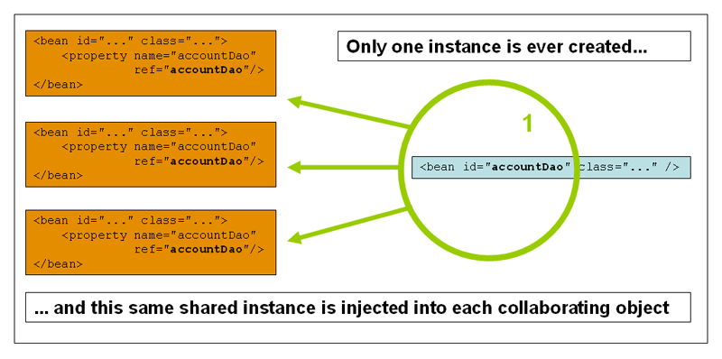

# Bean scope

## 개요

 Bean 정의는 실제 Bean 객체를 생성하는 방식을 정의하는 것으로 Class와 마찬가지로 하나의 Bean 정의에 해당하는 다수의 객체가 생성될 수 있다.  
Bean 정의를 통해 객체에 다양한 종속성 및 설정값을 주입할 수 있을 뿐 아니라, 객체의 범위(Scope)를 정의할 수 있다.  

## 설명

 Spring 프레임워크는 6개의 Scope를 지원하며, 이 중 4개의 Scope는 Web-aware ApplicationContext를 사용하는 경우에만 사용할 수 있다. 또한, 사용자 정의 범위를 생성할 수도 있다.

| Scope | 설명 |
| --- | --- |
| [singleton](#the-singleton-scope) | 하나의 Bean 정의에 대해서 Spring IoC Container 내에 단 하나의 객체만 존재한다. |
| [prototype](#the-prototype-scope) | 하나의 Bean 정의에 대해서 다수의 객체가 존재할 수 있다. |
| [request](#the-request-scope) | 하나의 Bean 정의에 대해서 하나의 HTTP request 생명주기 안에 단 하나의 객체만 존재한다. 즉, 각각의 HTTP Request는 자신만의 객체를 가진다. web-aware Spring ApplicationContext 안에서만 유효하다. |
| [session](#the-session-scope) | 하나의 Bean 정의에 대해서 하나의 HTTP Session 생명주기 안에 단 하나의 객체만 존재한다. web-aware Spring ApplicationContext 안에서만 유효하다. |
| [application](#the-application-scope) | 하나의 Bean 정의에 대해서 하나의 ServletContext 생명주기 안에 단 하나의 객체만 존재한다. web-aware Spring ApplicationContext 안에서만 유효하다. |
| [websocket](#the-websocket-scope) | 하나의 Bean 정의에 대해서 하나의 Websocket 생명주기 안에 단 하나의 객체만 존재한다. web-aware Spring ApplicationContext 안에서만 유효하다. |


### The singleton scope

 Bean이 singleton인 경우, 단지 하나의 공유 객체만 관리된다.

 

 Singleton scope은 Spring의 기본(default) scope이다.

 ```xml
<bean id="accountService" class="com.something.DefaultAccountService"/>
 
<!-- the following is equivalent, though redundant (singleton scope is the default) -->
<bean id="accountService" class="com.something.DefaultAccountService" scope="singleton"/>
```

### The prototype scope

 Singleton이 아닌 prototype scope의 형태로 정의된 bean은 필요한 매 순간 새로운 bean 객체가 생성된다.

 

 ```xml
<bean id="accountService" class="com.something.DefaultAccountService" scope="prototype"/>
```

 Prototype scope을 사용할 때 염두에 두고 있어야 할 것이 있다.  
Spring은 prototype bean의 전체 생명주기를 관리하지 않는데 Container는 객체화하고, 값을 설정하고, 다른 prototype 객체와 조립하여 Client에게 전달한 후 더 이상 prototype 객체를 관리하지 않는다.  
즉, scope에 관계없이 ***초기화(initialization)*** 생명주기 callback 메소드가 호출되는 반면에, prototype의 경우 ***파괴(destruction)*** 생명주기 callback 메소드는 호출되지 않는다.  
이것은 client 코드가 prototype 객체를 clean up하고 prototype 객체가 들고 있던 리소스를 해제하는 책임을 가진다는 것을 의미한다.

### Prototype bean에 종속적인 singleton bean(Singleton beans with prototype-bean dependencies)

 이 문제는 [메소드 삽입(Method Injection)](./ioc-container-dependencies.md#메소드-삽입method-injection)에서 다루고 있다.

### 기타 scopes(The other scopes)

 request, session, application, websocket scope들은 반드시 web-based 어플리케이션에서 사용할 수 있다.

#### 기본 Web 설정(Initial web configuration)

 request, session, application, websocket scope을 사용하기 위해서는 추가적인 설정이 필요하다. 추가 설정은 사용할 Servlet 환경에 따라 달라진다.  
만약 Spring Web MVC 안에서 bean에 접근할 경우, 즉 Spring DispatcherServlet 또는 DispatcherPortlet에서 처리되는 요청인 경우, 별도의 추가 설정은 필요없다.( DispatcherServlet과 DispatcherPortlet은 이미 모든 관련있는 상태를 제공한다.)  
만약 Servlet 2.4+ web Container를 사용하고, JSF나 Struts 등과 같이 Spring의 DispatcherServlet의 외부에서 요청을 처리하는 경우, 다음 javax.servlet.ServletRequestListener를 'web.xml' 파일에 추가해야 한다.

 ```xml
<web-app>
    ...
    <listener>
        <listener-class>org.springframework.web.context.request.RequestContextListener</listener-class>
    </listener>
    ...
</web-app>
```

 만약 다른 오래된 web Container(Servlet 2.3)를 사용한다면, 제공되는 javax.servlet.Filter 구현체를 사용해야 한다.(filter mapping은 web 어플리케이션 설정에 따라 달라질 수 있으므로, 적절히 수정해야 한다.)

 ```xml
<web-app>
    ..
    <filter>
        <filter-name>requestContextFilter</filter-name>
        <filter-class>org.springframework.web.filter.RequestContextFilter</filter-class>
    </filter>
    <filter-mapping>
        <filter-name>requestContextFilter</filter-name>
        <url-pattern>/*</url-pattern>
    </filter-mapping>
    ...
</web-app>
```

#### The request scope

 ```xml
<bean id="loginAction" class="com.foo.LoginAction" scope="request"/>
```

 위 정의에 따라, Spring Container는 모든 HTTP request에 대해서 'loginAction' bean 정의에 대한 LoginAction 객체를 생성할 것이다. 즉, 'loginAction' bean은 HTTP request 수준에 한정된다(scoped). 요청에 대한 처리가 완료되었을 때, 한정된(scoped) bean도 폐기된다.

#### The session scope

 ```xml
<bean id="userPreferences" class="com.foo.UserPreferences" scope="session"/>
```

 위 정의에 따라, Spring Container는 하나의 HTTP Session 일생동안 'userPreferences' bean 정의에 대한 UserPreferences 객체를 생성할 것이다. 즉, 'userPreferences' bean은 HTTP Session 수준에 한정된다(scoped). HTTP Session이 폐기될 때, 한정된(scoped) bean로 폐기된다.

#### The application scope

 ```xml
<bean id="appPreferences" class="com.foo.AppPreferences" scope="application"/>
```

 위 정의에 따라, Spring Container는 전체 Web Application에 대해 'appPreferences' bean 정의에 대한 AppPreferences 객체를 생성할 것이다. singleton scope와 비슷하지만 bean의 scope와 관련하여 매우 중요한 차이가 있는데, bean이 application 범위인 경우 bean의 동일한 instance는 동일한 ServletContext에서 실행되는 여러 서블릿 기반 애플리케이션에서 공유되는 반면 singleton 범위의 bean은 단일 애플리케이션 컨텍스트로만 범위가 지정된다.

#### The websocket scope

 ```xml
<bean id="appPreferences" class="com.foo.AppPreferences" scope="websocket"/>
```

 WebSocket scope bean은 WebSocket 세션 속성에 저장된다. 그리고 전체 WebSocket 세션 동안 해당 bean에 액세스할 때마다 bean의 동일한 instance가 반환된다.

#### 한정적 bean에 대한 종속성(Scoped beans as dependencies)

 HTTP request 또는 Session에 한정적인(scoped) bean을 정의하는 것은 꽤 괜찮은 기능이지만 Spring IoC Container가 제공하는 핵심 기능은 객체를 생성하는 것 뿐만 아니라 엮어준다는 것이다. 만약 HTTP request에 한정적인(scoped) bean을 다른 bean에 주입하기를 원한다면, 한정적(scoped) bean 대신에 AOP Proxy를 주입해야 한다.

 ```xml
<?xml version="1.0" encoding="UTF-8"?>
<beans xmlns="http://www.springframework.org/schema/beans"
    xmlns:xsi="http://www.w3.org/2001/XMLSchema-instance"
    xmlns:aop="http://www.springframework.org/schema/aop"
    xsi:schemaLocation="http://www.springframework.org/schema/beans
        http://www.springframework.org/schema/beans/spring-beans.xsd
        http://www.springframework.org/schema/aop
        http://www.springframework.org/schema/aop/spring-aop.xsd">
 
    <!-- a HTTP Session-scoped bean exposed as a proxy -->
    <bean id="userPreferences" class="com.foo.UserPreferences" scope="session">
        <!-- this next element effects the proxying of the surrounding bean -->
        <aop:scoped-proxy/>
    </bean>
 
    <!-- a singleton-scoped bean injected with a proxy to the above bean -->
    <bean id="userService" class="com.foo.SimpleUserService">
        <!-- a reference to the proxied 'userPreferences' bean -->
        <property name="userPreferences" ref="userPreferences"/>
    </bean>
</beans>
```

 Proxy를 생성하기 위해서 &lt;aop:scoped-proxy/&gt; element를 scoped bean 정의에 추가해야 한다(CGLIB 라이브러리도 classpath에 추가해야 한다).

## 참고자료

*   [Spring Framework - Reference Document / 1.5 Bean scopes](https://docs.spring.io/spring-framework/docs/5.3.27/reference/html/core.html#beans-factory-scopes)