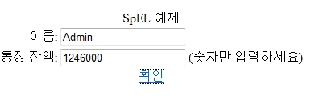
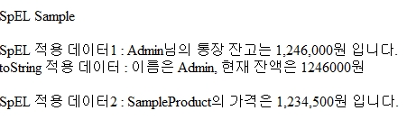

# Spring Expression Language(SpEL)

## 개요

 Spring 3.0에서 처음 소개된 스프링 전용 표현식 언어로 강력하고 유연하게 사용된다.  
SpEL은 빈 오브젝트에 직접 접근할 수 있는 표현식을 이용해서 프로퍼티 값을 능동적으로 가져오는 방법이며 가장 기본적이다. 또한 jsp에서 &lt;spring:eval&gt;태그를 사용하여 SpEL을 적용 할 수도 있다.

## 설명

### 빈 설정파일을 사용하여 SpEL적용

 빈 프로퍼티에 값을 설정하면, 다른 빈이나 프로퍼티에 접근 가능하다.

- 다음의 **빈에서 접근**하는 예제이다.

```xml
<bean id="springTest" ..>
	<property name="test" value="Sample" />
</bean>
 
<bean id="testNames">
	<property name="name" value="#{springTest.test}" />
</bean>
```

- 다음은 **&lt;util:properties&gt; 를 사용하여 프로퍼티에 접근**하는 예제 이다.

 globals.properties

 ```properties
driverClassName=com.mysql.jdbc.Driver
url=jdbc:mysql://localhost:1623/EASYCOMPANY
username=tex
password=texAdmin
```

 context-datasource.xml

```xml
<util:properties id="dbprops" location="classpath:/egovframework/property/globals.properties" />
 
<bean id="dataSource" class="org.apache.commons.dbcp.BasicDataSource" destroy-method="close">
	<property name="driverClassName" value="#{dbprops['driverClassName']}"/>
	<property name="url" value="#{dbprops['url']}"/>
	<property name="username" value="#{dbprops['username']}"/>
	<property name="password" value="#{dbprops['password']}"/>
</bean>
```

- 다음은 **&lt;util:properties&gt; 를 사용하여 변수로 직접 주입**하는 예제 이다.

 ```java
@Value("#{dbprops.driverClassName}")
private String driverClassName;
```

 또는

 ```java
@Value("#{dbprops}")
private Dbproperies dbprops;
```

### JSP에서 SpEL적용

 JSP의 EL대신에 Spring 3.0의 SpEL을 사용해서 값을 출력할 수 있다. JSP에서 SpEL을 사용하려면 태그 라이브러리를 추가해야 한다.

```xml
<%@ taglib prefix="spring" uri="http://www.springframework.org/tags"%>
```

 &lt;spring:eval&gt; 태그를 사용하여 JSP에서 SpEL을 사용한다. 모델 오브젝트를 직접 사용할 수 있다.

```xml
<spring:eval expression="sampleVO.money"/>
```

 메소드의 리턴값이 스트링일 경우, 메소드 자체를 호출할 수 있다.

```xml
<spring:eval expression="sampleVO.toString()"/>
```

 또한, @NumberFormat, @DateTimeFormat과 같은 컨버전 서비스에 등록되는 포맷터를 자동으로 적용할 수 있다. 다음은 sampleVO의 일부이다.

 ```java
 /** 잔액 */
@NumberFormat(pattern = "###,##0")
private Integer money;
```

```xml
<spring:eval expression="sampleVO.money"/>
```

 위와 같이 적용하면 입력 값에 따라 3자리마다 쉼표(,)가 출력된다.

 **입력값: 1234000** , **출력값: 1,234,000**

 모델에 직접 어노테이션으로 설정하지 않아도 new를 이용해 SpEL을 적용할 수 있다.

```xml
<spring:eval expression='new java.text.DecimalFormat("###,##0").format(price)'/>
```

 

## 참고자료

- [Spring Framework - Reference Document / 4. Spring Expression Language (SpEL)](https://docs.spring.io/spring-framework/docs/5.3.27/reference/html/core.html#expressions)
- [SpEL예제](../../runtime-example/individual-example/foundation-layer-core/spel-example.md)