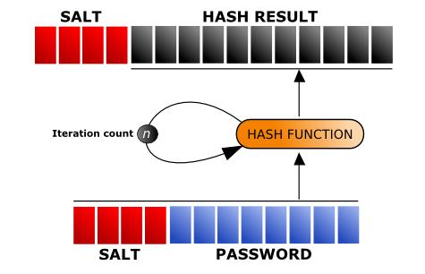

# Encryption/Decryption Service

## 개요

암호화는 시큐리티에 대처하는 가장 강력한 수단이다. 이때 본래의 메시지를 평문(Plan Text,Clear Text)이라고 부르고, 암호화된 메시지는 암호문(Cipher Text,Cryptogram)이라고 부른다.
암호화(Encryption,Ciphering)는 메시지의 내용이 불명확하도록 평문을 재구성하여 암호문을 만드는 것인데, 이 때 사용되는 메시지의 재구성 방법을 암호화 알고리즘(Encryption Algorithm)이라고 부른다. 암호화 알고리즘에서는 암호화의 비밀성을 높이기 위해 키(Key)를 사용하기도 한다.
복호화(Decyption,decipheing)란 암호화의 역과정으로, 불명확한 메시지로부터 본래의 메시지를 환원하는 과정이다. 일반적으로 복호화에도 암호화에 사용된 것과 동일한 알고리즘이 사용된다. 
그리고 암호화 기법을 적용하는 암호화 및 복호화 과정으로 구성된 시스템을 암호계(Crypto System)라고 부른다. 암호계에는 키나 알고리즘이 포함되는데 하나의 비밀키(Private Key,Secret Key)를 암호화와 복호화에 모두 사용하는 관용암호계(Conventional Crypto System) 와 비밀키와 공개키를 사용하는 공개키(Public Key System)시스템으로 구분된다.

## 설명

### JASYPT(Java simplified encryption)

Jasypt는 오픈소스 Java library로 개발자는 암호화관련 깊은 지식이 없어도 암복화 프로그램을 개발할 수 있도록 지원한다. 여기서 설명하는 부분은 암복화 모듈로 사용한 <acronym title="Application Programming Interface">API</acronym> 중심으로 설명하겠다.

#### Encryption binaries

Jasypt은 binaries(byte[] objects) 암호화를 위해 **org.jasypt.encryption.pbe.PBEByteEncryption** interface를 구현한 **org.jasypt.encryption.pbe.StandardPBEByteEncryptor**를 제공한다.

##### Configuration

PBE (Password Based Encryption) operations인 **org.jasypt.encryption.pbe.StandardPBEByteEncryptor**는 암호와 키를 필요하는데 알고리즘인데 설정하는 방법은 아래와 같다

- package에서 제공하는 기본 설정값 사용(암호는 제외)
- org.jasypt.encryption.pbe.config.PBEConfig 설정
- setAlgorithm(...), setProvider(...), setProviderName(...), setPassword(...), setKeyObtentionIterations(...) or setSaltGenerator(...) methods 설정

##### Initialization

암호화 하기전에 encrptor는 초기화(intialized)되어야 한다. 초기화는 아래와 같다.

- initialize() 메소드를 호출.
- encrypt(...) 또는 decrypt(...) 메소드가 처음 호출.(initialize() 메소드가 호출 하지 않아도 초기화됨)
- encryptor가 초기화가 된 후에 설정이 바뀌어 다시 initialize() 메소드를 호출하면 AlreadyInitializedException 이 발생.

##### Usage

- 메시지 암호화할 경우 encrypt(..) 메소드 호출
- 메시지 복호화할 경우 decrypt(..) 메소드 호출

#### Encrypting texts

Jasypt은 texts 암호화를 위해 **org.jasypt.encryption.pbe.PBEStringEncryptor** interface를 구현한 **org.jasypt.encryption.pbe.StandardPBEStringEncryptor**를 제공한다.

##### Basics

Jasypt는 text 암호화에 byte(binary) 암호화 방법을 사용한다.

- 모든 결과(암호화) 문자열은 기본적으로 BASE64로 encode되고 US-ASCII 문자셋으로 안전하게 저장된다.
- setStringOutputType 메소드를 사용하여 encoding 방식을 선택 할 수 있다.

##### Configuration

PBE(Password Based Encryption) operations인 **org.jasypt.encryption.pbe.StandardPBEStringEncryptor**는 암호와 키를 필요하는데 알고리즘인데 설정하는 방법은 아래와 같다

- package에서 제공하는 기본 설정값 사용(암호는 제외)
- org.jasypt.encryption.pbe.config.PBEConfig 설정
- setAlgorithm(...), setProvider(...), setProviderName(...), setPassword(...), setKeyObtentionIterations(...) or setSaltGenerator(...) methods 설정

##### Initialization

암호화 하기전에 encrptor는 초기화(intialized)되어야 한다. 초기화는 아래와 같다.

- initialize() 메소드를 호출.
- encrypt(...) 또는 decrypt(...) 메소드가 처음 호출.(initialize() 메소드가 호출 하지 안아도 초기화됨)
- encryptor가 초기화가 된 후에 설정이 바뀌어 다시 initialize() 메소드를 호출하면 AlreadyInitializedException 이 발생.

##### Usage

- 메시지 암호화할 경우 encrypt(..) 메소드 호출
- 메시지 복호화할 경우 decrypt(..) 메소드 호출

#### Encrypting passwords

Jasypt는 외부로 부터 공격받을 수 있는 데이타베이스 암호나 시스템 암호를 암호화할 수 있도록 지원한다.

##### Jasypt's Standard[Byte|String]Digester를 사용한 Digest 생성 절차

1. 명시된 salt size는 생성된다([org.jasypt.salt.SaltGenerator](http://www.jasypt.org/api/jasypt/1.8/org/jasypt/salt/SaltGenerator.html) 참고). size가 0일 경우는 salt는 사용되지 않는다.
   보다 높은 보안을 위해서는 salt는 기본으로 random으로 생성(like [org.jasypt.salt.RandomSaltGenerator](http://www.jasypt.org/api/jasypt/1.8/org/jasypt/salt/RandomSaltGenerator.html))한다.
2. salt bytes는 메시지 시작부분에 덧붙여진다.
3. Hash function은 salt와 메시지 전체에 적용되고, function 결과들은 명시한 iterations 만큼 반복된다.
4. 랜덤으로 salt를 생성하면 undigested salt는 hash 결과 시작부분에 덧붙여진다.



#### Encrypting numbers

Jasypt은 numbers 암호화를 위해 **org.jasypt.encryption.pbe.PBEBingIntegerEncryptor** 와 **org.jasypt.encryption.pbe.PBEBingDecimalEncryptor** interface를 구현한 **org.jasypt.encryption.pbe.StandardPBEBigIntegerEncryptor** 와 **org.jasypt.encryption.pbe.StandardPBEBigDecimalEncryptor**을 제공한다.

##### Basics

Jasypt는 number 암호화에 byte(binary) 암호화 방식을 사용한다.(Text 암호화 방식과 같다.)

##### Configuration

PBE (Password Based Encryption) operations인 **org.jasypt.encryption.pbe.StandardPBEByteEncryptor**는 암호와 키를 필요하는데 알고리즘인데 설정하는 방법은 아래와 같다.

- package에서 제공하는 기본 설정값 사용(암호는 제외)
- org.jasypt.encryption.pbe.config.PBEConfig 설정
- setAlgorithm(...), setProvider(...), setProviderName(...), setPassword(...), setKeyObtentionIterations(...) or setSaltGenerator(...) methods 설정

##### Initialization

암호화 하기전에 encrptor는 초기화(intialized)되어야 한다. 초기화는 아래와 같다.

- initialize() 메소드를 호출.
- encrypt(...) 또는 decrypt(...) 메소드가 처음 호출.(initialize() 메소드가 호출 하지 안아도 초기화됨)
- encryptor가 초기화가 된 후에 설정이 바뀌어 다시 initialize() 메소드를 호출하면 AlreadyInitializedException 이 발생.

##### Usage

- 메시지 암호화할 경우 encrypt(..) 메소드 호출
- 메시지 복호화할 경우 decrypt(..) 메소드 호출

#### Using Jasypt with JCE providers

Jasypt는 암호 기반 알고리즘외에 어떠한 알고리즘도 java의 security.provider를 구현한 JCE provider를 사용한다면 사용할 수 있다.

##### How can you use your own providers in jasypt?

```java
...
Security.addProvider(new BouncyCastleProvider());
...
StandardPBEStringEncryptor mySecondEncryptor = new StandardPBEStringEncryptor();
mySecondEncryptor.setProviderName("BC"); // jce provider name
mySecondEncryptor.setAlgorithm("PBEWITHSHA256AND128BITAES-CBC-BC");
mySecondEncryptor.setPassword(myPassword);
 
String mySecondEncryptedText = mySecondEncryptor.encrypt(myText);
...
```
```java
...        
StandardStringDigester digester = new StandardStringDigester();
digester.setProvider(new BouncyCastleProvider()); // create jce provider instance 
digester.setAlgorithm("WHIRLPOOL");
 
String digest = digester.digest(message);
...
```

### ARIA 블록암호 알고리즘

ARIA는 경량 환경 및 하드웨어 구현을 위해 최적화된, Involutional SPN 구조를 갖는 범용 블록 암호 알고리즘이다.

- 블록 크기 : 128비트
- 키 크기 : 128/192/256비트(AES와 동일 규격)
- 전체 구조 : Involutional Substitution-Permutation Network
- 라운드 수 : 12/14/16(키 크기에 따라 결정됨)

ARIA는 경량 환경 및 하드웨어에서의 효율성 향상을 위해 개발되었으며, ARIA가 사용하는 대부분의 연산은 XOR과 같은 단순한 바이트 단위 연산으로 구성되어 있습니다. ARIA라는 이름은 Academy(학계),Research Institute(연구소),Agency(정부 기관)의 첫 글자들을 딴 것으로, ARIA 개발에 참여한 학.연.관의 공동 노력을 표현하고 있다.

#### 표준화 동향

ARIA는 지난 2004년에 국가표준기본법에 의거, 지식경제부에 의하여 국가표준(KS)으로 지정되었다.

- 표준번호 : KSX1213:2004
- 부 문 : X-정보산업 < 정보기술(IT)응용
- 표 준 명 : 128비트 블록 암호 알고리즘 ARIA(128 bit block encryption algorithm ARIA)
- 이 력 : 2004년 12월 30일 제정
- 적용범위: 이 규격은 가변 크기의 암호키를 사용하여 128bit 블록 단위로 데이터의 암호화, 복호화를 수행하는 블록 암호 알고리즘을 규정

#### 안전성과 효율성

ARIA는 블록 암호에 대한 알려진 모든 공격에 대한 내성을 갖도록 설계되었다. 일차적으로 설계자들에 의한 내부적인 안전성 분석을 거친 뒤에, 객관적인 안전성 및 효율성 평가를 위하여 NESSIE(New European Schemes for Signatures, Integrity and Encryption)의 주관 기관인 벨기에 루벤 대학으로부터 평가를 받았다. ARIA는 하드웨어 구현 및 8비트 환경에서 뛰어난 효율성을 가지고 있어 IC 카드, VPN 장비 등 다양한 환경에 적용이 가능합니다. 또한 소프트 웨어 구현에서도 벨기에 루벤 대학의 효율성 평가에서 Camellia보다 빠르고 AES에 근접하는 성능을 보였다.

#### ARIA 효율성 비교(단위: cycle/byte)

| CPU          |  ARIA  |  AES   |  Camellia  |  SEED  |
|--------------|--------|--------|------------|--------|
| Pentium III  |  37.3  |  23.3  |  33.4      |  42.4  |
| Pentium IV   |  49.0  |  30.5  |  83.9      |  81.3  |

이 효율성 비교표는 NESSIE의 효율성 분석 보고서와 루벤 대학의 ARIA 분석 보고서에 근거하여 작성되었다. ARIA는 128비트 키 길이의 경우 루벤 대학의 평가의 대상이었던 ver. 0.8에 비해 라운드 수가 10에서 12로 증가 하였기 때문에 사이클 수를 평가 자료의 120%로 산출하였으며, 두 보고서가 같은 기관에서 (루벤 대학의 COSIC 그룹) 수행되었으나 양쪽 자료가 정확히 같은 환경에서 수행된 것은 아니기 때문에 두 보고서의 AES, Camellia에 대한 데이터로부터 양쪽 플랫폼의 성능비를 산출하여 SEED의 속도를 추정하였다.

### 가이드프로그램(Guide Program)

#### Configuration

암복호화 서비스를 사용하기 위해서는 다음과 같이 패스워드에 대한 hash 값 기록이 필요하다.

```properties
# Message digest algorithm using EgovPasswordEncoder..
crypto.password.algorithm=SHA-256
 
# hashed password (ex: egovframe (SHA-256) => gdyYs/IZqY86VcWhT8emCYfqY1ahw2vtLG+/FzNqtrQ=)
crypto.hashed.password=gdyYs/IZqY86VcWhT8emCYfqY1ahw2vtLG+/FzNqtrQ=
```

- crypto.password.algorithm : 패스워드 인코더에 사용될 hash function 알고리즘 (default : SHA-256)
- crypto.hashed.password : 패스워드에 대한 hash value (egovframework.rte.fdl.cryptography.EgovPasswordEncoder의 main 메소드에 의해 해당 값을 얻어 기록한다.)

그리고 이를 사용하기 위해 다음과 같이 property-placeholder 설정이 필요하다.

```xml
<context:property-placeholder 
location="classpath*:/META-INF/spring/crypto_config.properties,classpath*:/META-INF/spring/password.properties" />
<!-- recommended location method is using file prefix.. ex) "file:/home/properties/crypto_config.properties" -->
```

※ 위 property 파일과 이를 사용하기 위한 property-placeholder를 사용하지 않고 아래의 xml 설정에 직접 기록하여도 된다.

```xml
<bean id="passwordEncoder" class="egovframework.rte.fdl.cryptography.EgovPasswordEncoder">
  <property name="algorithm" value="${crypto.password.algorithm}" /><!-- default : SHA-256 -->
  <property name="hashedPassword" value="${crypto.hashed.password}" />
</bean>
 
<bean id="ARIACryptoService" class="egovframework.rte.fdl.cryptography.impl.EgovARIACryptoServiceImpl">
  <property name="passwordEncoder" ref="passwordEncoder" />
  <property name="blockSize" value="1025" /><!-- default : 1024 -->
</bean>
 
<bean id="digestService" class="egovframework.rte.fdl.cryptography.impl.EgovDigestServiceImpl">
  <property name="algorithm" value="SHA-256" /><!-- default : SHA-256 -->
  <property name="plainDigest" value="false" /><!-- default : false -->
</bean>
 
<bean id="generalCryptoService" class="egovframework.rte.fdl.cryptography.impl.EgovGeneralCryptoServiceImpl">
  <property name="passwordEncoder" ref="passwordEncoder" />
  <property name="algorithm" value="PBEWithSHA1AndDESede" /><!-- default : PBEWithSHA1AndDESede -->
  <property name="blockSize" value="1024" /><!-- default : 1024 -->
</bean>
```

##### Example

|  bean                 |  class                         |  설 명                                                             |
|-----------------------|--------------------------------|------------------------------------------------------------------|
| passwordEncoder       |  EgovPasswordEncoder           |  Hash function 알고리즘 및 hashed된 패스워드 보관 (다른 암복호화 서비스 bean에 의해 사용됨) |
| ARIACryptoService     |  EgovARIACryptoServiceImpl     |  ARIA 알고리즘을 통한 암복호화 서비스 제공                                       |
| digestService         |  EgovDigestServiceImpl         |  Digest Service(Hash function) 서비스 제공                            |
| generalCryptoService  |  EgovGeneralCryptoServiceImpl  |  ARIA 이외의 알고리즘(JASYPT 기반)을 통한 암복호화 서비스 제공                        |

#### ARIA 알고리즘 Sample Source

##### Encryption texts Guide Program

```java
@Resource(name="ARIACryptoService")
EgovCryptoService cryptoService;

@Test
public void testString() {
String[] testString = {
    "This is a testing...\nHello!",
    "한글 테스트입니다...",
    "!@#$%^&*()_+|~{}:\"<>?-=\\`[];',./"
};

try {
    for (String str : testString) {
    byte[] encrypted = cryptoService.encrypt(str.getBytes("UTF-8"), password);

    byte[] decrypted = cryptoService.decrypt(encrypted, password);

    assertEquals(str, new String(decrypted, "UTF-8"));
    }
} catch (UnsupportedEncodingException uee) {
    uee.printStackTrace();
    fail();
}
}
```

##### Encryption File Guide Program

```java
@Resource(name="ARIACryptoService")
EgovCryptoService cryptoService;
 
@Test
public void testFile() {
    String filePath = "/META-INF/spring/file/test.hwp";
    File srcFile = new File(this.getClass().getResource(filePath).getFile());
 
    File trgtFile;
    File decryptedFile;
    try {
        trgtFile = File.createTempFile("tmp", "encrypted");
        trgtFile.deleteOnExit();
 
        cryptoService.encrypt(srcFile, password, trgtFile);
 
        decryptedFile = File.createTempFile("tmp", "decrypted");
        decryptedFile.deleteOnExit();
 
        cryptoService.decrypt(trgtFile, password, decryptedFile);
 
        assertTrue("Decrypted file not same!!", 
          checkFileWithHashFunction(srcFile, decryptedFile));
    } catch (Exception ex) {
        ex.printStackTrace();
        fail(ex.getMessage());
    }
}
```

#### Digest Sample Source

##### Encryption Digest Guide Program

```java
@Resource(name="digestService")
EgovDigestService digestService;

@Test
public void testDigest() {
    String data = "egovframe";

    byte[] digested = digestService.digest(data.getBytes());

    assertTrue(digestService.matches(data.getBytes(), digested));
}
```

#### General 알고리즘 Sample Source

##### Encryption texts Guide Program

```java
@Resource(name="generalCryptoService")
EgovCryptoService cryptoService;

@Test
public void testString() {
    String[] testString = {
        "This is a testing...\nHello!",
        "한글 테스트입니다...",
        "!@#$%^&*()_+|~{}:\"<>?-=\\`[];',./"
    };

    try {
        for (String str : testString) {
        byte[] encrypted = cryptoService.encrypt(str.getBytes("UTF-8"), password);

        byte[] decrypted = cryptoService.decrypt(encrypted, password);

        assertEquals(str, new String(decrypted, "UTF-8"));
        }
    } catch (UnsupportedEncodingException uee) {
        uee.printStackTrace();
        fail();
    }
}
```

##### Encryption BigDecimal Guide Program

```java
@Resource(name="generalCryptoService")
EgovCryptoService cryptoService;

@Test
public void testBigDecimal() {
    BigDecimal big = new BigDecimal(123456);

    BigDecimal encrypted = cryptoService.encrypt(big, password);

    BigDecimal decrypted = cryptoService.decrypt(encrypted, password);

    assertEquals(big, decrypted);
}
```

##### Encryption File Guide Program

```java
@Resource(name="generalCryptoService")
EgovCryptoService cryptoService;

@Test
public void testFile() {
    String filePath = "/META-INF/spring/file/test.hwp";

    File srcFile = new File(this.getClass().getResource(filePath).getFile());

    File trgtFile;
    File decryptedFile;
    try {
        trgtFile = File.createTempFile("tmp", "encrypted");
        trgtFile.deleteOnExit();
        //trgtFile = new File("C:/test.enc");

        //System.out.println("Temp file : " + trgtFile.toString());

        cryptoService.encrypt(srcFile, password, trgtFile);

        decryptedFile = File.createTempFile("tmp", "decrypted");
        decryptedFile.deleteOnExit();
        //decryptedFile = new File("C:/test.dec.hwp");

        cryptoService.decrypt(trgtFile, password, decryptedFile);

        assertTrue("Decrypted file not same!!", checkFileWithHashFunction(srcFile, decryptedFile));

    } catch (IOException ioe) {
        ioe.printStackTrace();
        fail(ioe.getMessage());
    } catch (Exception ex) {
        ex.printStackTrace();
        fail(ex.getMessage());
    }
}
```

##### Web Encryption Guide Program

ARIA 알고리즘으로 암/복호화시 Byte[] 형태로 결과가 나오기 때문에, Base64를 통해 추가로 인코딩/디코딩 해야 한다. Base64 이용시 Apache Commons Codec의 Base64 클래스를 이용한다.

```java
import org.apache.commons.codec.binary.Base64;

String strValue = "TEXT";

byte[] text = cryptoService.encrypt(strValue.getBytes("UTF-8"), password);
String base64enc = Base64.encodeBase64String(text);
String urlText = URLEncoder.encode(base64enc);

//Decryption
System.out.println("\n\nDecoding Test!!!");

String value = URLDecoder.decode(urlText);
byte[] base64dec = Base64.decodeBase64(value);
byte[] dectext = cryptoService.decrypt(base64dec, password);
```

pom.xml에 아래 내용을 추가한다.

```xml
<dependency>
    <groupId>commons-codec</groupId>
    <artifactId>commons-codec</artifactId>
    <version>1.9</version>
</dependency>
```

## 참고자료

[ARIA 블록암호 알고리즘](https://seed.kisa.or.kr/kisa/algorithm/EgovAriaInfo.do)