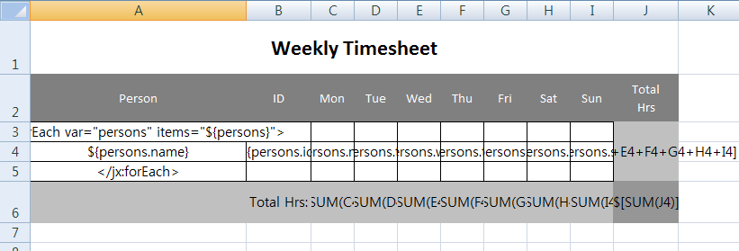
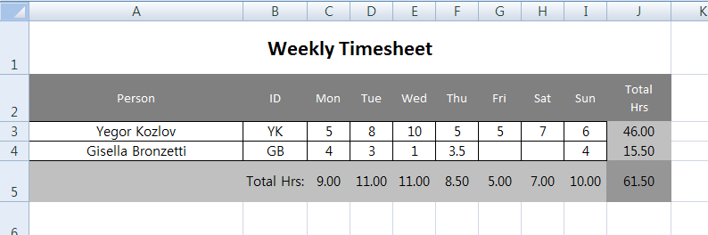

# Excel Service

## 개요

Excel 파일 포맷을 다룰 수 있는 자바 라이브러리를 제공하여, 사용자들이 데이터를 Excel 파일 포맷으로 다운받거나, 대량의 Excel 데이터를 시스템에 올릴 수 있도록 지원하기 위한 서비스이다.
Excel 서비스는 **Apache POI** 오픈소스를 사용하여 구현하였으며 **주요 Excel 접근** 기능 외에 **Excel 다운로드**, **Excel 파일 업로드** 등의 기능이 있다.
Excel 서비스 3.0 버전에서는 기존 버전을 refactoring 하였다.
기존의 메소드(xls, xlsx)를 지원하는 메소드들의 이름을 하나로 하여 Parameter 방식으로 구분자를 추가하였다.
또한, 기존의 iBatis 뿐만 아니라 MyBatis도 지원하는 클래스를 추가하였다.

## 설명

### 주요기능

#### Excel 파일 생성

엑셀 파일을 생성하여 지정된 위치에 저장하는 기능을 제공한다.

Workbook 인스턴스를 생성하여 Excel sheet를 추가 생성할 수 있다.

엑셀 버전에 따라 엑셀 97~2003버전(xls)인 HSSFWorkbook, 엑셀 2007이상(xlsx)의 XSSFWorkbook 클래스를 사용할 수 있으며, 각 클래스별 사용 법(method)는 동일하다.

##### Sample Source

```java
String sheetName1 = "first sheet";
String sheetName2 = "second sheet";
StringBuffer sb = new StringBuffer();
// 엑셀 필요버전에 맞는 확장자를 선택하면 됨
sb.append(fileLocation).append("/").append("testWriteExcelFile.xls");
sb.append(fileLocation).append("/").append("testWriteExcelFile.xlsx");
 
// Workbook을 필요버전에 맞는 클래스를 선택하면 됨
Workbook wb = new HSSFWorkbook(); // xls 버전
Workbook wb = new SXSSFWorkbook(); //xlsx 버전
 
wb.createSheet(sheetName1);
wb.createSheet(sheetName2);
wb.createSheet();
```

#### Excel 파일 수정

엑셀 파일 내 셀의 내용을 변경하고 저장한다.

저장된 엑셀파일을 로드할 수 있으며 지정한 sheet에 row와 cell 객체를 생성하여 텍스트를 저장하고 수정할 수 있다.

##### Sample Source

```java
// xls엑셀 파일 로드
Workbook wb = excelService.loadWorkbook(filename);
 
// xlsx엑셀 파일 로드
XSSFWorkbook wb = null;
wb = excelService.loadWorkbook(sb.toString(), wb);
 
log.debug("testModifyCellContents after loadWorkbook....");
 
Sheet sheet = wb.getSheetAt(0);
Font f2 = wb.createFont();
CellStyle cs = wb.createCellStyle();
cs = wb.createCellStyle();
 
cs.setFont(f2);
cs.setWrapText(true);
 
Row row = sheet.createRow(rownum);
row.setHeight((short) 0x349);
Cell cell = row.createCell(cellnum);
// xls 엑셀방식일 경우
cell.setCellType(Cell.CELL_TYPE_STRING);  
cell.setCellValue(new HSSFRichTextString(content));
 
// xlsx 엑셀방식일 경우
cell.setCellType(XSSFCell.CELL_TYPE_STRING);
cell.setCellValue(new XSSFRichTextString(content));
 
cell.setCellStyle(cs);
 
 
 
sheet.setColumnWidth(20, (int) ((50 * 8) / ((double) 1 / 20)));
 
FileOutputStream out = new FileOutputStream(filename);
wb.write(out);
out.close();
```

#### Excel 문서 속성 수정

엑셀 파일 문서의 속성(Header, Footer)을 수정한다.

Header 및 Footer 클래스로 엑셀문서의 Header와 Footer의 값과 속성을 설정할 수 있다.

##### Sample Source

```java
// 엑셀 파일 로드
Workbook wb = excelService.loadWorkbook(filename); // xls 버전
Workbook wb = excelService.loadWorkbook(filename, new XSSFWorkbook()); // xlsx 버전
LOGGER.debug("testModifyCellContents after loadWorkbook....");
 
Sheet sheet = wb.createSheet("doc test sheet");
 
Row row = sheet.createRow(1);
Cell cell = row.createCell(1);
cell.setCellValue(new HSSFRichTextString("Header/Footer Test")); // xls 버전
cell.setCellValue(new XSSFRichTextString("Header/Footer Test")); // xlsx 버전
 
 
// Header
Header header = sheet.getHeader();
header.setCenter("Center Header");
header.setLeft("Left Header");
header.setRight(HSSFHeader.font("Stencil-Normal", "Italic") + HSSFHeader.fontSize((short) 16) + "Right Stencil-Normal Italic font and size 16"); // xls 버전
header.setRight(XSSFOddHeader.stripFields("&IRight Stencil-Normal Italic font and size 16")); // xlsx 버전
 
 
// Footer
// xls 버전
Footer footer = sheet.getFooter();
footer.setCenter(HSSFHeader.font("Fixedsys", "Normal") + HSSFHeader.fontSize((short) 12) + "- 1 -");
 
// xlsx 버전
Footer footer = (XSSFOddFooter) sheet.getFooter();
footer.setCenter(XSSFOddHeader.stripFields("Fixedsys"));
 
footer.setLeft("Left Footer");
footer.setRight("Right Footer");
 
// 엑셀 파일 저장
FileOutputStream out = new FileOutputStream(filename);
wb.write(out);
out.close();
```

#### 셀 내용 추출

엑셀 파일을 읽어 특정 셀의 값을 얻어온다.

HSSFCell 클래스의 getRichStringCellValue, getNumericCellValue, getStringCellValue 등 다양한 type의 Cell 내용을 추출할 수 있다.

##### Sample Source

```java
Workbook wbT = excelService.loadWorkbook(filename); // xls 버전
Workbook wbT = excelService.loadWorkbook(filename, new XSSFWorkbook()); // xlsx 버전
Sheet sheetT = wbT.getSheet("cell test sheet");
 
for (int i = 0; i < 100; i++) {
	Row row = sheet.createRow(i);
	for (int j = 0; j < 5; j++) {
		Cell cell = row.createCell(j);
		cell.setCellValue(new HSSFRichTextString("row " + i + ", cell " + j)); // xls 버전
		cell.setCellValue(new XSSFRichTextString("row " + i + ", cell " + j)); // xlsx 버전
		cell.setCellStyle(cs);
	}
}
```

#### 셀 속성 추출

특정 셀의 속성(폰트, 사이즈 등)을 수정한다.

HSSFFont, HSSFCellStyle 등의 클래스를 이용하여 셀의 폰트, 사이즈 등의 셀 속성을 수정할 수 있다.

##### Sample Source

```java
// 엑셀 파일 로드
Workbook wb = excelService.loadWorkbook(filename); // xls 버전
Workbook wb = excelService.loadWorkbook(filename, new XSSFWorkbook()); //xlsx 버전
 
Sheet sheet = wb.createSheet("cell test sheet2");
sheet.setColumnWidth((short) 3, (short) 200);	// column Width
 
CellStyle cs = wb.createCellStyle();
Font font = wb.createFont();
font.setFontHeight((short) 16);
font.setBoldweight((short) 3);
font.setFontName("fixedsys");
 
cs.setFont(font);
cs.setAlignment(CellStyle.ALIGN_RIGHT);	// cell 정렬
cs.setWrapText( true );
 
for (int i = 0; i < 100; i++) {
	HSSFRow row = sheet.createRow(i);
	row.setHeight((short)300); // row의 height 설정
 
	for (int j = 0; j < 5; j++) {
		HSSFCell cell = row.createCell((short) j);
		cell.setCellValue(new HSSFRichTextString("row " + i + ", cell " + j)); // xls 버전
		cell.setCellValue(new XSSFRichTextString("row " + i + ", cell " + j)); // xlsx 버전
		cell.setCellStyle( cs );
	}
}
 
// 엑셀 파일 저장
FileOutputStream out = new FileOutputStream(filename);
wb.write(out);
out.close();
```

#### 공통 템플릿 사용

공통 템플릿을 사용하여 일관성을 유지한다. jXLS 오픈소스를 사용하여 작성된 템플릿에 지정된 값을 저장한다.

##### Sample Source

```java
List<PersonHourVO> persons = new ArrayList<PersonHourVO>();
PersonHourVO person = new PersonHourVO();
person.setName("Yegor Kozlov");
person.setId("YK");
person.setMon(5.0);
person.setTue(8.0);
person.setWed(10.0);
person.setThu(5.0);
person.setFri(5.0);
person.setSat(7.0);
person.setSun(6.0);
 
persons.add(person); 
 
PersonHourVO person1 = new PersonHourVO();
person1.setName("Gisella Bronzetti");
person1.setId("GB");
person1.setMon(4.0);
person1.setTue(3.0);
person1.setWed(1.0);
person1.setThu(3.5);
person1.setSun(4.0);
 
persons.add(person1); 
 
Map<String, Object> beans = new HashMap<String, Object>();
beans.put("persons", persons);
XLSTransformer transformer = new XLSTransformer();
 
transformer.transformXLS(filename, beans, sbResult.toString());
```

##### Excel Template

```jsp
<jx:forEach var="persons" items="${persons}">
${persons.name}	${persons.id}	${persons.mon}	${persons.tue}	${persons.wed}	${persons.thu}	${persons.fri}	${persons.sat}	${persons.sun}	$[C4+D4+E4+F4+G4+H4+I4]
</jx:forEach>
		Total Hrs:	$[SUM(C4)]	$[SUM(D4)]	$[SUM(E4)]	$[SUM(F4)]	$[SUM(G4)]	$[SUM(H4)]	$[SUM(I4)]	$[SUM(J4)]
```



##### Template 적용결과



### Excel 다운로드

##### Configuration

```xml
<bean id="categoryExcelView" class="egovframework.rte.fdl.excel.download.CategoryExcelView" />
 
<!--
XSSF 형태의 다운로드의 경우 다음의 View를 등록하여 사용한다.
<bean id="CategoryPOIExcelView" class="egovframework.rte.fdl.excel.download.CategoryPOIExcelView" />
-->
 
<bean class="org.springframework.web.servlet.view.BeanNameViewResolver">
	<property name="order" value="0" />
</bean>
```

##### Sample Source

Controller 클래스 작성 Map 사용

```java
@RequestMapping("/sale/listExcelCategory.do")
public ModelAndView selectCategoryList() throws Exception {
 
	List<Map> lists = new ArrayList<Map>();
 
	Map<String, String> mapCategory = new HashMap<String, String>();
	mapCategory.put("id", "0000000001");
	mapCategory.put("name", "Sample Test");
	mapCategory.put("description", "This is initial test data.");
	mapCategory.put("useyn", "Y");
	mapCategory.put("reguser", "test");
 
	lists.add(mapCategory);
 
	mapCategory.put("id", "0000000002");
	mapCategory.put("name", "test Name");
	mapCategory.put("description", "test Deso1111");
	mapCategory.put("useyn", "Y");
	mapCategory.put("reguser", "test");
 
	lists.add(mapCategory);
 
	Map<String, Object> map = new HashMap<String, Object>();
	map.put("category", lists);
 
	return new ModelAndView("categoryExcelView", "categoryMap", map);
}
```

VO 사용

```java
@RequestMapping("/sale/listExcelVOCategory.do")
public ModelAndView selectCategoryVOList() throws Exception {
 
	List<UsersVO> lists = new ArrayList<UsersVO>();
 
	UsersVO users = new UsersVO();
 
	//Map<String, String> mapCategory = new HashMap<String, String>();
	users.setId("0000000001");
	users.setName("Sample Test");
	users.setDescription("This is initial test data.");
	users.setUseYn("Y");
	users.setRegUser("test");
 
	lists.add(users);
 
	users.setId("0000000002");
	users.setName("test Name");
	users.setDescription("test Deso1111");
	users.setUseYn("Y");
	users.setRegUser("test");
 
	lists.add(users);
 
	Map<String, Object> map = new HashMap<String, Object>();
	map.put("category", lists);
 
	return new ModelAndView("categoryExcelView", "categoryMap", map);
}
```

View 클래스 작성(xls 버전)

```java
public class CategoryExcelView extends AbstractExcelView {
 
	private static final Logger LOGGER  = LoggerFactory.getLogger(CategoryExcelView.class);
 
	@Override
	protected void buildExcelDocument(Map model, HSSFWorkbook wb, HttpServletRequest req, HttpServletResponse resp) throws Exception {
        HSSFCell cell = null;
 
        LOGGER.debug("### buildExcelDocument start !!!");
 
        HSSFSheet sheet = wb.createSheet("User List");
        sheet.setDefaultColumnWidth(12);
 
        // put text in first cell
        cell = getCell(sheet, 0, 0);
        setText(cell, "User List");
 
        // set header information
        setText(getCell(sheet, 2, 0), "id");
        setText(getCell(sheet, 2, 1), "name");
        setText(getCell(sheet, 2, 2), "description");
        setText(getCell(sheet, 2, 3), "use_yn");
        setText(getCell(sheet, 2, 4), "reg_user");
 
        LOGGER.debug("### buildExcelDocument cast");
 
 
        Map<String, Object> map= (Map<String, Object>) model.get("categoryMap");
        List<Object> categories = (List<Object>) map.get("category");
 
        boolean isVO = false;
 
        if (categories.size() > 0) {
        	Object obj = categories.get(0);
        	isVO = obj instanceof UsersVO;
        }
 
        for (int i = 0; i < categories.size(); i++) {
 
        	if (isVO) {	// VO
 
        		LOGGER.debug("### buildExcelDocument VO : {} started!!", i);
 
        		UsersVO category = (UsersVO) categories.get(i);
 
	            cell = getCell(sheet, 3 + i, 0);
	            setText(cell, category.getId());
 
	            cell = getCell(sheet, 3 + i, 1);
	            setText(cell, category.getName());
 
	            cell = getCell(sheet, 3 + i, 2);
	            setText(cell, category.getDescription());
 
	            cell = getCell(sheet, 3 + i, 3);
	            setText(cell, category.getUseYn());
 
	            cell = getCell(sheet, 3 + i, 4);
	            setText(cell, category.getRegUser());
 
	            LOGGER.debug("### buildExcelDocument VO : {} end!!", i);
 
        	 } else {	// Map
 
        		LOGGER.debug("### buildExcelDocument Map : {} started!!", i);
 
        		Map<String, String> category = (Map<String, String>) categories.get(i);
 
 	            cell = getCell(sheet, 3 + i, 0);
 	            setText(cell, category.get("id"));
 
 	            cell = getCell(sheet, 3 + i, 1);
 	            setText(cell, category.get("name"));
 
 	            cell = getCell(sheet, 3 + i, 2);
 	            setText(cell, category.get("description"));
 
 	            cell = getCell(sheet, 3 + i, 3);
 	            setText(cell, category.get("useyn"));
 
 	            cell = getCell(sheet, 3 + i, 4);
 	            setText(cell, category.get("reguser"));
 
 	            LOGGER.debug("### buildExcelDocument Map : {} end!!", i);
        	 }
        }
    }
}
```

View 클래스 작성(xlsx 버전)

```java
public class CategoryPOIExcelView extends AbstractPOIExcelView {
 
	private static final Logger LOGGER  = LoggerFactory.getLogger(CategoryPOIExcelView.class);
 
	@Override
	protected void buildExcelDocument(Map model, XSSFWorkbook wb, HttpServletRequest req, HttpServletResponse resp) throws Exception {
        XSSFCell cell = null;
 
        LOGGER.debug("### buildExcelDocument start !!!");
 
        XSSFSheet sheet = wb.createSheet("User List");
        sheet.setDefaultColumnWidth(12);
 
        // put text in first cell
        cell = getCell(sheet, 0, 0);
        setText(cell, "User List");
 
        // set header information
        setText(getCell(sheet, 2, 0), "id");
        setText(getCell(sheet, 2, 1), "name");
        setText(getCell(sheet, 2, 2), "description");
        setText(getCell(sheet, 2, 3), "use_yn");
        setText(getCell(sheet, 2, 4), "reg_user");
 
        LOGGER.debug("### buildExcelDocument cast");
 
 
        Map<String, Object> map= (Map<String, Object>) model.get("categoryMap");
        List<Object> categories = (List<Object>) map.get("category");
 
        boolean isVO = false;
 
        if (categories.size() > 0) {
        	Object obj = categories.get(0);
        	isVO = obj instanceof UsersVO;
        }
 
        for (int i = 0; i < categories.size(); i++) {
 
        	if (isVO) {	// VO
 
        		LOGGER.debug("### buildExcelDocument VO : {} started!!", i);
 
        		UsersVO category = (UsersVO) categories.get(i);
 
	            cell = getCell(sheet, 3 + i, 0);
	            setText(cell, category.getId());
 
	            cell = getCell(sheet, 3 + i, 1);
	            setText(cell, category.getName());
 
	            cell = getCell(sheet, 3 + i, 2);
	            setText(cell, category.getDescription());
 
	            cell = getCell(sheet, 3 + i, 3);
	            setText(cell, category.getUseYn());
 
	            cell = getCell(sheet, 3 + i, 4);
	            setText(cell, category.getRegUser());
 
	            LOGGER.debug("### buildExcelDocument VO : {} end!!", i);
 
        	 } else {	// Map
 
        		LOGGER.debug("### buildExcelDocument Map : {} started!!", i);
 
        		Map<String, String> category = (Map<String, String>) categories.get(i);
 
 	            cell = getCell(sheet, 3 + i, 0);
 	            setText(cell, category.get("id"));
 
 	            cell = getCell(sheet, 3 + i, 1);
 	            setText(cell, category.get("name"));
 
 	            cell = getCell(sheet, 3 + i, 2);
 	            setText(cell, category.get("description"));
 
 	            cell = getCell(sheet, 3 + i, 3);
 	            setText(cell, category.get("useyn"));
 
 	            cell = getCell(sheet, 3 + i, 4);
 	            setText(cell, category.get("reguser"));
 
 	            LOGGER.debug("### buildExcelDocument Map : {} end!!", i);
        	 }
        }
    }
}
```

### Excel 업로드

##### Configuration

```xml
<bean id="excelService"	class="egovframework.rte.fdl.excel.impl.EgovExcelServiceImpl">
	<property name="mapClass" value="egovframework.rte.fdl.excel.upload.EgovExcelTestMapping" />
	<property name="sqlSessionTemplate" ref="sqlSessionTemplate" />
</bean>
 
<bean id="excelBigService" class="egovframework.rte.fdl.excel.impl.EgovExcelServiceImpl">
	<property name="mapClass" value="egovframework.rte.fdl.excel.upload.EgovExcelTestMapping" />
	<property name="mapBeanName" value="mappingBean" />
	<property name="sqlMapClient" ref="sqlMapClient" />
</bean>
 
<bean id="mappingBean" class="egovframework.rte.fdl.excel.upload.EgovExcelBigTestMapping" />
```

- class : egovframework.rte.fdl.excel.impl.EgovExcelServiceImpl
- propertyPath : xml형식의 엑셀 형식정보 위치
- mapClass : 개발자가 작성한 VO와 Query의 mapping을 위한 클래스
- mapBeanName : Excel Cell과 VO를 mapping 구현 Bean name (mapClass보다 우선함)
- sqlMapClient : ibatis의 sqlMapClient(ibatis 사용시 적용)
- sqlSessionTemplate : mybatis의 sqlSessionTemplate(mybatis 사용시 적용)

##### Sample Source

VO 클래스 작성

```java
public class EmpVO implements Serializable {
 
	private BigDecimal empNo;
	private String empName;
	private String job;
 
	public BigDecimal getEmpNo() {
		return empNo;
	}
 
  public void setEmpNo(BigDecimal empNo) {
  	this.empNo = empNo;
  }
 
	public String getEmpName() {
		return empName;
	}
 
	public void setEmpName(String empName) {
		this.empName = empName;
	}
 
	public String getJob() {
		return job;
	}
 
	public void setJob(String job) {
		this.job = job;
	}
}
```
- 엑셀과 Query의 mapping을 위한 VO클래스

Mapping 클래스 작성

```java
public class EgovExcelTestMapping extends EgovExcelMapping {
 
	private static final Logger LOGGER = LoggerFactory.getLogger(EgovExcelTestMapping.class);
 
	@Override
	public EmpVO mappingColumn(Row row) {
		Cell cell0 = row.getCell(0);
    	        Cell cell1 = row.getCell(1);
    	        Cell cell2 = row.getCell(2);
 
		EmpVO vo = new EmpVO();
 
		vo.setEmpNo(new BigDecimal(cell0.getNumericCellValue()));
		vo.setEmpName(EgovExcelUtil.getValue(cell1));
		vo.setJob(EgovExcelUtil.getValue(cell2));
 
		LOGGER.debug("########### vo is {}", vo.getEmpNo());
		LOGGER.debug("########### vo is {}", vo.getEmpName());
		LOGGER.debug("########### vo is {}", vo.getJob());
 
		return vo;
	}
}
```

- 엑셀과 VO의 mapping을 위한 mapping클래스
- **EgovExcelMapping** 클래스를 상속받아서 **mappingColumn** 메소드를 오버라이드하여 구현
- **HSSFCell** 클래스에서 엑셀 값을 추출하여 Query를 실행시키기 위한 VO와 mapping

##### Query

```xml
<sqlMap namespace="EmpBatchInsert">
	<typeAlias alias="empVO" type="egovframework.rte.fdl.excel.vo.EmpVO" />
	<insert id="insertEmpUsingBatch" parameterClass="empVO">
		<![CDATA[
			insert into EMP (
				EMP_NO,
				EMP_NAME,
				JOB
			) values (
				#empNo#,
				#empName#,
				#job#
			)
		]]>
	</insert>
</sqlMap>
```

## 예제
- [엑셀 예제](../../runtime-example/individual-example/foundation-layer/excel-example.md)