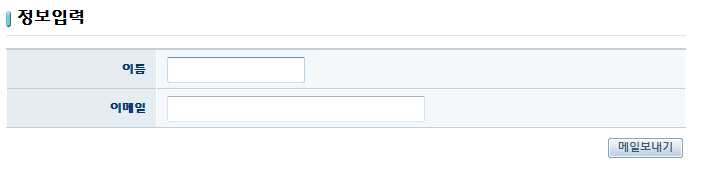

# 메일 서비스 예제(Mail Service Example)

## 개요
전자정부 표준프레임워크를 이용하여 메일을 발송하는 기능에 대한 예제이다. 사전에 정의된 property를 이용하여 메일 서버를 정의하고, 자바 코드를 이용하여 예제 메일을 발송한다.

## 설명
1. 해당 예제를 설치하고 실행하면 다음과 같은 메일보내기가 가능한 페이지가 호출된다.

2. 이름과 이메일란을 작성하고 [메일보내기]를 클릭한다.

3. 성공적으로 메일이 발송되면 성공 메세지를 출력한다.

## 참고 자료
- [Mail 서비스](./mail-service.md)
- [Property 서비스](./property-service.md)