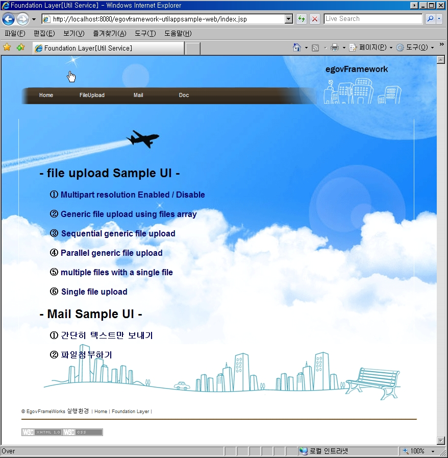

# Mail 서비스

## 개요

**전자정부 프레임워크**에서는 이메일 발송을 쉽게 처리하기 위해 Jakarta Commons Email <acronym title="Application Programming Interface">API</acronym>를 사용하고 있는데 Commons Email은 내부적으로 Java Mail API와 JavaBeans Activation API 를 제공하여 오픈 소스로 채택하였다

Apache Commons-Email은 Java Mail API를 근간으로 좀더 심플하게 메일을 보내는 방안을 제시한다.

Commons Email API는 메일 발송을 처리해주는 SimpleEmail, HtmlEmail과 같은 클래스를 제공하고 있으며, 이들 클래스를 사용하여 일반 텍스트메일, <acronym title="HyperText Markup Language">HTML</acronym> 메일, 첨부 메일 등을 매우 간단(simple)하게 발송할 수 있다.

Email Sample Code는 다음과 같다.

- 간단히 텍스트만 보내기
- 파일 첨부하기
- URL을 통해 첨부하기
- HTML 이메일 보내기
- 인증 처리하기

## 설명

### 1. 간단히 텍스트만 보내기

```java
public class EgovSimpleMail { 
  public static void main(String args[])throws MailException {   
	  SimpleEmail email = new SimpleEmail();
	  // setHostName에 실제 메일서버정보
 
	  email.setCharset("euc-kr"); // 한글 인코딩  
 
	  email.setHostName("mail.myserver.com"); //SMTP서버 설정
	  try {
		email.addTo("jdoe@somewhere.org", "John Doe"); // 수신자 추가
	} catch (EmailException e) {
		e.printStackTrace();
	}
	  try {
		email.setFrom("me@apache.org", "Me"); // 보내는 사람
	} catch (EmailException e) {
		e.printStackTrace();
	}
	  email.setSubject("Test message"); // 메일 제목
	  email.setContent("simple 메일 Test입니다", "text/plain; charset=euc-kr");
	  try {
		email.send();
	} catch (EmailException e) {
		e.printStackTrace();
	}
  } 
}
```
org.apache.commons.mail.SimpleEmail 은 가장 중심이 되는 org.apache.commons.mail.Email을 상속받아 setMsg(java.lang.String msg)만을 구현한 가장 기본적인 클래스이다.

 - SMTP서버 지정 : setHostName(java.lang.String aHostName)
 - 받는 사람의 메일주소 : addTo(java.lang.String email) or addTo(java.lang.String email, java.lang.String name)
 - 보내는 사람의 메일주소 : setFrom(java.lang.String email) or setFrom(java.lang.String email, java.lang.String name)
 - 여러 사람에게 메일을 보낼 경우 :  addTo 함수의 추가

setSubject(java.lang.String subject)와 setMsg(java.lang.String msg)로 메일 제목과 내용을 입력한 후 send() 함수로 전송한다.

email.setCharset(“euc-kr”)을 사용해서 메일의 캐릭터셋이 euc-kr 이라고 지정하고 있는데, 이를 표시하지 않으면 메일 제목이나 보내는 사람 이름등에 있는 한글이 깨지게 되니 주의해야한다.

### 2. 파일 첨부하기

```java
public class EgovEmailAttachment {
	public static void main(String args[]) throws MailException {
 
		try {
		  // 첨부할 attachment 정보를 생성합니다
		  EmailAttachment attachment = new EmailAttachment();
		  attachment.setPath("C:\\xxxx.jpg");
		  attachment.setDisposition(EmailAttachment.ATTACHMENT);
		  attachment.setDescription("첨부 관련 TEST입니다");
		  attachment.setName("xxxx.jpg"); // 
 
		  // 기본 메일 정보를 생성합니다
		  MultiPartEmail email = new MultiPartEmail();
		  email.setCharset("euc-kr");// 한글 인코딩
		  email.setHostName("mail.myserver.com");
		  email.addTo("egov@egov.org", "전자정부"); 
		  email.setFrom("egovto@egov.org", "Me");
		  email.setSubject("전자 정부 첨부 파일 TEST입니다");
		  email.setMsg("여기는 첨부관련 내용을 입력합니다");
 
		  // 생성한 attachment를 추가합니다
		  email.attach(attachment);
 
		  // 메일을 전송합니다
		  email.send();
 
		} catch (EmailException e) {
			e.printStackTrace();
		}
	}
}
```
첨부파일을 보낼려면 org.apache.commons.mail.EmailAttachment 클래스와 org.apache.commons.mail.MultiPartEmail 이메일을 사용하면 된다.

파일 경로와 파일 설명등을 추가하여 setName(java.lang.String name)을 통해 첨부되는 파일명을 설정한다. 그후 MultiPartEmail 을 통해 SimpleEmail 처럼 기본 메일정보를 설정한다.

그리고 MultiPartEmail의 attach() 함수를 통해 첨부 파일을 추가하여 전송한다.

만약 첨부파일이 두개 이상이라면 EmailAttachment 를 여러개 생성하여 파일 정보를 설정 한 후 attach()를 통해 추가해 준다.

EmailAttachment 객체를 생성한 뒤 email.attach()를 사용해서 첨부할 파일을 추가해주기만 하면 된다. 실제 파일명은 한글이 포함되더라도, EmailAttachment.setName() 메소드를 사용해서 파일명을 변경해서 전송할 수도 있다. 주의할 점은 1.0 버전의 Commons Email은 파일명을 한글로 전달할 경우, 파일명이 올바르게 전달되지 않고 깨져서 간단하는 점이다. (파일 자체는 올바르게 전송된다.) 따라서 1.0 버전의 Common Email을 사용하여 파일을 전송할 때에는 알파벳과 숫자로만 구성된 이름의 파일을 전송한다.

### 3. URL을 통해 첨부하기

```java
public class EgovEmailAttachmentUrl {
	public static void main(String args[]) throws MailException, MalformedURLException {
		try {
		  // 첨부할 URL정보 및 파일 기본 정보를 설정합니다
		  EmailAttachment attachment = new EmailAttachment();
		  attachment.setURL(new URL("http://www.apache.org/images/asf_logo_wide.gif"));
		  attachment.setDisposition(EmailAttachment.ATTACHMENT);
		  attachment.setDescription("Apache logo");
		  attachment.setName("Apache logo");
 
		  // 기본 메일 정보를 생성합니다
		  MultiPartEmail email = new MultiPartEmail();
		  email.setHostName("mail.myserver.com");
		  email.addTo("jdoe@somewhere.org", "John Doe");
		  email.setFrom("me@apache.org", "Me");
		  email.setSubject("The logo");
		  email.setMsg("Here is Apache's logo");
 
		  // attachment를 추가합니다
		  email.attach(attachment);
 
		  // 메일을 전송합니다
		  email.send();
 
		} catch (EmailException e) {
			e.printStackTrace();
		}
	}
}
```
파일 경로 정보를 setURL(java.net.<acronym title="Uniform Resource Locator">URL</acronym>) 으로 설정할 뿐 위의 첨부파일과 동일하다.

### 4. HTML 이메일 보내기

```java
public class EgovHtmlEmailSend {
	public static void main(String args[]) throws MailException, MalformedURLException {
		// 기본 메일 정보를 생성합니다
		try {
		HtmlEmail email = new HtmlEmail();
		email.setHostName("mail.myserver.com");
		email.addTo("xxxx@somewhere.org", "xxxx");
		email.setFrom("me@apache.org", "Me");
		email.setSubject("Test email with inline image");
 
		// 삽입할 이미지와 그 Content Id를 설정합니다
		URL url = new URL("http://www.apache.org/images/asf_logo_wide.gif");
		String cid = email.embed(url, "Apache logo");
 
		// HTML 메세지를 설정합니다
		email.setHtmlMsg("<html>The apache logo - </html>");
 
		// HTML 이메일을 지원하지 않는 클라이언트라면 다음 메세지를 뿌려웁니다
		email.setTextMsg("Your email client does not support HTML messages");
 
		// 메일을 전송합니다
		email.send();
 
		} catch (EmailException e) {
        	e.printStackTrace();
        }
	}
}
```
email.setHtmlMsg()를 사용하여 메일 내용을 입력할 때 캐릭터셋을 별도로 지정하지 않아도 한글이 깨지지 않는다.

### 5.인증처리

만약 <acronym title="Simple Mail Transfer Protocol">SMTP</acronym> 서버가 인증을 요구한다면 org.apache.commons.mail.Email 의 setAuthentication(java.lang.String username, java.lang.String password)를 통해 해결할 수 있다

이 함수는 JavaMail API의 DefaultAuthenticator 클래스를 생성하여 사용한다.

```java
SimpleEmail email = new SimpleEmail();
email.setCharset("euc-kr");
email.setHostName("mail.somehost.com");
email.setAuthentication("madvirus", "password");
...
```

### 예제 Sample 실행

1. utilappSample.zip([egovframework.rex.utilappsample.zip](https://www.egovframe.go.kr/wiki/lib/exe/fetch.php?media=egovframework:rte2:fdl:egovframework.rex.utilappsample.zip)) 파일을 다운로드 받는다.
2. 이클립스에서 다운로드 받은 폴더를 선택하여 프로젝트를 Import 한다.
3. lib에 라이브러리 파일이 있는지 확인한다.
src 폴더 아래에 Index.jsp를 선택하여 마우스 오른쪽 클릭하여 Run As > Run On Server를 실행한다.
4. Console 창에서 정상적으로 Tomcat이 실행된 것을 확인한다.

##### 샘플 utilappSample의 Index.jsp 실행하였을 경우 브라우져에서 실행되는 화면



## 참고 자료

[Apache Commons-Email UserGuide](https://commons.apache.org/proper/commons-email/userguide.html)

## 예제
[mail-example](../../runtime-example/individual-example/foundation-layer/mail-example.md)