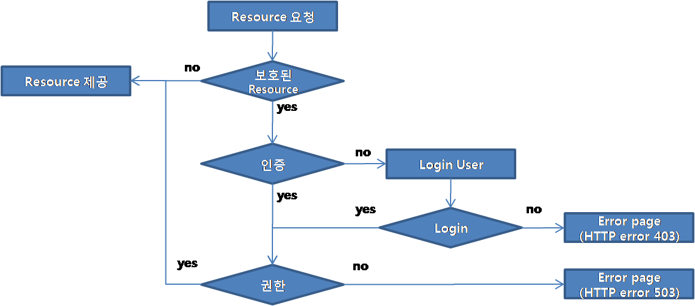
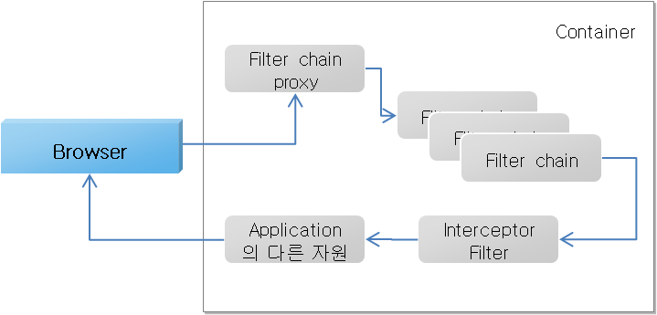
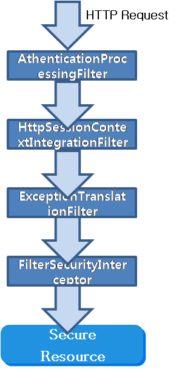
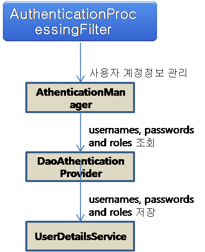
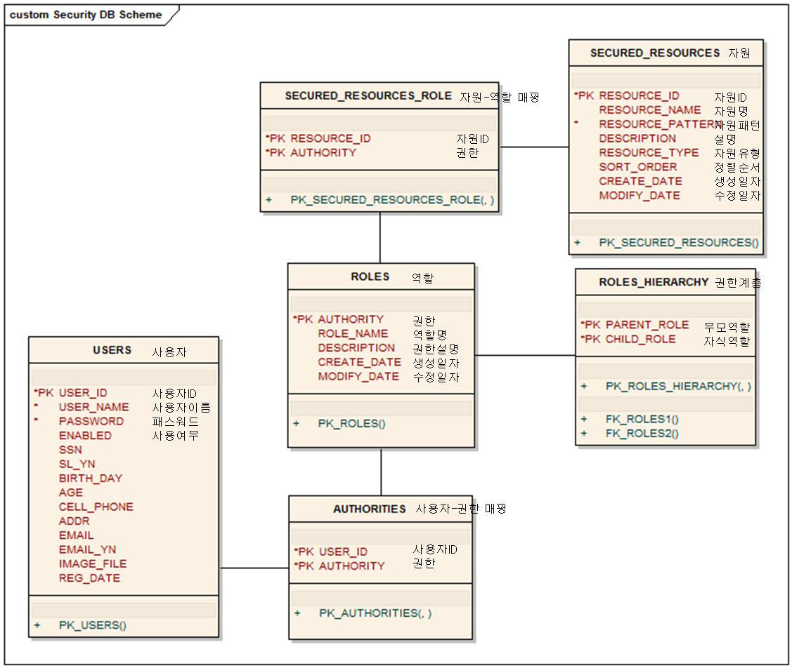

# Architecture

## 개요

 전자정부 개발프레임워크의 Spring Security 기본구조와 기본 환경 설정을 설명한다.  
전자정부 개발프레임워크의 Server Security는 컨테이너 기동시 적용되는 XML기반 인증이 아닌 실시간 적용되는 DB기반의 JDBC 인증을 사용한다.

## 설명

### Spring Security 아키텍처

#### 웹어플리케이션 인증절차

 

- 리소스 요청
- 요청에 대해 보호되고 있는 자원인지 판단
- 아직 인증이 안되었으므로 HTTP 응답코드(오류) 또는 특정 페이지로 redirect
- 인증 메커니즘에 따라 웹 페이지 로그인 폼 또는 X509 인증서
- 입력 폼의 내용을 HTTP post 또는 인증 세부사항을 포함하는 HTTP 헤더를 서버로 요청
- 신원정보(credential)가 유효한지 판단

- 유효한 경우 다음단계 진행
- 유효하지 않을 경우 신원정보 재요청(되돌아감)
- 보호 자원의 접근 권한이 있을 경우 요청 성공 / 접근 권한이 없을 경우 forbidden 403 HTTP 오류

#### Spring Security Filter Chain







- Spring Security에서 생성한 정보 - SecurityContextHoler를 이용하여 SecurityContext 얻음
- 응용프로그램이 분산되어 있는 경우 등 다양한 환경에서 사용 가능토록 SecurityContext를 SecurityContextHolder 내부에 생성한 ThreadLocal 객체를 이용하여 저장하고 있음.
- ThreadLocal 객체는 현재 쓰레드에서 필요한 상태 정보만 담을 수 있음.
- 웹 환경에서 요청이 있을때 마다 동일한 역할을 하는 SecurityContext를 다시 생성하는 것은 맞지 않음 → httpSessionContextIntegrationFilter 를 사용하여 SecurityContext 정보를 ThreadLocal에 기록하고 가져오는 작업을 수행함. (Session 에 저장)

### Security Configuration

#### 필수라이브러리

- spring-security-core-2.0.4.jar
- spring-security-taglibs-2.0.4.jar

#### web.xml 등록

- org.springframework.web.filter.DelegatingFilterProxy 등록 : Application Context에 Spring bean으로 등록된 필터 구현체를 대표하는 Spring Framework 클래스이다.
- 모든 웹요청이 Spring Security의 DelegatingFilterProxy로 전달되도록 한다.
- DelegatingFilterProxy는 웹요청이 서로 다른 URL 패턴에 근거하여 서로 다른 필터로 전달될 수 있도록 해주는 일반적으로 사용할 수 있는 클래스이다.
- 이런 위임된 필터들은 어플리케이션 컨텍스트 내에서 관리되며, 따라서 의존성 주입의 이점을 누릴 수 있다.

##### example

```xml
<filter>
	<filter-name>springSecurityFilterChain</filter-name>
	<filter-class>org.springframework.web.filter.DelegatingFilterProxy</filter-class>
</filter>
<filter-mapping>
	<filter-name>springSecurityFilterChain</filter-name>
	<url-pattern>/*</url-pattern>
</filter-mapping>
```

#### 주요테이블

사용자 인증과 관련된 테이블은 사용자테이블과 사용자권한테이블이며 사용자권한관련 테이블은 역할, 자원, 역할계층 등의 테이블이 있다.  



 DaoAuthenticationProvidor

##### 사용자 테이블

```sql
CREATE TABLE USERS (
	USERNAME VARCHAR(50) NOT NULL,
	PASSWORD VARCHAR(50) NOT NULL,
	ENABLED BIT NOT NULL,
	CONSTRAINT PK_USERS PRIMARY KEY(USERNAME)
);

```

- 필수 필드 : USERNAME(사용자 ID), PASSWORD(사용자 암호), ENABLED(계정 사용여부)
- 나머지 필드 : 세션처리를 위해 사용자 테이블의 나머지 정보를 사용한다. (예. 주민등록번호, 주소, 생일 ..)

##### 사용자 권한 테이블

```sql
CREATE TABLE AUTHORITIES (
	USERNAME VARCHAR(50) NOT NULL,
	AUTHORITY VARCHAR(50) NOT NULL,
	CONSTRAINT PK_AUTHORITIES PRIMARY KEY(USER_ID,AUTHORITY),
	CONSTRAINT FK_USERS FOREIGN KEY(USER_ID) REFERENCES USERS(USER_ID),
	CONSTRAINT FK_ROLES3 FOREIGN KEY(AUTHORITY) REFERENCES ROLES(AUTHORITY)
);

```

- 필수 필드 : USER\_ID(사용자 ID), AUTHORITY(권한)

##### 역할 테이블

```sql
CREATE TABLE ROLES (
	AUTHORITY VARCHAR(50) NOT NULL,
	ROLE_NAME VARCHAR(50),
	DESCRIPTION VARCHAR(100),
	CREATE_DATE DATE,
	MODIFY_DATE DATE,
	CONSTRAINT PK_ROLES PRIMARY KEY(AUTHORITY)
);

```

| AUTHORITY | DESCRIPTION |
| --- | --- |
| IS\_AUTHENTICATED\_ANONYMOUSLY | 익명 사용자 |
| IS\_AUTHENTICATED\_REMEMBERED | REMEMBERED 사용자 |
| IS\_AUTHENTICATED\_FULLY | 인증된 사용자 |
| ROLE\_RESTRICTED | 제한된 사용자 |
| ROLE\_USER | 일반 사용자 |
| ROLE\_ADMIN | 관리자 |
| ROLE\_A | A 업무 |
| ROLE\_B | B 업무 |

##### 역할 계층 테이블

 역할의 계층구조를 저장하는 테이블

```sql
CREATE TABLE ROLES_HIERARCHY (
	PARENT_ROLE VARCHAR(50) NOT NULL,
	CHILD_ROLE VARCHAR(50) NOT NULL,
	CONSTRAINT PK_ROLES_HIERARCHY PRIMARY KEY(PARENT_ROLE,CHILD_ROLE),
	CONSTRAINT FK_ROLES1 FOREIGN KEY(PARENT_ROLE) REFERENCES ROLES(AUTHORITY),
	CONSTRAINT FK_ROLES2 FOREIGN KEY(CHILD_ROLE) REFERENCES ROLES (AUTHORITY)
);

```

| CHILD\_ROLE | PARENT\_ROLE |
| --- | --- |
| ROLE\_ADMIN | ROLE\_USER |
| ROLE\_USER | ROLE\_RESTRICTED |
| ROLE\_RESTRICTED | IS\_AUTHENTICATED\_FULLY |
| IS\_AUTHENTICATED\_FULLY | IS\_AUTHENTICATED\_REMEMBERED |
| IS\_AUTHENTICATED\_REMEMBERED | IS\_AUTHENTICATED\_ANONYMOUSLY |
| ROLE\_ADMIN | ROLE\_A |
| ROLE\_ADMIN | ROLE\_B |
| ROLE\_A | ROLE\_RESTRICTED |
| ROLE\_B | ROLE\_RESTRICTED |

##### 보호된 자원 테이블

```sql
CREATE TABLE SECURED_RESOURCES (
	RESOURCE_ID VARCHAR(10) NOT NULL,
	RESOURCE_NAME VARCHAR(50),
	RESOURCE_PATTERN VARCHAR(300) NOT NULL,
	DESCRIPTION VARCHAR(100),
	RESOURCE_TYPE VARCHAR(10),
	SORT_ORDER INTEGER,
	CREATE_DATE DATE,
	MODIFY_DATE DATE,
	CONSTRAINT PK_RECURED_RESOURCES PRIMARY KEY(RESOURCE_ID)
);

```

 url, method, pointcut으로 자원을 보호한다.

| RESOURCE\_ID | RESOURCE\_PATTERN |
| --- | --- |
| web-000001 | \\A/test\\.do\\Z |
| web-000002 | \\A/sale/.\*\\.do\\Z |
| web-000003 | \\A/cvpl/((?!EgovCvplLogin\\.do).)\*\\Z |
| mtd-000001 | egovframework.rte.sample.service.EgovSampleService.updateSample |
| mtd-000002 | egovframework.rte.sample.service.EgovSampleService.deleteSample |
| mtd-000003 | execution(\* egovframework.rte.sample..service.\*Service.insert\*(..)) |

##### 보호된 자원 역할 테이블

 보호된 자원과 역할과의 매핑 테이블

```sql
CREATE TABLE SECURED_RESOURCES_ROLE (
	RESOURCE_ID VARCHAR(10) NOT NULL,
	AUTHORITY VARCHAR(50) NOT NULL,
	CONSTRAINT PK_SECURED_RESOURCES_ROLE PRIMARY KEY(RESOURCE_ID,AUTHORITY),
	CONSTRAINT FK_SECURED_RESOURCES FOREIGN KEY(RESOURCE_ID) REFERENCES SECURED_RESOURCES(RESOURCE_ID),
	CONSTRAINT FK_ROLES4 FOREIGN KEY (AUTHORITY) REFERENCES ROLES(AUTHORITY)
);

```

## 참고자료