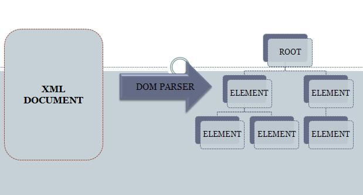
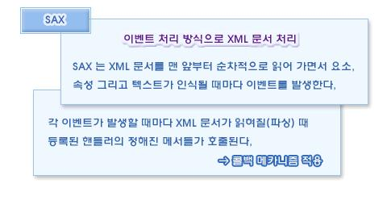
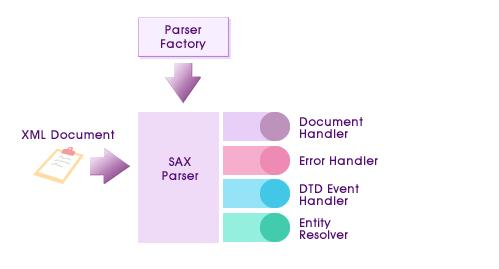
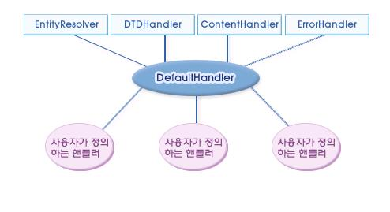

# XML Manipulation Service

## 개요

XML Manipulation 서비스는 XML을 생성하고, 읽고, 쓰는 등과 같은 기능과 조작 기능을 제공하는 서비스이다.
XML(Extensible Markup Language)은 W3C에서 다른 특수 목적의 마크업 언어를 만드는 용도에서 권장되는 다목적 마크업 언어이다.XML은 SGML의 단순화된 부분집합이지만, 수많은 종류의 데이터를 기술하는데 적용할 수 있다.XML은 주로 다른 시스템, 특히 인터넷에 연결된 시스템끼리 데이터를 쉽게 주고받을 수 있게 하여 HTML의 한계를 극복할 목적으로 만들어졌다. XML은 W3C에서 다른 특수 목적의 마크업 언어를 만드는 용도에서 권장되는 다목적 마크업 언어이다. XML은 SGML의 단순화된 부분집합이지만, 수많은 종류의 데이터를 기술하는데 적용할 수 있다.

## 설명

### XML Parser

XML 문서를 읽어 들이는 역할을 수행하는 파서는 두 가지 종류가 있다. XML 파일의 내용을 트리 구조로 한번에 읽어 들여 객체를 생성하여 처리하는 [DOM(Document Object Model)](http://www.w3.org/DOM/) 과 각각의 태그와 내용 등이 인식될 때마다 XML 문서를 읽어 들이는 [SAX(Simple API for XML)](http://www.saxproject.org/)라는 기술이다.

#### DOM(Document Object Model)

##### 요약

XML 문서는 **요소(element)**,**속성(attribute)**,**Text** 등으로 구성된 트리 구조의 계층적인 정보이다. ⇒DOM을 이용하면 XML 문서의 각 요소들에 대하여 트리 구조의 객체를 읽어 들인다. DOM은 XML 문서를 나타내는 각각의 객체들에 대한 표준 인터페이스이다. DOM 파서는 XML 문서로부터 DOM 구조를 생성하는 역할을 한다.




##### Sample Source

###### 1) XML 문서에 대한 Document 객체 생성

```java
DocumentBuilderFactory factory = DocumentBuilderFactory.newInstance();
DocumentBuilder parser = facory.newDocumentBuilder();
Document dc = parser.parse("XML파일명");
Element root = xmldoc.getDocumentElemnt();
logger.debug(root);
```

- DocumentBuilderFactory 인스턴스를 생성
- 생성한 DocumentBuilderFactory를 통해서 parse를 생성
- DocumentBuilder의 parse() 메서드를 호출하여 XML 문서를 로드
- 문서의 루트 요소 획득

###### 2) 바로 밑의 자식 요소들 추출 : Node 인터페이스에서 상속한 getFirstChild(),getNextSibling()을 자식 요소들 중 첫 번째 요소와 이 요소의 형제 요소들을 추출한다.

```java
Element root = doc.getDocumentElement();
for (Node ch = root.getFirstChild(); ch != null; ch = ch.getNextSibling() {
    logger.debug(ch.getNodeName());
}
```

- 문서의 루트 요소 획득
- getFirstChild(),getNextSibling()을 자식 요소들 중 첫 번째 요소와 이 요소의 형제 요소들을 추출

###### 3) 요소명만 추출 : 공백을 나타내는 텍스트 노드는 제외하고 요소명만 출력하려면 추출된 노드의 타입을 점검하여 Node.ELEMENT_NODE인 경우에만 노드 명을 출력한다.

```java
Element root = doc.getDocumentElement();
for (Node ch = root.getFirstChild(); ch != null; ch = ch.getNextSibiling()) {
  if (ch.getNodeType() == Node.ELEMENT_NODE)
    logger.debug(ch.getNodeName());
}
```

- 문서의 루트 요소 획득
- 노드의 타입을 점검하여 Node.ELEMENT_NODE인 경우에만 노드 명을 출력

###### 4) 모든 자식 요소 추출 : 각각의 자식 노드에 대해서도 getNode()메서드를 호출하여 자식의 자식 노드들도 추출한다.재귀함수 기법을 활용한다.

```java
Element root = xmldoc.getDocumentElement();
getNode(root)

public static void getNode(Node n) {
  for (Node ch = n.getFirstChild(); ch != null; ch = ch.getNextSibling()) {
    if (ch.getNodeType() == Node.ELEMENT_NODE) {
      logger.debug(ch.getNodeName());
      getNode(ch);
    }
  }
}
```

- 노드의 자식(child)노드를 찾아간다
- getNode()메서드를 호출하여 자식의 자식 노드들도 추출

###### 5) 공백 이외의 텍스트만 추출 : 공백을 나타내는 텍스트 노드를 제외하고 요소의 내용에 대한 텍스트 노드를 추출하려면 다음과 같은 조건식으로 제어문을 사용한다.

```java
public static void getNode(Node n) {
  for (Node ch = n.getFirstChild(); ch != null; ch = ch.getNextSibling()) {
    if (ch.getNodeType() == Node.ELEMENT_NODE) {
      logger.debug(ch.getNodeName());
      getNode(ch);
    }
    // 텍스트를 처리한다.
    else if (ch.getNodeType() == Node.TEXT_NODE && ch.getNodeValue().trim().length() != 0) {
      logger.debug(ch.getNodeValue());
    }
  }
}
```

- Ordered List Item

###### 6-1) 노드들의 타입에 따른 Parsing : 각 노드 타입에 따라 처리하고 추출된 XML 문서의 내용을 하나의 문자열로 리턴하는 메서드이다.

```java
private String xmlString = "";
public String printString(Node node) {
  int type = node.getNodeType();
  switch (type) {
  case Node.DOCUMENT_NODE:
    printString(((Document) node).getDocumentElement());
    break;
  case Node.ELEMENT_NODE:
    xmlString += "<" + node.getNodeName();
    NamedNodeMap attrs = node.getAttributes();
    for (int i = 0; i < attrs.getLength(); i++) {
      Node attr = attrs.item(i);
      xmlString += " " + attr.getNodeName() + "=" + attr.getNodeValue() + "'";
      xmlString += ">";
      NodeList children = node.getChildNodes();
      if (children != null) {
        for (int i = 0; i < children.getLength(); i++) {
          logger.debug(children.item(i));
        }
      }
      break;
    }
  case Node.CDATA_SECTION_NODE:
    xmlString += "<![CDATA[" + node.getNodeValue() + "]]>";
    break;
  case Node.TEXT_NODE:
    xmlString += node.getNodeValue().trim();
    break;
  case Node.PROCESSING_INSTRUCTION_NODE:
    xmlString += "<?" + node.getNodeName() + " " + node.getNodeValue() + "?>";
    break;
  }
  if (type == Node.ELEMENT_NODE) {
    xmlString += "</" + node.getNodeName() + ">";
  }
  return xmlString;
}
```

###### 6-2) 노드들의 타입에 따른 Parsing : Node 인터페이스에서 지원되는 getNodeType()이라는 메서드를 사용하여 인식된 자식 노드가 어떠한 타입 노드인지에 따라 처리한다.

| NODE TYPE                        | 설 명                                                                                                    |
| -------------------------------- | -------------------------------------------------------------------------------------------------------- |
| Node.DOCUMENT_NODE               | DocumentElement 객체 정보를 가지고 printString()을 호출                                                  |
| Node.ELEMENT_NODE                | 요소명,속성정보(NAME,VALUE)을 추출하여 xmlString에 저장하고 자손 요소 정보를 가지고 pringString()을 호출 |
| Node.CDATA_SECTION_NODE          | 추출된 VALUE에 &lt;!CDATA[와]]&gt;을 추가                                                                |
| Node.TEXT_NODE                   | VALUE만 추출                                                                                             |
| Node.PROCESSING_INSTRUCTION_NODE | 추출된 값에 &lt;? 와 ?&gt;을 추가                                                                        |

#### SAX(Simple API for XML)

##### 요약

XML 문서를 읽어 들이는 응용 프로그램 API 로서 XML 문서를 하나의 긴 문자열로 간주한다. SAX는 문자열을 앞에서 부터 차례로 읽어 가면서 요소,속성이 인식될 때 마다 **EVENT**를 발생시킨다.

각각의 EVENT가 발생 될 떄 마다 수행하고자 하는 기능을 **이벤트 핸들러 기술**을 이용하여 구현한다.

##### SAX 프로그램구현 과정



1. 발생될 이벤트에 대한 핸들러(이벤트 처리 객체)를 개발한다.
2. SAX 객체를 생성한다.
3. 미리 구현한 핸들러를 등록하면서 XML 문서를 읽어 들인다.

##### Sample Source



* 어떠한 기능의 핸들러를 구현할 것인가에 따라 다음 인터페이스들을 필요에 따라 상속한다.

```java
org.xml.sax.ContentHandlder
org.xml.sax.DTDHandler
org.xml.sax.EntityResolver
org.xml.sax.ErrorHandler
```

* org.xml.sax.ContentHandler : 이 핸들러는 SAX의 핵심으로,일반적인 문서 이벤트를 처리한다.

```java
void characters(char[] ch,int start,int length)
void endDocument() // 문서의 끝이 인식되면 호출된다.
void endElement(String namespaceURI,String localName,String qName)
                   // 요소의 종료가 인식되면 호출된다.
void endPrefixMapping(String prefix) // prefix-URI 이름 공간의 종료가 인식되면 호출된다.
void ignorableWhitspace(char[] ch,int start, int length)
                   // 요소 내용에서 무시 가능한 공백을 인식되면 호출된다.
void processingInstruction(String target,String data) // PI가 인식되면 호출된다.
void setDocumentLocator(Locator locator) // 이벤트가 발생된 위치 정보를 알려 주는 객체 전달 시 호출된다.
void skippedEntity(Strig name) // 스킵된 엔티티가 인식되면 호출된다.
void startDocument() // 문서의 시작이 인식되면 호출된다.
void startElement(String namespaceURI,String localName,String qName,Attributes atts)
                   // 요소의 시작이 인식되면 호출된다.
void startPrefixMapping(String prefix,String uri) 
                   // "prefix-URI 이름 공간의 시작이 인식되면 호출된다." 가 인식되면 호출된다.
```

* org.xml.sax.DTDHandler : 기본적인 파싱에 있어 요구되는 DTD 이벤트를 핸들링하기 위해 호출된다. 즉 표기법과 파싱되지 않는 엔티티(entity)선언을 만날 때 호출 된다.

```java
void notationDecl(String name,String publicId,String systemId) // DTD 선언 이벤트가 인식되면 호출된다.
void unparsedEntityDecl(String name,String publicId,String systemId,String notationName)
                  // 파싱되지 않는 엔티티 선언 이벤트가 인식되면 호출된다.
```

* org.xml.sax.EntityResolver : 외부 엔티티를 참조하기 위하여 호출된다. 만일 문서에 외부 엔티티 참조가 없다면, 이 인터페이스는 필요 없다.

```java
InputSource resolveEntity(String publicId,String systemId) // 확장 엔티티 처리와 관련된 기능을 처리한다.
```

* org.xml.sax.ErrorHandler : 에러를 처리하기 위해 사용된다. 파서는 모든 경고와 에러를 처리하기 위해 이 핸들러가 호출된다.

```java
void error(SAXParseException exception) // 복구 가능한 오류 발생시 호출된다.
void fatalError(SAXParseException exception) // 복구 불가능한 오류 발생시 호출된다.
void warning(SAXParseException exception) // 경고 오류 발생시 오출된다.
```

* DefaultHandler 클래스 : 필요한 메서드만을 오버라이딩 하여 구현할 수 있도록 이 인터페이스를 모두 상속하여 각 인터페이스에 정의되어 있는 abstract메서들을 오버라이딩한 DefaulatHandler 클래스를 사용한다.



```java
//DefaultHandler를 상속하여 구현한 핸들러 클래스
class SampleHandler extends DefaultHandler {
  public void startDocument() {
    logger.debug("XML이 시작되었습니다.");
  }
  public void endDocument() {
    logger.debug("XML이 종료되었습니다.");
  }
}
```

* SAX 객체 생성 : DOM 객체 생성 방법과 비슷하게 SAX 객체도 SAXParseFactory 객체 생성 후에 SAXParser 객체를 생성한다.

```java
SAXParserFactory spf = SAXParserFactory.newInstance();
SAXParser sp = spf.newSAXParser();
```

* 핸들러 등록과 XML 문서 읽기 : 핸들러 클래스의 객체와 SAXParser의 객체를 생성한 후에 다음과 같이 여러 개로 오버로딩 된 메서드를 중에서 하나를 선택하여 XML을 SAX 객체로 읽어 들인다.

```java
void parse(File f,DefaultHandler dh)
void parse(InputStream is, DefaultHandler dh)
void parse(InputStream is, DefaultHandler dh)
void parse(String uri, DefaultHandler dh)
```
```java
// 핸들러를 등록하면서 XML 문서를 읽는 예
SampleHandler sh = new SampleHandler();
// 문서를 읽어들린다.
sp.parse(new FileInputStream("text.xml"),sh);
```

### XML Manipulation

#### Configuration

```xml
<bean id="xmlCofig" class="egovframework.rte.fdl.xml.EgovXmlset">
        <property name="domconcrete" ref="domconcreteCont" />
        <property name="saxconcrete" ref="saxconcreteCont" />
</bean>
<bean id="domconcreteCont" class="egovframework.rte.fdl.xml.EgovConcreteDOMFactory"/>
<bean id="saxconcreteCont" class="egovframework.rte.fdl.xml.EgovConcreteSAXFactory"/>
```

| PROPERTIES  | 설 명                                           |
| ----------- | ----------------------------------------------- |
| domconcrete | EgovDOMValidatorService 생성하는 Concrete Class |
| saxconcrete | EgovSAXValidatorService 생성하는 Concrete Class |

```xml
<context:property-placeholder location="classpath*:spring/egovxml.properties" />
<bean id="xmlconfig" class="egovframework.rte.fdl.xml.XmlConfig">
	 <property name="xmlpath" value="${egovxmlsaved.path}" />
</bean>
```

| PROPERTIES | 설 명                            |
| ---------- | -------------------------------- |
| xmlpath    | XML문서 생성 Directory 위치 지정 |

```properties
// XML 기본저장 디렉토리
egovxmlsaved.path=C:\\Temp\\
```

egovxml.properties 내용 예시

#### Sample Source

```java
/** abstractXMLFactoryService 상속한 Class **/
@Resource(name = "domconcreteCont")
EgovConcreteDOMFactory domconcrete = null;
 
/** abstractXMLFactoryService 상속한 Class **/
@Resource(name = "saxconcreteCont")
EgovConcreteSAXFactory saxconcrete = null;
 
/** AbstractXMLUtility 상속한 DOMValidator **/
EgovDOMValidatorService domValidator = null;
/** AbstractXMLUtility 상속한 SAXValidator **/
EgovSAXValidatorService saxValidator = null;
```

##### DOM Service 생성

```java
@Test
public void ModuleTest() throws UnsupportedException {
  domValidator = domconcrete.CreateDOMValidator();
  logger.debug("fileName :" + fileName);
  domValidator.setXMLFile(fileName);
}
```

##### SAX Service 생성

```java
@Test
public void ModuleTest() throws UnsupportedException {
  saxValidator = saxconcrete.CreateSAXValidator();
  logger.debug("fileName :" + fileName);
  saxValidator.setXMLFile(fileName);
}
```

##### well-formed, Validation 검사

XML문서의 well-formed 검사를 하면서 Validation검사도 동시에 실행(선택)

```java
public void WellformedValidate(boolean used, boolean isvalid, AbstractXMLUtility service) throws ValidatorException {
  if (used) {
    if (service.parse(isvalid)) {
      if (isvalid)
        logger.debug("Validation 문서입니다.");
      else
        logger.debug("well-formed 문서입니다.");
    }
  }
}
```

| PARAMETER | 설 명               |
| --------- | ------------------- |
| isvalid   | Validation 검사여부 |


##### XPATH 조회

검색하고자하는 Element나 Attribute등을 검색식(표현식)을 통해 조회

```java
public void XPathResult(boolean used, AbstractXMLUtility service, Document doc) throws JDOMException {
  if (used) {
    List list = service.getResult(doc, "//*[@*]");
    viewEelement(list);
  }
}
```

| PARAMETER | 설 명             |
| --------- | ----------------- |
| expr      | Validation 검색식 |
| doc       | Document 객체     |

##### XML 생성

입력받은 Element를 사용하여 XML문서를 생성

```java
public void createNewXML(boolean used, AbstractXMLUtility service, Document doc, String EleName, List list, String path)
throws JDOMException, TransformerException, FileNotFoundException {
  if (used)
    service.createNewXML(doc, EleName, list, path);
}
```

| PARAMETER | 설 명               |
| --------- | ------------------- |
| doc       | Document 객체       |
| EleName   | Root 명             |
| list      | 생성 Element List   |
| path      | 생성될 XML문서 경로 |

##### Element 추가

입력받은 Element를 XML문서에 추가

```java
public void addElement(boolean used, AbstractXMLUtility service, Document doc, String EleName, List list, String path)
throws JDOMException, TransformerException, FileNotFoundException {
  if (used)
    service.addElement(doc, EleName, list, path);
}
```

| PARAMETER | 설 명               |
| --------- | ------------------- |
| doc       | Document 객체       |
| EleName   | Root 명             |
| list      | 생성 Element List   |
| path      | 생성될 XML문서 경로 |

##### TextNode Element 추가

입력받은 Text Element를 XML문서에 추가

```java
public void addTextElement(boolean used, AbstractXMLUtility service, Document doc,
  String elemName, List list, String path)
throws JDOMException, TransformerException, FileNotFoundException {
  if (used)
    service.addTextElement(doc, elemName, list, path);
}
```

| PARAMETER | 설 명               |
| --------- | ------------------- |
| doc       | Document 객체       |
| EleName   | Root 명             |
| list      | 생성 Element List   |
| path      | 생성될 XML문서 경로 |

##### TextNode Element 수정

입력받은 Text Element로 수정

```java
public void updTextElement(boolean used, AbstractXMLUtility service, Document doc, List list, String path)
throws JDOMException, TransformerException, FileNotFoundException {
  if (used)
    service.updTextElement(doc, list, path);
}
```

| PARAMETER | 설 명               |
| --------- | ------------------- |
| doc       | Document 객체       |
| list      | 생성 Element List   |
| path      | 생성될 XML문서 경로 |

##### Element 삭제

입력받은 Element을 삭제

```java
public void delElement(boolean used, AbstractXMLUtility service, Document doc, String EleName, String path)
throws JDOMException, TransformerException, FileNotFoundException {
  if (used)
    service.delElement(doc, EleName, path);
}
```

| PARAMETER | 설 명               |
| --------- | ------------------- |
| doc       | Document 객체       |
| EleName   | Element 명          |
| path      | 생성될 XML문서 경로 |

##### Element 수정

```java
public void updElement(boolean used, AbstractXMLUtility service, Document doc,
  String oldElement, String newElement, String path)
throws JDOMException, TransformerException, FileNotFoundException {
  if (used)
    service.updElement(doc, oldElement, newElement, path);
}
```

| PARAMETER  | 설 명               |
| ---------- | ------------------- |
| doc        | Document 객체       |
| oldElement | 수정할 Element 명   |
| newElement | 수정 Element 명     |
| path       | 생성될 XML문서 경로 |

#### 가이드프로그램 실행순서

1. 실행관리 Repository에서 egovframework.rte.fdl.xml-1.0.0-SNAPSHOT.jar를 Classpath 설정한다.
2. spring폴더를 생성 후 Classpath 설정한다.
3. 실행관리 Repository에서 egovxmlCfg.xml와 egovxml.properties 2파일은 반드시 spring폴더로 복사한다.
4. egovxmlCfg.xml 내용은 egovxml.properties 파일의 위치를 바꿔 설정한다.
5. egovxml.properties의 egovxmlsaved.path를 바꿔 설정한다.
6. 테스트에 필요한 context-test.xml,context-xmltest.xml를 spring폴더 또는 설정한위치로 복사한다.
7. 설정이 완료된 후 ControlXMLTest.java를 실행한다.


