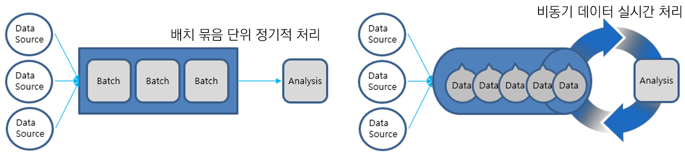

# Cloud Data Stream

## 개요

Spring Cloud Stream은 공유 메시징 시스템과 연결된 확장성이 뛰어난 이벤트 기반 마이크로서비스를 구축하기 위한 프레임워크이다.

Spring Cloud Stream의 핵심 구성 요소는 다음과 같다.<br/>
- 대상 바인더 : 외부 메시징 시스템과의 통합을 담당하는 구성 요소이다.<br/>
- 대상 바인딩 : 외부 메시징 시스템과 최종 사용자가 제공하는 애플리케이션 코드(생산자/소비자) 사이를 연결한다.<br/>
- 메시지 : 생산자와 소비자가 대상 바인더(및 외부 메시징 시스템을 통한 다른 응용 프로그램)와 통신하는 데 사용하는 표준 데이터 구조이다.

Spring Cloud Stream은 Spring Integration의 메시지 처리 핵심 기능을 기반으로 사용한다.<br/>
 또한 Spring Boot를 기반으로 Binder 구현체를 제공하여 메시지 처리를 추상화 하여 동일 환경 뿐만 아니라 이기종의 시스템 또는 다른 환경 간에도 연계 메시지 처리를 지원한다.

## 특징

### Data Stream

비동기 데이터 처리는 지속적으로 발생하는 데이터에 대하여 실시간으로 처리 하는데 주요 목적이 있으며, 시간에 비교적 민감한 자료의 처리에 적합하며 다양한 지리적 위치에서 다양한 형식으로 전달될 수 있다.

### Data Stream , Batch 비교



| 배치 처리 | 비동기 데이터 처리 |
| --- | --- |
| 한정된 대량의 데이터 | 지속적으로 데이터가 발생 |
| 스케줄러를 사용하여 특정 시간에 처리 | 데이터 발생주기는 일정한 경우와 불규칙한 경우 모두 가능 |
| 일괄로 정해진 묶음단위 처리 | 데이터를 실시간으로 처리 |

## 설명

### 예제 코드

java.util.function 패키지의 Functional Interface를 기반으로 람다식 사용 시 Supplier, Function, Consumer를 활용하여 클래스를 생성하지 않고 구현이 가능하다.<br/>
이 경우 Supplier는 Sink Binding으로 1초마다 주기적으로 발행된다.

```java
@Slf4j
@Configuration
public class DataStreamConfig {
 
    @Bean
    public Supplier<String> basicProducer() {
    	return () -> "Hello";
    }
 
    @Bean
    public Function<String, String> uppercase() {
        return value -> value.toUpperCase();
    }
 
    @Bean
    pubilc Consumer<String> basicConsumer() {
    	return message -> log.info("message = {}", message);
    }
}
```

### StreamBridge

불규칙하게 발행되는 경우 StreamBridge를 활용 할수 있다.

```java
    private void processChangeHistory(long elapsedTimeMills, String className, String methodName, Sample content) {
        SampleDTO sampleDTO = new SampleDTO();
        sampleDTO.setCategory("change");
        sampleDTO.setContent(content);
        sampleDTO.setClassName(className);
        sampleDTO.setMethodName(methodName);
        sampleDTO.setElapsedMills(elapsedTimeMills);
 
        streamBridge.send("historyDb", sampleDTO);
    }
```

### Deprecated 내용

Spring Cloud Stream v3.x에서 org.springframework.cloud.stream.annotation 패키지에 포함된 대부분의 어노테이션이 Depreaceted 되었다.<br/>
따라서 v3.x이상에서는 함수형 프로그래밍 방식으로 작성 및 설정 해야 한다.

~~@EnableBinding~~<br/>
~~@StreamListener~~<br/>
~~@Input~~<br/>
~~@Output~~<br/>
~~@StreamMessageConverter~~<br/>

## 설정방법

### pom.xml 설정

대표적으로 RabbitMQ Binder 및 Kafka Binder를 지원하며 그외에도 다양한 바인더를 지원한다.

```xml
	<!-- Spring Cloud Stream RabbitMQ Binder -->
	<dependency>
		<groupId>org.springframework.cloud</groupId>
		<artifactId>spring-cloud-stream-binder-rabbit</artifactId>
		<version>3.2.4</version>
	</dependency>
 
	<!-- Spring Cloud Stream Kafka Binder -->
	<dependency>
		<groupId>org.springframework.cloud</groupId>
		<artifactId>spring-cloud-stream-binder-kafka</artifactId>
		<version>3.2.4</version>
	</dependency>
```

### application.yml 설정

#### RabbitMQ 연결 설정 예시

```yml
spring:
  rabbitmq:
    host: 192.168.100.50
    port: 5672
    username: guest
    password: guest
    virtual-host: egov
```

#### Kafka 연결 설정 예시

```yml
spring:
  cloud:
    stream:
      kafka:
        binder:
          autoCreateTopics: false
          autoAddPartitions: false
          zkNodes: 192.168.100.50
          brokers: 192.168.100.50
```

#### 바인딩 설정

단일 바인딩의 경우 다음과 같이 간단하게 설정 가능 하다.

```yml
spring:
  cloud:
    stream:
      bindings:
        output:
          destination: sample-topic
        input:
          destination: sample-topic
```

#### 멀티 바인딩 설정

다음 네이밍 컨벤션을 반드시 따라야 한다.<br/>
input : {functionName} + -in- + {index}<br/>
output : {functionName} + -out- + {index}

```yml
spring:
  cloud:
    stream:
      bindings:
        basicProducer-out-0:
          destination: test-topic
          binder: kafka
        basicConsumer-in-0:
          destination: test-topic
          binder: rabbit
      function:
        definition: basicProducer;basicConsumer;
```

## 참고자료

- https://spring.io/projects/spring-cloud-stream/
- [Functional Interface](https://docs.oracle.com/javase/8/docs/api/java/util/function/package-summary.html)