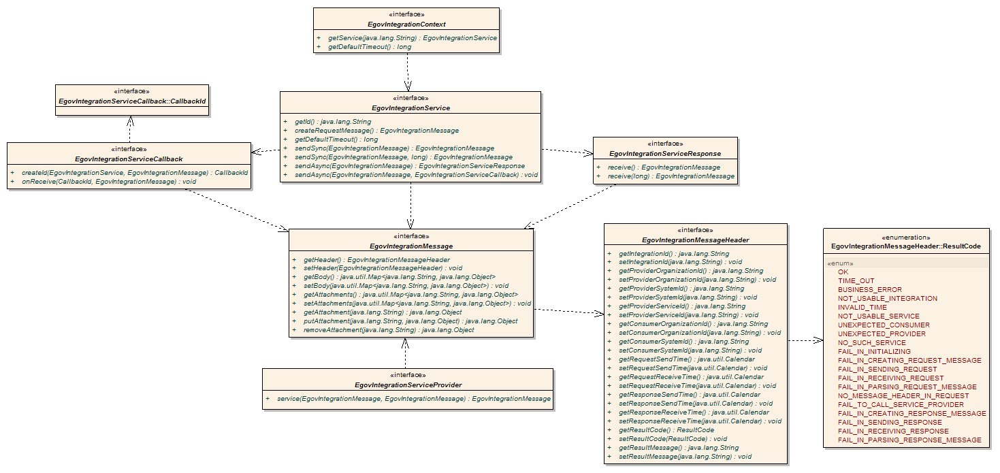
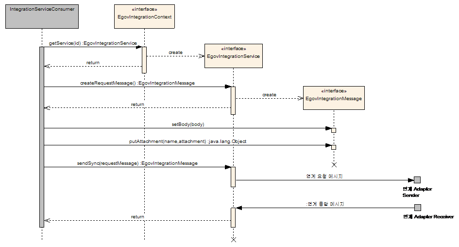
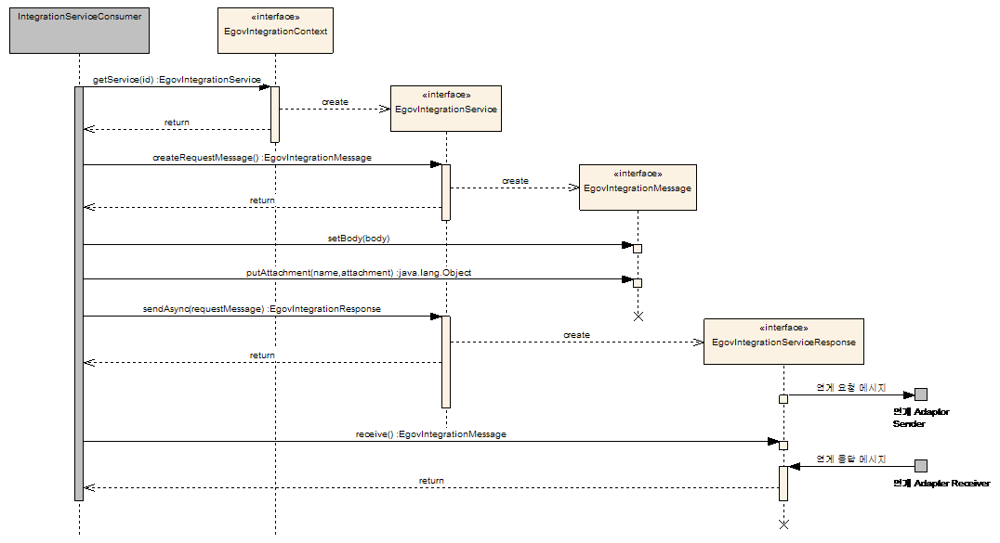
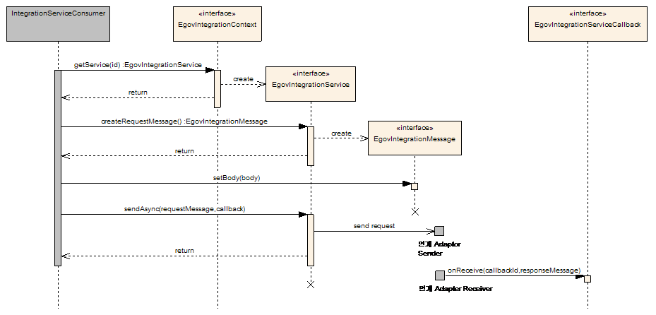

# 연계 서비스 API

## 개요

연계 서비스 API는 연계 서비스를 사용 및 제공하기 위한 interface를 제공한다.

## 설명

### 구성

연계 서비스 API는 다음과 같이 구성된다.



| <center>구성요소</center> | <center>설명</center> |
| --- | --- |
| [EgovIntegrationContext](#egovintegrationcontext) | 연계 서비스에 대한 설정 및 EgovIntegrationService 객체를 관리한다. |
| [EgovIntegrationMessage](#egovintegrationmessage) | 연계 서비스를 통해 주고받는 표준 메시지를 정의한다. |
| [EgovIntegrationMessageHeader](#egovintegrationmessageheader) | 연계 서비스를 통해 주고받는 표준 메시지 헤더를 정의한다. |
| [EgovIntegrationMessageHeader::ResultCode](#egovintegrationmessageheaderresultcode) | 연계 서비스 결과 코드를 담고 있는 enumeration이다. |
| [EgovIntegrationService](#egovintegrationservice) | 연계 서비스를 호출하기 위해 사용한다. |
| [EgovIntegrationResponse](#using-sendasync-with-response) | 연계 서비스를 비동기 방식으로 호출한 경우, 응답 메시지를 받기 위해 사용한다. |
| [EgovIntegrationServiceCallback](#using-sendasync-with-callback) | 연계 서비스를 비동기 방식으로 호출한 경우, 응답 메시지를 받기 위한 Callback interface이다. |
| [EgovIntegrationServiceCallback::CallbackId](#using-sendasync-with-callback) | 연계 서비스를 Callback을 이용한 비동기 방식으로 호출한 경우, 요청 메시지와 응답 메시지를 연결하기 위한 ID를 나타내는 interface이다. |
| [EgovIntegrationServiceProvider](#egovintegrationserviceprovider) | 연계 서비스를 제공하기 위해 사용한다. |

### EgovIntegrationContext

EgovIntegrationContext는 연계 서비스에 대한 설정 및 [EgovIntegrationService](#egovintegrationservice) 객체를 관리한다. 연계 서비스를 사용하기 위해서는 EgovIntegrationContext의 getService 메소드를 사용하여 [EgovIntegrationService](#egovintegrationservice) 객체를 얻어와야 한다.<br/>
아래는 주민등록번호와 성명을 이용하여 실명확인을 수행하는 예제이다.

```java
package itl.sample;
 
import javax.annotation.Resource;
 
import egovframework.rte.itl.integration.EgovIntegrationContext;
import egovframework.rte.itl.integration.EgovIntegrationService;
 
public class EgovIntegrationSample
{
    @Resource(name = "egovIntegrationContext")
    private EgovIntegrationContext egovIntegrationContext;
 
    public boolean verifyName(final String name, final String residentRegistrationNumber)
    {
        // 연계ID가 "INT_VERIFY_NAME"인 연계 서비스 객체를 얻어온다.
        EgovIntegrationService service = egovIntegrationContext.getService("INT_VERIFY_NAME");
 
        // 요청 메시지 생성
         EgovIntegrationMessage requestMessage = service.createRequestMessage();
 
        // 요청 메시지 작성
         requestMessage.getBody().put("name", name);
        requestMessage.getBody().put("residentRegistrationNumber", residentRegistrationNumber);
 
        // 서비스 요청
         EgovIntegrationMessage responseMessage = service.sendSync(requestMessage);
 
        // 결과 return
        return responseMessage.getBody().get("result");
    }
}
```
위 예제에 해당하는 Metadata는 아래와 같다.

<table border="1">
  <tr>
    <td colspan="7" style="text-align: center; font-weight: bold;">INTEGRATION</td>
  </tr>
  <tr>
    <td style="text-align: center; font-weight: bold;">ID</td>
    <td style="text-align: center; font-weight: bold;">PROVIDER_SERVICE_KEY</td>
    <td style="text-align: center; font-weight: bold;">CONSUMER_SYSTEM_KEY</td>
    <td style="text-align: center; font-weight: bold;">DEFAULT_TIMEOUT</td>
    <td style="text-align: center; font-weight: bold;">USING_YN</td>
    <td style="text-align: center; font-weight: bold;">VALIDATE_FROM</td>
    <td style="text-align: center; font-weight: bold;">VALIDATE_TO</td>
  </tr>
  <tr>
    <td>'INT_VERIFY_NAME'</td>
    <td>'SERVICE_VERIFY_NAME'</td>
    <td>'SYSTEM_CONSUMER'</td>
    <td>5000</td>
    <td>'Y'</td>
    <td>NULL</td>
    <td>NULL</td>
  </tr>
</table>

<table border="1">
  <tr>
    <td colspan="2" style="text-align: center; font-weight: bold;">ORGANIZATION</td>
  </tr>
  <tr>
    <td style="text-align: center; font-weight: bold;">ID</td>
    <td style="text-align: center; font-weight: bold;">NAME</td>
  </tr>
  <tr>
    <td>'ORG00001'</td>
    <td>'요청 기관'</td>
  </tr>
  <tr>
    <td>'ORG00002'</td>
    <td>'제공 기관'</td>
  </tr>
</table>

<table border="1">
  <tr>
    <td colspan="5" style="text-align: center; font-weight: bold;">SYSTEM</td>
  </tr>
  <tr>
    <td style="text-align: center; font-weight: bold;">SYSTEM_KEY</td>
    <td style="text-align: center; font-weight: bold;">ORGANIZATION_ID</td>
    <td style="text-align: center; font-weight: bold;">SYSTEM_ID</td>
    <td style="text-align: center; font-weight: bold;">SYSTEM_NAME</td>
    <td style="text-align: center; font-weight: bold;">STANDARD_YN</td>
  </tr>
  <tr>
    <td>'SYSTEM_CONSUMER'</td>
    <td>'ORG00001'</td>
    <td>'SYS00001'</td>
    <td>'요청 시스템'</td>
    <td>'Y'</td>
  </tr>
  <tr>
    <td>'SYSTEM_PROVIDER'</td>
    <td>'ORG00002'</td>
    <td>'SYS00001'</td>
    <td>'응답 시스템'</td>
    <td>'Y'</td>
  </tr>
</table>

<table border="1">
  <tr>
    <td colspan="9" style="text-align: center; font-weight: bold;">SERVICE</td>
  </tr>
  <tr>
    <td style="text-align: center; font-weight: bold;">SERVICE_KEY</td>
    <td style="text-align: center; font-weight: bold;">SYSTEM_KEY</td>
    <td style="text-align: center; font-weight: bold;">SERVICE_ID</td>
    <td style="text-align: center; font-weight: bold;">SERVICE_NAME</td>
    <td style="text-align: center; font-weight: bold;">REQUEST_MESSAGE_TYPE_ID</td>
    <td style="text-align: center; font-weight: bold;">RESPONSE_MESSAGE_TYPE_ID</td>
    <td style="text-align: center; font-weight: bold;">SERVICE_PROVIDER_BEAN_ID</td>
    <td style="text-align: center; font-weight: bold;">USING_YN</td>
    <td style="text-align: center; font-weight: bold;">STANDARD_YN</td>
  </tr>
  <tr>
    <td>'SERVICE_VERIFY_NAME'</td>
    <td>'SYSTEM_PROVIDER'</td>
    <td>'SRV00001'</td>
    <td>'VerifyName'</td>
    <td>'REQ_VERIFY_NAME'</td>
    <td>'RES_VERIFY_NAME'</td>
    <td>'serviceVerifyName'</td>
    <td>'Y'</td>
    <td>'Y'</td>
  </tr>
</table>

<table border="1">
  <tr>
    <td colspan="3" style="text-align: center; font-weight: bold;">RECORD_TYPE</td>
  </tr>
  <tr>
    <td style="text-align: center; font-weight: bold;">RECORD_TYPE_ID</td>
    <td style="text-align: center; font-weight: bold;">RECORD_TYPE_NAME</td>
    <td style="text-align: center; font-weight: bold;">PARENT_RECORD_TYPE_ID</td>
  </tr>
  <tr>
    <td>'REQ_VERIFY_NAME'</td>
    <td>'RequestVerifyName'</td>
    <td>NULL</td>
  </tr>
  <tr>
    <td>'RES_VERIFY_NAME'</td>
    <td>'ResponseVerifyName'</td>
    <td>NULL</td>
  </tr>
</table>

<table border="1">
  <tr>
    <td colspan="3" style="text-align: center; font-weight: bold;">RECORD_TYPE_FIELD</td>
  </tr>
  <tr>
    <td style="text-align: center; font-weight: bold;">RECORD_TYPE_ID</td>
    <td style="text-align: center; font-weight: bold;">RECORD_FIELD_NAME</td>
    <td style="text-align: center; font-weight: bold;">RECORD_FIELD_TYPE_ID</td>
  </tr>
  <tr>
    <td>'REQ_VERIFY_NAME'</td>
    <td>'name'</td>
    <td>'string'</td>
  </tr>
  <tr>
    <td>'REQ_VERIFY_NAME'</td>
    <td>'residentRegistrationNumber'</td>
    <td>'string'</td>
  </tr>
  <tr>
    <td>'RES_VERIFY_NAME'</td>
    <td>'result'</td>
    <td>'boolean'</td>
  </tr>
</table>

### EgovIntegrationMessage

EgovIntegrationMessage는 [헤더부](#헤더부), [바디부](#바디부), [첨부파일](#첨부파일)로 구성된다.

#### 헤더부

EgovIntegrationMessage의 헤더부를 access 하기 위한 메소드는 아래와 같다.

<table border="1">
  <tr>
    <td colspan="2" style="text-align: center; font-weight: bold;">Method Summary</td>
  </tr>
  <tr>
    <td style="text-align: right;"><a href="#egovintegrationmessageheader">EgovIntegrationMessageHeader</a></td>
    <td>getHeader()</td>
  </tr>
  <tr>
    <td style="text-align: right;">void</td>
    <td><span>setHeader(</span><a href="#egovintegrationmessageheader">EgovIntegrationMessageHeader</a><span> header)</span></td>
  </tr>
</table>

#### 바디부

EgovIntegrationMessage의 바디부를 access 하기 위한 메소드를 아래와 같다.

<table border="1">
  <tr>
    <td colspan="2" style="text-align: center; font-weight: bold;">Method Summary</td>
  </tr>
  <tr>
    <td style="text-align: right;">Map&lt;String, Object&gt;</td>
    <td>getBody()</td>
  </tr>
  <tr>
    <td style="text-align: right;">void</td>
    <td>setBody(Map&lt;String, Object&gt; body)</td>
  </tr>
</table>

EgovIntegrationMessage의 바디부는 다음 값들로만 구성될 수 있다.

- Java Primitive Type의 Wrapper 객체(Boolean, Byte, Short, Integer, Long, Float, Double)
- BigInteger, BigDecimal
- String
- Calendar
- List&lt;Object&gt;
- Map&lt;String, Object&gt;

#### 첨부파일

EgovIntegrationMessage의 첨부파일을 access 하기 위한 메소드는 아래와 같다.

<table border="1">
  <tr>
    <td colspan="5" style="text-align: center; font-weight: bold;">Method Summary</td>
  </tr>
  <tr>
    <td style="text-align: right;">Map&lt;String, Object&gt;</td>
    <td>getAttachments()</td>
  </tr>
  <tr>
    <td style="text-align: right;">void</td>
    <td>setAttachments(Map&lt;String, Object&gt; attachments)</td>
  </tr>
  <tr>
    <td style="text-align: right;">Object</td>
    <td>getAttachment(String name)</td>
  </tr>
  <tr>
    <td style="text-align: right;">void</td>
    <td>putAttachment(String name, Object attachment)</td>
  </tr>
  <tr>
    <td style="text-align: right;">Object</td>
    <td>removeAttachment(String name)</td>
  </tr>
</table>

### EgovIntegrationMessageHeader

EgovIntegrationMessageHeader는 다음과 같은 정보를 담고 있다.

| <center>Attribute Name</center> | <center>Data Type</center> | <center>설명</center> |
| --- | --- | --- |
| IntegrationId | String | 연계ID |
| ProviderOrganizationId | String | 연계 제공 기관ID |
| ProviderSystemId | String | 연계 제공 시스템ID |
| ProviderServiceId | String | 연계 제공 서비스ID |
| ConsumerOrganizationId | String | 연계 요청 기관ID |
| ConsumerSystemId | String | 연계 요청 시스템ID |
| RequestSendTime | Calendar | 요청 송신 시각 |
| RequestReceiveTime | Calendar | 요청 수신 시각 |
| ResponseSendTime | Calendar | 응답 송신 시각 |
| ResponseReceiveTime | Calendar | 응답 수신 시각 |
| ResultCode | [ResultCode](#egovintegrationmessageheaderresultcode) | 결과 코드 |
| ResultMessage | String | 결과 메시지 |

EgovIntegrationMessageHeader는 위 attribute에 대한 get/set 메소드를 정의하고 있다.

### EgovIntegrationMessageHeader::ResultCode

EgovIntegrationMessageHeader의 ResultCode Attribute는 다음 연계 서비스 결과 코드 중 하나의 값을 담고 있다.

| <center>Code Name</center> | <center>한글명</center> | <center>Value</center> | <center>설명</center> |
| --- | --- | --- | --- |
| OK | 정상 종료 | “0000” | 연계가 정상적으로 종료된 경우 |
| TIME_OUT | Timeout 발생 | “0001” | 연계 수행 중 Client 단에서 Timeout이 발생한 경우 |
| BUSINESS_ERROR | 업무 오류 발생 | “0002” | 연계 수행 중 Server 단에서 업무적인 오류가 발생한 경우 |
| NOT_USABLE_INTEGRATION | 사용하지 않는 연계 | “1000” | 연계 정의(IntegrationDefinition)의 using flag가 false인 경우 |
| INVALID_TIME | 연계 가용시간이 아님 | “1001” | 연계를 요청한 시각이 연계 정의(IntegrationDefinition)의 validateFrom과 validateTo 사이가 아닌 경우<br/>• 연계 가용시각 조건 = <br/><code>(validateFrom == null &#124;&#124; validateFrom.compareTo(now) &lt;= 0) &amp;&amp; (validateTo == null &#124;&#124; now.compareTo(validateTo) &lt;= 0)</code><br/>* now : Calendaer = 현재 시각 |
| NOT_USABLE_SERVICE | 사용하지 않는 서비스 | “1002” | 연계 정의(IntegrationDefinition)에 등록된 제공 서비스(ServiceDefinition)의 using flag 값이 false인 경우 |
| UNEXPECTED_CONSUMER | 기대하지 않은 연계 요청자 | “1003” | 연계 제공 시스템(Server)에 등록된 연계 정의(IntegrationDefinition)의 요청 시스템 코드값과 요청 메시지 헤더의 요청 시스템 코드값이 일치하지 않는 경우 |
| UNEXPECTED_PROVIDER | 기대하지 않은 연계 제공자 | “1004” | 연계 제공 시스템(Server)에 등록된 시스템 코드와 요청 메시지 헤더의 제공 시스템 코드값이 일치하지 않는 경우 |
| NO_SUCH_SERVICE | 제공하지 않는 서비스 | “1005” | 연계 제공 시스템(Server)에 등록되어 있지 않은 서비스를 요청한 경우 |
| FAIL_IN_INITIALIZING | 연계 서비스 초기화 실패 | “1006” | 연계 제공 서비스를 초기화하는데 실패한 경우 |
| FAIL_IN_CREATING_REQUEST_MESSAGE | 요청 메시지 생성 실패 | “2000” | Client에서 요청 메시지를 생성할 때 오류가 발생한 경우 |
| FAIL_IN_SENDING_REQUEST | 요청 메시지 송신 실패 | “2001” | Client에서 요청 메시지를 송신할 때 오류가 발생한 경우 |
| FAIL_IN_RECEIVING_REQUEST | 요청 메시지 수신 실패 | “3000” | Server에서 요청 메시지를 수신할 때 오류가 발생한 경우 |
| FAIL_IN_PARSING_REQUEST_MESSAGE | 요청 메시지 분석 실패 | “3001” | Server에서 요청 메시지를 분석할 때 오류가 발생한 경우 |
| NO_MESSAGE_HEADER_IN_REQUEST | 요청 메시지 헤더 부재 | “3002” | Server에서 받은 요청 메시지에 표준 메시지 헤더가 존재하지 않는 경우 |
| FAIL_TO_CALL_SERVICE_PROVIDER | 서비스 제공 모듈 호출 실패 | “3003” | Server에서 서비스 제공 모듈을 호출할 때 오류가 발생한 경우 |
| FAIL_IN_CREATING_RESPONSE_MESSAGE | 응답 메시지 생성 실패 | “4000” | Server에서 응답 메시지를 생성할 때 오류가 발생한 경우 |
| FAIL_IN_SENDING_RESPONSE | 응답 메시지 송신 실패 | “4001” | Server에서 응답 메시지를 송신할 때 오류가 발생한 경우 |
| FAIL_IN_RECEIVING_RESPONSE | 응답 메시지 수신 실패 | “5000” | Client에서 응답 메시지를 수신할 때 오류가 발생한 경우 |
| FAIL_IN_PARSING_RESPONSE_MESSAGE | 응답 메시지 분석 실패 | “5001” | Client에서 응답 메시지를 분석할 때 오류가 발생한 경우 |

### EgovIntegrationService

EgovIntegrationService를 동기화 방식의 호출과 비동시화 방식의 호출을 지원한다.

- [동기화 방식](#동기화-방식)
- [비동기화 방식](#비동기화-방식)

#### 동기화 방식

EgovIntegrationService의 sendSync 메소드는 동기화 방식으로 연계 서비스를 호출한다.



```java
...
 
public class EgovIntegrationSample
{
    ...
 
    public boolean verifyName(final String name, final String residentRegistrationNumber)
    {
        // EgovIntegrationContext에서 EgovIntegrationService 객체를 얻어온 후, 요청 메시지를 생성 및 작성한다.
        ...
 
        // 동기방식으로 연계 서비스 호출 (timeout = 5000 millisecond)
        EgovIntegrationMessage responseMessage = service.sendSync(requestMessage, 5000);
 
        // 응답 결과 처리
        ...
     }
 
     ...
}
```

EgovIntegrationContext 또는 Metadata의 연계등록정보에 등록된 default timeout 값을 사용할 경우, timeout 값을 생략할 수 있다.

```java
        ...
 
        EgovIntegrationMessage responseMessage = servicd.sendSync(requestMessage);
 
        ...
```

#### 비동기화 방식

EgovIntegrationService의 sendAsync 메소드는 비동기화 방식으로 연계 서비스를 호출한다. sendAsync 메소드는 두가지 방식이 존재한다.

- [Using sendAsync with Response](#using-sendasync-with-response)
- [Using sendAsync with Callback](#using-sendasync-with-callback)

##### Using sendAsync with Response

EgovIntegrationServiceResponse를 이용한 비동기 호출 방식이다. Response 방식의 비동기 호출은 연계 서비스를 요청하는 업무 모듈에 응답에 대한 ownership를 가지고 있으며, 응답 결과를 스스로 처리해야 하는 경우 사용한다.



```java
...
 
public class EgovIntegrationSample
{
    ...
 
    public boolean verifyName(final String name, final String residentRegistrationNumber)
    {
        // EgovIntegrationContext에서 EgovIntegrationService 객채를 얻어온 후, 요청 메시지를 생성 및 작성한다.
        ...
 
        // 비동기방식으로 연계 서비스 호출
        EgovIntegrationServiceResponse response = service.sendAsync(requestMessage);
 
        // response 객체를 이용하여 응답 메시지를 받기 전에 필요한 업무를 수행
         ...
 
        // response 객체를 이용하여 응답 메시지 수신(timeout = 5000 millisecond)
         EgovIntegrationMessage responseMessage = response.receive(5000);
 
        // 응답 메시지 처리
        ...
    }
 
    ...
}
```

EgovIntegrationContext 또는 Metadata의 연계등록정보에 등록된 default timeout 값을 사용할 경우, timeout 값을 생략할 수 있다.

```java
        ...
 
        // response 객체를 이용하여 응답 메시지 수신
        EgovIntegrationMessage responseMessage = response.receive();
 
        ...
```

##### Using sendAsync with Callback

EgovIntegrationServiceCallback를 이용한 비동기 호출 방식이다. Callback 방식의 비동기 호출은 연계 서비스를 요청하는 업무 모듈은 단지 요청만을 수행하고, 응답에 대한 처리는 Callback 객체에게 위임해도 상관없은 경우 사용한다.



```java
...
 
public class EgovIntegrationSample
{
    ...
 
    @Resource(name = "verifyNameServiceCallback")
    private EgovIntegrationServiceCallback callback;
 
    public boolean verifyName(final String name, final String residentRegistrationNumber)
    {
        // EgovIntegrationContext에서 EgovIntegrationService 객채를 얻어온 후, 요청 메시지를 생성 및 작성한다.
        ...
 
        // 비동기방식으로 연계 서비스 호출
         service.sendSync(requestMessage, callback);
    }
 
    ...
}
```

```java
package itl.sample;
 
import egovintegration.rte.itl.integration.EgovIntegrationServiceCallback;
import egovintegration.rte.itl.integration.EgovIntegrationServiceCallback.CallbackId;
 
public class VefiryNameServiceCallback
{
    public CallbackId createId(EgovIntegrationService service, EgovIntegrationMessage requestMessage)
    {
        // 본 메소드는 EgovIntegrationService를 구현한 연계 Adaptor 또는 솔루션에서 불리워진다.
        // 서비스와 요청 메시지를 이용하여 CallbackId를 생성하여 return한다.
        // 생성한 CallbackId는 응답 메시지 수신 시, 해당하는 서비스 및 요청 메시지를 식별하기 위해 사용한다.
 
        // CallbackId 생성
        CallbackId callbadkId = ...
 
        return callbackId;
    }
 
    public vod onReceive(CallbackId callbackId, EgovIntegrationMessage responseMessage)
    {
        // 본 메소드는 처리해야 하는 응답 메시지가 도착했을 때, 연계 Adaptor 또는 솔루션에 의해 불리워진다.
 
        // 응답 메시지 처리
         ...
    }
}
```

### EgovIntegrationServiceProvider

EgovIntegrationServiceProvider interface는 연계 서비스를 제공하기 위한 interface로 연계 서비스를 제공하는 모듈은 본 interface를 implements 해야 한다.<br/>
아래 예제는 이름과 주민등록번호는 이용하여 실명확인을 수행하는 서비스를 제공하는 업무 모듈과 Spring Framework Configuration XML 파일이다. (Metadata는 [EgovIntegrationContext](#egovintegrationcontext) 예제의 설정과 같다.)

```java
package itl.sample;
 
import egovframework.rte.itl.integration.EgovIntegrationMessage;
import egovframework.rte.itl.integration.EgovIntegrationServiceProvider;
 
public class ServiceVerifyName implements EgovIntegrationServiceProvider
{
    public void service(EgovIntegrationMessage requestMessage, EgovIntegrationMessage responseMessage)
    {
        String name = requestMessage.getBody().get("name");
        String residentRegistrationNumber = requestMessage.getBody().get("residentRegistrationNumber");
 
        // 실명 확인
         boolean result = varifyName(name, residentRegistrationNumber);
 
        responseMessage.getBody().put("result", result);
    }
}
```

```xml
    ...
 
    <bean id="serviceVerifyName" class="itl.sample.ServiceVerifyName"/>
 
    ...
```