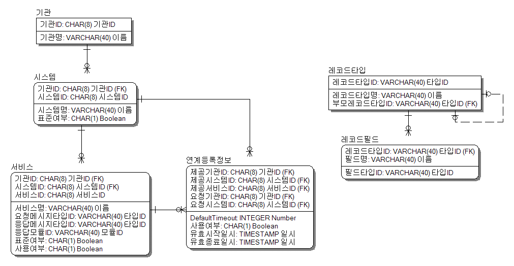
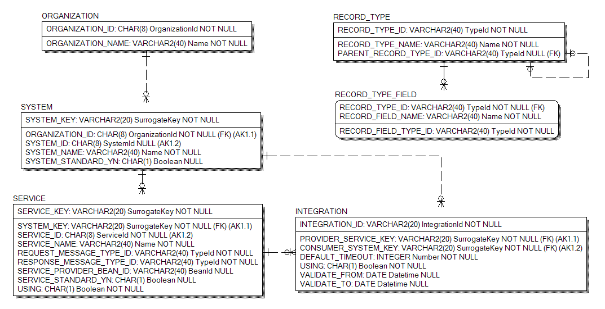
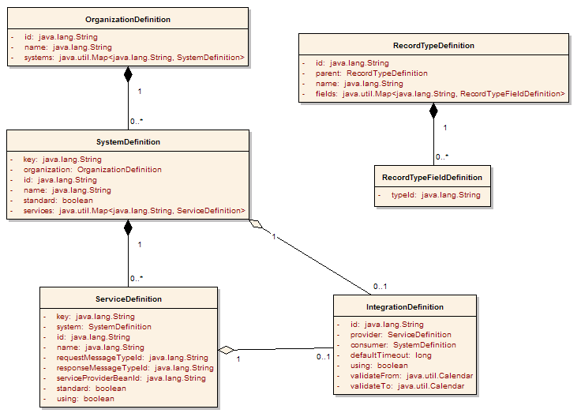

# Metadata

## 개요

Integration 서비스 Metadata는 연계에 필요한 정보를 정의하고 있다.
본 장은 실제 Integration 서비스로 구현된 연계 Adaptor를 사용하는 방식에 직접적인 도움을 주지는 않는다. 실제 사용법은 [연계 서비스 API](./integration-service-api.md)에서 설명하고 있다. 단, 연계 서비스 API의 핵심 Interface인 EgovIntegrationService의 단위에 해당하는 연계등록정보와, 이와 관련된 기관, 시스템, 서비스 등의 Metadata를 이해하는 것은 API 사용에 도움이 될 수 있다.

## 설명

### 논리모델

Integration 서비스 Metadata의 논리모델은 연계를 위해 필요한 논리적인 정보를 정의한다.

#### 논리ERD

Integration 서비스 Metadata의 논리ERD 및 Entity 설명은 다음과 같다.

- ERD의 Entity attribute의 Notation은 `"<name> : <data type> <domain>"` 이다.

| 
Entity
 | 
설명
 |
| --- | --- |
| 기관 | 연계 서비스를 제공 또는 사용하는 기관을 나타낸다. 하나의 기관은 다수의 시스템을 가지고 있다. |
| 시스템 | 연계 서비스를 제공 또는 사용하는 시스템을 나타낸다. 하나의 시스템은 반드시 하나의 기관에 속하며, 다수의 서비스를 가지고 있다. |
| 서비스 | 연계 서비스를 제공하는 단위를 나타낸다. 하나의 서비스는 반드시 하나의 시스템에 속한다. |
| 연계등록정보 | 연계 서비스를 사용하기 위한 단위를 나타낸다. 연계 요청 시스템이 연계 제공 서비스를 사용하기 위해서 등록해야 하는 정보를 담고 있다. |
| 레코드타입 | 연계에 사용되는 메시지의 형태를 나타낸다. <Key, Value> 쌍의 정보를 담고 있는 레코드 형태의 타입을 정의하고 있다. 하나의 레코드타입은 다수의 레코드필드를 가지고 있다. |
| 레코드필드 | 레코드타입에 속하는 내부 필드의 정의를 나타낸다. 필드의 이름과 타입을 정의한다. 하나의 레코드필드는 반드시 하나의 레코드타입에 속한다. |

#### 논리모델 Domain 설명

| 
Domain
 | 
Data Type
 | 
설명
 | 
비고
 |
| --- | --- | --- | --- |
| 기관ID | CHAR(8) | 연계 서비스를 제공 또는 사용하는 기관의 ID를 나타낸다.	| [ID 체계](#id-체계) 참조 |
| 시스템ID | CHAR(8) | 연계 서비스를 제공 또는 사용하는 시스템의 ID를 나타낸다. | [ID 체계](#id-체계) 참조 |
| 서비스ID | CHAR(8) | 연계 서비스의 ID를 나타낸다. | [ID 체계](#id-체계) 참조 |
| 타입ID | VARCHAR(40) | 메시지를 구성하는 각 구성 요소의 형식인 타입의 ID를 나타낸다.	| [ID 체계](#id-체계) 참조 |
| 모듈ID | VARCHAR(40) | 연계 서비스를 제공하기 위해 등록되어 있는 서비스 제공 모듈의 ID를 나타낸다. | [ID 체계](#id-체계) 참조 |
| Boolean | CHAR(1) | 참/거짓(true/false) 등의 논리값을 나타낸다. | 'Y' : true 'N' : false |
| Number | INTEGER | 일반적인 정수를 나타낸다.	| |
| 일시 | DATETIME | 일자와 시각을 포함하는 일시를 나타낸다. | |
| 이름 | VARCHAR(40) | 기관, 시스템, 서비스 등의 각종 이름을 나타낸다. | |

#### 논리모델 Entity 설명

##### 기관

<table border="1">
  <tr>
    <td colspan="3" style="text-align: center; font-weight: bold;">Entity 명</td>
    <td colspan="3">기관</td>
  </tr>
  <tr>
    <td colspan="3" style="text-align: center; font-weight: bold;">설명</td>
    <td colspan="3">연계 서비스를 제공 또는 사용하는 기관을 나타낸다. 하나의 기관은 다수의 시스템을 가지고 있다.</td>
  </tr>
  <tr>
    <td colspan="6" style="text-align: center; font-weight: bold;">Attribute</td>
  </tr>
  <tr>
    <td style="text-align: center; font-weight: bold;">Seq</td>
    <td style="text-align: center; font-weight: bold;">PK</td>
    <td style="text-align: center; font-weight: bold;">Attribute명</td>
    <td style="text-align: center; font-weight: bold;">Domain</td>
    <td style="text-align: center; font-weight: bold;">Data Type</td>
    <td style="text-align: center; font-weight: bold;">설명</td>
  </tr>
  <tr>
    <td style="text-align: center;">1</td>
    <td style="text-align: center;">Y</td>
    <td>기관ID</td>
    <td>기관ID</td>
    <td>CHAR(8)</td>
    <td>기관의 ID이다.</td>
  </tr>
  <tr>
    <td style="text-align: center;">2</td>
    <td style="text-align: center;"></td>
    <td>기관명</td>
    <td>이름</td>
    <td>VARCHAR(40)</td>
    <td>기관의 이름이다.</td>
  </tr>
</table>

##### 시스템

<table border="1">
  <tr>
    <td colspan="3" style="text-align: center; font-weight: bold;">Entity 명</td>
    <td colspan="3">시스템</td>
  </tr>
  <tr>
    <td colspan="3" style="text-align: center; font-weight: bold;">설명</td>
    <td colspan="3">연계 서비스를 제공 또는 사용하는 시스템을 나타낸다. 하나의 시스템은 반드시 하나의 기관에 속하며, 다수의 서비스를 가지고 있다.</td>
  </tr>
  <tr>
    <td colspan="6" style="text-align: center; font-weight: bold;">Attribute</td>
  </tr>
  <tr>
    <td style="text-align: center; font-weight: bold;">Seq</td>
    <td style="text-align: center; font-weight: bold;">PK</td>
    <td style="text-align: center; font-weight: bold;">Attribute명</td>
    <td style="text-align: center; font-weight: bold;">Domain</td>
    <td style="text-align: center; font-weight: bold;">Data Type</td>
    <td style="text-align: center; font-weight: bold;">설명</td>
  </tr>
  <tr>
    <td style="text-align: center;">1</td>
    <td style="text-align: center;">Y</td>
    <td>기관ID</td>
    <td>기관ID</td>
    <td>CHAR(8)</td>
    <td>기관의 ID이다.</td>
  </tr>
  <tr>
    <td style="text-align: center;">2</td>
    <td style="text-align: center;">Y</td>
    <td>시스템ID</td>
    <td>시스템ID</td>
    <td>CHAR(8)</td>
    <td>시스템의 ID이다.</td>
  </tr>
  <tr>
    <td style="text-align: center;">3</td>
    <td style="text-align: center;"></td>
    <td>시스템명</td>
    <td>이름</td>
    <td>VARCHAR(40)</td>
    <td>시스템의 이름이다.</td>
  </tr>
  <tr>
    <td style="text-align: center;">4</td>
    <td style="text-align: center;"></td>
    <td>표준여부</td>
    <td>Boolean</td>
    <td>CHAR(1)</td>
    <td>표준 준수 여부를 나타낸다.</td>
  </tr>
</table>

##### 서비스

<table border="1">
  <tr>
    <td colspan="3" style="text-align: center; font-weight: bold;">Entity 명</td>
    <td colspan="3">서비스</td>
  </tr>
  <tr>
    <td colspan="3" style="text-align: center; font-weight: bold;">설명</td>
    <td colspan="3">연계 서비스를 제공하는 단위를 나타낸다. 하나의 서비스는 반드시 하나의 시스템에 속한다.</td>
  </tr>
  <tr>
    <td colspan="6" style="text-align: center; font-weight: bold;">Attribute</td>
  </tr>
  <tr>
    <td style="text-align: center; font-weight: bold;">Seq</td>
    <td style="text-align: center; font-weight: bold;">PK</td>
    <td style="text-align: center; font-weight: bold;">Attribute명</td>
    <td style="text-align: center; font-weight: bold;">Domain</td>
    <td style="text-align: center; font-weight: bold;">Data Type</td>
    <td style="text-align: center; font-weight: bold;">설명</td>
  </tr>
  <tr>
    <td style="text-align: center;">1</td>
    <td style="text-align: center;">Y</td>
    <td>기관ID</td>
    <td>기관ID</td>
    <td>CHAR(8)</td>
    <td>기관의 ID이다.</td>
  </tr>
  <tr>
    <td style="text-align: center;">2</td>
    <td style="text-align: center;">Y</td>
    <td>시스템ID</td>
    <td>시스템ID</td>
    <td>CHAR(8)</td>
    <td>시스템의 ID이다.</td>
  </tr>
  <tr>
    <td style="text-align: center;">3</td>
    <td style="text-align: center;">Y</td>
    <td>서비스ID</td>
    <td>서비스ID</td>
    <td>CHAR(8)</td>
    <td>서비스의 ID이다.</td>
  </tr>
  <tr>
    <td style="text-align: center;">4</td>
    <td style="text-align: center;"></td>
    <td>서비스명</td>
    <td>이름</td>
    <td>VARCHAR(40)</td>
    <td>서비스의 이름이다.</td>
  </tr>
  <tr>
    <td style="text-align: center;">5</td>
    <td style="text-align: center;"></td>
    <td>요청메시지타입ID</td>
    <td>타입ID</td>
    <td>VARCHAR(40)</td>
    <td>요청 메시지의 타입 ID이다.</td>
  </tr>
  <tr>
    <td style="text-align: center;">6</td>
    <td style="text-align: center;"></td>
    <td>응답메시지타입ID</td>
    <td>타입ID</td>
    <td>VARCHAR(40)</td>
    <td>응답 메시지의 타입 ID이다.</td>
  </tr>
  <tr>
    <td style="text-align: center;">7</td>
    <td style="text-align: center;"></td>
    <td>응답모듈ID</td>
    <td>모듈ID</td>
    <td>VARCHAR(40)</td>
    <td>실제 서비스를 제공하는 응답 모듈의 ID이다.</td>
  </tr>
  <tr>
    <td style="text-align: center;">8</td>
    <td style="text-align: center;"></td>
    <td>표준여부</td>
    <td>Boolean</td>
    <td>CHAR(1)</td>
    <td>표준 준수 여부를 나타낸다.</td>
  </tr>
  <tr>
    <td style="text-align: center;">9</td>
    <td style="text-align: center;"></td>
    <td>사용여부</td>
    <td>Boolean</td>
    <td>CHAR(1)</td>
    <td>서비스의 사용 여부를 나타낸다.</td>
  </tr>
</table>

##### 연계등록정보

<table border="1">
  <tr>
    <td colspan="3" style="text-align: center; font-weight: bold;">Entity 명</td>
    <td colspan="3">연계등록정보</td>
  </tr>
  <tr>
    <td colspan="3" style="text-align: center; font-weight: bold;">설명</td>
    <td colspan="3">연계 서비스를 사용하기 위한 단위를 나타낸다. 연계 요청 시스템이 연계 제공 서비스를 사용하기 위해서 등록해야 하는 정보를 담고 있다.</td>
  </tr>
  <tr>
    <td colspan="6" style="text-align: center; font-weight: bold;">Attribute</td>
  </tr>
  <tr>
    <td style="text-align: center; font-weight: bold;">Seq</td>
    <td style="text-align: center; font-weight: bold;">PK</td>
    <td style="text-align: center; font-weight: bold;">Attribute명</td>
    <td style="text-align: center; font-weight: bold;">Domain</td>
    <td style="text-align: center; font-weight: bold;">Data Type</td>
    <td style="text-align: center; font-weight: bold;">설명</td>
  </tr>
  <tr>
    <td style="text-align: center;">1</td>
    <td style="text-align: center;">Y</td>
    <td>제공기관ID</td>
    <td>기관ID</td>
    <td>CHAR(8)</td>
    <td>서비스를 제공하는 기관의 ID이다.</td>
  </tr>
  <tr>
    <td style="text-align: center;">2</td>
    <td style="text-align: center;">Y</td>
    <td>제공시스템ID</td>
    <td>시스템ID</td>
    <td>CHAR(8)</td>
    <td>서비스를 제공하는 시스템의 ID이다.</td>
  </tr>
  <tr>
    <td style="text-align: center;">3</td>
    <td style="text-align: center;">Y</td>
    <td>제공서비스ID</td>
    <td>서비스ID</td>
    <td>CHAR(8)</td>
    <td>서비스를 제공하는 서비스의 ID이다.</td>
  </tr>
  <tr>
    <td style="text-align: center;">4</td>
    <td style="text-align: center;">Y</td>
    <td>요청기관ID</td>
    <td>기관ID</td>
    <td>CHAR(8)</td>
    <td>서비스를 요청하는 기관의 ID이다.</td>
  </tr>
  <tr>
    <td style="text-align: center;">5</td>
    <td style="text-align: center;">Y</td>
    <td>요청시스템ID</td>
    <td>시스템ID</td>
    <td>CHAR(8)</td>
    <td>서비스를 요청하는 시스템의 ID이다.</td>
  </tr>
  <tr>
    <td style="text-align: center;">6</td>
    <td style="text-align: center;"></td>
    <td>DefaultTimeout</td>
    <td>Number</td>
    <td>INTEGER</td>
    <td>서비스 요청 시 사용되는 default timeout 값이다.</td>
  </tr>
  <tr>
    <td style="text-align: center;">7</td>
    <td style="text-align: center;"></td>
    <td>사용여부</td>
    <td>Boolean</td>
    <td>CHAR(1)</td>
    <td>등록된 연계의 사용 여부를 나타낸다.</td>
  </tr>
  <tr>
    <td style="text-align: center;">8</td>
    <td style="text-align: center;"></td>
    <td>유효시작일시</td>
    <td>일시</td>
    <td>DATEIME</td>
    <td>등록된 연계가 유효한 기간의 시작 일시를 나타낸다.</td>
  </tr>
  <tr>
    <td style="text-align: center;">9</td>
    <td style="text-align: center;"></td>
    <td>유효종료일시</td>
    <td>일시</td>
    <td>DATEIME</td>
    <td>등록된 연계가 유효한 기간의 종료 일시를 나타낸다.</td>
  </tr>
</table>

##### 레코드타입

<table border="1">
  <tr>
    <td colspan="3" style="text-align: center; font-weight: bold;">Entity 명</td>
    <td colspan="3">레코드타입</td>
  </tr>
  <tr>
    <td colspan="3" style="text-align: center; font-weight: bold;">설명</td>
    <td colspan="3">연계에 사용되는 메시지의 형태를 나타낸다. &lt;Key, Value&gt; 쌍의 정보를 담고 있는 레코드 형태의 타입을 정의하고 있다. 하나의 레코드타입은 다수의 레코드필드를 가지고 있다.</td>
  </tr>
  <tr>
    <td colspan="6" style="text-align: center; font-weight: bold;">Attribute</td>
  </tr>
  <tr>
    <td style="text-align: center; font-weight: bold;">Seq</td>
    <td style="text-align: center; font-weight: bold;">PK</td>
    <td style="text-align: center; font-weight: bold;">Attribute명</td>
    <td style="text-align: center; font-weight: bold;">Domain</td>
    <td style="text-align: center; font-weight: bold;">Data Type</td>
    <td style="text-align: center; font-weight: bold;">설명</td>
  </tr>
  <tr>
    <td style="text-align: center;">1</td>
    <td style="text-align: center;">Y</td>
    <td>레코드타입ID</td>
    <td>타입ID</td>
    <td>VARCHAR(40)</td>
    <td>레코드 타입의 ID이다.</td>
  </tr>
  <tr>
    <td style="text-align: center;">2</td>
    <td style="text-align: center;"></td>
    <td>레코드타입명</td>
    <td>이름</td>
    <td>VARCHAR(40)</td>
    <td>레코드 타입의 이름이다.</td>
  </tr>
  <tr>
    <td style="text-align: center;">3</td>
    <td style="text-align: center;"></td>
    <td>부모레코드타입ID</td>
    <td>타입ID</td>
    <td>VARCHAR(40)</td>
    <td>부모 레코드 타입의 ID이다.</td>
  </tr>
</table>

##### 레코드필드

<table border="1">
  <tr>
    <td colspan="3" style="text-align: center; font-weight: bold;">Entity 명</td>
    <td colspan="3">레코드필드</td>
  </tr>
  <tr>
    <td colspan="3" style="text-align: center; font-weight: bold;">설명</td>
    <td colspan="3">레코드타입에 속하는 내부 필드의 정의를 나타낸다. 필드의 이름과 타입을 정의한다. 하나의 레코드필드는 반드시 하나의 레코드타입에 속한다.</td>
  </tr>
  <tr>
    <td colspan="6" style="text-align: center; font-weight: bold;">Attribute</td>
  </tr>
  <tr>
    <td style="text-align: center; font-weight: bold;">Seq</td>
    <td style="text-align: center; font-weight: bold;">PK</td>
    <td style="text-align: center; font-weight: bold;">Attribute명</td>
    <td style="text-align: center; font-weight: bold;">Domain</td>
    <td style="text-align: center; font-weight: bold;">Data Type</td>
    <td style="text-align: center; font-weight: bold;">설명</td>
  </tr>
  <tr>
    <td style="text-align: center;">1</td>
    <td style="text-align: center;">Y</td>
    <td>레코드타입ID</td>
    <td>타입ID</td>
    <td>VARCHAR(40)</td>
    <td>필드가 속한 레코드의 타입 ID이다.</td>
  </tr>
  <tr>
    <td style="text-align: center;">2</td>
    <td style="text-align: center;">Y</td>
    <td>필드명</td>
    <td>이름</td>
    <td>VARCHAR(40)</td>
    <td>필드의 이름이다.</td>
  </tr>
  <tr>
    <td style="text-align: center;">3</td>
    <td style="text-align: center;"></td>
    <td>필드타입ID</td>
    <td>타입ID</td>
    <td>VARCHAR(40)</td>
    <td>필드의 타입 ID이다.</td>
  </tr>
</table>

### 물리모델

Integration 서비스 Metadata의 물리모델은 논리모델을 실제 물리적인 DB로 구현하기 위한 모델로서, 아래 물리ERD는 Oracle DB를 가정하여 작성된 것이다. 물리모델은 Hibernate 등과 같은 Object Relational Mapping(ORM)을 사용하여 Access하는 것을 고려하여, 복수의 Attribute를 Identifier로 갖는 Entity를 Table로 변환할 때 Surrogate Key를 도입하고, 기존 Identifier는 Unique Constraints로 적용하여 정의되었다.

#### 물리ERD

Integration 서비스 Metadata의 물리ERD 및 Table 설명은 다음과 같다.

- ERD의 Table Column의 Notation은 `"<name> : <data type> <domain> <null option> <key>*"` 이다.

- 물리ERD의 경우, 각 연계 Adaptor 또는 연계 솔루션, 또는 시스템에 따라 사용하는 DB가 달라지므로 Data Type 등이 변경될 수 있다.

| 
Table
 | 
Entity
 | 
설명
 |
| --- | --- | --- |
| ORGANIZATION | 기관 | 연계 서비스를 제공 또는 사용하는 기관을 나타낸다. 하나의 기관은 다수의 시스템을 가지고 있다. |
| SYSTEM | 시스템 | 연계 서비스를 제공 또는 사용하는 기관을 나타낸다. 하나의 기관은 다수의 시스템을 가지고 있다. |
| SERVICE | 서비스 | 연계 서비스를 제공하는 단위를 나타낸다. 하나의 서비스는 반드시 하나의 시스템에 속한다. |
| INTEGRATION | 연계등록정보 | 연계 서비스를 사용하기 위한 단위를 나타낸다. 연계 요청 시스템이 연계 제공 서비스를 사용하기 위해서 등록해야 하는 정보를 담고 있다. |
| RECORD_TYPE | 레코드타입 | 연계에 사용되는 메시지의 형태를 나타낸다. <Key, Value> 쌍의 정보를 담고 있는 레코드 형태의 타입을 정의하고 있다. 하나의 레코드타입은 다수의 레코드필드를 가지고 있다. |
| RECORD_TYPE_FIELD | 레코드필드 | 레코드타입에 속하는 내부 필드의 정의를 나타낸다. 필드의 이름과 타입을 정의한다. 하나의 레코드필드는 반드시 하나의 레코드타입에 속한다. |

#### 물리 모델 Domain 설명

| 
Domain
 | 
Data Type
 | 
설명
 | 
비고
 |
| --- | --- | --- | --- |
| OrganizationId | CHAR(8) | 연계 서비스를 제공 또는 사용하는 기관의 ID를 나타낸다.	| [ID 체계](#id-체계) 참조 |
| SystemId | CHAR(8) | 연계 서비스를 제공 또는 사용하는 시스템의 ID를 나타낸다. | [ID 체계](#id-체계) 참조 |
| ServiceId | CHAR(8) | 연계 서비스의 ID를 나타낸다. | [ID 체계](#id-체계) 참조 |
| TypeId | VARCHAR2(40) | 메시지를 구성하는 각 구성 요소의 형식인 타입의 ID를 나타낸다.	| [ID 체계](#id-체계) 참조 |
| BeanId | VARCHAR2(40) | 연계 서비스를 제공하기 위해 등록되어 있는 서비스 제공 모듈의 ID를 나타낸다. | [ID 체계](#id-체계) 참조 |
| Boolean | CHAR(1) | 참/거짓(true/false) 등의 논리값을 나타낸다. | 'Y' : true 'N' : false |
| Number | INTEGER | 일반적인 정수를 나타낸다. | |
| Datetime | DATEIME | 일자와 시각을 포함하는 일시를 나타낸다. | |
| Name | VARCHAR2(40) | 기관, 시스템, 서비스 등의 각종 이름을 나타낸다. | |
| SurrogateKey | VARCHAR2(20) | Composite 형태의 Primary Key를 대체하기 위한 키 | |

#### 물리 모델 Table 설명

##### ORGANIZATION

<table border="1">
  <tr>
    <td colspan="3" style="text-align: center; font-weight: bold;">Table 명</td>
    <td colspan="2">ORGANIZATION</td>
    <td colspan="1" style="text-align: center; font-weight: bold;">Entity</td>
    <td colspan="2">기관</td>
  </tr>
  <tr>
    <td colspan="3" style="text-align: center; font-weight: bold;">설명</td>
    <td colspan="5">연계 서비스를 제공 또는 사용하는 기관을 나타낸다. 하나의 기관은 다수의 시스템을 가지고 있다.</td>
  </tr>
  <tr>
    <td colspan="8" style="text-align: center; font-weight: bold;">Column</td>
  </tr>
  <tr>
    <td style="text-align: center; font-weight: bold;">Seq</td>
    <td style="text-align: center; font-weight: bold;">PK</td>
    <td style="text-align: center; font-weight: bold;">Column명</td>
    <td style="text-align: center; font-weight: bold;">한글명</td>
    <td style="text-align: center; font-weight: bold;">Domain</td>
    <td style="text-align: center; font-weight: bold;">Data Type</td>
    <td style="text-align: center; font-weight: bold;">Null</td>
    <td style="text-align: center; font-weight: bold;">설명</td>
  </tr>
  <tr>
    <td style="text-align: center;">1</td>
    <td style="text-align: center;">Y</td>
    <td>ORGANIZATION_ID</td>
    <td>기관ID</td>
    <td>OrganizationId</td>
    <td>CHAR(8)</td>
    <td style="text-align: center;">N</td>
    <td>기관의 ID이다.</td>
  </tr>
  <tr>
    <td style="text-align: center;">2</td>
    <td style="text-align: center;"></td>
    <td>ORGANIZATION_NAME</td>
    <td>기관명</td>
    <td>Name</td>
    <td>VARCHAR2(40)</td>
    <td style="text-align: center;">N</td>
    <td>기관의 이름이다.</td>
  </tr>
  <tr>
    <td colspan="8" style="text-align: center; font-weight: bold;">Constraints</td>
  </tr>
  <tr>
    <td colspan="8">PRIMARY KEY (ORGANIZATION_ID)</td>
  </tr>
</table>

##### SYSTEM

<table border="1">
  <tr>
    <td colspan="3" style="text-align: center; font-weight: bold;">Table 명</td>
    <td colspan="2">SYSTEM</td>
    <td colspan="1" style="text-align: center; font-weight: bold;">Entity</td>
    <td colspan="2">시스템</td>
  </tr>
  <tr>
    <td colspan="3" style="text-align: center; font-weight: bold;">설명</td>
    <td colspan="5">연계 서비스를 제공 또는 사용하는 시스템을 나타낸다. 하나의 시스템은 반드시 하나의 기관에 속하며, 다수의 서비스를 가지고 있다.</td>
  </tr>
  <tr>
    <td colspan="8" style="text-align: center; font-weight: bold;">Column</td>
  </tr>
  <tr>
    <td style="text-align: center; font-weight: bold;">Seq</td>
    <td style="text-align: center; font-weight: bold;">PK</td>
    <td style="text-align: center; font-weight: bold;">Column명</td>
    <td style="text-align: center; font-weight: bold;">한글명</td>
    <td style="text-align: center; font-weight: bold;">Domain</td>
    <td style="text-align: center; font-weight: bold;">Data Type</td>
    <td style="text-align: center; font-weight: bold;">Null</td>
    <td style="text-align: center; font-weight: bold;">설명</td>
  </tr>
  <tr>
    <td style="text-align: center;">1</td>
    <td style="text-align: center;">Y</td>
    <td>SYSTEM_KEY</td>
    <td>시스템KEY</td>
    <td>SurrogateKey</td>
    <td>VARCHAR2(20)</td>
    <td style="text-align: center;">N</td>
    <td>시스템의 Surrogate Key이다.</td>
  </tr>
  <tr>
    <td style="text-align: center;">2</td>
    <td style="text-align: center;"></td>
    <td>ORGANIZATION_ID</td>
    <td>기관ID</td>
    <td>OrganizationId</td>
    <td>CHAR(8)</td>
    <td style="text-align: center;">N</td>
    <td>기관의 ID이다.</td>
  </tr>
  <tr>
    <td style="text-align: center;">3</td>
    <td style="text-align: center;"></td>
    <td>SYSTEM_ID</td>
    <td>시스템ID</td>
    <td>SystemId</td>
    <td>CHAR(8)</td>
    <td style="text-align: center;">N</td>
    <td>시스템의 ID이다.</td>
  </tr>
  <tr>
    <td style="text-align: center;">4</td>
    <td style="text-align: center;"></td>
    <td>SYSTEM_NAME</td>
    <td>시스템명</td>
    <td>Name</td>
    <td>VARCHAR2(40)</td>
    <td style="text-align: center;">N</td>
    <td>시스템의 이름이다.</td>
  </tr>
  <tr>
    <td style="text-align: center;">5</td>
    <td style="text-align: center;"></td>
    <td>STANDARD_YN</td>
    <td>표준여부</td>
    <td>Boolean</td>
    <td>CHAR(1)</td>
    <td style="text-align: center;">N</td>
    <td>표준 준수 여부를 나타낸다.</td>
  </tr>
  <tr>
    <td colspan="8" style="text-align: center; font-weight: bold;">Constraints</td>
  </tr>
  <tr>
    <td colspan="8">PRIMAEY KEY (SYSTEM_KEY)</td>
  </tr>
  <tr>
    <td colspan="8">UNIQUE (ORGANIZATION_ID, SYSTEM_ID)</td>
  </tr>
  <tr>
    <td colspan="8">FOREIGN KEY (ORGANIZATION_ID) REFERENCES ORGANIZATION (ORGANIZATION_ID)</td>
  </tr>
</table>

##### SERVICE

<table border="1">
  <tr>
    <td colspan="3" style="text-align: center; font-weight: bold;">Table 명</td>
    <td colspan="2">SERVICE</td>
    <td colspan="1" style="text-align: center; font-weight: bold;">Entity</td>
    <td colspan="2">서비스</td>
  </tr>
  <tr>
    <td colspan="3" style="text-align: center; font-weight: bold;">설명</td>
    <td colspan="5">연계 서비스를 제공하는 단위를 나타낸다. 하나의 서비스는 반드시 하나의 시스템에 속한다.</td>
  </tr>
  <tr>
    <td colspan="8" style="text-align: center; font-weight: bold;">Column</td>
  </tr>
  <tr>
    <td style="text-align: center; font-weight: bold;">Seq</td>
    <td style="text-align: center; font-weight: bold;">PK</td>
    <td style="text-align: center; font-weight: bold;">Column명</td>
    <td style="text-align: center; font-weight: bold;">한글명</td>
    <td style="text-align: center; font-weight: bold;">Domain</td>
    <td style="text-align: center; font-weight: bold;">Data Type</td>
    <td style="text-align: center; font-weight: bold;">Null</td>
    <td style="text-align: center; font-weight: bold;">설명</td>
  </tr>
  <tr>
    <td style="text-align: center;">1</td>
    <td style="text-align: center;">Y</td>
    <td>SERVICE_KEY</td>
    <td>서비스KEY</td>
    <td>SurrogateKey</td>
    <td>VARCHAR2(20)</td>
    <td style="text-align: center;">N</td>
    <td>서비스의 Surrogate Key이다.</td>
  </tr>
  <tr>
    <td style="text-align: center;">2</td>
    <td style="text-align: center;"></td>
    <td>SYSTEM_KEY</td>
    <td>시스템KEY</td>
    <td>SurrogateKey</td>
    <td>VARCHAR2(20)</td>
    <td style="text-align: center;">N</td>
    <td>시스템의 Surrogate Key이다.</td>
  </tr>
  <tr>
    <td style="text-align: center;">3</td>
    <td style="text-align: center;"></td>
    <td>SERVICE_ID</td>
    <td>서비스ID</td>
    <td>ServiceId</td>
    <td>CHAR(8)</td>
    <td style="text-align: center;">N</td>
    <td>서비스의 ID이다.</td>
  </tr>
  <tr>
    <td style="text-align: center;">4</td>
    <td style="text-align: center;"></td>
    <td>SERVICE_NAME</td>
    <td>서비스명</td>
    <td>Name</td>
    <td>VARCHAR2(40)</td>
    <td style="text-align: center;">N</td>
    <td>서비스의 이름이다.</td>
  </tr>
  <tr>
    <td style="text-align: center;">5</td>
    <td style="text-align: center;"></td>
    <td>REQUEST_MESSAGE_TYPE_ID</td>
    <td>요청메시지타입ID</td>
    <td>TypeId</td>
    <td>VARCHAR2(40)</td>
    <td style="text-align: center;">N</td>
    <td>요청 메시지의 타입 ID이다.</td>
  </tr>
  <tr>
    <td style="text-align: center;">6</td>
    <td style="text-align: center;"></td>
    <td>RESPONSE_MESSAGE_TYPE_ID</td>
    <td>응답메시지타입ID</td>
    <td>TypeId</td>
    <td>VARCHAR2(40)</td>
    <td style="text-align: center;">N</td>
    <td>응답 메시지의 타입 ID이다.</td>
  </tr>
  <tr>
    <td style="text-align: center;">7</td>
    <td style="text-align: center;"></td>
    <td>SERVICE_PROVIDER_BEAN_ID</td>
    <td>응답모듈ID</td>
    <td>BeanId</td>
    <td>VARCHAR2(40)</td>
    <td style="text-align: center;">Y</td>
    <td>실제 서비스를 제공하는 응답 모듈의 ID이다.</td>
  </tr>
  <tr>
    <td style="text-align: center;">8</td>
    <td style="text-align: center;"></td>
    <td>STANDARD_YN</td>
    <td>표준여부</td>
    <td>Boolean</td>
    <td>CHAR(1)</td>
    <td style="text-align: center;">N</td>
    <td>표준 준수 여부를 나타낸다.</td>
  </tr>
  <tr>
    <td style="text-align: center;">9</td>
    <td style="text-align: center;"></td>
    <td>USING_YN</td>
    <td>사용여부</td>
    <td>Boolean</td>
    <td>CHAR(1)</td>
    <td style="text-align: center;">N</td>
    <td>서비스의 사용 여부를 나타낸다.</td>
  </tr>
  <tr>
    <td colspan="8" style="text-align: center; font-weight: bold;">Constraints</td>
  </tr>
  <tr>
    <td colspan="8">PRIMARY KEY (SERVICE_KEY)</td>
  </tr>
  <tr>
    <td colspan="8">UNIQUE (SYSTEM_KEY, SERVICE_ID)</td>
  </tr>
  <tr>
    <td colspan="8">FOREIGN KEY (SYSTEM_KEY) REFERENCES SYSTEM (SYSTEM_KEY)</td>
  </tr>
</table>

##### INTEGRATION

<table border="1">
  <tr>
    <td colspan="3" style="text-align: center; font-weight: bold;">Table 명</td>
    <td colspan="2">INTEGRATION</td>
    <td colspan="1" style="text-align: center; font-weight: bold;">Entity</td>
    <td colspan="2">연계등록정보</td>
  </tr>
  <tr>
    <td colspan="3" style="text-align: center; font-weight: bold;">설명</td>
    <td colspan="5">연계 서비스를 사용하기 위한 단위를 나타낸다. 연계 요청 시스템이 연계 제공 서비스를 사용하기 위해서 등록해야 하는 정보를 담고 있다.</td>
  </tr>
  <tr>
    <td colspan="8" style="text-align: center; font-weight: bold;">Column</td>
  </tr>
  <tr>
    <td style="text-align: center; font-weight: bold;">Seq</td>
    <td style="text-align: center; font-weight: bold;">PK</td>
    <td style="text-align: center; font-weight: bold;">Column명</td>
    <td style="text-align: center; font-weight: bold;">한글명</td>
    <td style="text-align: center; font-weight: bold;">Domain</td>
    <td style="text-align: center; font-weight: bold;">Data Type</td>
    <td style="text-align: center; font-weight: bold;">Null</td>
    <td style="text-align: center; font-weight: bold;">설명</td>
  </tr>
  <tr>
    <td style="text-align: center;">1</td>
    <td style="text-align: center;">Y</td>
    <td>INTEGRATION_ID</td>
    <td>연계ID</td>
    <td>Surrogate Key</td>
    <td>VARCHAR2(20)</td>
    <td style="text-align: center;">N</td>
    <td>연계등록정보의 Surrogate Key이다.</td>
  </tr>
  <tr>
    <td style="text-align: center;">2</td>
    <td style="text-align: center;"></td>
    <td>PROVIDER_SERVICE_KEY</td>
    <td>제공서비스KEY</td>
    <td>Surrogate Key</td>
    <td>VARCHAR2(20)</td>
    <td style="text-align: center;">N</td>
    <td>서비스를 제공하는 서비스의 Surrogate Key이다.</td>
  </tr>
  <tr>
    <td style="text-align: center;">3</td>
    <td style="text-align: center;"></td>
    <td>CONSUMER_SYSTEM_KEY</td>
    <td>요청시스템KEY</td>
    <td>Surrogate Key</td>
    <td>VARCHAR2(20)</td>
    <td style="text-align: center;">N</td>
    <td>서비스를 요청하는 시스템의 Surrogate Key이다.</td>
  </tr>
  <tr>
    <td style="text-align: center;">4</td>
    <td style="text-align: center;"></td>
    <td>DEFAULT_TIMEOUT</td>
    <td>DefaultTimeout</td>
    <td>Number</td>
    <td>INTEGER</td>
    <td style="text-align: center;">N</td>
    <td>서비스 요청 시 사용되는 default timeout 값이다.</td>
  </tr>
  <tr>
    <td style="text-align: center;">5</td>
    <td style="text-align: center;"></td>
    <td>USING_YN</td>
    <td>사용여부</td>
    <td>Boolean</td>
    <td>CHAR(1)</td>
    <td style="text-align: center;">N</td>
    <td>등록된 연계의 사용 여부를 나타낸다.</td>
  </tr>
  <tr>
    <td style="text-align: center;">6</td>
    <td style="text-align: center;"></td>
    <td>VALIDATE_FROM</td>
    <td>유효시작일시</td>
    <td>Datetime</td>
    <td>DATETIME</td>
    <td style="text-align: center;">Y</td>
    <td>등록된 연계가 유효한 기간의 시작 일시를 나타낸다.</td>
  </tr>
  <tr>
    <td style="text-align: center;">7</td>
    <td style="text-align: center;"></td>
    <td>VALIDATE_TO</td>
    <td>유효종료일시</td>
    <td>Datetime</td>
    <td>DATETIME</td>
    <td style="text-align: center;">Y</td>
    <td>등록된 연계가 유효한 기간의 종료 일시를 나타낸다.</td>
  </tr>
  <tr>
    <td colspan="8" style="text-align: center; font-weight: bold;">Constraints</td>
  </tr>
  <tr>
    <td colspan="8">PRIMARY KEY (INTEGRATION_ID)</td>
  </tr>
  <tr>
    <td colspan="8">UNIQUE (PROVIDER_SERVICE_KEY, CONSUMER_SYSTEM_KEY)</td>
  </tr>
  <tr>
    <td colspan="8">FOREIGN KEY (PROVIDER_SERVICE_KEY) REFERENCES SERVICE (SERVICE_KEY)</td>
  </tr>
  <tr>
    <td colspan="8">ROREIGN KEY (CONSUMER_SYSTEM_KEY) REFERENCES SYSTEM (SYSTEM_KEY)</td>
  </tr>
</table>

##### RECORD_TYPE

<table border="1">
  <tr>
    <td colspan="3" style="text-align: center; font-weight: bold;">Table 명</td>
    <td colspan="2">RECORD_TYPE</td>
    <td colspan="1" style="text-align: center; font-weight: bold;">Entity</td>
    <td colspan="2">레코드타입</td>
  </tr>
  <tr>
    <td colspan="3" style="text-align: center; font-weight: bold;">설명</td>
    <td colspan="5">연계에 사용되는 메시지의 형태를 나타낸다. &lt;Key, Value&gt; 쌍의 정보를 담고 있는 레코드 형태의 타입을 정의하고 있다. 하나의 레코드타입은 다수의 레코드필드를 가지고 있다.</td>
  </tr>
  <tr>
    <td colspan="8" style="text-align: center; font-weight: bold;">Column</td>
  </tr>
  <tr>
    <td style="text-align: center; font-weight: bold;">Seq</td>
    <td style="text-align: center; font-weight: bold;">PK</td>
    <td style="text-align: center; font-weight: bold;">Column명</td>
    <td style="text-align: center; font-weight: bold;">한글명</td>
    <td style="text-align: center; font-weight: bold;">Domain</td>
    <td style="text-align: center; font-weight: bold;">Data Type</td>
    <td style="text-align: center; font-weight: bold;">Null</td>
    <td style="text-align: center; font-weight: bold;">설명</td>
  </tr>
  <tr>
    <td style="text-align: center;">1</td>
    <td style="text-align: center;">Y</td>
    <td>RECORD_TYPE_ID</td>
    <td>레코드타입ID</td>
    <td>TypeId</td>
    <td>VARCHAR2(40)</td>
    <td style="text-align: center;">N</td>
    <td>레코드 타입의 ID이다.</td>
  </tr>
  <tr>
    <td style="text-align: center;">2</td>
    <td style="text-align: center;"></td>
    <td>RECORD_TYPE_NAME</td>
    <td>레코드타입명</td>
    <td>Name</td>
    <td>VARCHAR2(40)</td>
    <td style="text-align: center;">N</td>
    <td>레코드 타입의 이름이다.</td>
  </tr>
  <tr>
    <td style="text-align: center;">3</td>
    <td style="text-align: center;"></td>
    <td>PARENT_RECORD_TYPE_ID</td>
    <td>부모레코드타입ID</td>
    <td>TypeId</td>
    <td>VARCHAR2(40)</td>
    <td style="text-align: center;">Y</td>
    <td>부모 레코드 타입의 ID이다.</td>
  </tr>
  <tr>
    <td colspan="8" style="text-align: center; font-weight: bold;">Constraints</td>
  </tr>
  <tr>
    <td colspan="8">PRIMARY KEY (RECORD_TYPE_ID)</td>
  </tr>
  <tr>
    <td colspan="8">FOREIGN KEY (PARENT_RECORD_TYPE_ID) REFERENCES RECORD_TYPE (RECORD_TYPE_ID)</td>
  </tr>
</table>

##### RECORD_TYPE_FIELD

<table border="1">
  <tr>
    <td colspan="3" style="text-align: center; font-weight: bold;">Table 명</td>
    <td colspan="2">RECORD_TYPE_FIELD</td>
    <td colspan="1" style="text-align: center; font-weight: bold;">Entity</td>
    <td colspan="2">레코드필드</td>
  </tr>
  <tr>
    <td colspan="3" style="text-align: center; font-weight: bold;">설명</td>
    <td colspan="5">레코드타입에 속하는 내부 필드의 정의를 나타낸다. 필드의 이름과 타입을 정의한다. 하나의 레코드필드는 반드시 하나의 레코드타입에 속한다.</td>
  </tr>
  <tr>
    <td colspan="8" style="text-align: center; font-weight: bold;">Column</td>
  </tr>
  <tr>
    <td style="text-align: center; font-weight: bold;">Seq</td>
    <td style="text-align: center; font-weight: bold;">PK</td>
    <td style="text-align: center; font-weight: bold;">Column명</td>
    <td style="text-align: center; font-weight: bold;">한글명</td>
    <td style="text-align: center; font-weight: bold;">Domain</td>
    <td style="text-align: center; font-weight: bold;">Data Type</td>
    <td style="text-align: center; font-weight: bold;">Null</td>
    <td style="text-align: center; font-weight: bold;">설명</td>
  </tr>
  <tr>
    <td style="text-align: center;">1</td>
    <td style="text-align: center;">Y</td>
    <td>RECORD_TYPE_ID</td>
    <td>레코드타입ID</td>
    <td>TypeId</td>
    <td>VARCHAR2(40)</td>
    <td style="text-align: center;">N</td>
    <td>필드가 속한 레코드의 타입 ID이다.</td>
  </tr>
  <tr>
    <td style="text-align: center;">2</td>
    <td style="text-align: center;">Y</td>
    <td>RECORD_FIELD_NAME</td>
    <td>필드명</td>
    <td>Name</td>
    <td>VARCHAR2(40)</td>
    <td style="text-align: center;">N</td>
    <td>필드의 이름이다.</td>
  </tr>
  <tr>
    <td style="text-align: center;">3</td>
    <td style="text-align: center;"></td>
    <td>RECORD_FIELD_TYPE_ID</td>
    <td>필드타입ID</td>
    <td>TypeId</td>
    <td>VARCHAR2(40)</td>
    <td style="text-align: center;">N</td>
    <td>필드의 타입 ID이다.</td>
  </tr>
  <tr>
    <td colspan="8" style="text-align: center; font-weight: bold;">Constraints</td>
  </tr>
  <tr>
    <td colspan="8">PRIMARY KEY (RECORD_TYPE_ID, RECORD_FIELD_NAME)</td>
  </tr>
  <tr>
    <td colspan="8">FOREIGN KEY (RECORD_TYPE_ID) REFERENCES RECORD_TYPE (RECORD_TYPE_ID)</td>
  </tr>
</table>

### Metadata Java Classes

Integration 서비스의 Metadata를 읽어오기 위한 Java Class를 정의하고 있다.

#### ClassDiagram

### ID 체계

Integration 서비스 Metadata의 ID 체계는 다음과 같다.

| 
ID
 | 
영문명
 | 
Data Type
 | 
형태
 | 
제약사항
 |
| --- | --- | --- | --- | --- |
| 기관ID | OrganizationId | CHAR(8) | 기관을 의미하는 Prefix ‘ORG’ 이후에 숫자 ‘0’으로 채워진 5자리 정수 Ex) ORG00000, ORG00001, ORG99999 | • 모든 기관은 반드시 Unique한 ID를 가져야 한다. |
| 시스템ID | SystemId | CHAR(8) | 시스템을 의미하는 Prefix ‘SYS’ 이후에 숫자 ‘0’으로 채워진 5자리 정수 Ex) SYS00000, SYS00001, SYS99999 | • 동일한 기관에 속한 모든 시스템은 반드시 Unique한 ID를 가져야 한다. (서로 다른 기관에 속한 시스템은 같은 ID를 가질 수 있다.) |
| 서비스ID | ServiceId | CHAR(8) | 서비스를 의미하는 Prefix ‘SRV’ 이후에 숫자 ‘0’으로 채워진 5자리 정수  Ex) SRV00000, SRV00001, SRV99999	| • 동일한 시스템에 속한 모든 서비스는 반드시 Unique한 ID를 가져야 한다. (서로 다른 시스템에 속한 시스템은 같은 ID를 가질 수 있다.) |
| 타입ID | TypeId | VARCHAR2(40) | 알파벳 대소문자, 숫자, ‘_’ 로 구성된 길이 1 ~ 40 사이의 문자열 Ex) messageType0000, record_ABC | • 모든 타입은 Unique한 ID를 가져야 한다. • 메타데이터로 저장되는 레코드타입의 ID는 다음의 Reserved 값을 가질 수 없다. boolean, string, byte, short, integer, long, biginteger, float, double, bigdecimal, calendar |
| 모듈ID | BeanId | VARCHAR2(40) | 알파벳 대소문자, 숫자, ‘_’ 로 구성된 길이 1 ~ 40 사이의 문자열 Ex) serviceProviderA, bean_123	 | • 모듈ID는 전자정부 개발프레임워크의 기반이 되는 Spring Framework에 등록되는 Bean Id이다. |

