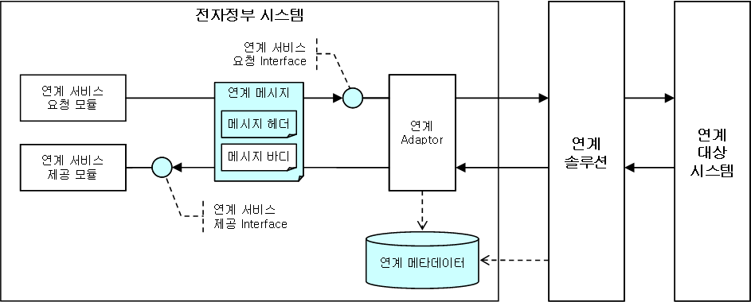

# Integration 서비스

## 개요

Integration 서비스는 전자정부 개발프레임워크 기반의 시스템이 타 시스템과의 연계를 위해 사용하는 Interface의 표준을 정의한 것이다.

## 설명

### 목적

기존의 전자정부 시스템은 타 시스템과의 연계를 위해 연계 솔루션을 사용하거나 자체 개발한 연계 모듈을 사용해왔다. 기존에 사용된 연계 솔루션 및 자체 연계 모듈은 각각 고유한 설정 및 사용 방식을 가지고 있어, 동일한 연계 서비스라 할지라도 사용하는 연계 모듈에 따라 각기 다른 방식으로 개발되어 왔다. 본 Integration 서비스는 이러한 중복 개발을 없애고, 표준화된 설정 및 사용 방식을 정의하여 개발 효율성을 제고한다.

### 아키텍처

Integration 서비스를 사용하여 구현된 전자정부 시스템의 아키텍처는 다음과 같다.

Integration 서비스는 연계 서비스 요청 Interface, 연계 서비스 제공 Interface, 연계 메시지 및 메시지 헤더 등을 정의하고 있으며, 연계 서비스 요청 모듈 및 제공 모듈은 연계 Adaptor나 연계 솔루션과 관계 없이 Integration 서비스가 제공하는 Interface와 Class만을 사용하여 연계 업무를 수행할 수 있다. Integration 서비스는 연계 Interface 외에 연계에 필요한 정보를 담기 위한 Metadata를 정의하고 있다. Metadata는 연계 Interface를 사용하기 위해 필요한 최소한의 정보(연계 기관 정보, 연계 시스템 정보, 연계 서비스 정보, 메시지 형식 등)을 정의하고 있다.

### 구성

Integration 서비스는 연계에 필요한 정보를 정의한 Metadata와 연계 서비스를 사용 및 제공하기 위한 API로 구성된다.

* [Metadata](./integration-service-metadata.md)
* [연계 서비스 API](./integration-service-api.md)