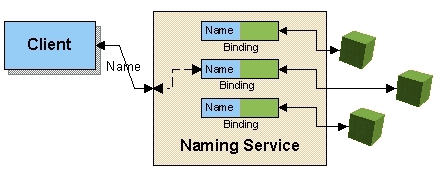

# Naming Service

## 개요

 Naming 서비스는 Java Naming and Directory Interface(JNDI) API를 이용하여 자원(Resource)를 찾을 수 있도록 도와주는 서비스이다. Naming 서비스를 지원하는 Naming 서버에 자원을 등록하여 다른 어플리케이션에서 사용할 수 있도록 공개하고, Naming 서버에 등록되어 있는 자원을 찾아와서 이용할 수 있게 한다.

 

## 주요 개념

### Java Naming and Directory Interface(JNDI)

Java Naming and Directory Interface(JNDI)는 Java 소프트웨어 클라이언트가 이름(name)을 이용하여 데이터 및 객체를 찾을 수 있도록 도와주는 디렉토리 서비스에 대한 Java API이다.

- 참조: http://en.wikipedia.org/wiki/JNDI

## 설명

Naming 서비스는 사용하는 방식에는 Spring XML Configuration 파일에 설정하는 방식과 JNDI API를 wrapping한 JndiTemplate class를 사용하는 방식이 있다.

- [Spring XML Configuration 파일에 설정하는 방식](#spring-xml-configuration-설정) : <br/>
Spring XML Configuration 설정파일에 JNDI 객체를 bean으로 등록하는 방식으로, JNDI 객체를 Lookup만 할 수 있다. 일반적으로 가장 많이 사용된다.

- [JNDI API를 wrapping한 JndiTemplate class를 사용하는 방식](#jnditemplate-클래스-사용) : <br/>
Spring Framework에서 JNDI API를 쉽게 사용할 수 있도록 제공하는 JndiTemplate class를 직접 사용하는 방식으로, JNDI API 기능을 모두 사용해야 할 경우 사용하는 방식이다.

### Spring XML Configuration 설정

Spring Framework는 XML Configuration 파일에 JNDI 객체를 설정할 수 있다. 단, 설정 파일을 통해서는 JNDI 객체를 lookup하는 것만 가능하므로, bind, rebind, unbind 기능을 사용하려면 [Using JndiTemplate](#jnditemplate-클래스-사용) 방식을 사용해야 한다.

Spring Framework은 XML Configuration을 간편하게 할 수 있게 하기 위해 2.0 버전부터 jee tag를 제공하고 있다. 전자정부 개발프레임워크는 Spring 2.5 이상을 기반으로 하기 때문에 본 가이드는 jee tag를 사용한 방식만을 설명한다.

#### 설정

jee tag를 사용하기 위해서는 Spring XML Configuration 파일의 머릿말에 namespace와 schemaLocation를 추가해야 한다.

- namespace : xmlns:jee="http://www.springframework.org/schema/jee"

- schemaLocation : http://www.springframework.org/schema/jee http://www.springframework.org/schema/jee/spring-jee.xsd

```xml
<?xml version="1.0" encoding="UTF-8"?>
<beans xmlns="http://www.springframework.org/schema/beans"
       xmlns:xsi="http://www.w3.org/2001/XMLSchema-instance"
       xmlns:jee="http://www.springframework.org/schema/jee"
       xsi:schemaLocation="
http://www.springframework.org/schema/beans http://www.springframework.org/schema/beans/spring-beans.xsd
http://www.springframework.org/schema/jee http://www.springframework.org/schema/jee/spring-jee.xsd">
 
    <!-- <bean/> definitions here -->
 
</beans>
```

#### jndi-lookup tag

jndi-lookup tag는 JNDI 객체를 찾아서 bean으로 등록해주는 tag이다.

##### tag 설명

```xml
    <jee:jndi-lookup id="bean id"
                     jndi-name="jndi name"
                     cache="true or false"
                     resource-ref="true or false"
                     lookup-on-startup="true or false"
                     expected-type="java class"
                     proxy-interface="java class">
        <jee:environment>
            name=value
            ping=pong
            ...
        </jee:environment>
    </jee:jndi-lookup>
```

jndi-lookup tag는 Spring Framework의 JndiObjectFactoryBean class와 1:1로 매핑된다. tag의 attribute 값은 다음과 같다.

| <center>Attribute</center> | <center>설명</center> | <center>Optional</center> | <center>Data Type</center> | <center>Default 값</center> | <center>비고</center> |
| --- | --- | --- | --- | --- | --- |
| id | Spring XML Configuration의 bean id이다. | N | String | | |
| jndi-name | 찾고자 하는 JNDI 객체의 이름이다. | N | String | | |
| cache | 한번 찾은 JNDI 객체에 대한 cache여부를 나타낸다. | Y | boolean | true | |
| resource-ref | J2EE Container 내에서 찾을지 여부를 나타낸다. | Y | boolean | false | |
| lookup-on-startup | 시작시에 lookup을 수행할지 여부를 타나낸다. | Y | boolean | true | |
| expected-type | 찾는 JNDI 객체를 assign할 타입을 나타낸다. | Y | Class | | 값이 지정되지 않았을 경우 무시한다. |
| proxy-interface | JNDI 객체를 사용하기 위한 Proxy Interface이다. | Y | Class | | 값이 지정되지 않았을 경우 무시한다. |

jndi-lookup tag의 element인 environment tag는 JNDI Environment 변수값을 등록할 때 사용한다. environment tag는 'foo=bar' 와 같이 <변수명>=<변수값> 형태의 List를 값으로 가진다.

##### 예제

- Simple
  
  가장 단순한 설정으로 이름만을 사용하여 JNDI 객체를 찾아준다. 아래 이름 “jdbc/MyDataSource”로 등록되어 있는 JNDI 객체를 찾아 “userDao” Bean의 “dataSource” property로 Dependency Injection하는 예제이다.

  ```xml
    <jee:jndi-lookup id="dataSource" jndi-name="jdbc/MyDataSource"/>
 
    <bean id="userDao" class="com.foo.JdbcUserDao">
        <!-- Spring will do the cast automatically (as usual) -->
        <property name="dataSource" ref="dataSource"/>
    </bean>
  ```

- With single JNDI environment settings

  아래는 단일 JNDI 환경 설정을 사용하여 JNDI 객체를 찾아오는 예제이다.

  ```xml
    <jee:jndi-lookup id="dataSource" jndi-name="jdbc/MyDataSource">
        <jee:environment>foo=bar</jee:environment>
    </jee:jndi-lookup>
  ```

- With multiple JNDI environment settings

  아래는 복수 JNDI 환경 설정을 사용하여 JNDI 객체를 찾아오는 예제이다.

  ```xml
    <jee:jndi-lookup id="dataSource" jndi-name="jdbc/MyDataSource">
        <!-- newline-separated, key-value pairs for the environment (standard Properties format) -->
        <jee:environment>
            foo=bar
            ping=pong
        </jee:environment>
    </jee:jndi-lookup>
  ```

- Complex

  아래는 이름 외 다양한 설정을 통해 JNDI 객체를 찾아오는 예제이다.
 
  ```xml
    <jee:jndi-lookup id="dataSource"
                jndi-name="jdbc/MyDataSource"
                cache="true"
                resource-ref="true"
                lookup-on-startup="false"
                expected-type="com.myapp.DefaultFoo"
                proxy-interface="com.myapp.Foo"/>
  ```

#### local-slsb tag

local-slsb tag는 EJB Stateless SessionBean을 참조하기 위한 tag이다.

##### tag 설명

```xml
    <jee:local-slsb id="bean id"
                    jndi-name="JNDI name"
                    business-interface="Java Class"
                    cache-home="true or false"
                    lookup-home-on-startup="true or false"
                    resource-ref="true or false">
        <jee:environment>
            name=value
            ping=pong
            ...
        </jee:environment>
    </jee:local-slsb>
```

locak-slsb tag는 Spring Framework의 LocalStatelessSessionProxyFactoryBean class와 1:1로 매핑된다. tag의 attribute는 다음과 같다.

| <center>Attribute</center> | <center>설명</center> | <center>Optional</center> | <center>Data Type</center> | <center>Default 값</center> | <center>비고</center> |
| --- | --- | --- | --- | --- | --- |
| id | Spring XML Configuration의 bean id이다. | N | String | | |
| jndi-name | 찾고자 하는 EJB의 JNDI 이름이다. | N | String | | |
| business-interface | Proxing할 EJB의 Business interface이다. | N | Class | | |
| cache-home | 한번 찾은 EJB Home 객체에 대한 cache여부를 나타낸다. | Y | boolean | true | |
| lookup-home-on-startup | 시작 시에 lookup을 수행할지 여부를 나타낸다. | Y | boolean | true | |
| resource-ref | J2EE Container 내에서 찾을지 여부를 나타낸다. | Y | boolean | false | |

local-slsb tag의 element인 environment tag는 JNDI Environment 변수값을 등록할 때 사용한다. evironment tag는 'foo=bar' 와 같이 <변수명>=<변수값> 형태의 List를 값으로 가진다.

##### 예제

- Simple

  간단히 사용하는 예제이다.

  ```xml
    <jee:local-slsb id="simpleSlsb" jndi-name="ejb/RentalServiceBean"
        business-interface="com.foo.service.RentalService"/>
  ```

- Complex

  local-slsb tag를 사용하기 위해 다양한 설정 값을 이용하는 예제이다.

  ```xml
    <jee:local-slsb id="complexLocalEjb"
        jndi-name="ejb/RentalServiceBean"
        business-interface="com.foo.service.RentalService"
        cache-home="true"
        lookup-home-on-startup="true"
        resource-ref="true"/>
  ```

#### remote-slsb tag

remote-slsb tag는 remote EJB Stateless SessionBean을 참조하기 위한 tag이다.

##### tag 설명

```xml
    <jee:remote-slsb id="bean id"
                     jndi-name="JNDI name"
                     business-interface="Java Class"
                     cache-home="true or false"
                     lookup-home-on-startup="true or false"
                     resource-ref="true or false"
                     home-interface="Java Class"
                     refresh-home-on-connect-failure="true or false">
        <jee:environment>
            name=value
            ping=pong
            ...
        </jee:environment>
    </jee:remote-slsb>
```

remote-slsb tag는 Spring Framework의 SimpleRemoteStatelessSessionProxyFactoryBean class와 1:1로 매핑된다. tag의 attribute는 아래와 같다.

| <center>Attribute</center> | <center>설명</center> | <center>Optional</center> | <center>Data Type</center> | <center>Default 값</center> | <center>비고</center> |
| --- | --- | --- | --- | --- | --- |
| id | Spring XML Configuration의 bean id이다. | N | String | | |
| jndi-name | 찾고자 하는 EJB의 JNDI 이름이다. | N | String | | |
| business-interface | Proxing할 EJB의 Business interface이다. | N | Class | | |
| cache-home | 한번 찾은 EJB Home 객체에 대한 cache여부를 나타낸다. | Y | boolean | true | |
| lookup-home-on-startup | 시작 시에 lookup을 수행할지 여부를 나타낸다. | Y | boolean | true | |
| resource-ref | J2EE Container 내에서 찾을지 여부를 나타낸다. | Y | boolean | false | |
| home-interface | EJB Home interface이다. | Y | Class | | |
| refresh-home-on-connect-failure | 연결 실패 시, EJB Home을 reflesh할지 여부를 나타낸다. | Y | boolean | false | |

remote-slsb tag의 element인 environment tag는 JNDI Environment 변수값을 등록할 때 사용한다. evironment tag는 'foo=bar' 와 같이 <변수명>=<변수값> 형태의 List를 값으로 가진다.

##### 예제

- Simple

  간단히 사용하는 예제이다.

  ```xml
    <jee:remote-slsb id="complexRemoteEjb"
                     jndi-name="ejb/MyRemoteBean"
                     business-interface="com.foo.service.RentalService"
                     home-interface="com.foo.service.RentalService"/>
  ```

- Complex
  
  remove-slsb tag를 사용하기 위해 다양한 설정 값을 이용하는 예제이다.

  ```xml
    <jee:remote-slsb id="complexRemoteEjb"
                     jndi-name="ejb/MyRemoteBean"
                     business-interface="com.foo.service.RentalService"
                     cache-home="true"
                     lookup-home-on-startup="true"
                     resource-ref="true"
                     home-interface="com.foo.service.RentalService"
                     refresh-home-on-connect-failure="true"/>
  ```

### JndiTemplate 클래스 사용

JndiTemplate class는 JNDI API를 쉽게 사용할 수 있도록 제공하는 wrapper class이다.

#### bind

아래 JndiTemplateSample class의 bind 메소드는 JndiTemplate을 이용하여 argument 'resource'를 argument 'name'으로 JNDI 객체로 bind한다.

```java
import javax.naming.NamingException;
 
import org.springframework.jndi.JndiTemplate;
 
...
 
public class JndiTemplateSample
{
    private JndiTemplate jndiTemplate = new JndiTemplate();
 
    ...
 
    public boolean bind(final String name, Object resource)
    {
        try
        {
            jndiTemplate.bind(name, resource);
            return true;
        }
        catch (NamingException e)
        {
            e.printStackTrace();
            return false;
        }
    }
 
    ...
}
```

#### lookup

JndiTemplate을 이용하여 argument 'name'으로 등록되어 있는 자원(resource)를 찾을 수 있다.

```java
    public Object lookupResource(final String name)
    {
        try
        {
            return jndiTemplate.lookup(name);
        }
        catch (NamingException e)
        {
            e.printStackTrace();
            return null;
        }
    }

```

#### lookup with requiredType

JndiTemplate의 lookup 메소드는 찾고자 하는 자원의 이름 뿐 아니라 원하는 타입(Type)을 지정할 수 있다.

```java
    public Foo lookupFoo(final String fooName)
    {
        try
        {
            return jndiTemplate.lookup(fooName, Foo.class);
        }
        catch (NamingException e)
        {
            e.printStackTrace();
            return null;
        }
    }

```

#### rebind

JndiTemplate의 rebind 메소드를 사용하여 자원을 재등록할 수 있다.

```java
    public boolean rebind(final String name, Object resource)
    {
        try
        {
            jndiTemplate.rebind(name, resource);
            return true;
        }
        catch (NamingException e)
        {
            e.printStackTrace();
            return false;
        }
    }

```

#### unbind

JndiTemplate의 unbind 메소드를 사용하여 등록된 자원을 등록해제할 수 있다.

```java
    public boolean unbind(final String name)
    {
        try
        {
            jndiTemplate.unbind(name);
            return true;
        }
        catch (NamingException e)
        {
            e.printStackTrace();
            return false;
        }
    }

```

## 참고자료

- [Spring Framework JndiTemplate class API](https://docs.spring.io/spring-framework/docs/2.5.x/javadoc-api/org/springframework/jndi/JndiTemplate.html)
- [The Spring Framework - Reference Documentation A.2.3. The jee schema](https://docs.spring.io/spring-framework/docs/2.5.x/reference/xsd-config.html#xsd-config-body-schemas-jee)
- [Java SE Guide to JNDI](https://docs.oracle.com/javase/1.5.0/docs/guide/jndi/index.html)