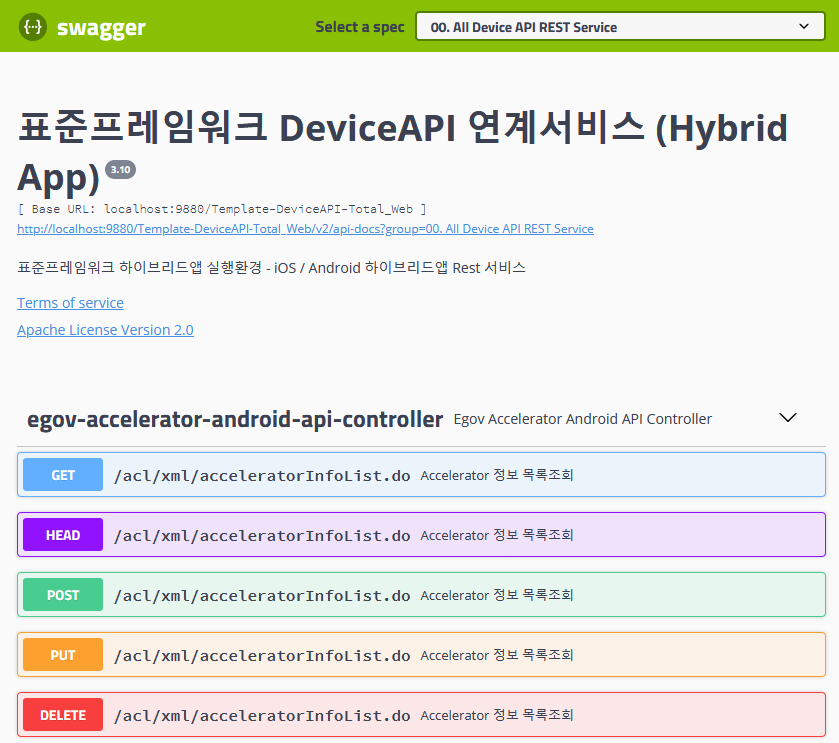
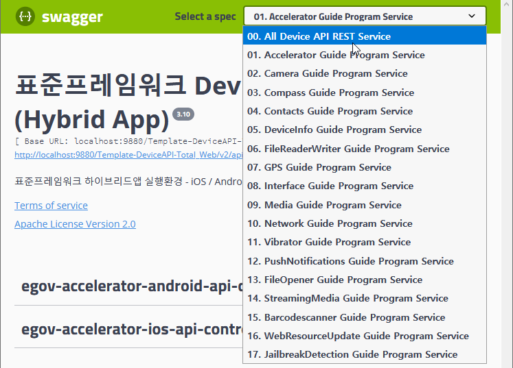
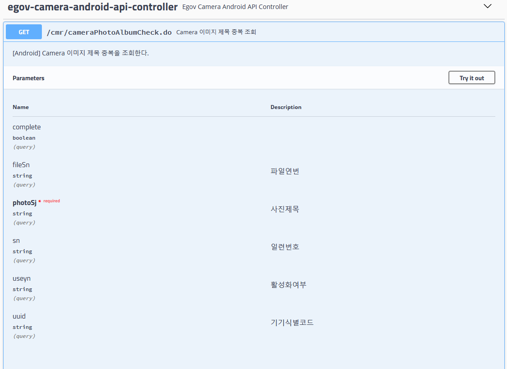
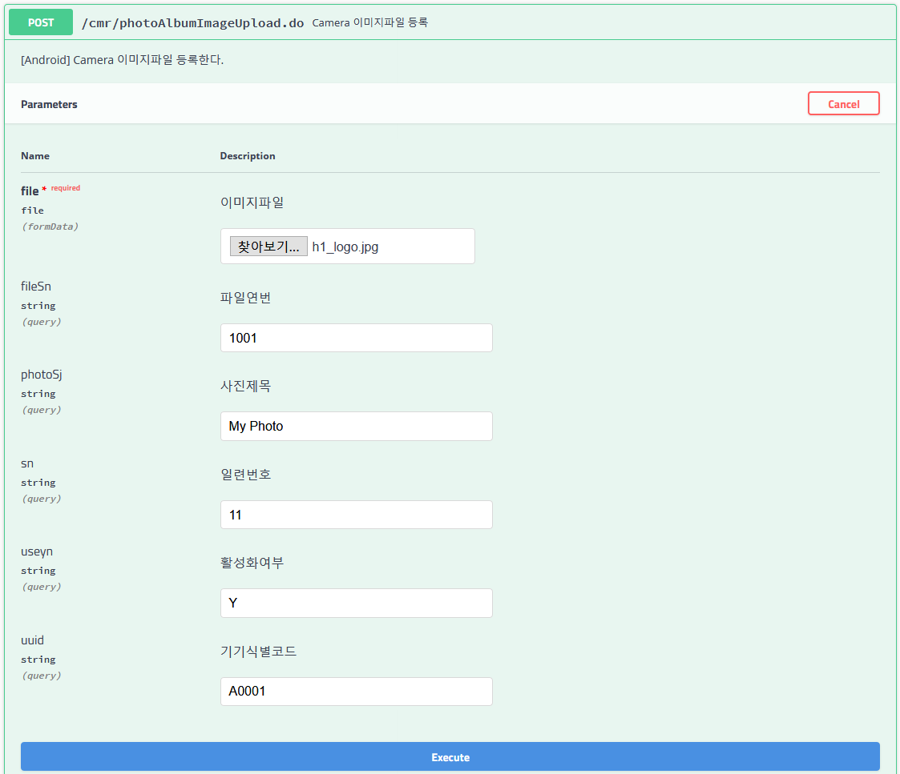

# Swagger

## 개요

Swagger는 Restful 서비스 사용시 구현된 서비스에 대한 문서화를 지원하는 도구이다.

## 설명

### 목적

Restful 서비스를 구현한 경우 해당 API서버가 어떤 스펙을 가지고 있고 어떤 데이터를 주고 받는지에 대한 문서작업은 꼭 필요하다.<br/>
하지만 이런 문서작업은 상당한 시간을 사용하여 작성하여야 하고 API서버의 스펙이 변경되면 문서도 수정해 주어야 하기 때문에 관리가 여간 어려운게 아니다.<br/>
따라서 API 서버의 서비스를 작성하는것외에 문서의 작성과 유지보수를 위해 많은 시간과 비용이 발생한다.<br/>
Swagger는 이러한 Restful서비스의 문서작성과 유지보수에 대한 효율성을 높일수 있다.

### 특징

#### 간단한 설정으로 Swagger UI를 구동시킬수 있다.



#### 그룹별로 정리할수 있으며 간단한 정보를 안내할수 있다.

그룹별로 정리되기 위해서는 URL경로가 업무별로 구분가능하고 정리되어 있어야 한다.<br/>
해당 서비스에 대해 기본적인 정보를 안내할수 있다.



#### UI에서 전문의 각항목의 정의명을 표시해 줄수 있다.



#### UI에서 테스트를 수행할수 있다. 각 항목의 입력은 물론 파일 업로드까지 테스트가 가능하다.



#### 테스트 결과가 UI에서 즉시 표시된다.


## 설정방법

### pom.xml 설정

```xml
	<dependency>
	    <groupId>io.springfox</groupId>
	    <artifactId>springfox-swagger2</artifactId>
	    <version>2.9.2</version> 
	</dependency>
 
	<dependency>
	    <groupId>io.springfox</groupId>
	    <artifactId>springfox-swagger-ui</artifactId>
	    <version>2.9.2</version>
	</dependency>
```

### swagger-servlet.xml 설정

```xml
    <context:component-scan base-package="egovframework">
        <context:include-filter type="annotation" expression="org.springframework.stereotype.Controller"/>
        <context:exclude-filter type="annotation" expression="org.springframework.stereotype.Service"/>
        <context:exclude-filter type="annotation" expression="org.springframework.stereotype.Repository"/>
    </context:component-scan>
 
	<bean id="swagger2Config"
		class="springfox.documentation.swagger2.configuration.Swagger2DocumentationConfiguration"></bean>
 
	<mvc:resources location="classpath:/META-INF/resources/"
		mapping="swagger-ui.html"></mvc:resources>
	<mvc:resources
		location="classpath:/META-INF/resources/webjars/"
		mapping="/webjars/**"></mvc:resources>
```

### web.xml 설정

```xml
  <servlet>
    <servlet-name>swagger</servlet-name>
    <servlet-class>org.springframework.web.servlet.DispatcherServlet</servlet-class>
    <init-param>
      <param-name>contextConfigLocation</param-name>
      <param-value>/WEB-INF/config/egovframework/springmvc/swagger-servlet.xml</param-value>
    </init-param>
    <load-on-startup>2</load-on-startup>
  </servlet>
  <servlet-mapping>
    <servlet-name>swagger</servlet-name>
    <url-pattern>/swagger-ui.html</url-pattern>
    <url-pattern>/webjars/**</url-pattern>
    <url-pattern>/</url-pattern>
  </servlet-mapping>
```

### SwaggerConfig 작성

@EnableSwagger2 어노테이션을 반드시 추가하여야 한다.

```java
@Configuration
@EnableSwagger2
@EnableWebMvc
public class SwaggerConfig {
 
    @Bean
    public Docket newsApiAll() {
        return new Docket(DocumentationType.SWAGGER_2)
                .groupName("00. All Device API REST Service")
                .apiInfo(apiInfo())
                .select()
                .paths(PathSelectors.any())
                .build();
    }
 
    @Bean
    public Docket newsApiAccelerator() {
        return new Docket(DocumentationType.SWAGGER_2)
                .groupName("01. Accelerator Guide Program Service")
                .apiInfo(apiInfo())
                .select()
                .paths(regex("/acl.*"))
                .build();
    }
 
    private ApiInfo apiInfo() {
        return new ApiInfoBuilder()
                .title("표준프레임워크 DeviceAPI 연계서비스 (Hybrid App)")
                .description("표준프레임워크 하이브리드앱 실행환경  - iOS / Android 하이브리드앱 Rest 서비스")
                .termsOfServiceUrl("https://www.egovframe.go.kr/wiki/doku.php?id=egovframework:hyb:gate_page")
                .license("Apache License Version 2.0")
                .licenseUrl("https://www.egovframe.go.kr")
                .version("3.10")
                .build();
    }
}
```