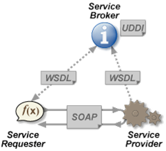
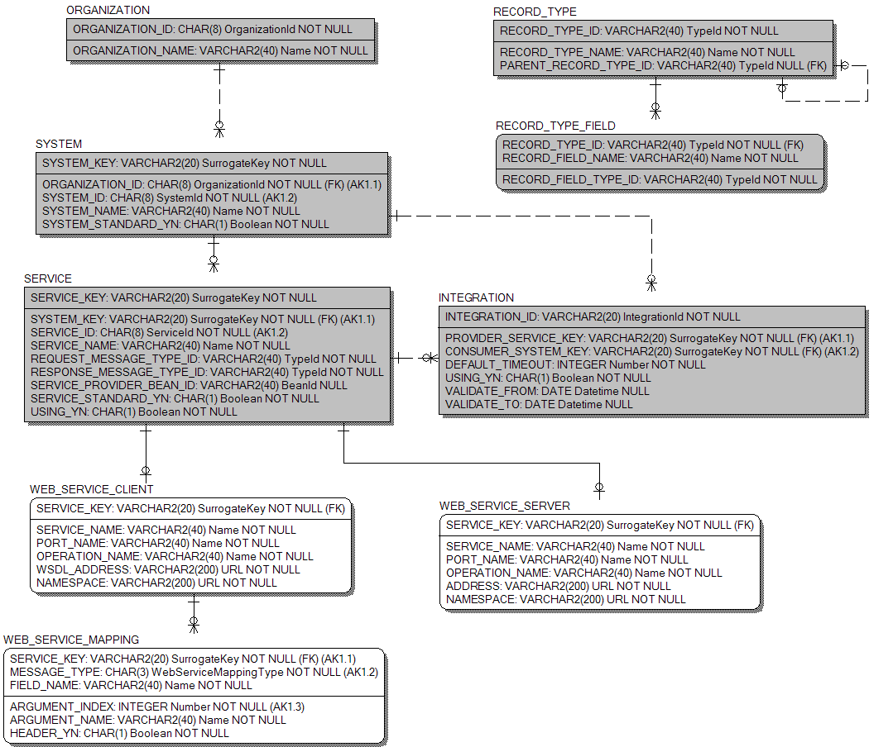

# WebService

## 개요

WebService는 전자정부 개발프레임워크 Integration 서비스 표준에 따라 WebService를 요청하고 제공하기 위한 Library이다.

### 주요 개념

#### Web Services

W3C는 Web Service를 “네트워크 상에서 발생하는 컴퓨터 간의 상호작용을 지원하기 위한 소프트웨어 시스템”으로 정의하고 있다. 일반적으로 Web Service는 인터넷과 같은 네트워크 상에서 접근되고, 요청된 서비스를 제공하는 원격 시스템에서 수행되는 Web APIs이다.



- 참조 : https://en.wikipedia.org/wiki/Web_service

### 사용 오픈소스

#### Apache CXF

WebService는 Web Service 구현하기 위해서 [Apache CXF](https://cxf.apache.org/)를 사용한다.

## 설명

WebService는 [Integration Service](./integration-service.md) 표준에 따라 구현한 Library이므로, 본 장에서는 API 등의 사용 방식은 설명하지 않는다. 본 장은 WebService 만을 위한 추가적인 설정 정보를 설명하고, 설정 방법을 가이드한다.

### Metadata

WebService는 연계 서비스를 요청하고 제공하기 위한 Web Service Client와 Server 정보를 필요로한다.

#### 물리ERD



| <center>Table</center> | <center>설명</center> |
| --- | --- |
| WEB_SERVICE_SERVER | 연계 서비스를 Web Service 형태로 공개(publish)하기 위해 필요한 정보를 담고 있다. |
| WEB_SERVICE_CLIENT | Web Service 형태로 공개(publish)되어 있는 연계 서비스를 호출하기 위해 필요한 정보를 담고 있다. |
| WEB_SERVICE_MAPPING | 전자정부 Integration 서비스 표준에 따라 개발된 서비스가 아닌 기존의 Legacy 시스템의 Web Service를 호출하기 위해, 표준 메시지와 Web Service 메시지 간의 mapping 정보를 담고 있다. |

#### 물리 모델 Domain 설명

| <center>Domain</center> | <center>Data Type</center> | <center>설명</center> | <center>비고</center> |
| --- | --- | --- | --- |
| URL | VARCHAR2(200) | URL을 나타낸다. | |
| WebServiceMappingType | CHAR(2) | Req/Res 구분을 나타낸다. | 'REQ' : Request<br/>'RES' : Response |

#### 물리 모델 Table 설명

##### WEB_SERVICE_SERVER

<table border="1">
  <tr>
    <td colspan="3" style="text-align: center; font-weight: bold;">Table 명</td>
    <td colspan="5">WEB_SERVICE_SERVER</td>
  </tr>
  <tr>
    <td colspan="3" style="text-align: center; font-weight: bold;">설명</td>
    <td colspan="5">연계 서비스를 Web Service 형태로 공개(publish)하기 위해 필요한 정보를 담고 있다.</td>
  </tr>
  <tr>
    <td colspan="8" style="text-align: center; font-weight: bold;">Column</td>
  </tr>
  <tr>
    <td style="text-align: center; font-weight: bold;">Seq</td>
    <td style="text-align: center; font-weight: bold;">PK</td>
    <td style="text-align: center; font-weight: bold;">Column명</td>
    <td style="text-align: center; font-weight: bold;">한글명</td>
    <td style="text-align: center; font-weight: bold;">Domain</td>
    <td style="text-align: center; font-weight: bold;">Data Type</td>
    <td style="text-align: center; font-weight: bold;">Null</td>
    <td style="text-align: center; font-weight: bold;">설명</td>
  </tr>
  <tr>
    <td style="text-align: center;">1</td>
    <td style="text-align: center;">Y</td>
    <td>SERVICE_KEY</td>
    <td>서비스KEY</td>
    <td>SurrogateKey</td>
    <td>VARCHAR2(20)</td>
    <td style="text-align: center;">N</td>
    <td>서비스 Key이다.</td>
  </tr>
  <tr>
    <td style="text-align: center;">2</td>
    <td style="text-align: center;"></td>
    <td>ADDRESS</td>
    <td>주소</td>
    <td>URL</td>
    <td>VARCHAR2(200)</td>
    <td style="text-align: center;">N</td>
    <td>서비스를 공개할 주소이다.</td>
  </tr>
  <tr>
    <td style="text-align: center;">3</td>
    <td style="text-align: center;"></td>
    <td>NAMESPACE</td>
    <td>네임스페이스</td>
    <td>URL</td>
    <td>VARCHAR2(200)</td>
    <td style="text-align: center;">N</td>
    <td>서비스의 네임스페이스이다.</td>
  </tr>
  <tr>
    <td style="text-align: center;">4</td>
    <td style="text-align: center;"></td>
    <td>SERVICE_NAME</td>
    <td>서비스명</td>
    <td>Name</td>
    <td>VARCHAR2(40)</td>
    <td style="text-align: center;">N</td>
    <td>공개할 때 사용할 서비스의 이름이다.</td>
  </tr>
  <tr>
    <td style="text-align: center;">5</td>
    <td style="text-align: center;"></td>
    <td>PORT_NAME</td>
    <td>포트명</td>
    <td>Name</td>
    <td>VARCHAR2(40)</td>
    <td style="text-align: center;">N</td>
    <td>공개할 때 사용할 포트의 이름이다.</td>
  </tr>
  <tr>
    <td style="text-align: center;">6</td>
    <td style="text-align: center;"></td>
    <td>OPERATION_NAME</td>
    <td>기능명</td>
    <td>Name</td>
    <td>VARCHAR2(40)</td>
    <td style="text-align: center;">N</td>
    <td>공개할 때 사용할 기능의 이름이다.</td>
  </tr>
  <tr>
    <td colspan="8" style="text-align: center; font-weight: bold;">Constraints</td>
  </tr>
  <tr>
    <td colspan="8">PRIMARY KEY (SERVICE_KEY)</td>
  </tr>
  <tr>
    <td colspan="8">FOREIGN KEY (SERVICE_KEY) REFERENCES SERVICE (SERVICE_KEY)</td>
  </tr>
</table>

##### WEB_SERVICE_CLIENT

<table border="1">
  <tr>
    <td colspan="3" style="text-align: center; font-weight: bold;">Table 명</td>
    <td colspan="5">WEB_SERVICE_CLIENT</td>
  </tr>
  <tr>
    <td colspan="3" style="text-align: center; font-weight: bold;">설명</td>
    <td colspan="5">Web Service 형태로 공개(publish)되어 있는 연계 서비스를 호출하기 위해 필요한 정보를 담고 있다.</td>
  </tr>
  <tr>
    <td colspan="8" style="text-align: center; font-weight: bold;">Column</td>
  </tr>
  <tr>
    <td style="text-align: center; font-weight: bold;">Seq</td>
    <td style="text-align: center; font-weight: bold;">PK</td>
    <td style="text-align: center; font-weight: bold;">Column명</td>
    <td style="text-align: center; font-weight: bold;">한글명</td>
    <td style="text-align: center; font-weight: bold;">Domain</td>
    <td style="text-align: center; font-weight: bold;">Data Type</td>
    <td style="text-align: center; font-weight: bold;">Null</td>
    <td style="text-align: center; font-weight: bold;">설명</td>
  </tr>
  <tr>
    <td style="text-align: center;">1</td>
    <td style="text-align: center;">Y</td>
    <td>SERVICE_KEY</td>
    <td>서비스KEY</td>
    <td>SurrogateKey</td>
    <td>VARCHAR2(20)</td>
    <td style="text-align: center;">N</td>
    <td>서비스 Key이다.</td>
  </tr>
  <tr>
    <td style="text-align: center;">2</td>
    <td style="text-align: center;"></td>
    <td>WSDL_ADDRESS</td>
    <td>WSDL 주소</td>
    <td>URL</td>
    <td>VARCHAR2(200)</td>
    <td style="text-align: center;">N</td>
    <td>사용할 서비스의 WSDL 주소이다.</td>
  </tr>
    <tr>
    <td style="text-align: center;">3</td>
    <td style="text-align: center;"></td>
    <td>NAMESPACE</td>
    <td>네임스페이스</td>
    <td>URL</td>
    <td>VARCHAR2(200)</td>
    <td style="text-align: center;">N</td>
    <td>서비스의 네임스페이스이다.</td>
  </tr>
  <tr>
    <td style="text-align: center;">4</td>
    <td style="text-align: center;"></td>
    <td>SERVICE_NAME</td>
    <td>서비스명</td>
    <td>Name</td>
    <td>VARCHAR2(40)</td>
    <td style="text-align: center;">N</td>
    <td>사용할 서비스의 이름이다.</td>
  </tr>
  <tr>
    <td style="text-align: center;">5</td>
    <td style="text-align: center;"></td>
    <td>PORT_NAME</td>
    <td>포트명</td>
    <td>Name</td>
    <td>VARCHAR2(40)</td>
    <td style="text-align: center;">N</td>
    <td>사용할 포트의 이름이다.</td>
  </tr>
  <tr>
    <td style="text-align: center;">6</td>
    <td style="text-align: center;"></td>
    <td>OPERATION_NAME</td>
    <td>기능명</td>
    <td>Name</td>
    <td>VARCHAR2(40)</td>
    <td style="text-align: center;">N</td>
    <td>사용할 기능의 이름이다.</td>
  </tr>
  <tr>
    <td colspan="8" style="text-align: center; font-weight: bold;">Constraints</td>
  </tr>
  <tr>
    <td colspan="8">PRIMARY KEY (SERVICE_KEY)</td>
  </tr>
  <tr>
    <td colspan="8">FOREIGN KEY (SERVICE_KEY) REFERENCES SERVICE (SERVICE_KEY)</td>
  </tr>
</table>

##### WEB_SERVICE_MAPPING

<table border="1">
  <tr>
    <td colspan="3" style="text-align: center; font-weight: bold;">Table 명</td>
    <td colspan="5">WEB_SERVICE_MAPPING</td>
  </tr>
  <tr>
    <td colspan="3" style="text-align: center; font-weight: bold;">설명</td>
    <td colspan="5">전자정부 Integration 서비스 표준에 따라 개발된 서비스가 아닌 기존의 Legacy 시스템의 Web Service를 호출하기 위해, 표준 메시지와 Web Service 메시지 간의 mapping 정보를 담고 있다.</td>
  </tr>
  <tr>
    <td colspan="8" style="text-align: center; font-weight: bold;">Column</td>
  </tr>
  <tr>
    <td style="text-align: center; font-weight: bold;">Seq</td>
    <td style="text-align: center; font-weight: bold;">PK</td>
    <td style="text-align: center; font-weight: bold;">Column명</td>
    <td style="text-align: center; font-weight: bold;">한글명</td>
    <td style="text-align: center; font-weight: bold;">Domain</td>
    <td style="text-align: center; font-weight: bold;">Data Type</td>
    <td style="text-align: center; font-weight: bold;">Null</td>
    <td style="text-align: center; font-weight: bold;">설명</td>
  </tr>
  <tr>
    <td style="text-align: center;">1</td>
    <td style="text-align: center;">Y</td>
    <td>SERVICE_KEY</td>
    <td>서비스KEY</td>
    <td>SurrogateKey</td>
    <td>VARCHAR2(20)</td>
    <td style="text-align: center;">N</td>
    <td>서비스 Key이다.</td>
  </tr>
  <tr>
    <td style="text-align: center;">2</td>
    <td style="text-align: center;">Y</td>
    <td>MESSAGE_TYPE</td>
    <td>메시지타입</td>
    <td>WebServiceMappingType</td>
    <td>CHAR(3)</td>
    <td style="text-align: center;">N</td>
    <td>Req/Res 구분이다.</td>
  </tr>
    <tr>
    <td style="text-align: center;">3</td>
    <td style="text-align: center;">Y</td>
    <td>FIELD_NAME</td>
    <td>필드명</td>
    <td>Name</td>
    <td>VARCHAR2(40)</td>
    <td style="text-align: center;">N</td>
    <td>표준 메시지 Field 이름이다.</td>
  </tr>
  <tr>
    <td style="text-align: center;">4</td>
    <td style="text-align: center;"></td>
    <td>ARGUMENT_INDEX</td>
    <td>변수순서</td>
    <td>Number</td>
    <td>Integer</td>
    <td style="text-align: center;">N</td>
    <td>Web Service 메시지의 변수 순서이다.</td>
  </tr>
  <tr>
    <td style="text-align: center;">5</td>
    <td style="text-align: center;"></td>
    <td>ARGUMENT_NAME</td>
    <td>변수명</td>
    <td>Name</td>
    <td>VARCHAR2(40)</td>
    <td style="text-align: center;">N</td>
    <td>Web Service 메시지의 변수 이름이다.</td>
  </tr>
  <tr>
    <td style="text-align: center;">6</td>
    <td style="text-align: center;"></td>
    <td>HEADER_YN</td>
    <td>헤더여부</td>
    <td>Boolean</td>
    <td>CHAR(1)</td>
    <td style="text-align: center;">N</td>
    <td>Web Service 헤더 여부이다.</td>
  </tr>
  <tr>
    <td colspan="8" style="text-align: center; font-weight: bold;">Constraints</td>
  </tr>
  <tr>
    <td colspan="8">PRIMARY KEY (SERVICE_KEY, MESSAGE_TYPE, FIELD_NAME)</td>
  </tr>
  <tr>
    <td colspan="8">FOREIGN KEY (SERVICE_KEY) REFERENCES WEB_SERVICE_CLIENT (SERVICE_KEY)</td>
  </tr>
</table>

### 설정 방법

WebService를 사용하기 위해 다음의 설정이 필요하다.

1. [pom.xml에 dependency 설정 추가](#pomxml에-dependency-설정-추가)
2. [Spring XML Configuration 설정](#spring-xml-configuration-설정)

#### pom.xml에 dependency 설정 추가

WebService를 사용하기 위해서 pom.xml의 dependencies tag에 다음 dependency를 추가한다.

- &lt;version&gt; tag의 값인 ${egovframework.versioin}에는 사용할 egovframework의 version을 기재한다.

```xml
    ...
    <dependencies>
        ...
        <dependency>
            <groupId>egovframework.rte</groupId>
            <artifactId>egovframework.rte.itl.webservice</artifactId>
            <version>${egovframework.version}</version>
        </dependency>
        ...
    </dependencies>
    ...

```

#### Spring XML Configuration 설정

WebService를 위한 기본적인 설정이 포함된 “context-webservice.xml” 파일을 Spring XML Configuration 파일에 import한다.

```xml
    <import resource="classpath:/egovframework/rte/itl/webservice/context/context-webservice.xml"/>
```

그리고 Context와 DataSource를 등록해야 한다.(DataSource의 경우, 프로젝트에서 사용하는 것이 있을 경우 설정하지 않아도 된다. 단, 반드시 id가 “dataSource”이여야 한다.)

```xml
    <!-- EgovWebServiceContext 이다.
         organizationId 와 systemId 는 현재 시스템의 기관ID 및 시스템ID를 넣어야 한다. -->
    <bean id="egovWebServiceContext"
          class="egovframework.rte.itl.webservice.EgovWebServiceContext"
          init-method="init">
        <property name="organizationId" value="ORG_EGOV"/>
        <property name="systemId" value="SYS00001"/>
        <property name="defaultTimeout" value="5000"/>
        <property name="integrationDefinitionDao" ref="integrationDefinitionDao"/>
        <property name="webServiceServerDefinitionDao" ref="webServiceServerDefinitionDao"/>
        <property name="webServiceClientDefinitionDao" ref="webServiceClientDefinitionDao"/>
        <property name="typeLoader" ref="typeLoader"/>
        <property name="classLoader" ref="classLoader"/>
    </bean>
 
    <!-- DataSource 설정이다. 시스템에 맞게 재작성 해야 한다. 아래는 HSQL Sample이다. -->
    <bean id="dataSource" class="org.apache.commons.dbcp.BasicDataSource" destroy-method="close">
        <property name="driverClassName" value="net.sf.log4jdbc.DriverSpy"/>
        <property name="url" value="jdbc:log4jdbc:hsqldb:hsql://localhost/test"/>
        <property name="username" value="sa"/>
        <property name="password" value=""/>
        <property name="defaultAutoCommit" value="false"/>
        <property name="poolPreparedStatements" value="true"/>
    </bean>
```

### Client 모듈 개발

WebService Client 모듈은 Web Service로 공개된 Integration 서비스 표준에 따라 호출하는 모듈로서, 본 장은 설정 방식을 설명한다. (호출 방식은 [연계 서비스 API](./integration-service-api.md)를 참조한다.)<br/>
Client 모듈을 설정하기 위해서는 다음 과정이 필요하다.

1. [Metadata WEB_SERVICE_CLIENT 설정 추가](#metadata-web_service_client-설정-추가)
2. [(Optional) Metadata WEB_SERVICE_MAPPING 설정 추가](#optional-metadata-web_service_mapping-설정-추가)

#### Metadata WEB_SERVICE_CLIENT 설정 추가

Client 모듈을 설정하기 위해서는 Metadata의 WEB_SERVICE_CLIENT Table에 설정을 추가해야 한다.<br/>
다음과 같이 Integration 서비스의 Metadata인 INTEGRATION Table에 연계등록정보가 설정되어 있다고 가정한다. (* 기관, 시스템, 서비스, 메시지타입 등의 정보는 설정되어 있으며, 개발하는 시스템은 'SYSTEM_CONSUMER'라고 가정함)

<table border="1">
  <tr>
    <td colspan="7" style="text-align: center; font-weight: bold;">INTEGRATION</td>
  </tr>
  <tr>
    <td style="text-align: center; font-weight: bold;">ID</td>
    <td style="text-align: center; font-weight: bold;">PROVIDER_SERVICE_KEY</td>
    <td style="text-align: center; font-weight: bold;">CONSUMER_SYSTEM_KEY</td>
    <td style="text-align: center; font-weight: bold;">DEFAULT_TIMEOUT</td>
    <td style="text-align: center; font-weight: bold;">USING_YN</td>
    <td style="text-align: center; font-weight: bold;">VALIDATE_FROM</td>
    <td style="text-align: center; font-weight: bold;">VALIDATE_TO</td>
  </tr>
  <tr>
    <td>'INT_VERIFY_NAME'</td>
    <td>'SERVICE_VERIFY_NAME'</td>
    <td>'SYSTEM_CONSUMER'</td>
    <td>5000</td>
    <td>'Y'</td>
    <td>NULL</td>
    <td>NULL</td>
  </tr>
</table>

Web Service 'SERVICE_VERIFY_NAME'를 호출하기 위해서 WEB_SERVICE_CLIENT에 'SERVICE_VERIFY_NAME'을 SERVICE_KEY로 갖는 설정을 추가해야 한다.

<table border="1">
  <tr>
    <td colspan="6" style="text-align: center; font-weight: bold;">WEB_SERVICE_CLIENT</td>
  </tr>
  <tr>
    <td style="text-align: center; font-weight: bold;">SERVICE_KEY</td>
    <td style="text-align: center; font-weight: bold;">WSDL_ADDRESS</td>
    <td style="text-align: center; font-weight: bold;">NAMESPACE</td>
    <td style="text-align: center; font-weight: bold;">SERVICE_NAME</td>
    <td style="text-align: center; font-weight: bold;">PORT_NAME</td>
    <td style="text-align: center; font-weight: bold;">OPERATION_NAME</td>
  </tr>
  <tr>
    <td>'SERVICE_VERIFY_NAME'</td>
    <td>'http://192.168.0.1:8080/Sample/services/VerifyName?wsdl'</td>
    <td>'http://itl/sample/'</td>
    <td>'VerifyNameService'</td>
    <td>'VerifyNamePort'</td>
    <td>'service'</td>
  </tr>
</table>

#### (Optional) Metadata WEB_SERVICE_MAPPING 설정 추가

만약 호출하는 Web Service가 전자정부 Integration 서비스 표준에 따라 개발된 서비스가 아닌 경우, 메시지 헤더부가 다를 수 있어 별도의 Mapping 정보가 필요하다.<br/>
전자정부 Integration 서비스 표준은 Web Service Header부에 들어갈 Attribute들이 EgovIntegrationMessageHeader에 정의되어 있고, 바디부는 EgovIntegrationMessage의 body에 정의되어 있으므로 별도의 mapping 정보 없이 header와 body 부의 구분이 가능하지만, 표준을 따르지 않은 Web Service의 경우 EgovIntegrationMessage의 body부에 정의되어 있는 일부 값들을 헤더에 포함시켜야 한다.

WEB_SERVICE_MAPPING Table의 정보는 Integration 서비스 표준에 정의되어 있는 메시지 형태를 기준으로 한다. 서비스 'SERVICE_VERIFY_NAME'의 Request Message는 'name', 'residentRegistrationNumber' 필드를 가지고, Response Message는 'result' 필드를 가진다. 따라서 'SERVICE_VERIFY_NAME'에 해당하는 WEB_SERVICE_MAPPING은 다음의 정보를 가져야 한다.

<table border="1">
  <tr>
    <td colspan="6" style="text-align: center; font-weight: bold;">WEB_SERVICE_MAPPING</td>
  </tr>
  <tr>
    <td style="text-align: center; font-weight: bold;">SERVICE_KEY</td>
    <td style="text-align: center; font-weight: bold;">MESSAGE_TYPE</td>
    <td style="text-align: center; font-weight: bold;">FIELD_NAME</td>
    <td style="text-align: center; font-weight: bold;">ARGUMENT_INDEX</td>
    <td style="text-align: center; font-weight: bold;">ARGUMENT_NAME</td>
    <td style="text-align: center; font-weight: bold;">HEADER_YN</td>
  </tr>
  <tr>
    <td>'SERVICE_VERIFY_NAME'</td>
    <td>'REQ'</td>
    <td>'name'</td>
    <td>1</td>
    <td>'name'</td>
    <td>Y</td>
  </tr>
  <tr>
    <td>'SERVICE_VERIFY_NAME'</td>
    <td>'REQ'</td>
    <td>'residentRegistrationNumber'</td>
    <td>2</td>
    <td>'residentRegistrationNumber'</td>
    <td>N</td>
  </tr>
  <tr>
    <td>'SERVICE_VERIFY_NAME'</td>
    <td>'RES'</td>
    <td>'result'</td>
    <td>1</td>
    <td>'result'</td>
    <td>N</td>
  </tr>
</table>

위 정보 중 HEADER_YN column의 값에 따라 해당 field가 Web Service Envelop의 header에 포함될지 여부를 판단한다. 위 설정값을 적용하면, 요청 메시지 중 'name' field는 Web Service Envelop의 헤더에 포함된다.

### Server 모듈 개발

Web Service Server 모듈을 개발하는 과정은 다음과 같다.

1. [web.xml에 EgovWebServiceServlet 추가](#webxml에-egovwebserviceservlet-추가)
2. [Metadata WEB_SERVICE_SERVER 설정 추가](#metadata-web_service_server-설정-추가)

#### web.xml에 EgovWebServiceServlet 추가

web.xml에 EgovWebServiceServlet 설정을 추가한다.

```xml
    ...
    <servlet>
        <description></description>
        <display-name>EgovWebServiceServlet</display-name>
        <servlet-name>EgovWebServiceServlet</servlet-name>
        <servlet-class>egovframework.rte.itl.webservice.EgovWebServiceServlet</servlet-class>
        <load-on-startup>1</load-on-startup>
    </servlet>
    <servlet-mapping>
        <servlet-name>EgovWebServiceServlet</servlet-name>
        <url-pattern>/services/*</url-pattern>
    </servlet-mapping>
    ...
```

&lt;url-pattern&gt; tag의 값은 변경 될 수 있다. 자세한 설명은 다음 WEB_SERVICE_SERVER 설정을 참조한다.

#### Metadata WEB_SERVICE_SERVER 설정 추가

다음과 같이 Integration 서비스의 Metadata인 INTEGRATION Table에 연계등록정보가 설정되어 있다고 가정한다. (* 기관, 시스템, 서비스, 메시지타입 등의 정보는 설정되어 있으며, 공개할 서비스는 'SERVICE_VERIFY_NAME'이라고 가정함)

<table border="1">
  <tr>
    <td colspan="7" style="text-align: center; font-weight: bold;">INTEGRATION</td>
  </tr>
  <tr>
    <td style="text-align: center; font-weight: bold;">ID</td>
    <td style="text-align: center; font-weight: bold;">PROVIDER_SERVICE_KEY</td>
    <td style="text-align: center; font-weight: bold;">CONSUMER_SYSTEM_KEY</td>
    <td style="text-align: center; font-weight: bold;">DEFAULT_TIMEOUT</td>
    <td style="text-align: center; font-weight: bold;">USING_YN</td>
    <td style="text-align: center; font-weight: bold;">VALIDATE_FROM</td>
    <td style="text-align: center; font-weight: bold;">VALIDATE_TO</td>
  </tr>
  <tr>
    <td>'INT_VERIFY_NAME'</td>
    <td>'SERVICE_VERIFY_NAME'</td>
    <td>'SYSTEM_CONSUMER'</td>
    <td>5000</td>
    <td>'Y'</td>
    <td>NULL</td>
    <td>NULL</td>
  </tr>
</table>

Web Service 'SERVICE_VERIFY_NAME'를 공개하기 위해서 WEB_SERVICE_SERVER에 'SERVICE_VERIFY_NAME'을 SERVICE_KEY로 갖는 설정을 추가해야 한다.

<table border="1">
  <tr>
    <td colspan="6" style="text-align: center; font-weight: bold;">WEB_SERVICE_SERVICE</td>
  </tr>
  <tr>
    <td style="text-align: center; font-weight: bold;">SERVICE_KEY</td>
    <td style="text-align: center; font-weight: bold;">ADDRESS</td>
    <td style="text-align: center; font-weight: bold;">NAMESPACE</td>
    <td style="text-align: center; font-weight: bold;">SERVICE_NAME</td>
    <td style="text-align: center; font-weight: bold;">PORT_NAME</td>
    <td style="text-align: center; font-weight: bold;">OPERATION_NAME</td>
  </tr>
  <tr>
    <td>'SERVICE_VERIFY_NAME'</td>
    <td>'/VerifyName'</td>
    <td>'http://itl/sample/'</td>
    <td>'VerifyNameService'</td>
    <td>'VerifyNamePort'</td>
    <td>'service'</td>
  </tr>
</table>

&lt;servlet-mapping&gt; tag의 &lt;url-pattern&gt; tag의 값은 서비스를 제공하기 위한 주소로, WEB_SERVICE_SERVER Table의 ADDRESS Column 값은 &lt;url-pattern&gt; tag값에 대한 상대 위치를 나타낸다.<br/>
예를 들어, Web Application의 IP가 192.168.0.1, Port가 8080, Context Root가 “Sample”, url-patterns이 ”/services/*”인 경우, 위 'SERVICE_VERIFY_NAME'의 WSDL Address는 `http://192.168.0.1:8080/Sample/services/VerifyName?wsdl`이다.

### WAS에 배포

전자정부 WebService를 포함한 어플리케이션을 WAS에 배포(deploy)하는 방법을 설명한다. Apache CXF의 경우 Web Service 관련 라이브러리를 CXF에서 제공하는 것을 사용해야 한다. 만약 WAS가 기본적으로 Web Service 라이브러리를 제공할 경우, 정상적으로 동작하지 않을 수 있다. 따라서 CXF 라이브러리를 사용할 수 있도록 설정을 변경해야 하는데, 대부부의 해결책은 Web Application의 WEB-INF의 라이브러리를 먼저 loading하도록 Class Loading 순서를 변경하는 것이다.

본 WebService는 JAX-WS 2.0 이상을 사용한다.

#### TmaxSoft JEUS 6.0

전자정부 WebService의 경우 내부적으로 CXF를 사용하지만 JEUS 6.0에 배포했을 경우 Server 모듈을 공개(publish)할 때 문제가 발생한다. 그 원인은 JEUS 6.0에 기본적으로 포함되어 있는 Web Services 관련 library와 전자정부 WebService가 사용하는 library가 같지 않기 때문이다. 현재 아래와 같은 2가지 문제가 발견되었다.

- Publish Address 문제<br/>
  Server 모듈을 publish할 때 EgovWebServiceServlet의 path에 대한 상대경로를 사용한다. Apache CXF가 사용하는 library의 경우, 이를 실제 주소로 변환해주지만, JEUS 6.0에 기본적으로 포함된 library는 그렇지 않기 때문에 IllegalArgumentException을 발생시킨다.

- Service Endpoint Interface 참조 문제<br/>
  전자정부 WebService는 Integration 서비스 표준에 따라 Server 모듈의 Service Endpoint Interface와 구현 class를 동적으로 생성한다. 하지만 JEUS 6.0에 기본적으로 포함된 library의 경우, 이렇게 동적으로 생성된 class를 인식하지 못해서 Exception이 발생한다.

해결방법은 전자정부 WebService가 사용하는 library가 ClassLoader에서 먼저 loading되게 하는 것이다. JEUS 6.0은 jeus-web-dd.xml 설정을 통해서 WEB-INF/lib에 있는 library를 먼저 loading하도록 설정할 수 있다.

```xml
<?xml version="1.0" encoding="UTF-8"?>
<jeus-web-dd  xmlns="http://www.tmaxsoft.com/xml/ns/jeus" version="6.0">
    <webinf-first>true</webinf-first>
</jeus-web-dd>
```

위 jeus-web-dd.xml 파일을 web.xml 파일이 존재하는 WEB-INF 폴더에 위치시킨다. 그리고, webinf-first를 true로 설정하는 경우, XML Parser에 대한 충돌이 발생한다. 충돌을 해결하기 위해서 아래 2개의 파일을 WEB-INF/lib에서 제거해야 한다.

- 'xml-apis-1.0.b2.jar' (또는 상위 버전)
- 'stax-api-1.0.1.jar' (또는 상위 버전)

#### JBoss

JBoss의 경우, 아래 jboss-web.xml 파일을 추가한다.

```xml
<?xml version="1.0" encoding="UTF-8"?>
<jboss-web>
    <class-loading java2ClassLoadingCompliance="false">
        <loader-repository>
            apache.cxf:archive=<WAR 파일명>
            <loader-repository-config>
                java2ParentDelegation=false
            </loader-repository-config>
        </loader-repository>
    </class-loading>
</jboss-web>
```

*&lt;WAR 파일명&gt;은 deploy하는 war 파일명을 확장자를 포함하여 기재한다.

#### WebLogic

WebLogic 9.2 버전은 J2EE 1.4까지만 지원하므로, JAX-WS 2.0을 지원하지 않는다. WebService를 WebLogic에서 사용하기 위해서는 JAX-WS 2.0 이상을 지원하는 10.x 이상을 사용해야 한다.

## 참고자료

- [Integration Service](./integration-service.md)
- https://cxf.apache.org

