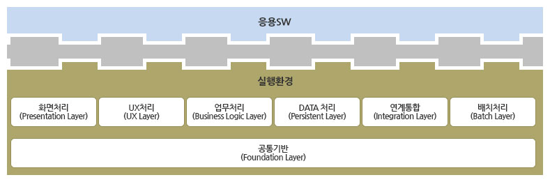
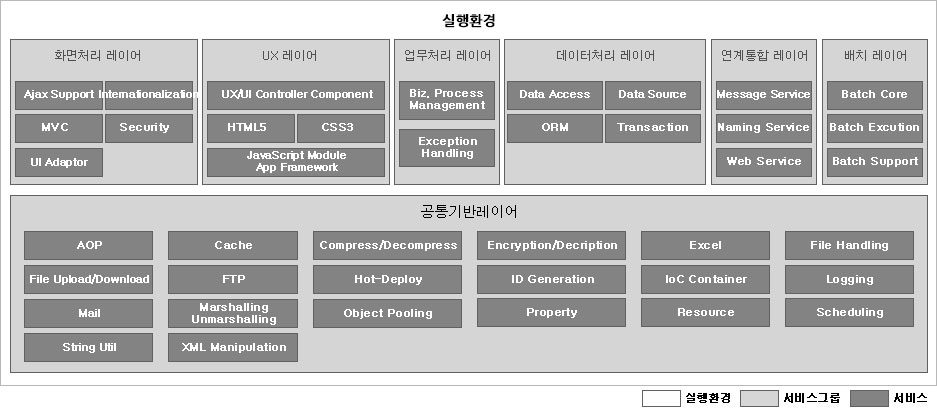

# 표준프레임워크 실행환경 소개

## 개요
표준프레임워크 실행환경은 응용SW의 구성기반으로서, 응용SW 실행 시 필요한 기본 기능을 제공하는 환경을 의미한다.

즉, 전자정부 업무 구현을 목적으로 개발된 프로그램이 사용자가 의도하는 대로 정상적으로 실행될 수 있도록 지원하는 재사용 가능한 서버 실행 모듈, SW구조의 집합을 의미 한다.

## 목표
전자정부 표준프레임워크 실행환경은 ‘전자정부 서비스의 품질향상 및 정보화 투자 효율성 향상’을 위해 개발프레임워크 실행환경 표준을 정립하고, 개발프레임워크 표준 적용을 통한 응용 SW의 표준화 및 품질과 재사용성 향상을 목표로 한다.  
또한, 모바일 웹의 사용성과 편의성 증대를 위하여 기존 실행환경 기반 개발이 가능한 모바일 웹 기반의 표준패턴 및 가이드 코드를 제공한다.

## 배경
현재 전자정부는 유사한 기능을 가지는 다양한 종류 및 버전의 프레임워크를 개별 시스템 단위로 적용/관리하고 있으며, 이에 따라 다양한 문제점들이 발생하고 있다.  
전자정부에 적용된 개발 프레임워크는 Black Box 형태로 제공되어 사업자의 기술지원 없이는 응용 SW를 유지보수하기 어렵기 때문에 사업자에 대한 의존성이 발생한다.  
복수개의 개발프레임워크가 적용된 사업의 경우, 개발프레임워크에 따라 개발표준 정의, 개발자 수급, 교육시행 등 별도의 유지보수 체계를 갖추는 중복 투자가 발생하며, 개발프레임워크의 체계적인 관리절차의 미비로 동일 개발프레임워크라 하더라도 버전 관리에 어려움이 있다.

따라서 전자정부 개발프레임워크의 표준화를 통하여
- 사업자 고유 개발프레임워크에 대한 기술 종속성을 배제하고, 
- 프레임워크 표준화를 통해 응용 SW의 표준화와 품질 및 재사용성을 향상시키며, 
- 개발 프레임워크의 유지 보수 단일화를 통한 투자 효율성을 높인다. 
- 또한 모바일 표준 패턴 및 가이드 코드를 제시하여 프로그램 사용자의 편의성을 향상시킨다. 

## 특징
표준프레임워크 실행환경은 전자정부 프레임워크에 대한 요구사항에 기반하고 기존 전자정부 프로젝트에 적용된 업체별 프레임워크를 비교 분석하여 38개 실행환경 프레임워크 서비스를 정의하였다.  
표준프레임워크 실행환경은 서비스별 오픈 소스 소프트웨어 심사 과정을 거쳐 선정한 경량화된 표준프레임워크로서 사실상 업계 표준에 가까운 Spring 프레임워크를 기반으로 한다.  
연계 솔루션에 독립된 전자정부 표준프레임워크 표준 연계 인터페이스를 정의하고 웹서비스 기반 구현체를 제공하며 모바일 웹의 경우 UX처리를 통합 웹서비스를 구현한다.

- 8개 서비스 그룹, 39개 서비스로 구성 - 표준프레임워크 실행환경은 화면처리, UX처리, 업무처리, 데이터처리, 연계통합, 배치처리, 모바일 서비스, 공통기반의 8개 서비스 그룹으로 구성되며, MVC, UX/UI Controller Component, IoC 컨테이너, AOP, Data Access, Integration 등의 핵심 서비스를 제공한다. 
- 전자정부 프로젝트에 최적화된 오픈 소스 소프트웨어 선정 - 표준프레임워크 실행환경은 전자정부 프레임워크에 대한 요구사항에 기반하여 38개 서비스 별 오픈 소스 소프트웨어 심사 과정을 거쳐 최적의 오픈 소스 소프트웨어를 선정하였다.
- 경량화된 표준프레임워크로서 사실상 업계 표준에 가까운 Spring 프레임워크를 적용 - J2EE 표준을 준수하는 Spring 프레임워크를 채택함으로써 특정 업체의 WAS나 DBMS에 독립적인 환경을 제공한다.
- DI(Dependency Injection) 방식의 의존 관계 처리 - 표준프레임워크 실행환경은 Dependency Injection을 통해 객체나 컴포넌트 간의 의존성을 정의함으로써 변경 용이성과 재사용성을 향상한다. 
- AOP(Aspect Oriented Programming) 지원 - 표준프레임워크 실행환경은 로깅, 트랜잭션, 예외처리와 같은 공통 관심 대상을 분리하여 정의함으로써, 개발자가 비즈니스 업무 개발에 집중할 수 있도록 한다. 
- MVC Model2 아키텍처 구조 제공 및 다양한 UI 클라이언트 연계 지원 - 표준프레임워크 실행환경은 Spring MVC를 기반으로 하며, 다양한 UI 클라이언트 연계를 위한 인터페이스를 정의한다.
- 전자정부 표준프레임워크 표준 연계 인터페이스 정의 - 표준프레임워크 실행환경 표준 연계 인터페이스를 정의함으로써 연계 솔루션에 대한 의존성을 배제하고 독립적인 어플리케이션 개발이 가능하다.
- UX/UI Controller Component - 모바일 ‘웹’ 사용자 환경(UX/UI)에 대한 유연한 대응을 위해 Touch Optimized 된 필수 UI 컨트롤러 컴포넌트를 제공한다.

## 실행환경 서비스 구성
전자정부 표준프레임워크 실행환경은 8개 서비스 그룹으로 구성되며 38개 서비스를 제공한다. 실행환경 서비스 그룹 및 서비스는 아래 그림과 같다.

## 화면처리
화면처리 서비스그룹은 업무처리 서비스와 사용자간의 인터페이스를 담당하는 서비스로 사용자 화면 구성 및 사용자 입력 정보 검증 등의 기능을 지원한다. 
- Ajax Support: Ajax는 대화식 웹 애플리케이션의 제작을 위해 HTML과 CSS, DOM, 자바 스크립트, XML, XSLT 등과 같은 조합을 이용하는 웹 개발 기법으로 Ajax 기능 지원을 위한 Custom Tag Library를 제공한다.
- Internationalization: Internationalization은 다양한 지역과 언어 환경을 지원할 수 있는 서비스로, 서버 설정 및 클라이언트 브라우저 환경에 따라 자동화된 다국어 기능을 제공한다.  
- MVC: MVC 디자인 패턴을 적용하여 사용자 화면을 개발할 수 있도록 MVC 기반 구조를 제공한다.
- Validation: 웹 응용프로그램 작성 시 발생될 수 있는 웹 보안상의 취약점(XSS, SQL Injection 등)에 대응하기 위한 기능을 제공한다.
- UI Adaptor: 화면 레이어의 구현 방식에 따라 업무로직 레이어가 변경되는 것을 막기 위해서, 업무처리 Layer에서 사용할 데이터 타입을 정의하고, 화면 레이어에서 사용하는 in/out parameter를 해당 구현 방식에 맞게 변환해주는 기능 제공한다.

## UX처리
UX 처리 서비스는 모바일 웹의 사용성과 편의성 증대를 위하여 사용자 경험 기능을 제공하고 시각,인터페이스,효과 경험이 가능하도록 지원한다.
- UX/UI Controller Component: 모바일 ‘웹’ 사용자 환경(UX/UI)에 대한 유연한 대응을 위해 Touch Optimized 된 필수 UI 컨트롤러 컴포넌트를 제공한다.
- HTML5 : 모바일 웹 페이지 구성 시 사용할 수 있는 마크업 언어로서 모바일 특화 태그 및 디바이스 API 제공한다.
- CSS3 : 모바일 기기 및 브라우저에 따라 적합한 컴포넌트가 보여지도록 한다.
- JavaScript Module App Framework : UX/UI controller component의 효율성을 보장하는 javascript 및 Json 구조를 제공한다.

## 업무처리
업무처리 서비스는 업무 프로그램의 업무 로직을 담당하는 서비스로 업무 흐름제어, 에러 처리 등의 기능을 제공한다.
- Process Control: 비지니스 로직과 업무 흐름의 분리를 지원하며, XML 등의 외부 설정으로 업무흐름 구성을 제공하고, 미리 정의된 프로세스를 실행하는 기능을 제공한다.
- Exception Handling: 응용 프로그래밍의 수행 과정에서 발생하는 예외사항(Exception)을 처리하기 위해 표준화된 방법을 제공한다.
## 데이터처리
데이터처리 서비스는 데이터베이스에 대한 연결 및 영속성 처리, 선언적인 트랜잭션 관리를 지원한다. 
- Data Access: 다양한 데이터베이스 솔루션 및 데이터베이스 접근 기술에 대한 추상화된 접근 방식을 제공하여 업무 로직과 데이터베이스 솔루션 및 접근 기술 간의 종속성을 배제하기 위한 기능을 제공한다.
- Data Source: 다양한 방식의 데이터베이스 연결을 제공하고, 이에 대한 추상화 계층을 제공함으로써, 업무 로직과 데이터베이스 연결 방식 간의 종속성을 배제하기 위한 기능을 제공한다.
- ORM: 객체 모델과 관계형 데이터베이스 간의 매핑 기능인 ORM(Object-Relational Mapping) 기능을 제공함으로서, SQL이 아닌 객체를 이용한 업무 로직의 작성이 가능하도록 지원한다.
- Transaction: Database Transaction을 처리하기 위한 서비스로서, Transaction 처리에 대한 추상화된 방법을 제공하여 일관성 있는 프로그래밍 모델을 제공한다.

## 연계통합
연계통합 레이어는 타 시스템과의 연동기능을 지원한다. 
- Naming Service: 원격에 있는 모듈 및 자원 등을 찾아주는 기능을 제공한다.
- Web Service: 연계 등을 위하여 업무 서비스를 웹서비스의 형태로 어플리케이션 외부에 노출시켜 타 시스템이나 어플리케이션에서 서비스를 이용할 수 있도록 하는 기능을 제공한다.
- Integration Service: 전자정부 시스템과의 연계를 위한 공통 인터페이스를 제공하여, 다양한 솔루션 연계 방식에 대한 표준 처리 방식을 제공한다.

## 배치처리
배치처리 서비스는 일괄처리 업무 구현에 필요한 기능을 제공한다.
- Batch Core: 배치기능 구현을 위한 Job 및 Step의 기본 설정 기능을 제공한다.
- Batch Execution: 배치기능 실행을 위한 JobLauncher, JobRunner 및 배치수행 정보를 저장하는 기능을 제공한다.
- Batch Support: 배치수행에 관한 다양한 부가기능 및 확장기능을 제공한다.

## 공통기반
공통기반 서비스는 실행환경 서비스 간에 공통적으로 사용되는 기능을 제공한다.
- AOP: 관점지향 프로그래밍(Aspect Oriented Programming: AOP) 사상을 구현하고 지원한다. 
- Cache: 빈번히 사용되는 컨텐츠에 대해서 빠른 접근을 가능하게 하는 기능으로 잦은 접근을 통한 오버헤드나 시간을 단축시키는 역할을 한다.
- Compress/Decompress: 데이터를 압축 및 복원하는 기능을 제공한다. 데이터를 효율적으로 저장 및 전송하기 위해 원본 데이터를 압축하거나 압축된 데이터를 복원하여 원본 데이터를 구하는데 사용될 수 있다. 
- Encryption/Decryption: 데이터에 대한 암호화 및 복호화 기능을 제공하며, 네트워크를 통한 데이터 송수신을 시 보안을 목적으로 사용될 수 있다.  
- Excel: 엑셀 파일 포맷을 다룰 수 있는 자바 라이브러리를 제공한다.
- File Handling: File 생성 및 접근, 변경을 위해 File에 Access할 수 있는 기능을 제공한다. 
- File Upload/Download: 화면처리 서비스 그룹에서 사용되며, 파일을 업로드 및 다운로드 하기 위한 기능을 제공한다.
- FTP: FTP(File Transfer Protocol) 프로토콜을 이용하여 데이터(파일)을 주고받기 위한 FTP 클라이언트 기능을 제공한다.
- ID Generation: UUID(Universal Unique Identifier) 표준에 따라 시스템에서 사용하는 ID(Identifier)를 생성하는 기능을 제공한다.
- IoC Container: 프레임워크의 기본 기능인 IoC(Inversion of Control) 컨테이너 기능을 제공한다.
- Logging: System.out.println 문을 사용한 오버헤드를 줄이고, 간편한 설정을 통해 로그를 저장하고 통제할 수 있는 기능을 제공한다. 
- Mail: SMTP 표준을 준수하며 이메일을 송신할 수 있도록 이메일 클라이언트 기능을 제공한다.
- Marshalling/Unmarshalling: 객체를 특정 데이터 형식으로 변환하고, 반대로 특정 데이터 형식으로 작성된 데이터를 객체로 변환하는 기능을 제공한다.
- Object Pooling: Pool에 사용 가능한 객체가 있을 경우 객체를 할당 받거나, 없을 경우 Pool 크기에 따라 새로운 객체 생성 및 할당하는 기능을 제공한다. 
- Property: 외부 파일이나 환경 정보를 구성하는 키와 값의 쌍을 내부적으로 저장하고 있으며, 어플리케이션이 특정 키에 대한 값에 접근할 수 있도록 기능을 제공한다.
- Resource: 국제화(Internationalization) 및 현지화(Localization)를 지원하기 위한 기능으로, 키값을 이용하여 국가 및 언어에 해당하는 메시지를 읽어오는 기능 제공한다.
- Scheduling: 어플리케이션 서버 내에서 주기적으로 발생하거나 반복적으로 발생하는 작업을 지원하는 기능으로서, 유닉스의 크론(Cron) 명령어와 유사한 기능을 제공한다.
- Server Security: 서버 함수 및 데이터 접근 시 보안 관리를 위해 사용자 인증 및 권한 관리 기능을 제공한다. 
- String Util: 문자열 데이터를 다루기 위한 다양한 기능을 제공한다.
- XML Manipulation: XML을 생성하고, 읽고, 쓰기 위한 기능을 제공한다.

## 실행환경 오픈소스 소프트웨어 사용현황
실행환경의 서비스를 제공하기 위해 필요한 기반 오픈소스 소프트웨어를 도출하고, 오픈소스 소프트웨어 평가 및 테스트를 통하여 서비스별 오픈소스 소프트웨어를 선정하였다.  
오픈소스 소프트웨어 평가는 산업 표준, 라이선스, 기능 요건, 성숙도 및  확장 시 지원, 개발 환경 등 다양한 항목에 대한 종합적인 평가를 수행하였다.  
표준프레임워크 실행환경 서비스는 선정된 오픈소스 소프트웨어에 기반하여 재활용하거나 확장하여 구현되었으며, 일부 서비스는 선정 기준을 만족하는 오픈소스 소프트웨어가 선정되지 않았으며 자체 구현되었다.

| 서비스 그룹 | 서비스 | 오픈소스 소프트웨어 | 버전 | 확장 및 개발 |
|-------------|--------|---------------------|-------|--------------|
| 화면처리    | Ajax Support | [Ajax Tags](http://ajaxtags.sourceforge.net/) | 1.5.7 | |
| 화면처리    | Internationalization | [Spring MVC](https://spring.io/) | 5.3.27 | |
| 화면처리    | MVC | [Spring](https://spring.io/) | 5.3.27 | Custom Tag 외 기능 확장 |
| 화면처리    | Security | [Apache Commons Validator](http://commons.apache.org/validator/) | 1.7.0 | |
| 화면처리    | UI Adaptor | 선정되지 않음 | | UI Adaptor 연동 매뉴얼 제공 |
| UX처리     | UX/UI Controller Component | [JqueryMobile](http://jquerymobile.com) | 1.4.5 | |
| UX처리     | HTML5 | 선정되지 않음 | | HTML5 지원기능 |
| UX처리     | CSS3 | 선정되지 않음 | | CSS3 지원기능 |
| UX처리     | JavaScript Module App Framework | 선정되지 않음 | | UX/UI Controller Component의 효율성을 보장하는 가이드제공 |
| 업무처리    | Process Control | [Spring](https://spring.io/) | 2.4.0 | |
| 업무처리    | Exception Handling | [Spring](https://spring.io/) | 5.3.27 | Exception 기능 확장 |
| 데이터처리  | Data Access | [iBatis SQL Maps](http://ibatis.apache.org/) | 2.3.4 | Spring-iBatis 기능 확장 |
| 데이터처리  | Data Access | [MyBatis](https://blog.mybatis.org/) | 3.5.13 | |
| 데이터처리  | DataSource | [Spring](https://spring.io/) | 5.3.27 | |
| 데이터처리  | ORM | [Hibernate](http://www.hibernate.org/) | 5.6.15 | |
| 데이터처리  | Transaction | [Spring](https://spring.io/) | 5.3.27 | |
| 연계통합    | Naming Service Support | [Spring](https://spring.io/) | 5.3.27 | |
| 연계통합    | Integration Service | 선정되지 않음 | | 표준 인터페이스 처리 기능 개발 |
| 연계통합    | Web Service Interface | [CXF](http://cxf.apache.org/) | 3.5.6 | 표준 인터페이스를 준수하도록 웹서비스를 확장 |
| 배치처리    | Batch Framework | [SpringBatch](https://spring.io/) | 4.3.8 | |
| 공통기반    | AOP | [Spring](https://spring.io/) | 5.3.27 | |
| 공통기반    | Cache | [EHCache](http://ehcache.sourceforge.net/) | 2.10.9.2 | |
| 공통기반    | Compress/Decompress | [Apache Commons Compress](http://commons.apache.org/compress/) | 1.23.0 | |
| 공통기반    | Encryption/Decryption | [java simplified encryption (jasypt)](http://www.jasypt.org/) | 1.9.3 | 암호화 기능 확장 |
| 공통기반    | Excel | [Apache POI](http://poi.apache.org/), [jXLS](http://jxls.sourceforge.net/) | 5.2.3, 2.12.0 | Excel 기능 확장 |
| 공통기반    | File Handling | [Jakarta Commons VFS](http://commons.apache.org/vfs/) | 2.9.0 | File Access 기능 확장 |
| 공통기반    | File Upload/Download | [Apache Commons FileUpload](http://commons.apache.org/fileupload/) | 1.5.0 | |
| 공통기반    | FTP | [Apache Commons Net](http://commons.apache.org/net/) | 3.9.0 | |
| 공통기반    | ID Generation | 선정되지 않음 | | 시스템 고유 ID 생성 기능 개발 |
| 공통기반    | IoC Container | [Spring](http://www.springsource.org/) | 5.3.27 | |
| 공통기반    | Logging | [Log4j](http://logging.apache.org/) | 2.20.0 | |
| 공통기반    | Mail | [Apache Common Email](http://commons.apache.org/email/) | 1.5.0 | |
| 공통기반    | Marshalling/Unmarshalling | [Apache XML Beans](http://xmlbeans.apache.org/) | 5.1.1 | |
| 공통기반    | Object Pooling | [Apache Commons Pool](http://commons.apache.org/pool/) | 2.10.0 | |
| 공통기반    | Property | [Spring](https://spring.io/) | 5.3.27 | |
| 공통기반    | Resource | [Spring](https://spring.io/) | 5.3.27 | |
| 공통기반    | Scheduling | [Quartz](http://www.quartz-scheduler.org/) | 2.3.2 | |
| 공통기반    | Server Security | [Spring Security](https://spring.io/) | 5.8.3 | 인증, 권한 관리 기능 확장 |
| 공통기반    | String Util | [Jakarta Regexp](http://jakarta.apache.org/regexp/) | 1.4 | 문자열 처리 기능 확장 |
| 공통기반    | XML Manipulation | [Apache Xerces 2](http://xerces.apache.org/xerces2-j/), [JDOM](https://github.com/hunterhacker/jdom) | 2.12.2, 2.0.6.1 | XML 처리 기능 확장 |
