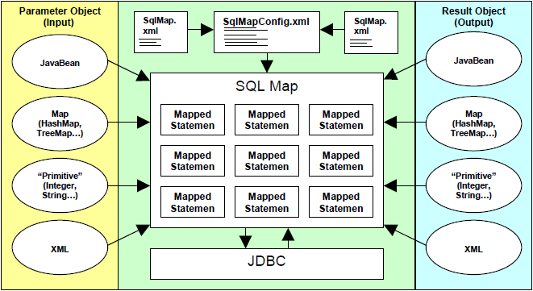

# Data Access 서비스

## 개요

 Data Access 서비스는 다양한 데이터베이스 솔루션 및 데이터베이스 접근 기술에 일관된 방식으로 대응하기 위한 서비스로서,데이터를 조회하거나 입력, 수정, 삭제하는 기능을 수행하는 메커니즘을 단순화한다. 또한 데이터베이스 솔루션이나 접근 기술이 변경될 경우에도 데이터를 다루는 시스템 영역의 변경을 최소화할 수 있도록 데이터베이스와의 접점을 추상화하며, 추상화된 데이터 접근 방식을 템플릿(Template)으로 제공함으로써, 개발자들의 업무 효율을 향상시킨다.

### iBATIS 프레임워크

 전자정부 프레임워크에서는 JDBC 를 사용한 Data Access 를 추상화하여 간편하고 쉽게 사용할 수 있는 Data Mapper framework 인 iBATIS 를 Data Access 기능의 기반 오픈 소스로 채택하였다. iBATIS 를 사용하면 관계형 데이터베이스에 억세스하기 위해 필요한 일련의 자바 코드 사용을 현저히 줄일 수 있으며 간단한 XML 기술을 사용하여 SQL 문을 JavaBeans (또는 Map) 에 간편하게 맵핑할 수 있다.

- 추상화된 접근 방식 제공 : JDBC 데이터 억세스에 대한 추상화된 접근 방식으로 간편하고 쉬운 API, 자원 연결/해제, 공통 에러 처리 등을 통합 지원한다.
- 코드로부터 SQL 분리 지원 : 소스코드로부터 SQL 문을 분리하여 별도의 repository(의미있는 문법의 XML)에 유지하고 이에 대한 빠른 참조구조를 내부적으로 구현하여 관리/유지보수/튜닝의 용이성을 보장한다.
- 쿼리 실행의 입/출력 객체 바인딩/맵핑 지원 : 쿼리문의 입력 파라메터에 대한 바인딩과 실행결과 resultset 의 가공(맵핑) 처리시 객체(VO, Map, List) 수준의 자동화를 지원한다.
- Dynamic SQL 지원 : 코드 작성, API 직접 사용없이 입력 조건에 따른 동적인 쿼리문 변경을 지원한다.
- 다양한 DB 처리 지원 : 기본 질의 외에 Batch SQL, Paging, Callable Statement, BLOB/CLOB 등 다양한 DB처리를 지원한다.

#### 세부 사항 설명

- [iBATIS Configuration](./dataaccess-ibatis_configuration.md)
- [Spring iBATIS Integration](./dataaccess-spring_ibatis_integration.md)
- [Data Type](./dataaccess-data_type.md)
- [parameterMap](./dataaccess-parametermap.md)
- [Inline parameters](./dataaccess-inline_parameters.md)
- [resultMap](./dataaccess-resultmap.md)
- [Dynamic SQL](./dataaccess-dynamic_sql.md)

 iBATIS Data Mapper API 는 XML을 사용하여 SQL 문에 대한 객체 맵핑을 간편하게 기술할 수 있도록 지원하며, 자바빈즈 객체와 Map 구현체, 다양한 원시 래퍼 타입(String, Integer..) 등을 PreparedStatement 의 파라메터나 ResultSet에 대한 결과 객체로 쉽게 맵핑해준다.

 

- 파라메터 객체를 제공한다. (마찬가지로 자바빈즈, Map 또는 원시 래퍼 일 수 있다.) 파라메터 객체는 update 문, 쿼리의 where 절의 input 변수로 세팅될 것이다.
- mapped statement 를 실행한다. Data Mapper 프레임워크는 PreparedStatement 의 인스턴스를 생성하여 위에서 제공된 파라메터 객체를 이용해 파라메터를 세팅하고(바인드 변수처리),쿼리문을 실행하고 결과를 ResultSet 으로 부터 결과 객체로 작성한다.
- update 문의 경우에는 변경 반영된 rows 수를 리턴하고, 조회의 경우 단건 조회 용 single 객체 또는 여러건 조회를 위한 Collection (객체의 List) 을 리턴하게 된다. 파라메터 객체와 마찬가지로 결과 객체의 JavaBean 이나 Map, primitive type wrapper 또는 XML 문서가 될 수 있다.

## 설명

 Data Access 서비스에 대한 자세한 설명에 앞서 간단하게 Data Access 서비스를 시작하는데 필요한 것에 대한 설명을 하고자 한다.

### Step1. 사전 준비

#### 필요 Library

 본 서비스를 활용하기 위해서 필요한 Library 목록과 설명은 아래와 같다.

| 라이브러리 | 설 명 | 연관 라이브러리 |
| --- | --- | --- |
| ibatis-sqlmap-2.3.4.726.jar | iBATIS 라이브러리(필수) |  |
| commons-dbcp-1.2.2.jar | database connection pooling 지원 라이브러리(선택) |  |
| commons-logging-1.1.1.jar | commons 로깅(선택) |  |
| log4j-1.3alpha-8.jar | log4j(선택) |  |
| oscache-2.4.jar | 중앙집중 또는 분산 캐슁 지원(선택) |  |
| cglib-nodep-2.1\_3.jar | Runtime Bytecode Enhancing 필요 시(선택) |  |

 ibatis-sqlmap-2.3.4.726.jar 만이 필수 라이브러리이다. 그러나 일반적으로 commons-dbcp 와 같은 커넥션풀링 라이브러리 및 로깅 처리를 위한 라이브러리는 반드시 필요로 하며, 추가적으로 iBATIS 에서 지원하는 개선된 기능으로 cache 지원 이나 Runtime Bytecode Enhancement 관련 기능을 쓰고자 할 경우는 위의 참조 라이브러리를 추가로 설정할 수 있다. 또한 우리는 Spring-iBATIS 연동 형태의 어플리케이션 개발을 선호하므로 Spring 관련 라이브러리 및 이에 대한 dependency 라이브러리가 일반적으로 함께 포함될 것이다. 여기에 덧붙여 실제 Data Access 처리의 대상의 되는 DBMS(Oracle, Mysql, Hsqldb, Tibero ..) 에 따라 적절한 jdbc 드라이버에 대한 라이브러리가 추가적으로 필요하다.

### Step2. sql-map-config.xml 설정 및 기본 Spring 설정

 Spring 프레임워크 기반 어플리케이션에서 iBATIS 를 연동하여 사용하고자 하는 경우 Spring의 SqlMapClientFactoryBean 에 대한 설정이 필요하며 여기서는 실제 대상 sql-map-config 설정 파일과 iBATIS 에 제공될 dataSource 에 대한 설정을 지시한다.

```xml
<!-- SqlMap setup for iBATIS Database Layer -->
<bean id="sqlMapClient" class="egovframework.rte.psl.orm.ibatis.SqlMapClientFactoryBean">
    <property name="configLocation" value="classpath:/META-INF/sqlmap/sql-map-config.xml"/>
    <property name="dataSource" ref="dataSource"/>
</bean>
```

- Spring 연동 기능을 사용하면 iBATIS 의 SqlMapClient(a thread safe client for SQL Maps) 를 별도의 iBATIS API 없이도 얻을 수 있게 된다.
- 실행환경 3.5 부터는 Spring 4 변경에 따라 org.springframework.orm.ibatis.SqlMapClientFactoryBean 클래스가 egovframework.rte.psl.orm.ibatis.SqlMapClientFactoryBean 로 변경된다.

 아래는 주된 iBATIS 의 SQL Map XML Configuration 파일(sql-map-config.xml 설정 파일)이다. iBATIS 단독으로 쓰일 때는 transactionManager, dataSource 설정 등을 추가로 포함해야 하지만 Spring 연동 환경에서는 이 부분은 Spring 이 넘겨주는 dataSource 를 자동으로 사용하게 되고 transaction 관리는 비즈니스 서비스 영역에 선언적으로 설정하여 iBATIS 관련 모듈에서는 고민할 필요가 없게 된다.

```xml
<?xml version="1.0" encoding="UTF-8"?>

    <!DOCTYPE sqlMapConfig PUBLIC "-//ibatis.apache.org//DTD SQL Map Config 2.0//EN" 
    "http://ibatis.apache.org/dtd/sql-map-config-2.dtd">
 
<sqlMapConfig>
	<settings useStatementNamespaces="false" 
		  ..
	/>
 
	<typeHandler javaType="java.util.Calendar" jdbcType="TIMESTAMP"
		callback="egovframework.rte.psl.dataaccess.typehandler.CalendarTypeHandler" />
 
	<sqlMap resource="META-INF/sqlmap/mappings/testcase-basic.xml" />
	<sqlMap ../>
	..
</sqlMapConfig>
```

- sqlMapConfig : iBATIS 설정 파일의 root 태그
- settings : 다양한 옵션 설정을 지시할 수 있는 태그 (ex. cacheModel 사용여부, Runtime Bytecode Enhance 사용여부, 쿼리문에 대한 Namespace 사용여부 등의 옵션 설정 가능. cf. transaction/dataSource 연결 관련한 설정은 Spring 연동 환경에서는 필요 없음.)
- typeHandler : javaType ↔ jdbcType 간의 type 변환 처리가 별도로 필요한 경우 typeHandler 를 구현하고 이를 sql-map-config 에 등록함.
- typeAlias : global 하게 사용할 typeAlias (클래스 풀 패키지명에 대한 간략한 별칭) 를 지정할 수 있음.
- sqlMap : 각 SQL Mapping XML 파일을 등록함. classpath 나 url 로부터 해당 자원을 stream 형식으로 로딩하게 됨. resource 속성은 기본으로 classpath 경로를 바라본다.

 Spring 2.5.5 이상, iBATIS 2.3.2 이상 인 경우에는 iBATIS 연동을 위한 SqlMapClientFactoryBean 정의 시 mappingLocations 속성으로 Sql 매핑 파일에 대한 패턴 표현식으로 일괄 지정도 가능하다. mappingLocations 속성 사용 예는 다음과 같다.

```xml
	<!-- SqlMap setup for iBATIS Database Layer -->
	<bean id="sqlMapClient" class="egovframework.rte.psl.orm.ibatis.SqlMapClientFactoryBean">
		<property name="configLocation" value="classpath:/META-INF/sqlmap/sql-map-config.xml"/>
		<!-- Java 1.5 or higher and iBATIS 2.3.2 or higher REQUIRED -->
     		<property name="mappingLocations" value="classpath:/META-INF/sqlmap/mappings/**/*.xml" />
		<property name="dataSource" ref="dataSource"/>
	</bean>
```

 이 경우는 “configLocation” 속성이 필요하지 않지만, 현재 해당 속성이 없는 경우 SqlMapClientFactoryBean의 초기화되지 않기 때문에 “configLocation” 속성을 유지하셔야 한다. 이 때 해당 sql-map-config.xml은 다음과 같이 dummy.xml query를 갖도록 처리하여야 한다.

```xml
<?xml version="1.0" encoding="UTF-8"?>
<!DOCTYPE sqlMapConfig PUBLIC "-//ibatis.apache.org//DTD SQL Map Config 2.0//EN" 
"http://ibatis.apache.org/dtd/sql-map-config-2.dtd">
 
<sqlMapConfig>
	<sqlMap resource="sqlmap/sql/common/dummy.xml"/>
</sqlMapConfig>
```

 dummy.xml은 다음과 같이 처리한다.

```xml
<?xml version="1.0" encoding="UTF-8"?>
<!DOCTYPE sqlMap PUBLIC "-//iBATIS.com//DTD SQL Map 2.0//EN" "http://www.ibatis.com/dtd/sql-map-2.dtd">
 
<sqlMap namespace="Dummy">
</sqlMap>
```

### Step3. sql mapping xml 설정

 iBATIS 에서 정의한 SQL Map 문서 구조 내에서 다양한 옵션 설정과 Mapped statement 정의를 작성하게 된다. 아래는 부서정보에 대한 CRUD 와 관련한 쿼리와 이에 대한 In/Out 객체 맵핑을 포함하는 간략한 매핑 파일이다.

```xml
<?xml version="1.0" encoding="UTF-8"?>
<!DOCTYPE sqlMap PUBLIC "-//iBATIS.com//DTD SQL Map 2.0//EN" "http://www.ibatis.com/dtd/sql-map-2.dtd">
 
<sqlMap namespace="Dept">
 
	<typeAlias alias="deptVO" type="egovframework.DeptVO" />
 
	<resultMap id="deptResult" class="deptVO">
		<result property="deptNo" column="DEPT_NO" />
		<result property="deptName" column="DEPT_NAME" />
		<result property="loc" column="LOC" />
	</resultMap>
 
	<insert id="insertDept" parameterClass="deptVO">
		insert into DEPT
		           (DEPT_NO,
		            DEPT_NAME,
		            LOC)
		values     (#deptNo#,
		            #deptName#,
		            #loc#)
	</insert>
 
	<select id="selectDept" parameterClass="deptVO" resultMap="deptResult">
		<![CDATA[
			select DEPT_NO,
			       DEPT_NAME,
			       LOC
			from   DEPT
			where  DEPT_NO = #deptNo#
		]]>
	</select>
 
	<update id="updateDept" parameterClass="deptVO">
		update DEPT
		set    DEPT_NAME = #deptName#,
		       LOC = #loc#
		where  DEPT_NO = #deptNo#
	</update>
 
	<delete id="deleteDept" parameterClass="deptVO">
		delete from DEPT
		where       DEPT_NO = #deptNo#
	</delete>
 
	<select id="selectDeptList" parameterClass="deptVO" resultMap="deptResult">
		<![CDATA[
			select DEPT_NO,
			       DEPT_NAME,
			       LOC
			from   DEPT
			where  1 = 1
		]]>
		<isNotNull prepend="and" property="deptNo">
			DEPT_NO = #deptNo#
		</isNotNull>
		<isNotNull prepend="and" property="deptName">
			DEPT_NAME LIKE '%' || #deptName# || '%'
		</isNotNull>
	</select>
 
</sqlMap>
```

- typeAlias : 현재 매핑 파일내에서 객체에 대한 간략한 alias 명을 지정함.
- resultMap : DB 의 칼럼명과 객체의 Attribute 명에 대한 매핑을 작성함. javaType, jdbcType, columnIndex, typeHandler 등 다양한 추가 옵션 지정이 가능함.
- insert : 입력 쿼리(insert 문)에 대한 Mapped Statement 정의 태그
- select : 조회 쿼리에 대한 Mapped Statement 정의 태그
- update : 수정 쿼리(update 문)에 대한 Mapped Statement 정의 태그
- delete : 삭제 쿼리(delete 문)에 대한 Mapped Statement 정의 태그

 위의 CRUD 관련 매핑 파일에서는 기본으로 DeptVO 라는 JavaBeans 객체를 Parameter/Result 객체로 사용하고 있으며 이를 typeAlias 로 간략하게 지정하여 사용하고 있다. 위에서는 주로 parameterClass 로 지정하여 파라메터 객체에 대한 명시적 사용을 지시하고 있으며, 실제 바인드 변수 처리 시에는 #attribute명# 과 같이 Inline Parameter 형식을 사용하였다. 또한 resultMap 정의를 통하여 ResultSet 에 따른 결과 칼럼정보에 대한 결과 객체(DeptVO)의 필드별 매핑을 별도로 정의하였고 이를 select 문의 resultMap 속성에 명시하여 select 의 결과를 resultMap 을 통해 처리하고 있다. 이러한 방식 외에 다양한 방식으로 Mapped Statement 처리를 정의할 수 있으나, 위와 같이 JavaBeans 객체를 사용하고 또 resultMap 을 정의하여 결과객체 처리를 하며 Inline Parameter 방식으로 바인드 변수 처리하는 스타일로 사용하기를 권고하는 바이다.

### Step4. DAO 클래스 생성

 간단한 형태의 DAO 클래스를 생성한다. 아래의 DAO 에서 상속하고 있는 EgovAbstractDAO 에서는 SqlMapClientDaoSupport 를 extends 하고 있으며 iBATIS SQL Map 상호 작용을 위한 기본 클래스인 SqlMapClient (위에서 “sqlMapClient” 로 정의한 iBATIS 연동 FactoryBean 에 의해 제공됨) 에 대한 injection 처리가 내부적으로 적용되어 있고, 기본 CRUD 에 대한 iBATIS 실행을 위해서는 간략한 메서드 래핑도 제공한다. 상세 API 를 사용하고자 하는 경우 getSqlMapClientTemplate() 를 통해(ex. getSqlMapClientTemplate().queryWithRowHandler(“selectEmpListToOutFileUsingRowHandler”, paramObject, rowHandler); ) 사용할 수 있다.

#### DAO 클래스

```java
..
 
@Repository("deptDAO")
public class DeptDAO extends EgovAbstractDAO {
 
    public void insertDept(DeptVO vo) {
        insert("insertDept", vo);
    }
 
    public int updateDept(DeptVO vo) {
        return update("updateDept", vo);
    }
 
    public int deleteDept(DeptVO vo) {
        return delete("deleteDept", vo);
    }
 
    public DeptVO selectDept(DeptVO vo) {
        return (DeptVO)selectByPk("selectDept", vo);
    }
 
    @SuppressWarnings("unchecked")
    public List<DeptVO> selectDeptList(DeptVO searchVO) {
        return list("selectDeptList", searchVO);
    }
}

```

- @Repository : DAO 에 대한 @Repository 스테레오 타입 Annotation 을 사용한 Spring Bean 정의

 각 CRUD 에 관련한 메서드에서는 queryId 와 파라메터 객체(여기서는 DeptVO) 를 인자로 iBATIS 의 Mapped Statement 을 실행하고 있으며, 조회의 경우에는 단건 조회는 DeptVO 객체로, 리스트 조회는 DeptVO 에 대한 List 를 돌려주도록 하고 있다. iBATIS 내부적으로는 java 1.5 이상의 Generics (type 이 정의된 Collection 처리) 로 처리하지 않으나 sql 매핑 파일에 따라 실제 데이터는 List&lt;DeptVO&gt; 로 처리가 될 것이므로 @SuppressWarnings(“unchecked”) 을 지시하여 호출 이전 모듈에서는 불필요한 Type Casting 을 최소화하고 있다. 만약 sql-map-config.xml 의 settings 옵션으로 useStatementNamespaces=“true” 를 설정한 경우라면 위의 queryId 는 “Dept.insertDept” 와 같이 sql 맵핑 파일에 지정한 Namespace prefix 을 포함하는 형태여야 함에 유의한다.

### Step5. 테스트 클래스 생성

 위에서 정의한 설정 파일 및 DAO 를 이용하여 간단한 입력,조회 처리에 대한 JUnit TestCase 형태(JUnit 4 스타일)로 구성하였다.

```java
..
 
@RunWith(SpringJUnit4ClassRunner.class)
@ContextConfiguration(locations = {"classpath*:META-INF/spring/context-*.xml" })
@TransactionConfiguration(transactionManager = "txManager", defaultRollback = false)
@Transactional
public class BasicDataAccessTest {
 
    @Resource(name = "dataSource")
    DataSource dataSource;
 
    @Resource(name = "deptDAO")
    DeptDAO deptDAO;
 
    @Before
    public void onSetUp() throws Exception {
        // 외부에 sql file 로부터 DB 초기화 (기존 테이블 삭제/생성)
        SimpleJdbcTestUtils.executeSqlScript(
            new SimpleJdbcTemplate(dataSource), new ClassPathResource(
                "META-INF/testdata/sample_schema_ddl_hsql.sql"), true);
    }
 
    public DeptVO makeVO() {
        DeptVO vo = new DeptVO();
        vo.setDeptNo(new BigDecimal(90));
        vo.setDeptName("test 부서");
        vo.setLoc("test 위치");
        return vo;
    }
 
    public void checkResult(DeptVO vo, DeptVO resultVO) {
        assertNotNull(resultVO);
        assertEquals(vo.getDeptNo(), resultVO.getDeptNo());
        assertEquals(vo.getDeptName(), resultVO.getDeptName());
        assertEquals(vo.getLoc(), resultVO.getLoc());
    }
 
    @Test
    public void testBasicInsert() throws Exception {
        DeptVO vo = makeVO();
 
        // insert
        deptDAO.insertDept(vo);
 
        // select
        DeptVO resultVO = deptDAO.selectDept(vo);
 
        // check
        checkResult(vo, resultVO);
    }
 
    @Test
    public void testBasicUpdate() throws Exception {
        DeptVO vo = makeVO();
 
        // insert
        deptDAO.insertDept(vo);
 
        // data change
        vo.setDeptName("upd Dept");
        vo.setLoc("upd loc");
 
        // update
        int effectedRows = deptDAO.updateDept(vo);
        assertEquals(1, effectedRows);
 
        // select
        DeptVO resultVO = deptDAO.selectDept(vo);
 
        // check
        checkResult(vo, resultVO);
    }
 
    @Test
    public void testBasicDelete() throws Exception {
        DeptVO vo = makeVO();
 
        // insert
        deptDAO.insertDept(vo);
 
        // delete
        int effectedRows = deptDAO.deleteDept(vo);
        assertEquals(1, effectedRows);
 
        // select
        DeptVO resultVO = deptDAO.selectDept(vo);
 
        // null 이어야 함
        assertNull(resultVO);
    }
 
    @Test
    public void testBasicSelectList() throws Exception {
        DeptVO vo = makeVO();
 
        // insert
        deptDAO.insertDept(vo);
 
        // 검색조건으로 key 설정
        DeptVO searchVO = new DeptVO();
        searchVO.setDeptNo(new BigDecimal(90));
 
        // selectList
        List<DeptVO> resultList = deptDAO.selectDeptList(searchVO);
 
        // key 조건에 대한 결과는 한건일 것임
        assertNotNull(resultList);
        assertTrue(resultList.size() > 0);
        assertEquals(1, resultList.size());
        checkResult(vo, resultList.get(0));
 
        // 검색조건으로 name 설정 - '%' || #deptName# || '%'
        DeptVO searchVO2 = new DeptVO();
        searchVO2.setDeptName(""); // '%' || '' || '%' --> '%%'
 
        // selectList
        List<DeptVO> resultList2 = deptDAO.selectDeptList(searchVO2);
 
        // like 조건에 대한 결과는 한건 이상일 것임
        assertNotNull(resultList2);
        assertTrue(resultList2.size() > 0);
 
    }
}

```

 기본적으로 Annotation 형식 Bean 생성 및 Dependency Injection 을 적용한 Spring 기반의 어플리케이션으로 구성하였으며, dataSource, transactionManager 등의 Spring Bean 이 함께 사용되고 있고, 테스트 케이스는 JUnit 4 형식으로 Spring 설정 파일 로딩 및 transactionManager, dataSource(DB 초기화를 위해 SimpleJdbcTemplate 사용 시 참조)를 얻을 수 있도록 되어 있음을 참고한다. 테스트 편의를 위해 매 테스트 메서드에 우선하여 @Before 로 정의된 메서드에서 기존 테이블 삭제 및 재생성 처리를 하고 있으며, makeVO 라는 별도 메서드로 테스트용 VO 작성 부분을 분리하고, checkResult 라는 메서드로 original VO 와 조회 결과 resultVO 에 대한 assert 비교 로직을 분리하여 재사용하고 있다. @Test 로 지시한 각 메서드가 테스트 메서드이고 입력-조회-결과체크, 입력-변경-조회-결과체크, 입력-삭제-조회-null체크, 검색조건 설정-조회-결과체크 의 flow 에 대한 검증으로 DeptDAO 에 대한 기본 CRUD 테스트 로직을 구성하였다.

### Step6. 실 행

-  파일을 다운로드 받아서 압축을 푼다.
- 이클립스에서 압축 푼 폴더를 선택하여 프로젝트를 Import 한다.
- 프로젝트내 src 폴더에 DeptVO.java, DeptDAO.java, BasicDataAccessTest.java, Spring, iBATIS 설정파일 및 Sql 맵핑파일, 테스트 데이터용 초기화 스크립트 파일 및 log4j.xml 가 정상적으로 있는지 확인한다.
- lib에 라이브러리 파일이 있는지 확인한다.
- BasicDataAccessTest.java를 선택하여 마우스 오른쪽 클릭하여 Run As > JUnit Test 실행한다.
- JUnit 결과창에서 정상적으로 수행된 것을 확인한다.

 ※ 해당 프로젝트는 Hsqldb (현재 메모리구동 방식)을 사용하고 있으나 다른 DBMS 를 쓰고자 하는 경우 jdbc.properties 에 관련 접속정보를 추가하고 JDBC 드라이버 jar 파일을 라이브러리로 추가하여 테스트 해 볼 수 있다.

## 참고 자료

- [http://ibatis.apache.org](http://ibatis.apache.org)
- [iBATIS-SqlMaps-2 Developer Guide](https://ibatis.apache.org/docs/java/pdf/iBATIS-SqlMaps-2_en.pdf)
- [iBATIS-SqlMaps-2 개발자 가이드 (이동국님 번역)](https://ibatis.apache.org/docs/java/pdf/iBATIS-SqlMaps-2_ko.pdf)
- [Spring Framework - Reference Documentation](http://static.springframework.org/spring/docs/2.5.6/reference/orm.html#orm-ibatis)