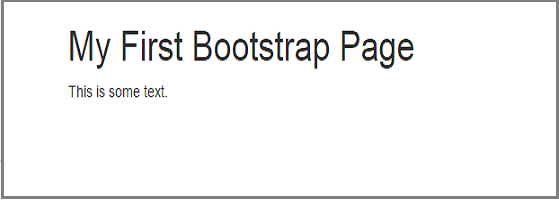
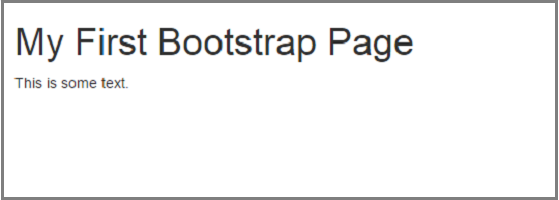
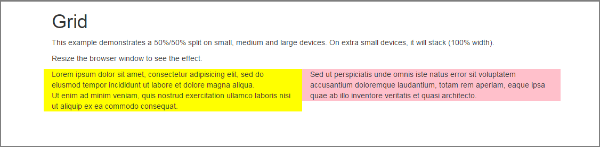
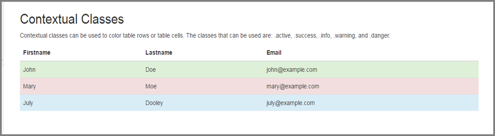
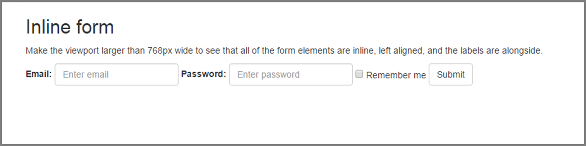
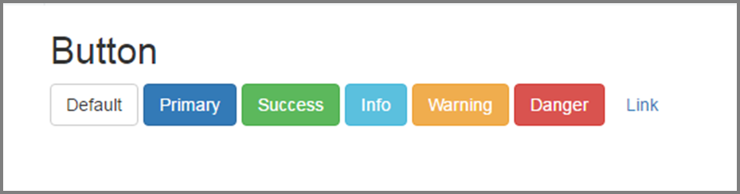
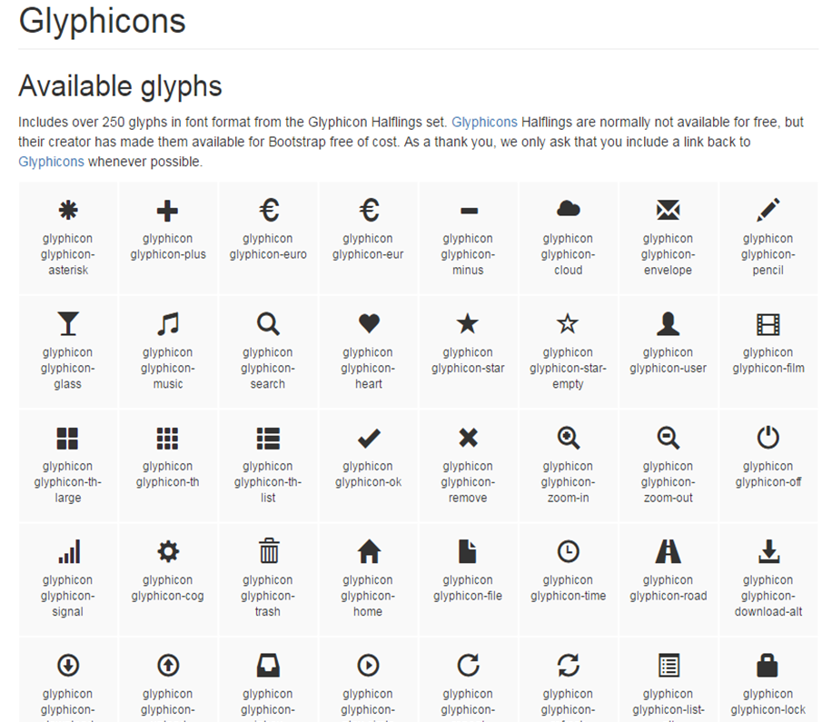
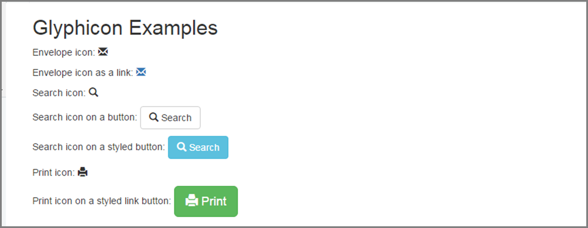
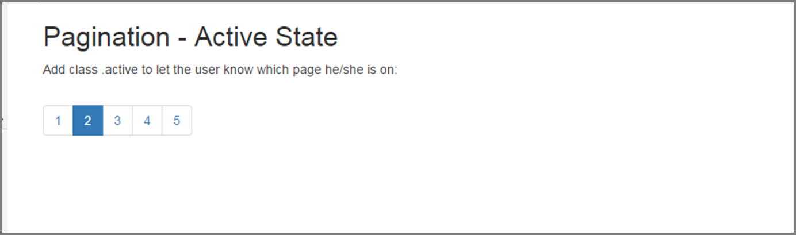
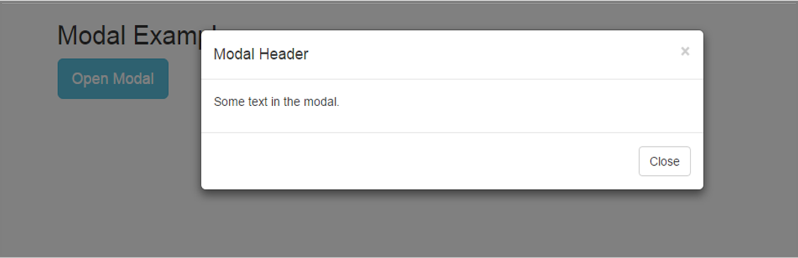

# UI - bootstrap

## 개요

부트스트랩(Bootstrap)은 웹디자인을 쉽게 하기 위해 트위터에서 오픈 소스로 공개한 프런트 엔드 프레임워크로, 유연한 HTML, CSS, JavaScript 템플릿과 UI컴포넌트, 인터렉션을 제공하여 손 쉽게 웹 사이트를 구축할 수 있는 시작점이 된다.

부트스트랩의 장점은 크게 다음과 같다.

- 부트스트랩 3 이후부터 모바일 중심의 프레임워크이다
- 다양한 브라우저들을 지원한다.
- 반응형 웹에 최적화 되어있다. 부트스트랩은 스마트폰, 태블릿, 데스크탑에 최적화 되어 css가 조정이 된다.
- 시작이 용이하다. HTML, CSS만 알고 있어도 부트스트랩의 사용이 가능하다.

이러한 장점들로 인해 표준프레임워크에서는 실행환경 UI로 bootstrap을 선정하였다.

본 가이드에서는 부트스트랩의 기본적인 소개와 몇 가지의 예제를 제공한다.

자세한 내용은 부트스트랩 사이트의 [가이드](http://getbootstrap.com/)나 w3schools의 [튜토리얼](http://www.w3schools.com/bootstrap/bootstrap_get_started.asp)을 참조하도록 한다.

## 시작하기

부트스트랩을 사용하기 위해서는 부트스트랩 관련 CSS와 JavaScript를 추가해 주어야 한다. 추가하는 방법은 두가지로 부트스트랩을 다운로드 하여 사용하거나, 다운로드 하지 않을 경우 CDN 링크를 추가하여 사용 한다.

※ 주의사항 : 부트스트랩을 사용하려면 **jQuery**가 필요하므로 반드시 별도로 추가하여 주어야 한다.

- 다운로드
  - [부트스트랩 사이트](http://getbootstrap.com/getting-started/#download)의 메뉴 중 시작하기 > 다운로드 항목에서 원하는 종류의 다운로드를 진행한다.
  - 부트스트랩 사이트에서는 여러가지 다운로드를 제공하는데, 본 가이드에서는 **프리컴파일 된 부트스트랩**을 다운로드하여 진행하였다.
    - 프리컴파일 된 부트스트랩 : 컴파일되고 최소화된 CSS, 자바스크립트, 폰트 제공. 문서나 원본 파일들은 포함되어 있지 않음
- 부트스트랩 CDN
  - MaxCDN에서 부트스트랩의 CSS 와 자바스크립트를 CDN으로 지원한다. 이를 사용하려면, 아래의 부트스트랩 CDN 링크들을 추가하면 사용할 수 있다. 자세한 내용은 다음 [링크(download-cdn)](http://getbootstrap.com/getting-started/#download-cdn)를 확인 한다.

```html
<!-- 최신 컴파일 및 최소화된 최신 CSS -->
<link rel="stylesheet" href="https://maxcdn.bootstrapcdn.com/bootstrap/3.3.6/css/bootstrap.min.css" 
        integrity="sha384-1q8mTJOASx8j1Au+a5WDVnPi2lkFfwwEAa8hDDdjZlpLegxhjVME1fgjWPGmkzs7" crossorigin="anonymous">

<!-- 옵션 테마 -->
<link rel="stylesheet" href="https://maxcdn.bootstrapcdn.com/bootstrap/3.3.6/css/bootstrap-theme.min.css" 
        integrity="sha384-fLW2N01lMqjakBkx3l/M9EahuwpSfeNvV63J5ezn3uZzapT0u7EYsXMjQV+0En5r" crossorigin="anonymous">


<!-- jQuery library 부트스트랩을 사용하려면 jQuery가 필요함-->
<script src="https://ajax.googleapis.com/ajax/libs/jquery/1.12.2/jquery.min.js"></script>


<!-- 최신 컴파일 및 최소화된 자바스크립트 -->
<script src="https://maxcdn.bootstrapcdn.com/bootstrap/3.3.6/js/bootstrap.min.js" 
        integrity="sha384-0mSbJDEHialfmuBBQP6A4Qrprq5OVfW37PRR3j5ELqxss1yVqOtnepnHVP9aJ7xS" crossorigin="anonymous"></script>
```

### 파일 구조

프리 컴파일 된 부트스트랩을 다운로드하고, 압축을 해제하면 다음과 같은 구조를 볼 수 있다.

```
bootstrap/
├── css/
│   ├── bootstrap.css
│   ├── bootstrap.css.map
│   ├── bootstrap.min.css
│   ├── bootstrap-theme.css
│   ├── bootstrap-theme.css.map
│   └── bootstrap-theme.min.css
├── js/
│   ├── bootstrap.js
│   └── bootstrap.min.js
└── fonts/
    ├── glyphicons-halflings-regular.eot
    ├── glyphicons-halflings-regular.svg
    ├── glyphicons-halflings-regular.ttf
    ├── glyphicons-halflings-regular.woff
    └── glyphicons-halflings-regular.woff2
```

위의 구조는 어느 웹프로젝트에도 쉽게 적용하기 위한 가장 기본적인 형태다. 컴파일 된 CSS와 JavaScript(bootstrap.*)를 제공하고, 컴파일 되고 최소화된 CSS와 JavaScript(bootstrap.min.*) 도 제공한다.

그리고 Glyphicons 의 폰트 파일들과 부가적인 부트스트랩 테마 파일들도 같이 존재한다.

## 부트스트랩의 특징

### HTML5

부트스트랩은 HTML5의 HTML요소와 CSS속성을 요구하기 때문에 HTML5 doctype을 사용해야 한다. 항상 페이지의 시작부분에 **HTML5 doctype**과 `<head>`내에 **lang** 속성과 **character set**을 추가해 주어야 한다.

```html
<!DOCTYPE html>
<html lang="ko">
  <head>
    <meta charset="utf-8"> 
  </head>
</html>
```

### 모바일 친화적

부트스트랩2 에서는 모바일 친화적인 스타일을 프레임워크의 core로 추가했는데, 부트스트랩3 부터는 시작부터 모바일 친화적으로 설계 되었다.

다음은 페이지의 렌더링과 확대/축소를 사용하기 위한 것으로, `<head>` 내에 `viewport` 메타 태그를 추가한다.

```html
<meta name="viewport" content="width=device-width, initial-scale=1">
```

- **width=device-width**
  - device의 화면 폭(width)에 따라 페이지의 화면 폭을 설정한다.(device마다 달라짐)
- **initial-scale=1**
  - 페이지가 처음 브라우저에 로드 될 때 초기 zoom level을 설정한다.
- **user-scalable=no**
  - 모바일 기기의 Zoom기능을 끌 수 있다.

### 컨테이너

부트스트랩은 사이트 전체의 콘텐츠를 감싸는 컨테이너 요소가 필요하다.

다음의 두 예제는 컨테이너에 대한 예제이다.

※ jsfiddle.net을 이용하여 아래의 예제코드를 실행 결과를 링크로 제공.

#### 예제 1 : container

```html
<!DOCTYPE html>
<html lang="ko">
   <head>
      <title>Bootstrap Example</title>
      <meta charset="utf-8">
      <meta name="viewport" content="width=device-width, initial-scale=1">
      <link rel="stylesheet" href="https://maxcdn.bootstrapcdn.com/bootstrap/3.3.6/css/bootstrap.min.css" 
         integrity="sha384-1q8mTJOASx8j1Au+a5WDVnPi2lkFfwwEAa8hDDdjZlpLegxhjVME1fgjWPGmkzs7" crossorigin="anonymous">
      <script src="https://ajax.googleapis.com/ajax/libs/jquery/1.12.2/jquery.min.js"></script>
      <script src="https://maxcdn.bootstrapcdn.com/bootstrap/3.3.6/js/bootstrap.min.js" 
         integrity="sha384-0mSbJDEHialfmuBBQP6A4Qrprq5OVfW37PRR3j5ELqxss1yVqOtnepnHVP9aJ7xS" crossorigin="anonymous"></script>
   </head>
   <body>
      <div class="container">
         <h1>My First Bootstrap Page</h1>
         <p>This is some text.</p>
      </div>
   </body>
</html>
```

결과 보기 : [https://jsfiddle.net/ymxvbzo7/?utm_source=website&utm_medium=embed&utm_campaign=ymxvbzo7](https://jsfiddle.net/ymxvbzo7/?utm_source=website&utm_medium=embed&utm_campaign=ymxvbzo7)

#### 예제 2 : container-fluid

```html
<!DOCTYPE html>
<html lang="ko">
   <head>
      <title>Bootstrap Example</title>
      <meta charset="utf-8">
      <meta name="viewport" content="width=device-width, initial-scale=1">
      <link rel="stylesheet" href="https://maxcdn.bootstrapcdn.com/bootstrap/3.3.6/css/bootstrap.min.css" 
         integrity="sha384-1q8mTJOASx8j1Au+a5WDVnPi2lkFfwwEAa8hDDdjZlpLegxhjVME1fgjWPGmkzs7" crossorigin="anonymous">
      <script src="https://ajax.googleapis.com/ajax/libs/jquery/1.12.2/jquery.min.js"></script>
      <script src="https://maxcdn.bootstrapcdn.com/bootstrap/3.3.6/js/bootstrap.min.js" 
         integrity="sha384-0mSbJDEHialfmuBBQP6A4Qrprq5OVfW37PRR3j5ELqxss1yVqOtnepnHVP9aJ7xS" crossorigin="anonymous"></script>
   </head>
   <body>
      <div class="container-fluid">
         <h1>My First Bootstrap Page</h1>
         <p>This is some text.</p>
      </div>
   </body>
</html>
```

결과 보기 : [https://jsfiddle.net/y1hL9vqd/1/?utm_source=website&utm_medium=embed&utm_campaign=y1hL9vqd](https://jsfiddle.net/y1hL9vqd/1/?utm_source=website&utm_medium=embed&utm_campaign=y1hL9vqd)





위의 그림처럼 두 예제의 결과보기의 화면의 폭을 좌우로 늘려보면, 두 예제의 차이점을 알 수 있다.

첫번째 예제는 고정 폭 컨테이너(`<div class="container">`)를 사용하였고, 두번째 예제는 최대 폭 컨테이너(`<div class="container-fluid">`)를 사용한 예제이다.

그 밖에 세부 내용은 [링크](http://getbootstrap.com/css/#overview-container)를 참조하도록 한다.

### 그리드 시스템

부트스트랩은 반응형, 페이지 레이아웃을 위해 자체적인 그리드 레이아웃 시스템을 제공한다.

부트스트랩의 그리드 시스템은 **12열의 그리드**(12-column grid)로 구성되어 있으며, device나 viewport의 크기에 따라 자동으로 열이 적절한 크기로 배열되게 한다.

#### 고려사항

- 행(row)은 반드시 **.container**(고정폭) 나 **.container-fluid**(전체폭) 안에 위치해야 한다.
- 열(column)들은 수평그룹을 만드는데 행을 이용한다.
- 콘텐츠는 열 안에 위치해야 한다. 그리고 열 들만이 행의 바로 아래에 올 수 있다.
- **.row**와 **.col-xs-4** 같은 사전 정의된 그리드 클래스들을 통해 간편하게 그리드 레이아웃 만들 수 있다.
- 열은 **padding** 으로 여백을 줄 수 있다. 패딩은 행 내에서 첫 열과 마지막 열을 위해 **.row** 내에 음수 마진으로 offset 되어 있다.
- 그리드 열은 **12**개의 가능한 열들을 원하는 만큼 명시하는 것으로 만들어진다.( ex) 같은 크기의 3개 열 : **.col-xs-4** 를 3개 사용)

기타사항은 [링크](http://getbootstrap.com/css/#grid-intro) 내용을 참조하도록 한다.

#### 그리드 옵션

|             | 매우 작은 기기 모바일 폰( &lt; 768px)  | 작은 기기 태블릿 (≥768px)   | 중간 기기 데스크탑 (≥992px)   | 큰 기기 데스크탑 (≥1200px)   |
|-------------|-----------------------------|----------------------|-----------------------|-----------------------|
|   그리드 적용    |   항상                        |   분기점보다 크면 적용        |
|   컨테이너 너비   |   없음 (auto)                 |   750px              |   970px               |   1170px              |
|   클래스 접두사   |   .col-xs-                  |   .col-sm-           |   .col-md-            |   .col-lg-            |
|   컬럼 수      |   12                        |
|   컬럼 너비     |   Auto                      |   ~62px              |   ~81px               |   ~97px               |
|   사이 너비     |   30px (컬럼의 양쪽에 15px 씩)     |

세부내용은 [링크](http://getbootstrap.com/css/#grid-options)의 표를 참조한다.

#### 기본적인 부트스트랩 그리드 구조

```html
<div class="row">
  <div class="col-sm-4">.col-sm-4</div>
  <div class="col-sm-4">.col-sm-4</div>
  <div class="col-sm-4">.col-sm-4</div>
</div>
```

- 행(row)를 생성해야 한다.(`<div class="row">`)
- 행 안에 적절한 수의 열(column)을 추가한다. (`<div class="col-sm-4">.col-sm-4</div>`)
- 행 안의 열의 수는 항상 12열을 맞춰야 한다.

#### 그리드 예제 : Stacked-to-horizontal

```html
<!DOCTYPE html>
<html lang="ko">
   <head>
      <title>Bootstrap Example</title>
      <meta charset="utf-8">
      <meta name="viewport" content="width=device-width, initial-scale=1">
      <link rel="stylesheet" href="https://maxcdn.bootstrapcdn.com/bootstrap/3.3.6/css/bootstrap.min.css" 
         integrity="sha384-1q8mTJOASx8j1Au+a5WDVnPi2lkFfwwEAa8hDDdjZlpLegxhjVME1fgjWPGmkzs7" crossorigin="anonymous">
      <script src="https://ajax.googleapis.com/ajax/libs/jquery/1.12.2/jquery.min.js"></script>
      <script src="https://maxcdn.bootstrapcdn.com/bootstrap/3.3.6/js/bootstrap.min.js" 
         integrity="sha384-0mSbJDEHialfmuBBQP6A4Qrprq5OVfW37PRR3j5ELqxss1yVqOtnepnHVP9aJ7xS" crossorigin="anonymous"></script>
   </head>
   <body>
      <div class="container">
         <h1>Grid</h1>
         <p>This example demonstrates a 50%/50% split on small, medium and large devices. On extra small devices, it will stack (100% width).</p>
         <p>Resize the browser window to see the effect.</p>
         <div class="row">
            <div class="col-sm-6" style="background-color:yellow;">
               Lorem ipsum dolor sit amet, consectetur adipisicing elit, sed do eiusmod tempor incididunt ut labore et dolore magna aliqua.<br>
               Ut enim ad minim veniam, quis nostrud exercitation ullamco laboris nisi ut aliquip ex ea commodo consequat.
            </div>
            <div class="col-sm-6" style="background-color:pink;">
               Sed ut perspiciatis unde omnis iste natus error sit voluptatem accusantium doloremque laudantium, totam rem aperiam, eaque ipsa quae ab illo inventore veritatis et quasi architecto.    
            </div>
         </div>
      </div>
   </body>
</html>
```




결과 보기 : [https://jsfiddle.net/eh5kmtt9/1/?utm_source=website&utm_medium=embed&utm_campaign=eh5kmtt9](https://jsfiddle.net/eh5kmtt9/1/?utm_source=website&utm_medium=embed&utm_campaign=eh5kmtt9)

결과창의 좌우폭을 확대 및 축소를 해보면, 화면 사이즈에 맞춰서 열(column)이 쌓이거나(stack) 수평이 되게 늘어나는 것을 확인 할 수 있다.이와 같이 손 쉽게 반응형을 지원하고, 페이지 레이아웃을 구성할 수 있다.

그 밖의 예제들은 부트스트랩 사이트 [그리드 부분](http://getbootstrap.com/css/#grid)에서 내용을 확인하도록 한다.

### 다양한 스타일의 CSS

부트스트랩은 깔끔하고 잘 정돈된 느낌의 다양한 스타일의 CSS를 제공한다. 자세한 내용은 [링크](http://getbootstrap.com/css/)의 내용을 확인하도록 한다.

#### 테이블

다음은 부트스트랩에서 제공하는 클래스를 적용한 테이블 예제이다.

```html
<!DOCTYPE html>
<html lang="ko">
   <head>
      <title>Bootstrap Example</title>
      <meta charset="utf-8">
      <meta name="viewport" content="width=device-width, initial-scale=1">
      <link rel="stylesheet" href="https://maxcdn.bootstrapcdn.com/bootstrap/3.3.6/css/bootstrap.min.css" 
         integrity="sha384-1q8mTJOASx8j1Au+a5WDVnPi2lkFfwwEAa8hDDdjZlpLegxhjVME1fgjWPGmkzs7" crossorigin="anonymous">
      <script src="https://ajax.googleapis.com/ajax/libs/jquery/1.12.2/jquery.min.js"></script>
      <script src="https://maxcdn.bootstrapcdn.com/bootstrap/3.3.6/js/bootstrap.min.js" 
         integrity="sha384-0mSbJDEHialfmuBBQP6A4Qrprq5OVfW37PRR3j5ELqxss1yVqOtnepnHVP9aJ7xS" crossorigin="anonymous"></script>
   </head>
   <body>
      <div class="container">
         <h2>Contextual Classes</h2>
         <p>Contextual classes can be used to color table rows or table cells. The classes that can be used are: .active, .success, .info, .warning, and .danger.</p>
         <table class="table">
            <thead>
               <tr>
                  <th>Firstname</th>
                  <th>Lastname</th>
                  <th>Email</th>
               </tr>
            </thead>
            <tbody>
               <tr class="success">
                  <td>John</td>
                  <td>Doe</td>
                  <td>example1@example.com</td>
               </tr>
               <tr class="danger">
                  <td>Mary</td>
                  <td>Moe</td>
                  <td>example2@example.com</td>
               </tr>
               <tr class="info">
                  <td>July</td>
                  <td>Dooley</td>
                  <td>example3@example.com</td>
               </tr>
            </tbody>
         </table>
      </div>
   </body>
</html>
```

결과보기 : [https://jsfiddle.net/r60oymr2/3/?utm_source=website&utm_medium=embed&utm_campaign=r60oymr2](https://jsfiddle.net/r60oymr2/3/?utm_source=website&utm_medium=embed&utm_campaign=r60oymr2)




부트스트랩에서 기본적으로 제공하는 테이블 디자인 중 하나이다.

#### 폼

다음은 부트스트랩에서 제공하는 폼의 예제이다.

```html
<!DOCTYPE html>
<html lang="ko">
   <head>
      <title>Bootstrap Example</title>
      <meta charset="utf-8">
      <meta name="viewport" content="width=device-width, initial-scale=1">
      <link rel="stylesheet" href="https://maxcdn.bootstrapcdn.com/bootstrap/3.3.6/css/bootstrap.min.css" 
         integrity="sha384-1q8mTJOASx8j1Au+a5WDVnPi2lkFfwwEAa8hDDdjZlpLegxhjVME1fgjWPGmkzs7" crossorigin="anonymous">
      <script src="https://ajax.googleapis.com/ajax/libs/jquery/1.12.2/jquery.min.js"></script>
      <script src="https://maxcdn.bootstrapcdn.com/bootstrap/3.3.6/js/bootstrap.min.js" 
         integrity="sha384-0mSbJDEHialfmuBBQP6A4Qrprq5OVfW37PRR3j5ELqxss1yVqOtnepnHVP9aJ7xS" crossorigin="anonymous"></script>
   </head>
   <body>
      <div class="container">
         <h2>Inline form</h2>
         <p>Make the viewport larger than 768px wide to see that all of the form elements are inline, left aligned, and the labels are alongside.</p>
         <form class="form-inline" role="form">
            <div class="form-group">
               <label for="email">Email:</label>
               <input type="email" class="form-control" id="email" placeholder="Enter email">
            </div>
            <div class="form-group">
               <label for="pwd">Password:</label>
               <input type="password" class="form-control" id="pwd" placeholder="Enter password">
            </div>
            <div class="checkbox">
               <label><input type="checkbox"> Remember me</label>
            </div>
            <button type="submit" class="btn btn-default">Submit</button>
         </form>
      </div>
   </body>
</html>
```

결과보기 : [https://jsfiddle.net/4006oqs0/1/?utm_source=website&utm_medium=embed&utm_campaign=4006oqs0](https://jsfiddle.net/4006oqs0/1/?utm_source=website&utm_medium=embed&utm_campaign=4006oqs0)



위의 예제는 인라인 폼(inline form)이 적용 된 예제로, 화면의 폭에 따라 입력창의 위치가 변화한다.

#### 버튼

다음은 부트스트랩에서 제공하는 버튼 디자인이다.

```html
<!DOCTYPE html>
<html lang="ko">
   <head>
      <title>Bootstrap Example</title>
      <meta charset="utf-8">
      <meta name="viewport" content="width=device-width, initial-scale=1">
      <link rel="stylesheet" href="https://maxcdn.bootstrapcdn.com/bootstrap/3.3.6/css/bootstrap.min.css" 
         integrity="sha384-1q8mTJOASx8j1Au+a5WDVnPi2lkFfwwEAa8hDDdjZlpLegxhjVME1fgjWPGmkzs7" crossorigin="anonymous">
      <script src="https://ajax.googleapis.com/ajax/libs/jquery/1.12.2/jquery.min.js"></script>
      <script src="https://maxcdn.bootstrapcdn.com/bootstrap/3.3.6/js/bootstrap.min.js" 
         integrity="sha384-0mSbJDEHialfmuBBQP6A4Qrprq5OVfW37PRR3j5ELqxss1yVqOtnepnHVP9aJ7xS" crossorigin="anonymous"></script>
   </head>
   <body>
      <div class="container">
         <h2>Button</h2>
         <!-- Standard button -->
         <button type="button" class="btn btn-default">Default</button>
         <!-- Provides extra visual weight and identifies the primary action in a set of buttons -->
         <button type="button" class="btn btn-primary">Primary</button>
         <!-- Indicates a successful or positive action -->
         <button type="button" class="btn btn-success">Success</button>
         <!-- Contextual button for informational alert messages -->
         <button type="button" class="btn btn-info">Info</button>
         <!-- Indicates caution should be taken with this action -->
         <button type="button" class="btn btn-warning">Warning</button>
         <!-- Indicates a dangerous or potentially negative action -->
         <button type="button" class="btn btn-danger">Danger</button>
         <!-- Deemphasize a button by making it look like a link while maintaining button behavior -->
         <button type="button" class="btn btn-link">Link</button>
      </div>
   </body>
</html>
```

결과보기 : [https://jsfiddle.net/ysohpdqh/5/?utm_source=website&utm_medium=embed&utm_campaign=ysohpdqh](https://jsfiddle.net/ysohpdqh/5/?utm_source=website&utm_medium=embed&utm_campaign=ysohpdqh)




### 컴포넌트

부트스트랩에서는 iconography, dropdown, input group, navigation, alerts 등의 재사용 가능한 컴포넌트를 제공하고 있다. 본 가이드에서는 몇 가지 컴포넌트만 소개한다.

그 밖의 다른 컴포넌트 들은 [링크](http://getbootstrap.com/components/)를 통해 확인 하도록 한다.

#### Glyphicons

250개 이상의 기호가 Glyphicon Halflings 세트로 폰트 포맷에 포함되어 있다.



##### 사용방법

사용할 부분에 다음 구문을 삽입한다.

```html
<span class="glyphicon glyphicon-search" aria-hidden="true"></span>
```

위의 구문에서 원하는 Glyphicon의 **class**를 교체하여 사용한다.

다음은 Glyphicon을 사용한 예제이다.

```html
<!DOCTYPE html>
<html lang="ko">
   <head>
      <title>Bootstrap Example</title>
      <meta charset="utf-8">
      <meta name="viewport" content="width=device-width, initial-scale=1">
      <link rel="stylesheet" href="https://maxcdn.bootstrapcdn.com/bootstrap/3.3.6/css/bootstrap.min.css" 
         integrity="sha384-1q8mTJOASx8j1Au+a5WDVnPi2lkFfwwEAa8hDDdjZlpLegxhjVME1fgjWPGmkzs7" crossorigin="anonymous">
      <script src="https://ajax.googleapis.com/ajax/libs/jquery/1.12.2/jquery.min.js"></script>
      <script src="https://maxcdn.bootstrapcdn.com/bootstrap/3.3.6/js/bootstrap.min.js" 
         integrity="sha384-0mSbJDEHialfmuBBQP6A4Qrprq5OVfW37PRR3j5ELqxss1yVqOtnepnHVP9aJ7xS" crossorigin="anonymous"></script>
   </head>
   <body>
      <div class="container">
         <h2>Glyphicon Examples</h2>
         <p>Envelope icon: <span class="glyphicon glyphicon-envelope"></span></p>
         <p>Envelope icon as a link:
            <a href="#"><span class="glyphicon glyphicon-envelope"></span></a>
         </p>
         <p>Search icon: <span class="glyphicon glyphicon-search"></span></p>
         <p>Search icon on a button:
            <button type="button" class="btn btn-default">
            <span class="glyphicon glyphicon-search"></span> Search
            </button>
         </p>
         <p>Search icon on a styled button:
            <button type="button" class="btn btn-info">
            <span class="glyphicon glyphicon-search"></span> Search
            </button>
         </p>
         <p>Print icon: <span class="glyphicon glyphicon-print"></span></p>
         <p>Print icon on a styled link button:
            <a href="#" class="btn btn-success btn-lg">
            <span class="glyphicon glyphicon-print"></span> Print 
            </a>
         </p>
      </div>
   </body>
</html>
```

결과보기 : [https://jsfiddle.net/t1tresaj/1/?utm_source=website&utm_medium=embed&utm_campaign=t1tresaj](https://jsfiddle.net/t1tresaj/1/?utm_source=website&utm_medium=embed&utm_campaign=t1tresaj)



#### 페이지네이션(Pagination)

페이지네이션 컴포넌트로 사이트나 앱을 위한 페이지네이션 링크를 제공한다.

##### 사용방법

페이지네이션의 경우 순서가 없는 목록(`unordered list`, `<ul>` )에 **.pagination** class 클래스를 추가한다.

다음은 페이지네이션을 사용한 예제이다.

```html
<!DOCTYPE html>
<html lang="ko">
   <head>
      <title>Bootstrap Example</title>
      <meta charset="utf-8">
      <meta name="viewport" content="width=device-width, initial-scale=1">
      <link rel="stylesheet" href="https://maxcdn.bootstrapcdn.com/bootstrap/3.3.6/css/bootstrap.min.css" 
         integrity="sha384-1q8mTJOASx8j1Au+a5WDVnPi2lkFfwwEAa8hDDdjZlpLegxhjVME1fgjWPGmkzs7" crossorigin="anonymous">
      <script src="https://ajax.googleapis.com/ajax/libs/jquery/1.12.2/jquery.min.js"></script>
      <script src="https://maxcdn.bootstrapcdn.com/bootstrap/3.3.6/js/bootstrap.min.js" 
         integrity="sha384-0mSbJDEHialfmuBBQP6A4Qrprq5OVfW37PRR3j5ELqxss1yVqOtnepnHVP9aJ7xS" crossorigin="anonymous"></script>
   </head>
   <body>
      <div class="container">
         <h2>Pagination - Active State</h2>
         <p>Add class .active to let the user know which page he/she is on:</p>
         <ul class="pagination">
            <li><a href="#">1</a></li>
            <li class="active"><a href="#">2</a></li>
            <li><a href="#">3</a></li>
            <li><a href="#">4</a></li>
            <li><a href="#">5</a></li>
         </ul>
      </div>
   </body>
</html>
```

결과보기 : [https://jsfiddle.net/L860z1cy/1/?utm_source=website&utm_medium=embed&utm_campaign=L860z1cy](https://jsfiddle.net/L860z1cy/1/?utm_source=website&utm_medium=embed&utm_campaign=L860z1cy)



위의 예제에서 **리스트 아이템**(`list item`, `<li>`)에 **.active** class를 추가하면, 해당 링크는 활성 상태가 된다.

클릭할 수 없는 링크일 경우 .disable을 사용하면 비활성 상태로 된다.

### 자바스크립트

부트스트랩 내에 존재하는 UI 컴포넌트에 동적인 인터랙션이 필요한 컴포넌트는 12개가 넘는 jQuery plugin을 통하여 컨트롤 할 수 있도록 되어있다.

단 컴포넌트를 주의할 점은 모든 플러그인은 jQuery에 의존하기 때문에 jQuery는 반드시 플러그인 파일 전에 포함되어야 한다.

본 가이드에서는 모달(modal)에 대한 가이드만 제공한다.

#### 모달(Modal)

모달 플러그인은 현재 페이지의 상단에 표시되는 대화 상자 / 팝업 창이다.

- 다른 모달이 보이는 동안에 모달은 열리지 않는다.
- 다른 컴포넌트가 모달의 모습이나 기능에 영향을 끼치지 않도록 항상 모달의 HTML 코드를 문서 상단에 위치한다.
- 모바일 기기에서는 제약사항이 있다.
- 플러그인 사용 시 개별적(**modal.js**)으로 include하거나, 전체(**bootstrap.js** 또는 **bootstrap.min.js**)를 include하여 사용할 수 있다.

##### 사용법

다음은 기본적인 modal을 만드는 방법을 보여주는 예제이다.

```html
<!DOCTYPE html>
<html lang="ko">
   <head>
      <title>Bootstrap Example</title>
      <meta charset="utf-8">
      <meta name="viewport" content="width=device-width, initial-scale=1">
      <link rel="stylesheet" href="https://maxcdn.bootstrapcdn.com/bootstrap/3.3.6/css/bootstrap.min.css" 
         integrity="sha384-1q8mTJOASx8j1Au+a5WDVnPi2lkFfwwEAa8hDDdjZlpLegxhjVME1fgjWPGmkzs7" crossorigin="anonymous">
      <script src="https://ajax.googleapis.com/ajax/libs/jquery/1.12.2/jquery.min.js"></script>
      <script src="https://maxcdn.bootstrapcdn.com/bootstrap/3.3.6/js/bootstrap.min.js" 
         integrity="sha384-0mSbJDEHialfmuBBQP6A4Qrprq5OVfW37PRR3j5ELqxss1yVqOtnepnHVP9aJ7xS" crossorigin="anonymous"></script>
   </head>
   <body>
      <div class="container">
         <h2>Modal Example</h2>
         <!-- Trigger the modal with a button -->
         <button type="button" class="btn btn-info btn-lg" data-toggle="modal" data-target="#myModal">Open Modal</button>
         <!-- Modal -->
         <div class="modal fade" id="myModal" role="dialog">
            <div class="modal-dialog">
               <!-- Modal content-->
               <div class="modal-content">
                  <div class="modal-header">
                     <button type="button" class="close" data-dismiss="modal">&times;</button>
                     <h4 class="modal-title">Modal Header</h4>
                  </div>
                  <div class="modal-body">
                     <p>Some text in the modal.</p>
                  </div>
                  <div class="modal-footer">
                     <button type="button" class="btn btn-default" data-dismiss="modal">Close</button>
                  </div>
               </div>
            </div>
         </div>
      </div>
   </body>
</html>
```

결과보기 : [https://jsfiddle.net/eqfmxd3e/1/?utm_source=website&utm_medium=embed&utm_campaign=eqfmxd3e](https://jsfiddle.net/eqfmxd3e/1/?utm_source=website&utm_medium=embed&utm_campaign=eqfmxd3e)



위의 예제의 구조를 보면 크게 **Triger**, **Modal**, **Modal content**로 구성된 것을 확인할 수 있다.

- Trigger
  - 모달 윈도우를 호출하려면 트리거가 필요하다.
  - 보통 버튼이나 링크를 트리거로 사용한다.
  - 두 개의 **data-*** 속성을 include 해야 한다.
    - data-toggle=**modal** : 모달 윈도우를 연다.
    - data-target=**#myModal** : 모달 윈도우를 열 id
- Modal
  - 모달의 부모 `<div>`에는 모달(**myModal**)을 트리거 하기 위해 사용되는 **data-target**의 속성 값과 동일한 ID를 가져야 한다.
  - **.modal** 클래스는 content에서 modal의 `<div>`를 식별하고, 그것을 focus로 가져온다.
  - **.fade** 클래스는 모달 안과 밖으로 fade 전환 효과를 추가해 준다. 만약 효과를 사용하지 않으면 이 클래스를 삭제한다.
  - **role=dialog** 속성은 스크린 리더를 사용하는 사람들에 대한 접근성을 향상시킨다.
  - **.modal-dialog** 클래스는 모달의 적절한 폭과 여백을 설정한다.
- Modal content
  - **modal-content** 클래스의 `<div>`는 모달의 스타일(border, background-color 등…)을 지정한다. 여기에 모달의 header, body, footer를 추가한다.
  - **.modal-header** 클래스는 모달의 header 스타일을 정의하는데 사용한다.
  - header 안의 `<button>`에는 **data-dismiss=modal** 속성이 정의되어 있는데 이는 클릭하면 모달을 닫는 기능을 수행한다.
  - **.close** 클래스는 닫기 버튼의 스타일이다.
  - **.modal-title** 클래스는 header의 적절한 라인 높이의 스타일이다.
  - **.modal-body** 클래스는 모달의 body 스타일을 정의하는데 사용한다. 여기에 다른 HTML markup(paragraphs, images, videos, 등…)들을 추가한다.
  - **.modal-footer** 클래스는 모달의 footer 스타일을 정의하는데 사용한다. 기본적으로 우측 정렬로 되어있다.

## 참고자료
- [부트스트랩 사이트](http://getbootstrap.com/)
- [부트스트랩 한글번역 사이트](https://getbootstrap.kr/)
- [w3schools bootstrap Tutorial](http://www.w3schools.com/bootstrap/default.asp)
