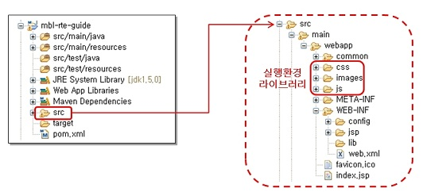
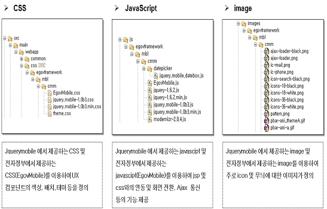
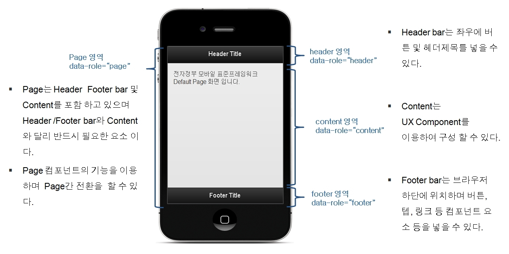
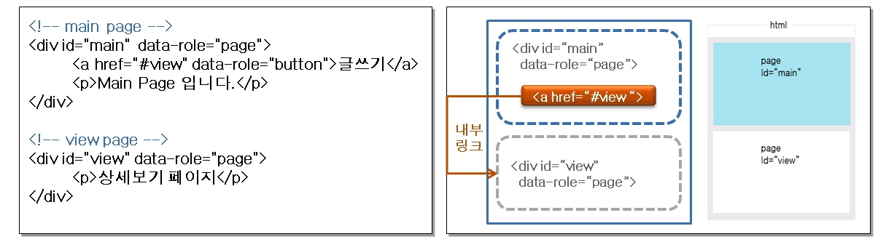
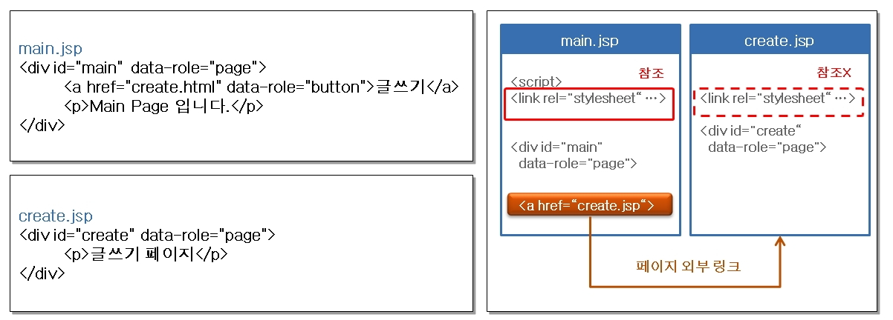

# HTML5 CSS3.0 JavaScript Module App Framework 기본 활용

## 개요
전자정부에서 효율적인 스마트 전자정부 기반 시스템의 구축•운영을 위해 전자정부의 서비스 품질 UX 레이어로 **UI/UX Controller Component**, **HTML5**, **CSS3**, **JavaScript Module App Framework** 서비스를 제공한다.
오픈소스는 JQuery Mobile을 채택하였으며 jQuery Mobile은 html5, CSS3, javascript를 제공한다. 이를 Customizing 하여 UI 레이어의 기능을 사용하며 내용은 아래와 같다. 
- **UI/UX Controller Component** : 모바일 웹 사용자 환경(UX/UI)에 대한 유연한 대응을 위해 Touch Optimized 된 필수 UI 컨트롤러 컴포넌트를 제공한다. 
- **HTML5** : 모바일 웹 페이지 구성 시 사용할 수 있는 마크업 언어로서 모바일 특화 태그 및 디바이스 API를 제공한다. 
- **CSS3** : 모바일 기기 및 브라우저에 따라 적합한 컴포넌트가 보이게 하는 기능을 제공한다. 
- **JavaScript Module App Framework** : UX/UI controller component의 효율성을 보장하는 javascript 및 Json 구조를 제공한다.

## 설명

### 기본 활용 구조
전자정부 모바일 표준프레임워크 실행환경은 기존 전자정부 표준프레임워크의 디렉터리 구조 및 표준을 준수하고 있으며, 모바일 웹 개발에 편의를 제공하기 위해 하위 디렉터리 구조를 다음과 같이 구성하고 있다.

- 프로젝트의 하위 폴더인 ‘src’에 실행환경을 지원하는 라이브러리 및 JSP 파일이 존재한다. 라이브러리는 CSS, JavaScript 및 이미지 파일로 구성되어 있다.

    

- 전자정부 모바일 표준 프레임워크는 CSS 및 JavaScript를 이용하여 실행환경을 제공하며 CSS, javascript, image는 각각 유기적으로 연결되어 있다.

    

- HTML5 <Tag> 패턴인 ‘data-role’ 속성에 적용된 값에 따라 Page, Header, Content, Footer 영역으로 구분된다.

    

### javascript 구조와 Ajax 처리
모바일 페이지 이동은 기본적으로 Ajax를 이용하여 처리된다. 이는 모바일에 최적화된 화면 전환 효과를 주기 위함으로 옵션 설정을 통해 변경 가능하다.

- 페이지 내부 이동
  - 하나의 HTML 파일 안에 여러 page가 선언되어 있는 경우에 사용할 수 있는 방법으로 모바일 page 구성의 기본 방식이다.
  - 페이지 내부 이동은 Ajax 통신을 사용하며 page로 선언된 div 태그의 id 값을 링크의 href 속성 값(#pageId)으로 적용하여 사용 가능하다. (한 HTML 내에 여러 page가 선언되어 있을 경우 제일 상단의 page를 첫 화면으로 인식한다.)
  - 페이지 내부 이동은 Ajax 방식을 기본으로 하기 때문에 연속적으로 여러 번 사용하면 DOM 객체를 제대로 못 불러 올 경우가 있으므로 외부 페이지 이동을 권장한다.
    
    

- 페이지 외부 이동
  - 페이지 외부 이동은 Ajax 통신을 이용하며 Ajax로 호출한 html의 data-role=“page” 영역만 읽어 들여서 호출한 html 페이지의 DOM 요소에 추가해 준다. (페이지 내부 이동과 유사 한 구조로 DOM 관리)
    - Ajax로 호출된 HTML의 page 영역만 가져오기 때문에 호출된 페이지에서 사용하는 JavaScript, CSS 등은 호출을 한 HTML 내에 존재해야 한다.
    - Ajax 통신을 사용하고 싶지 않은 경우 Internal / External UX Component를 참조하여 변경 가능하다.
    
        

- mobileinit 이벤트와 기본 환경 설정
  - 전자정부 모바일 표준프레임워크는 모바일 애플리케이션이 시작될 때 각종 초기화 작업이 수행될 수 있도록 mobileinit 이벤트를 통하여 기본 환경 설정을 변경할 수 있도록 한다.
  - mobileinit 이벤트는 page가 시작되자마자 발생하는 이벤트로 첫 번째 초기화 작업 시 실행되며, 함수 내부에 여러 이벤트를 적용하여 사용할 수 있다.
    ```javascript
    $(document).bind("mobileinit", function(){
          //apply overrides here
    });
    ```
  - mobileinit 이벤트는 실행 즉시 발생하므로 jquerymoible.js가 로드되기 전에 바인딩 되어야 한다. 다시 말해 mobileinit 이벤트의 위치는 jquery 라이브러리와 jquerymobile 라이브러리 사이에 위치 해야 한다.
    ```html
    <script src="jquery.js"></script>
    <script src="custom-scripting.js"></script>
    <script src="jquery-mobile.js"></script>
    ```
- \$.mobile 객체를 통해 재설정이 가능한 주요 기본 환경설정

  | 기본 환경설정 | 설명                                                                                                           |
  | --- |--------------------------------------------------------------------------------------------------------------|
  | loadingMessage (string, default: “loading”) | 페이지가 로딩될 때 나타나는 텍스트를 설정한다. ‘false’로 설정하면 로딩 메시지가 나타나지 않는다.                                                   |
  | pageLoadErrorMessage (string, default: “Error Loading Page”) | Ajax 방식의 페이지 이동에서 페이지를 로드하지 못했을 경우 나타나는 에러 메시지의 텍스트를 설정한다.                                                   |
  | defaultDialogTransition (string, default: 'pop') | 다이얼로그에서 Ajax 방식을 통한 페이지 전환에 관여하는 기본 환경설정을 변경한다. defaultDialogTransition 옵션을 ‘none’으로 설정하면 화면전환 효과가 적용되지 않는다. |
  | defaultPageTransition (string, default: 'slide') | Ajax 방식을 사용하는 페이지 전환에 관여하는 기본 환경설정을 변경한다. defaultPageTransition 옵션을 ‘none’으로 설정하면 화면전환 효과가 적용되지 않는다.         |
  | ajaxEnabled (boolean, default: true) | 모든 링크 이동이나 폼 전송은 기본적으로 Ajax 방식을 기반으로 하고 있다. Ajax가 아니라 일반 방식으로 페이지 이동을 처리하고 싶다면 이 값을 ‘false’로 지정한다.           |

- 이벤트
  - 전자정부 모바일 표준프레임워크는 스마트 기반 모바일 환경에 적합한 이벤트를 선별하여 제공한다. Touch, Mouse, Window 영역의 다양한 이벤트를 지원 가능 여부에 따라 선택적으로 이용하기 때문에 모바일 환경과 데스크톱(Desktop) 환경 모두에서 사용 가능하다. live() 또는 bind() 메서드를 이용하여 여러 이벤트를 함께 사용할 수 있다.
  - 지원 터치 이벤트

    | 터치 이벤트 | 설명                                                               |
    | --- |------------------------------------------------------------------|
    | tap | Touch가 감지되면 즉시 발생하는 이벤트이다.                                       |
    | taphold | tap을 일정 시간 이상 지속했을 때 발생하는 이벤트이다.                                 |
    | swipe | 30pixel 이상의 수평 방향이나 20pixel 이상의 수직 방향으로 드래그(drag) 되면 발생하는 이벤트이다. |
    | swipeleft | swipe 이벤트가 왼쪽으로 일어났을 때 발생하는 이벤트이다.                               |
    | swiperight | swipe 이벤트가 오른쪽으로 일어났을 때 발생하는 이벤트이다.                              |

  - 지원 화면 방향 전환 및 스크롤 이벤트

    | 화면 방향 전환 및 스크롤 이벤트 | 설명                                                                                                  |
    | --- |-----------------------------------------------------------------------------------------------------|
    | orientationChange | 기기의 방향이 수평 또는 수직으로 바뀌었을 때 발생하는 이벤트이다. orientationChange 이벤트가 지원되지 않을 경우에는 resize 이벤트가 자동으로 bind 된다. |
    | scrollstart | 스크롤(scroll)이 시작되면 발생하는 이벤트이다. (iOS 기기는 스크롤 중에는 DOM 을 변경하지 않고 queue에 저장해두었다가 스크롤이 끝난 후에 변경한다.)       |
    | scrollstop | 스크롤이 끝나면 발생하는 이벤트이다.                                                                                |

  - 지원 페이지 이벤트

    | 페이지 이벤트 | 설명                                                                    |
    | --- |-----------------------------------------------------------------------|
    | pagebeforecreate | 페이지가 초기화되기 직전에 발생하며 페이지 로딩 시 가장 먼저 발생하는 이벤트이다. 페이지 생성 시에만 이벤트가 발생한다.  |
    | pagecreate | 페이지 초기화가 끝나면 발생하는 이벤트이다. 페이지 생성이 완료된 시점에만 이벤트가 발생한다.                  |
    | pagebeforeshow | 화면전환이 일어나기 전, 즉 페이지가 보이기 전에 매번 발생하는 이벤트이다.                            |
    | pageshow | 화면전환이 완료되었거나 페이지가 보인 후에 매번 발생하는 이벤트이다.                                |
    | pagebeforehide | 화면전환이 일어나기 전, 즉 페이지가 숨겨지기 전에 매번 발생하는 이벤트이다.                           |

  - Visual Mouse event
    
    | 페이지 이벤트 | 설명                                      |
    | --- |-----------------------------------------|
    | vmouseover | 터치 이벤트 또는 mouseover가 발생할 때 나타나는 이벤트이다.  |
    | vmousedown | 터치 이벤트 또는 mousedown이 발생할 때 나타나는 이벤트이다.  |
    | vmousemove | 터치 이벤트 또는 mousemove가 발생할 때 나타나는 이벤트이다.  |
    | vmouseup | 터치 이벤트 또는 mouseup이 발생할 때 나타나는 이벤트이다.    |


- 메서드 & 유틸리티
  - 전자정부 모바일 표준프레임워크는 \$.mobile 객체에 대한 메서드와 속성들을(properties) 제공한다.
    
    | 메서드                          | 설명                                                                                                                                          |
    |------------------------------|---------------------------------------------------------------------------------------------------------------------------------------------|
    | \$.mobile.changePage(method) | 프로그램 코드 상에서 페이지를 이동할 수 있도록 지원하는 메서드이다. 주로 화면전환, 페이지 로딩 등의 기능이 가능한 환경에서 링크 클릭이나 폼 전송을 할 때 내부적으로 사용된다.                                        |
    | \$.mobile.loadPage(method)   | 외부 페이지를 로드하고, DOM에 추가한다. 이 메서드는 첫 번째 인자로 URL이 올 때 changePage() 함수를 통해 내부적으로 호출된다. 이 함수는 현재 활성화된 페이지에는 영향을 주지 않고, 백그라운드에서 페이지를 로드 할 때 사용된다.  |
    | \$.mobile.loading(“show”)    | 페이지 로딩 메시지를 보여준다.                                                                                                                           |
    | \$.mobile.loading(“hide”)    | 페이지 로딩 메시지를 숨긴다.                                                                                                                            |


## 참고자료
- 🌏 [HTML5](https://www.w3.org/TR/html5/)
- 🌏 [CSS3](https://www.w3.org/TR/css3-selectors/)
- 🌏 [JavaScript Module App Framework](https://jquerymobile.com)
