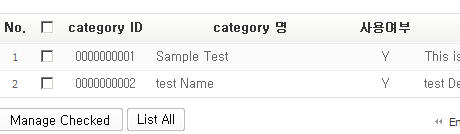
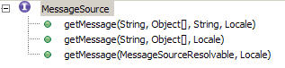

# Internationalization(국제화)
 
## 개요

전자정부 표준 프레임워크에서는 Spring MVC 에서 제공하는 LocaleResolver를 이용한다.
우리는 여기서 LocaleResolver를 알아보고 적용하는 설정과 다국어가 적용된 message resource 를 가져와 활용하는 것을 보도록 하겠다.
Spring MVC 는 다국어를 지원하기 위하여 아래와 같은 종류의 LocaleResolver 를 제공하고 있다.

- CookieLocaleResolver
  - 쿠키를 이용한 locale정보 사용
- SessionLocaleResolver
  - 세션을 이용한 locale정보 사용
- AcceptHeaderLocaleResolver
  - 클라이언트의 브라우져에 설정된 locale정보 사용

**Bean 설정 파일에 정의하지 않을 경우 AcceptHeaderLocaleResolver 를 default 로 적용된다.**

## 설명

### 3가지의 LocaleResolver

#### CookieLocaleResolver

CookieLocaleResolver 를 설정하는 경우 사용자의 쿠키에 설정된 Locale 을 읽어 들인다.
samlple-servlet.xml

```xml
...
<bean id="localeResolver"
    class="org.springframework.web.servlet.i18n.CookieLocaleResolver" >
    <property name="cookieName" value="clientlanguage"/>   
    <property name="cookieMaxAge" value="100000"/>
    <property name="cookiePath" value="web/cookie"/>
</bean>
...
```

다음과 같은 속성을 사용할 수 있다.

|    속성                   |          기본값             |               설명                                 |
|-------------------------|--------------------------|--------------------------------------------------|
|  cookieName             |  classname + locale      |  쿠키 명                                             |
|  cookieMaxAge           |  integer.MAX_INT         |  -1 로 해두면 브라우저를 닫을 때 없어짐                         |
|  cookiepath             |  /                       |  Path 를 지정하면 해당하는 Path와 그 하위 Path 에서만 참조         |

#### SessionLocaleResolver

requst가 가지고 있는 session으로 부터 locale 정보를 가져온다.
samlple-servlet.xml

```xml
...
<bean id="localeResolver" class="org.springframework.web.servlet.i18n.SessionLocaleResolver" />
...
```

#### AcceptHeaderLocaleResolver

사용자의 브라우저에서 보내진 request 의 헤더에 accept-language 부분에서 Locale 을 읽어 들인다. 사용자의 브라우저의 Locale 을 나타낸다.
samlple-servlet.xml

```xml
<bean id="localeResolver" class="org.springframework.web.servlet.i18n.AcceptHeaderLocaleResolver" />
```

### XML 설정

#### Web Configuration

Web 을 통해 들어오는 요청을 Charset UTF-8 적용한다.

CharacterEncodingFilter 을 이용하여 encoding 할 수 이도록 아래와 같이 세팅한다.

**web.xml**

```xml
...
   <filter>
       <filter-name>encoding-filter</filter-name>
       <filter-class>
           org.springframework.web.filter.CharacterEncodingFilter
       </filter-class>
       <init-param>
           <param-name>encoding</param-name>
           <param-value>UTF-8</param-value>
       </init-param>
   </filter>
 
  <filter-mapping>
      <filter-name>encoding-filter</filter-name>
      <url-pattern>/*</url-pattern>
  </filter-mapping>
...
```

#### Spring Configuration

사용자의 브라우저의 Locale 정보를 이용하지 않고 사용자가 선택하여 언어를 직접 선택할 수 있도록 구현하려 한다면 CookieLocaleResolver 나 SessionLocaleResolver 를 이용한다. 먼저 다국어를 지원해야 하므로 메세지를 MessageSource 로 추출하여 구현해야 한다.
messageSource는 아래와 같이 설정하였다.

**samlple-servlet.xml**

context-common.xml 등에 설정된 경우 설정할 필요는 없다.

```xml
<bean id="messageSource" class="org.springframework.context.support.ResourceBundleMessageSource">
    <property name="basenames">
    <list>
        <value>classpath:/message/message</value>
    </list>
    </property>
</bean>
```

### XML 설정

message properties 파일은 아래와 같다.
locale에 따라 ko, en 으로 구분하였다.
message_ko.properties

```properties
view.category=카테고리
```

message_en.properties

```properties
view.category=category
```

ResourceBundleMessageSource 는 beannames 명으로 messages 을 받아오는데 디폴트의 경우는 messages.properties 에서 message를 받아오고 locale 이 한국어일 경우는 messages_ko_KRproperties 에서 받아오고 영어일 경우는 messages_en_US.properties 에서 받아온다. 아래와 같이 localeResover 과 localeChangeInterceptor 를 등록하고 Annotation 기반에서 동작할 수 있도록 **DefaultAnnotationHandlerMapping** 에 interceptor 로 등록을 해준다.

**samlple-servlet.xml** (Spring 3.0이하)

```xml
<!-- 세션을 이용한 Locale 이용시-->
<bean id="localeResolver" class="org.springframework.web.servlet.i18n.SessionLocaleResolver"/>
 
<!-- 쿠키를 이용한 Locale 이용시  
<bean id="localeResolver" class="org.springframework.web.servlet.i18n.CookieLocaleResolver"/>
-->
<bean id="localeChangeInterceptor" class="org.springframework.web.servlet.i18n.LocaleChangeInterceptor">
	<property name="paramName" value="language"/>
</bean>
 
<bean id="annotationMapper" class="org.springframework.web.servlet.mvc.annotation.DefaultAnnotationHandlerMapping">
	<property name="interceptors">
		<list>
			<ref bean="localeChangeInterceptor"/>
		</list>
	</property>
</bean>
```

**samlple-servlet.xml** (Spring 3.1이상, 실행환경 대부분 버전이 해당된다.)

```xml
<!-- 세션을 이용한 Locale 이용시-->
<bean id="localeResolver" class="org.springframework.web.servlet.i18n.SessionLocaleResolver"/>
 
<!-- 쿠키를 이용한 Locale 이용시  
<bean id="localeResolver" class="org.springframework.web.servlet.i18n.CookieLocaleResolver"/>
-->
<bean id="localeChangeInterceptor" class="org.springframework.web.servlet.i18n.LocaleChangeInterceptor">
	<property name="paramName" value="language"/>
</bean>
 
<bean class="org.springframework.web.servlet.mvc.method.annotation.RequestMappingHandlerAdapter">
    <property name="webBindingInitializer">
        <bean class="egovframework.com.cmm.web.EgovBindingInitializer"/>
    </property>
</bean>
<bean class="org.springframework.web.servlet.mvc.method.annotation.RequestMappingHandlerMapping">
    <property name="interceptors">
        <list>
            <ref bean="localeChangeInterceptor" />
        </list>
    </property>
</bean>
```

**설정 주의사항**

```xml
<mvc:annotation-driven/>
```
위의 내용이 설정되어 있을 경우 상단의 RequestMappingHandlerAdapter, RequestMappingHandlerMapping 설정이 적용되지 않는다. `mvc:annotation-driven`이 기본 설정으로 위 bean을 생성하므로 servlet xml에 선언되어 있을 경우 주석 처리한다. 세부 내용은 Spring MVC Tag Configuration 을 참고한다.
`mvc:annotation-driven`을 사용하려면 인터셉터를 명시적으로 선언해야 한다. RequestMappingHandlerAdapter, RequestMappingHandlerMapping Bean의 설정 내용을 삭제하고, 아래의 코드를 추가한다.

```xml
<mvc:interceptors>
	<mvc:interceptor>
		<mvc:mapping path="/**" />
		<bean id="localeChangeInterceptor" class="org.springframework.web.servlet.i18n.LocaleChangeInterceptor">
	        <property name="paramName" value="language" />
	    </bean>
	</mvc:interceptor>
</mvc:interceptors>
```

SessionLocaleResolver 를 이용하여 위와 같이 하였을 경우 Locale 결정은 **language** 로 Request Parameter 로 넘기게 된다. 카테고리 용어가 영어와 한글로 바뀌는 것을 아래와 같이 볼 수 있다.

리스트를 보여주는 화면에 예를 보자면 Spring 메시지 태그를 이용하여

```xml
<spring:message code="view.category" />
```
으로 표현한다.

```html
<%@ taglib prefix="spring" uri=http://www.springframework.org/tags %>
 
<form:form commandName="message" >
....
		<table border="1" cellspacing="0" class="boardList" summary="List of Category">
			<thead>
				<tr>
					<th scope="col">No.</th>
					<th scope="col">
						<input name="checkAll" type="checkbox" class="inputCheck" title="Check All" onclick="javascript:fncCheckAll();"/>
					</th>
					<th scope="col"><spring:message code="view.category" /> ID</th>
					<th scope="col"><spring:message code="view.category" /> 명</th>
					<th scope="col">사용여부</th>
					<th scope="col">Description</th>
					<th scope="col">등록자</th>
				</tr>
			</thead>
....
```

화면상으로 해당 페이지를 실행해보면 아래와 같다.

한글인 경우 :

```
http://localhost:8080/sample-web/sale/listCategory.do?language=ko
```


영어인 경우 :

```
http://localhost:8080/sample-web/sale/listCategory.do?language=en
```




**Java 소스내에서 locale 적용 메시지 가져오기**

참고로 MessageSource 는 아래와 같은 메소드로 이루어져 있다.(실제로 여기서의 구현체는 ResourceBundleMessageSource 임.)



```java
String msg = messageSource.getMessage(messageKey, messageParameters,	defaultMessage, locale);
```

## 참고자료

