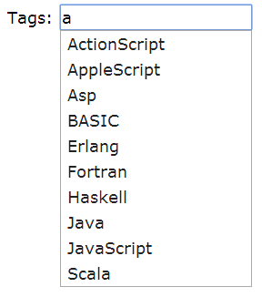
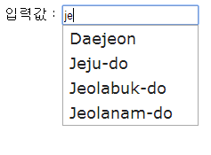
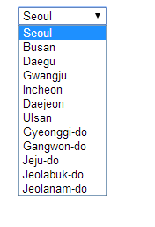
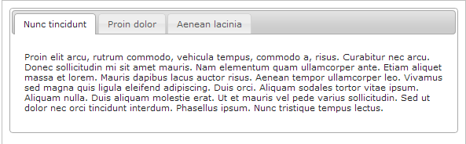

# jQuery 가이드
## 개요
jQuery는 브라우저 호환성이 있는 다양한 기능을 제공하는 자바스크립트 라이브러리이다. jQuery에서 제공하는 오픈 라이브러리들을 통해 java script로 ajax, event, 다양한 ui 기능 등을 구현할 수 있으며 위키가이드에서는 jQuery의 기본적인 몇가지 기능(ajax, callback함수, post호출 등)에 대하여 살펴본다.

자세한 내용은 [jQuery 사이트](https://jquery.com/)를 살펴보도록 한다.

jQuery ajax의 다양한 기능들 중 기본Ajax기능과 응용을 통한 콤보박스, Select박스의 간단한 화면처리에 대하여 가이드한다.

- jQuery ajax 기본기능
  - [jQuery.ajax()](#jqueryajax)
  - [jQuery.get()](#jqueryget)
  - [jQuery.post()](#jquerypost)

- jQuery ajax 응용
  - [Select box](#select-box)
  - [Tabs](#tabs)

## 설정
jQuery를 이용하기 위해서는 jQuery java script를 추가해주어야 한다. 추가하는 방법은 jquery url을 직접 명시하는 경우, 프로젝트에 jquery java script를 직접 추가하여 참조하는 경우가 있다.
- jQuery url을 직접 명시하는 경우

```javascript
<script src="//code.jquery.com/jquery-1.11.0.min.js"></script>
```
- jQuery script를 직접 추가하여 참조하는 경우

```javascript
<script type="text/javascript" src="jQuery파일 경로"></script>
```

jquery-버전.js를 다운받아 프로젝트 하위경로에 추가한 후, 저장한 경로를 적어준다.

## jQuery AJAX의 기본 기능
### jQuery.ajax()
jQuery Ajax기능을 위해서는 기본적으로 jQuery.ajax(url[,settings]) 함수를 이용한다.

#### ajax함수 안의 settings
jQuery ajax함수 안에는 다음과 같은 설정들이 가능하다.

| 설정  | 설명  | default   | type   |
|---|---|---|---|
|url	| request를 전달할 url명	| N/A	| url string   |
|data	| request에 담아 전달할 data명과 data값	| N/A	| String/Plain Object/Array   |
|contentType	| server로 데이터를 전달할 때 contentType	| 'application/x-www-form-urlencoded; charset=UTF-8'	| contentType String |
|dataType	| 서버로부터 전달받을 데이터 타입	| xml, json, script, or html	| xml/html/script/json/jsonp/multiple, space-separated values |
|statusCode	| HTTP 상태코드에 따라 분기처리되는 함수	| N/A	| 상태코드로 분리되는 함수   |
|beforeSend	| request가 서버로 전달되기 전에 호출되는 콜백함수	| N/A	| Function( jqXHR jqXHR, PlainObject settings )  |
|error	| 요청을 실패할 경우 호출되는 함수	| N/A	| Function( jqXHR jqXHR, String textStatus, String errorThrown ) |
|success	| 요청에 성공할 경우 호출되는 함수	| N/A	| Function( PlainObject data, String textStatus, jqXHR jqXHR )  |
|crossDomain	| crossDomain request(jsonP와 같은)를 강제할 때 설정(cross-domain request설정 필요)	| same-domain request에서 false, cross-domain request에서는 true	| Boolean |

##### 예제 1
하나의 파라미터를 ajax request로 전달하는 예제는 다음과 같다.
example01.do로 호출을 하며 sampleInput이란 데이터명으로 “sampleData” String을 전달한다. 요청이 성공할 경우 success의 함수를 호출하며 실패시 error함수를 호출하는 자바스크립트 코드이다.

```javascript
$.ajax({
   url : "<c:url value='/example01.do'/>",
   data : {
    sampleInput : "sampleData"
   },
   success : function(data, textStatus, jqXHR) {
    //Sucess시, 처리
   },
   error : function(jqXHR, textStatus, errorThrown){
    //Error시, 처리
}
});
```

#### ajax함수의 callback함수
ajax의 콜백함수이다. jQuery 1.5부터 jQuery의 모든 Ajax함수는 XMLHttpRequest객체의 상위 집합을 리턴받을 수 있게 되었다. 이 객체를 jQuery에서는 jqXHR이라 부르며, jqXHR의 함수로 콜백함수를 정의할 수 있다.

아래 콜백함수와 위의 settings에서 정의된 error, success콜백함수와 다른 점은 다음과 같다.

- 사용자 정의에 의해 순차적으로 실행된다.
- ajax에서 request를 리턴받아 호출할 수 있다.

| 함수명	                                                                                                 | 설명   |
|------------------------------------------------------------------------------------------------------|---|
| ```jqXHR.done(function( data, textStatus, jqXHR ) {});```                                 | 성공시 호출되는 콜백함수   |
| ```jqXHR.fail(function( jqXHR, textStatus, errorThrown ) {});```                          | 실패시 호출되는 콜백함수   |
| ```jqXHR.always(function( data\|jqXHR, textStatus, jqXHR'\|errorThrown ) { });``` |  항상 호출되는 콜백함수   |

##### 예제 2
여러개의 데이터를 전달하며 호출 후 콜백함수로 서버에서 값을 받는 예제이다.
example02.do을 호출하며 name, location을 요청데이터로 전달한다. 성공시에 done콜백함수를 호출한다.

```javascript
$.ajax({
   url : "<c:url value='/example02.do'/>",
   data : {
      name : "gil-dong",
      location : "seoul"
   },
})
    .done(function( data ) {
   if ( console && console.log ) {
    console.log( "Sample of data:", data.slice( 0, 100 ) );
   }
});
```

##### 예제 3
example03.do를 호출하며 성공시 done콜백함수를, 실패시 fail콜백함수가 호출된다.
성공,실패여부에 상관없이 always콜백함수는 항상 호출된다. done, fail, always콜백함수는 ajax함수를 통해 리턴되 request로 호출가능하다.

```javascript
var jqxhr = $.ajax( "<c:url value='/example03.do'/>", )
    .done(function() {
        alert( "success" );
    })
    .fail(function() {
        alert( "error" );
    })
    .always(function() {
        alert( "complete" );
    });

jqxhr.always(function() {
    alert( "second complete" );
});
```

### jQuery.get()
jQuery 1.5부터 sucess콜백함수는 jqXHR(XMLHttpRequest의 상위집합 객체)를 받을 수 있게 되었다. 그러나 JSONP와 같은 cross-domain request의 GET요청 시에는 jqXHR을 사용하여도 XHR인자는 success함수 안에서 undefined로 인식된다.

jQuery.get()은 ajax를 GET요청하는 함수이며 jqXHR을 반환받는다. 따라서 $.ajax()와 동일하게 done, fail, always콜백함수를 쓸 수 있다.
get함수는 ajax함수로 나타내면 다음과 같다.

```javascript
$.ajax({
   url: url,
   data: data,
   success: success,
   dataType: dataType
});
```

#### get함수 설정
| 설정	| 설명	| default	| type  |
|---|---|---|---|
| url	| request를 전달할 url명	| N/A	| url String   |
| data	| request에 담아 전달할 data명과 data값	| N/A	| String/Plain Object   |
| dataType	| 서버로부터 전달받을 데이터 타입	| xml, json, script, or html	| String   |
| success	| 요청에 성공할 경우 호출되는 함수	| N/A	| Function( PlainObject data, String textStatus, jqXHR jqXHR )  |
##### 예제 1
url만 호출하고 결과값은 무시하는 경우

```javascript
$.get( "example.do" );
```

##### 예제 2
url로 데이터만 보내고 결과는 무시하는 경우

```javascript
$.get( "example.do", { name: "gil-dong", location: "seoul" } );
```

##### 예제 3
url를 호출하고 결과값을 Alert창으로 띄우는 경우

```javascript
$.get( "test.php", function( data ) {
    alert( "Data Loaded: " + data );
});
```

##### 예제 4
url를 호출하고 결과값을 Alert창으로 띄우는 경우

```javascript
$.get( "example.do", { name: "gil-dong", location: "seoul" } )
    .done(function( data ) {
        alert( "Data Loaded: " + data );
});
```

### jQuery.getJSON()
ajax호출을 HTTP GET메서드로 JSON문자열로 인코딩한 데이터를 요청한다.
$.ajax()메서드로 표현하면 다음과 같다.

```javascript
$.ajax({
    url: url,
    data: data,
    success: success,
    dataType: 'json'
});
```

#### getJSON함수 설정
| 설정	| 설명	| default	| type  |
|---|---|---|---|
| url	| request를 전달할 url명	| N/A	| url String    |
| data	| request에 담아 전달할 data명과 data값	| N/A	| String/Plain Object   |
| dataType	| 서버로부터 전달받을 데이터 타입	| xml, json, script, or html	| String    |

### jQuery.post()
jQuery.post()은 ajax를 POST요청하는 함수이며 jqXHR을 반환받는다. 따라서 ajax(), get()와 동일하게 done, fail, always콜백함수를 쓸 수 있다.
jQuery.post 함수 설정은 get함수와 동일하다.(jQuery.post( url [, data ] [, success ] [, dataType ] ))

jQuery.post함수를 ajax함수로 쓰면 다음과 같다.

```javascript
$.ajax({
    type: "POST",
    url: url,
    data: data,
    success: success,
    dataType: dataType
});
```

#### 예제 1
url만 호출하고 결과값은 무시하는 경우

```javascript
$.post( "example.do" );
```

#### 예제 2
url로 데이터만 보내고 결과는 무시하는 경우

```javascript
$.post( "example.do", { name: "gil-dong", location: "seoul" } );
```

#### 예제 3
url를 호출하고 결과값을 console log를 남기는 경우

```javascript
$.post( "example.do", function( data ) {
    console.log( data.name );
    console.log( data.location );
});
```

#### 예제 4
url로 데이터를 호출하고 결과값을 Alert창으로 띄우는 경우

```javascript
$.post( "example.do", { name: "gil-dong", location: "seoul" } )
    .done(function( data ) {
        alert( "Data Loaded: " + data );
});
```

## jQuery Ajax 응용
jQuery의 ajax 추가 UI기능(자동완성기능, 판넬 탭 등)을 사용하기 위해서는 jQuery UI를 설정해주어야 한다. 다음에서는 jQuery UI와 ajax를 이용한 자동완성기능(autocomplete), 판넬 탭(tabs)에 대하여 가이드한다.

### jQuery UI 설정
jQuery UI(version 1.11.0)을 추가하기 위해서는 위에서 설정했던 기본 jQuery script와 jQuery ui스크립트를 다음과 같이 jsp에 추가해준다.

```javascript
...
<link rel="stylesheet"
	href="http://code.jquery.com/ui/1.11.0/themes/smoothness/jquery-ui.css" />
<script src="//code.jquery.com/jquery-1.11.0.min.js"></script>
<script src="http://code.jquery.com/ui/1.11.0/jquery-ui.js"></script>
...
```

jQuery UI script를 직접 추가하여 참조하는 경우는 jQuery-ui.js와 jQuery-ui.css를 다운받아 프로젝트 하위 경로에 추가한 후, 저장한 경로를 지정해준다.

## Auto complete
jQuery에서는 input창에서 예상되는 텍스트값을 보여주는 자동완성기능을 쉽게 구현할 수 있도록 autoComplete()을 제공하고 있다.
### autoComplete의 설정

| 구분      | 설정                  | 설명                    | Type                       |
| ------- | ------------------- | --------------------- | -------------------------- |
| Options | source              | 하단에 뜨는 자동완성리스트(필수값)   | Array, String, function    |
| Options | minLength           | 자동완성이 동작하는 최소 문자열 수   | Integer                    |
| Options | disabled            | disable 여부            | Boolean                    |
| Events  | change(event, ui)   | 값 변경시 발생하는 이벤트 함수     | autocompletechange         |
| Events  | focus( event, ui )  | 값이 포커스될 때 발생하는 이벤트 함수 | autocompletefocus          |
| Events  | select( event, ui ) | 값이 선택될 때 발생하는 이벤트 함수  | autocompleteselect<br><br> |
자세한 내용은 [jQuery 사이트의 autocomplete api](https://api.jqueryui.com/autocomplete/)을 참고한다.

### autoComplete 기본 예제
기본 autoComplete기능 구현은 다음과 같다.

```html
<html lang="en">
<head>
  <meta charset="utf-8">
  <title>jQuery UI Autocomplete - Default functionality</title>
  <link rel="stylesheet" href="//code.jquery.com/ui/1.11.0/themes/smoothness/jquery-ui.css">
  <script src="//code.jquery.com/jquery-1.10.2.js"></script>
  <script src="//code.jquery.com/ui/1.11.0/jquery-ui.js"></script>
  <link rel="stylesheet" href="/resources/demos/style.css">
  <script>
  $(function() {
    var availableTags = [ "ActionScript", "AppleScript", "Asp", "BASIC",
				"C", "C++", "Clojure", "COBOL", "ColdFusion", "Erlang",
				"Fortran", "Groovy", "Haskell", "Java", "JavaScript", "Lisp",
				"Perl", "PHP", "Python", "Ruby", "Scala", "Scheme" ];
    $( "#tags" ).autocomplete({
      source: availableTags
    });
  });
  </script>
</head>
<body>

<div class="ui-widget">
  <label for="tags">Tags: </label>
  <input id="tags">
</div>
</body>
</html>
```

위와 같이 했을 때 결과는 다음과 같다.



minLength는 default값이 1이기 때문에 input에 1개이상의 문자를 입력했을 때 source의 String배열들이 자동문자리스트로 뜨게 된다.

### autoComplete와 ajax를 이용한 응용예제
ajax를 통해 리스트를 받아와 autoComplete의 source로 뿌려주는 예제에 대해 살펴보자.</br>
ajax를 통해 source를 가져오기 위해서는 서버호출 결과값이 2가지 중 하나의 타입이어야 한다.
- String array타입
- Object(id, label,value 값을 갖는) array타입
1. String array로 가져오는 경우
   example.do라는 url로 ajax호출을 통해 source를 가져오고 선택 시 값이 alert되도록 하는 예제이다.


```html
...
<script type="text/javaScript">
$(function() {
   $('#autoValue').autocomplete(
      {
         source : function(request, response) {
	    $.ajax({
	       url : "<c:url value='/example.do'/>",
	       data : { input : request.term },
               success : function(data) {
	          response( data.locations );
	       }
	   });
         },
	 minLength : 1,
	 select : function(event, ui) {
            alert( ui.item ? "Selected : " + ui.item.label
		: "Nothing select, input was " + this.value);
	 }
     });
});
</script>
//... 생략
<input type="text" id="autoValue" />
//... 생략
```

data로 전송하는 request.term은 input값으로 사용자가 입력한 값이다. 즉, 사용자가 “je”를 입력하면 input = je 로 값이 넘어간다.</br>
이 때 Controller에서는 reqeust.getParameter(“input”) 또는 @RequestParam(“input”) String input으로 값을 꺼낼 수 있다.</br>

다음은 MappingJacksonJsonView의 빈을 jsonView로 등록했을 때 Controller에서 data를 꺼내고 결과값을 client로 넘겨주는 예제이다.(Ajax통신 시 java코드는 <Ajax support java code 위키>를 참고한다.)

```java
@RequestMapping(value="/autoList.do")
public String autoList(HttpServletRequest request, ModelMap model) {

	String input = request.getParameter("input");
	List<String> resultList = new ArrayList<String>();
        //...생략...
	//서비스클래스를 통해 결과값을 resultList에 담음		
	model.addAttribute("locations", resultList );
 
	return "jsonView";
}
```

이 때, 호출되는 Query문의 예이다. (mybatis예제)

```xml
<select id="selectLocationList" parameterType="string" resultType="string">
SELECT
	LOCATION_NM
FROM LOCATION
	WHERE upper(LOCATION_NM) LIKE '%' || upper(#{input}) || '%'
</select>
```

만약 결과값이 다음과 같다면

```json
{"locations":["Daejeon","Jeju-do","Jeolabuk-do","Jeolanam-do"]}
```

ajax의 성공시 콜백함수인 success에서는 data.locations로 값을 꺼내 autocomplete의 source를 설정할 수 있다.</br>
위와 같은 경우 결과 화면은 다음과 같다.




2. Object array로 가져오는 경우

위와 동일하게 Query문을 통해 입력값에 따라 데이터를 검색하고 Object array로 서버에서 결과값을 가져오는 경우에 대해 가이드한다.</br>
Controller에서 List<Object>의 값을 ModelMap에 “locations”라는 이름으로 클라이언트로 넘겨주고 서버에서 다음과 같이 json data가 넘어왔을 때

```json
{"locations":[{"locationId":"0006","locationNm":"Daejeon","localNb":"042"},{"locationId":"0010","locationNm":"Jeju-do","localNb":"064"},{"locationId":"0011","locationNm":"Jeolabuk-do","localNb":"063"},{"locationId":"0012","locationNm":"Jeolanam-do","localNb":"061"}]}
```

autocomplete의 source에 넘어온 값이 나타나도록 하는 Object는 label, id, value값을 가질 수 있다. 그렇기 때문에 넘어온 request의 값을 success콜백함수에서 source에 나타나도록하는 Object형태로 변환해야 한다.</br>
나머지 jQuery구현은 동일하다.

```javascript
success : function(data) {
    response($.map(data.locations, function(item) {
        return{
            id: item.locationId,
            label: item.locationNm,
            //value: item.localNb
        }));
    }
```

이 때, 자동완성 리스트로 나타나는 값은 label이며, value를 설정해주었을때는 자동완성 리스트에서 값 선택 시 input값에 label값이 아닌 value값이 대입된다.

## Select box
### selectbox(combobox) 제어
jQuery에서는 별도로 select box ui함수를 제공하지 않는다.</br>
jQuery를 통해 selectbox를 제어하는 방법에 대하여 알아보고 selectbox에 나타나는 리스트를 ajax로 구현하는 방법에 대하여 살펴본다.</br>
다루고자 하는 selectbox가 다음과 같다고 가정하자.

```html
<select id="combobox">
   <option value="">===locations===</option>
   <option value="01">Seoul</option>
   <option value="02">Busan</option>
   <option value="03">Jeju-do</option>
   <option value="04">Incheon</option>
</select>
```

#### selectbox 값 가져오기
selectbox에서 선택된 value를 가져오는 방법은 다음과 같다.

```javascript
var selectedVal = $("#combobox option:selected").val();
```

#### selectbox 내용 가져오기
selectbox에서 선택된 text(ex:Seoul)를 가져오는 방법은 다음과 같다.

```javascript
var selectedText= $("#combobox option:selected").text();
```

#### selectbox에서 선택된 Index값 가져오기
selectbox의 리스트에서 선택된 Index를 구하는 방법은 다음과 같다.

```javascript
var selectedIndex = $("#combobox option").index($("#combobox option:selected"));
```

#### selectbox에 리스트 마지막에 추가하기
selectbox의 리스트에 값을 마지막에 추가하는 방법은 다음과 같다.

```javascript
$("#combobox").append("<option value="05">Daejeon</option>");
```

맨 앞에 추가하는 경우는 .prepend()를 쓴다.

#### selectbox 값 교체하기
selectbox의 리스트의 값들을 교체하는 방법은 다음과 같다.

```html
$("#combobox").html(
"<option value=''>===locations===</option>
   <option value='01'>Jeju-do</option>
   <option value='02'>Seoul</option>
   <option value='03'>Incheon</option>
   <option value='04'>Daejeon</option>")
```
#### selectbox 값 교체하기
selectbox의 리스트의 값들을 교체하는 방법은 다음과 같다.

```html
$("#combobox").html(
"<option value=''>===locations===</option>
   <option value='01'>Jeju-do</option>
   <option value='02">Seoul</option>
   <option value='03'>Incheon</option>
   <option value='04'>Daejeon</option>")
````

#### selectbox에서 값 삭제하기
selectbox의 리스트에서 선택된 값을 삭제하는 방법은 다음과 같다.

```javascript
$("#combobox option:selected").remove();
```

#### selectbox에서 값이 선택될 때 콜백함수
selectbox에서 값이 선택되었을 때 호출되는 콜백함수는 다음과 같다.

```javascript
$("#combobox).change(function() {
    //기능구현
});
```

### selectbox 만들기
위에서 쓴 selectbox 제어기능과 jQuery ajax함수를 이용하여 다음과 같이 간단히 selectbox를 만들 수 있다.

<JSP에서 콤보박스 구현 예제>

```html
<script type="text/javaScript">
	$(function() {
		$.ajax({
			url : "<c:url value='/simpleCombo.do'/>",
			success : function(data) {
				loadCombo($("#combobox"), data.locations);
                                $("#combobox").val("");
			}
		});
 
		$("#combobox").change(function() {
			alert("Selected : " + $("#combobox option:selected").val());
		});
	});
 
	function loadCombo(target, data) {
		var dataArr = [];
		var inx = 0;
		target.empty();
 
		$(data).each( function() {
			dataArr[inx++] = "<option value=" + this.locationId + ">" + this.locationNm + "</option> ";
		});
 
		target.append(dataArr);
	}
</script>

//... 생략
<select id="combobox">
    <option>===locations===</option>
</select>
```

<서버에서 가져오는 결과값>

```json
{"locations":[{"locationId":"0001","locationNm":"Seoul"},{"locationId":"0002","locationNm":"Busan"},{"locationId":"0003","locationNm":"Daegu"},{"locationId":"0004","locationNm":"Gwangju"},{"locationId":"0005","locationNm":"Incheon"},{"locationId":"0006","locationNm":"Daejeon"},{"locationId":"0007","locationNm":"Ulsan"},{"locationId":"0008","locationNm":"Gyeonggi-do"},{"locationId":"0009","locationNm":"Gangwon-do"},{"locationId":"0010","locationNm":"Jeju-do"},{"locationId":"0011","locationNm":"Jeolabuk-do"},{"locationId":"0012","locationNm":"Jeolanam-do"}]}
```

ajax함수가 실행되면서 simpleCombo.do를 통해 data를 가져오고 json값이 위와 같을 때 combobox를 구성하는 함수를 구현하여 combobox에 나오는 목록을 나타낼 수 있다.
위의 결과는 다음과 같다.



## Tabs
Tab 기본 구현하기
jQuery UI에서 tab구현은 tabs()를 쓰며 추가 설정은 다음과 같다.

| 설정         | 설명                                      | 구분         |
| ---------- | --------------------------------------- | ---------- |
| active     | 활성화될 panel선택                            | options    |
| event      | tab이 활성화되는 이벤트                          | options    |
| hide       | panel이 숨겨질 때 애니메이션                      | options    |
| show       | panel이 나타날 때 애니메이션                      | options    |
| beforeLoad | Remote tab이 로드되기 전에 실행되기 전에 발생되는 이벤트 함수 | events     |
| create     |                                         | events<br> |

Tab을 구현하는 경우 기본 예제는 다음과 같다.
```html
<!doctype html>
<html lang="en">
<head>
  <meta charset="utf-8">
  <title>jQuery UI Tabs - Default functionality</title>
  <link rel="stylesheet" href="//code.jquery.com/ui/1.11.0/themes/smoothness/jquery-ui.css">
  <script src="//code.jquery.com/jquery-1.10.2.js"></script>
  <script src="//code.jquery.com/ui/1.11.0/jquery-ui.js"></script>
  <link rel="stylesheet" href="/resources/demos/style.css">
  <script>
  $(function() {
    $( "#tabs" ).tabs();
  });
  </script>
</head>
<body>

<div id="tabs">
  <ul>
    <li><a href="#tabs-1">Nunc tincidunt</a></li>
    <li><a href="#tabs-2">Proin dolor</a></li>
    <li><a href="#tabs-3">Aenean lacinia</a></li>
  </ul>
  <div id="tabs-1">
    <p>Proin elit arcu, rutrum commodo, vehicula tempus, commodo a, risus. Curabitur nec arcu. Donec sollicitudin mi sit amet mauris. Nam elementum quam ullamcorper ante. Etiam aliquet massa et lorem. Mauris dapibus lacus auctor risus. Aenean tempor ullamcorper leo. Vivamus sed magna quis ligula eleifend adipiscing. Duis orci. Aliquam sodales tortor vitae ipsum. Aliquam nulla. Duis aliquam molestie erat. Ut et mauris vel pede varius sollicitudin. Sed ut dolor nec orci tincidunt interdum. Phasellus ipsum. Nunc tristique tempus lectus.</p>
  </div>
  <div id="tabs-2">
    <p>Morbi tincidunt, dui sit amet facilisis feugiat, odio metus gravida ante, ut pharetra massa metus id nunc. Duis scelerisque molestie turpis. Sed fringilla, massa eget luctus malesuada, metus eros molestie lectus, ut tempus eros massa ut dolor. Aenean aliquet fringilla sem. Suspendisse sed ligula in ligula suscipit aliquam. Praesent in eros vestibulum mi adipiscing adipiscing. Morbi facilisis. Curabitur ornare consequat nunc. Aenean vel metus. Ut posuere viverra nulla. Aliquam erat volutpat. Pellentesque convallis. Maecenas feugiat, tellus pellentesque pretium posuere, felis lorem euismod felis, eu ornare leo nisi vel felis. Mauris consectetur tortor et purus.</p>
  </div>
  <div id="tabs-3">
    <p>Mauris eleifend est et turpis. Duis id erat. Suspendisse potenti. Aliquam vulputate, pede vel vehicula accumsan, mi neque rutrum erat, eu congue orci lorem eget lorem. Vestibulum non ante. Class aptent taciti sociosqu ad litora torquent per conubia nostra, per inceptos himenaeos. Fusce sodales. Quisque eu urna vel enim commodo pellentesque. Praesent eu risus hendrerit ligula tempus pretium. Curabitur lorem enim, pretium nec, feugiat nec, luctus a, lacus.</p>
    <p>Duis cursus. Maecenas ligula eros, blandit nec, pharetra at, semper at, magna. Nullam ac lacus. Nulla facilisi. Praesent viverra justo vitae neque. Praesent blandit adipiscing velit. Suspendisse potenti. Donec mattis, pede vel pharetra blandit, magna ligula faucibus eros, id euismod lacus dolor eget odio. Nam scelerisque. Donec non libero sed nulla mattis commodo. Ut sagittis. Donec nisi lectus, feugiat porttitor, tempor ac, tempor vitae, pede. Aenean vehicula velit eu tellus interdum rutrum. Maecenas commodo. Pellentesque nec elit. Fusce in lacus. Vivamus a libero vitae lectus hendrerit hendrerit.</p>
  </div>
</div>
</body>
</html>
```

위의 결과는 다음과 같다.



- referenced [jquery ui site](https://jqueryui.com/tabs/#default)

ajax로 Tab 구현하기
ajax로 Tab을 구현하기 위해서는 각 Tab에 ajax호출 url을 지정해주기만 하면 된다.

```html
<script src="http://code.jquery.com/jquery-1.10.2.js"></script>
<script src="http://code.jquery.com/ui/1.11.0/jquery-ui.js"></script>
<script type="text/javaScript">
$(function() {
    $( "#tabs" ).tabs({
      beforeLoad: function( event, ui ) {
        ui.jqXHR.error(function() {
          ui.panel.html(
            "Couldn't load this tab. We'll try to fix this as soon as possible. " +
            "If this wouldn't be a demo." );
        });
      }
    });
  });
</script>
</head>
<body>
   <div id="tabs">
      <ul>
         <li><a href="${pageContext.request.contextPath }/simpleCombo.do">Tab 1</a></li>
	 <li><a href="${pageContext.request.contextPath }/tabTwoForm.do">Tab 2</a></li>
	 <li><a href="${pageContext.request.contextPath }/tabThreeForm.do">Tab 3</a></li>
      </ul>
   </div>
</body>
```

위의 경우 첫번째 탭 지정시 simpleCombo.do가 호출되어 panel안에 simpleCombo.do를 통해 호출된 화면이 보여진다.

## 참고자료
- [jQuery Web Site](https://jquery.com/)
- [jQuery UI Web Site](https://jqueryui.com/index.html)
