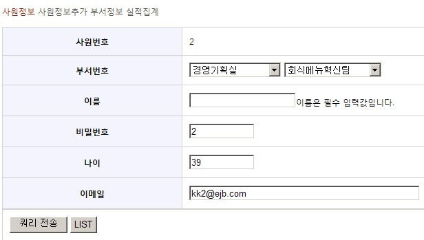
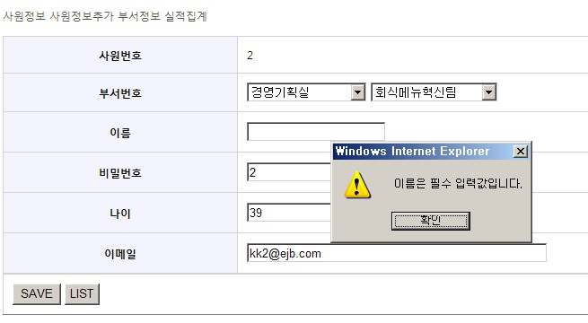

# Spring Framework + Jakarta Commons Validator

## 개요

입력값 검증을 위한 Validation 기능은 Valang, Jakarta Commons, Spring 등에서 제공한다.  
여기서는 Jakarta Commons Validator를 Spring Framework과 연동하여 사용하는 방법에 대해서 설명하고자 한다.  
Jakarta Commons Validator는 필수값, 각종 primitive type(int,long,float…), 최대-최소길이, 이메일, 신용카드번호등의 값 체크등을 할 수 있도록 Template이 제공된다.  
이 Template은 Java 뿐 아니라 Javascript로도 제공되어 client-side, server-side의 검증을 함께 할 수 있으며,
Configuration과 에러메시지를 client-side, server-side 별로 따로 하지 않고 한곳에 같이 쓰는 관리상의 장점이 있다.  
Struts에서는 Commons Validator를 사용하기 위한 org.apache.struts.validator.ValidatorPlugIn 같은 플러그인 클래스를 제공하는데,
Spring에서는 Spring Modules 프로젝트에서 연계 모듈을 제공한다.  
여기서는 server-side, client-side validation을 위해,
설치방법, Spring Module에서 제공하는 핵심 클래스인 DefaultValidatorFactory, DefaultValidator와 설정파일인 validator-rules.xml, validator.xml 에 대한 간략한 설명과
예제 프로젝트인 easycompany에 적용하는 과정을 설명한다.  

## 설명

### 필요라이브러리

1. commons-validator : Ver 1.4.0 아래 4개의 파일에 대한 dependency가 있다.
   - commons-beanutils : Ver 1.8.3
   - commons-digester : Ver 1.8
   - commons-logging : Ver 1.1.2
   - junit : Ver 3.8.2
2. [spring modules](http://www.egovframe.go.kr/maven/org/springmodules/spring-modules-validation/0.9/spring-modules-validation-0.9.jar) : Ver 0.9 다운 받고 압축을 풀어 보면 여러 파일들이 있으나 여기서 필요한 건 spring-modules-validation.jar 뿐이다. 예제를 보려면 \samples\sources\spring-modules-validation-commons-samples-src.zip도 필요하다.
3. 위에서 언급한 라이브러리들을 설치한다.

### DefaultValidatorFactory, DefaultBeanValidator 설정

Spring Validator와 Commons Validator의 연계를 위해 중요한 역할을 하는 클래스인 DefaultValidatorFactory, DefaultBeanValidator에 대해 간략하게 설명하자면 아래 표와 같다.

| DefaultValidatorFactory | DefaultBeanValidator |
|-------------------------|----------------------|
| 프로퍼티 'validationConfigLocationsApache'에 정의된 Validation rule을 기반으로 Commons Validator들의 인스턴스를 얻는다. | DefaultBeanValidator는 org.springframework.validation.Validator를 implements하고 있지만, DefaultValidatorFactory가 가져온 Commons Validator의 인스턴스를 이용해 validation을 수행한다. Controller에 validation 수행할때 이 DefaultBeanValidator를 참조하면 된다. |

아래 코드를 참조해 빈 정의 파일(예제에는 easycompany-servlet.xml)에 다음과 같이 ValidatorFactory,Validator,validator-rules.xml,validation.xml 파일을 등록한다.

```xml
...
<!-- Integration Apache Commons Validator by Spring Modules -->				
    <bean id="beanValidator" class="org.springmodules.validation.commons.DefaultBeanValidator">
	<property name="validatorFactory" ref="validatorFactory"/>
    </bean>
 
    <bean id="validatorFactory" class="org.springmodules.validation.commons.DefaultValidatorFactory">
	<property name="validationConfigLocations">
		<list>
                      <!-- validator-rules.xml, validator.xml의 위치-->
			<value>/WEB-INF/conf/validator-rules.xml</value>
			<value>/WEB-INF/conf/validator.xml</value>
		</list>
	</property>
    </bean>
...
```

### validator-rules.xml 설정

validator-rules.xml은 application에서 사용하는 모든 validation rule에 대해 정의하는 파일이다.
예제에 있는 validator-rules.xml의 필수값 체크 부분을 보면 아래와 같이 작성되어 있다.

```xml
      <validator name="required"
            classname="org.springmodules.validation.commons.FieldChecks"
               method="validateRequired"
         methodParams="java.lang.Object,
                       org.apache.commons.validator.ValidatorAction,
                       org.apache.commons.validator.Field,
                       org.springframework.validation.Errors"
                  msg="errors.required">
         <javascript><![CDATA[
         .....
            ]]>
         </javascript>
      </validator>
```

<table>
  <tr>
    <th>name</th>
    <td>validation rule(required,mask,integer,email…)</td>
  </tr>
  <tr>
    <th>classname</th>
    <td>validation check를 수행하는 클래스명(org.springmodules.validation.commons.FieldChecks)</td>
  </tr>
  <tr>
    <th>method</th>
    <td>validation check를 수행하는 클래스의 메소드명(validateRequired,validateMask…)</td>
  </tr>
  <tr>
    <th>methodParams</th>
    <td>validation check를 수행하는 클래스의 메소드의 파라미터</td>
  </tr>
  <tr>
    <th>msg</th>
    <td>에러 메시지 key</td>
  </tr>
  <tr>
    <th>javascript</th>
    <td>client-side validation을 위한 자바스크립트 코드</td>
  </tr>
</table>

Spring Modules에서 제공하는 validation rule에 따라 구성해보자.

**Spring Modules (0.9 기준)에서 제공하는 validation rule들은 아래와 같다.**

| name(validation rule) | FieldCheck 클래스                                | FieldCheck 클래스의 메소드 |       기능       |
|-----------------------|--------------------------------------------------|----------------------------|:----------------:|
| required              | org.springmodules.validation.commons.FieldChecks | validateRequired           | 필수값 체크      |
| minlength             | org.springmodules.validation.commons.FieldChecks | validateMinLength          | 최소 길이 체크   |
| maxlength             | org.springmodules.validation.commons.FieldChecks | validateMaxLength          | 최대 길이 체크   |
| mask                  | org.springmodules.validation.commons.FieldChecks | validateMask               | 정규식 체크      |
| byte                  | org.springmodules.validation.commons.FieldChecks | validateByte               | Byte형 체크      |
| short                 | org.springmodules.validation.commons.FieldChecks | validateShort              | Short형 체크     |
| integer               | org.springmodules.validation.commons.FieldChecks | validateInteger            | Integer형 체크   |
| long                  | org.springmodules.validation.commons.FieldChecks | validateLong               | Long형 체크      |
| float                 | org.springmodules.validation.commons.FieldChecks | validateFloat              | Float형 체크     |
| double                | org.springmodules.validation.commons.FieldChecks | validateDouble             | Double형 체크    |
| date                  | org.springmodules.validation.commons.FieldChecks | validateDate               | Date형 체크      |
| range                 | org.springmodules.validation.commons.FieldChecks | validateIntRange           | 범위 체크        |
| intRange              | org.springmodules.validation.commons.FieldChecks | validateIntRange           | int형 범위 체크  |
| floatRange            | org.springmodules.validation.commons.FieldChecks | validateFloatRange         | Float형 범위체크 |
| creditCard            | org.springmodules.validation.commons.FieldChecks | validateCreditCard         | 신용카드번호체크 |
| email                 | org.springmodules.validation.commons.FieldChecks | validateEmail              | 이메일체크       |

validator-rules.xml을 직접 작성하는것 보다는 예제에 있는 파일을 참고하거나 copy해서 사용하면 편리하다.  
spring-modules-0.9.zip을 압축을 풀어보면 예제코드가 있다.(\samples\sources\spring-modules-validation-commons-samples-src.zip)
예제코드의 validator-rules.xml(\webapp\WEB-INF\validator-rules.xml)에는 모든 validation rule이 이미 정의되어 있다.

org.springmodules.validation.commons.FieldChecks 클래스에는 필수값 체크, primitive 타입 체크등 여러 validation을 수행하는 메소드들이 있다.  
FieldChecks 클래스 소스를 열어 보면 실제 validation 처리는 Commons Validator에 위임하고 있다.  
따라서 주의 할점은 Commons Validator에서 제공하는 validation rule중에, FieldChecks 클래스가 제공하지 않는 rule도 있다는 것이다.  
예를 들어 Commons Validator 1.3.1 에서는 URL이나 IP 관련 Validator를 제공하지만, Spring Modules의 FieldChecks 클래스에 해당 메소드가 없기 때문에,
새로운 FieldCheck 클래스를 추가한 후 validation-rules.xml에 클래스와 메소드를 등록해야 사용할 수 있다.  
Spring Modules가 제공하는 validation rule외에 rule을 추가하는 방법에 대해서는 주민등록번호 validation rule 추가하기 를 참고하라.

### validator.xml 설정

validator.xml은 validation rule과 validation할 Form을 매핑한다.  
form name과 field property의 name-rule은 Server-side와 Client-side인 경우에 따라 다르다.  

**Server-side validation의 경우는,**  
form name과 field property는 validation할 폼 클래스의 이름, 필드과 각각 매핑된다.(camel case)
폼 클래스가 Employee면 employee, DepartmentForm 이면 departmentForm을 form name으로 지정하라.

**Client-side의 경우는,**  
form name은 JSP에서 설정한 \<validator:javascript formName=“employee” …/> 태그의 formName와 매핑되고, field property는 각각의 폼 필드의 이름과 일치하면 된다.

**따라서, Server-side, Client-side 둘 다 수행하려면,**  
JSP의 \<validator:javascript formName=“employee” …/> 태그의 formName은 폼 클래스의 이름이 되어야 하고, JSP의 폼 필드들은 폼 클래스의 필드와 일치해야 한다.

depends는 해당 필드에 적용할 (validator-rules.xml에 정의된 rule name) validator를 의미한다.  
\<arg key…>는 메시지 출력시 파라미터를 지정하는 값이다.  
아래와 같이 작성했다면, Employee 클래스의 name 필드에 대해서 필수값 체크를, age 필드에 대해서 integer 체크를, email 필드에 대해선 필수값과 email 유효값 체크를 하겠다는 의미이다

```xml
<?xml version="1.0" encoding="UTF-8"?>
<!DOCTYPE form-validation PUBLIC 
    "-//Apache Software Foundation//DTD Commons Validator Rules Configuration 1.1//EN" 
    "http://jakarta.apache.org/commons/dtds/validator_1_1.dtd">
 
<form-validation>
 
    <formset>
 
        <form name="employee">
        	<field property="name" depends="required">
        		<arg0 key="employee.name" />
		</field>
		<field property="age" depends="integer">
        		<arg0 key="employee.age" />
		</field>
		<field property="email" depends="required,email">
        		<arg0 key="employee.email" />
		</field>		
        </form>
 
    </formset>
 
</form-validation>
```

### Server-Side Validation

#### Controller

Server-Side Validation을 위해 Controller에 validation 로직을 추가해 보자.  
위 설정 파일에서 등록한 DefaultBeanValidator가 Controller에서 validation을 수행한다.  
DefaultBeanValidator는 Commons Validator의 기능을 사용하지만 자신은 Spring Validator이기 때문에,
사용자는 Spring Validator를 사용하듯이 Controller에서 validation 코딩을 하면 된다.

```java
package com.easycompany.controller.annotation;
...
import org.springmodules.validation.commons.DefaultBeanValidator;
...
 
@Controller
public class UpdateEmployeeController {	
	...
	@Autowired
	private DefaultBeanValidator beanValidator;
        ...
	@RequestMapping(value = "/updateEmployee.do", method = RequestMethod.POST)
	public String updateEmployee(@ModelAttribute("employee") Employee employee,			
			BindingResult bindingResult, Model model) {
 
		beanValidator.validate(employee, bindingResult); //validation 수행
		if (bindingResult.hasErrors()) { //만일 validation 에러가 있으면...
			.....
			return "modifyemployee";
		}
		employeeManageService.updateEmployee(employee);
		return "changenotify";
	}        
}
```

#### JSP

Validation을 적용할 JSP를 작성한다.(modifyemployee.jsp)  
form submit을 하면 이름, 나이, 이메일등의 입력값이 Employee 클래스에 바인딩이 되서 Controller에 전달이 되고,
Controller에 validation 수행 로직이 있으면 validator.xml 내용에 따라 validation이 이루어 진다.  
만일 에러가 발생하면 \<form:error…/>에 에러에 해당하는 메시지를 출력한다. 에러 메시지에 관련해서는 아래 에러 메시지 등록을 참고하라.

```html
<form:form commandName="employee">
<table>
        ....
	<tr>
		<th>이름</th>
		<td><form:input path="name" size="20"/><form:errors path="name" /></td>
	</tr>
	<tr>
		<th>비밀번호</th>
		<td><form:input path="password" size="10"/></td>
	</tr>
	<tr>
		<th>나이</th>
		<td><form:input path="age" size="10"/><form:errors path="age" /></td>
	</tr>
	<tr>
		<th>이메일</th>
		<td><form:input path="email" size="50"/><form:errors path="email" /></td>
	</tr>
</table>
<table width="80%" border="1">
	<tr>
		<td>
		<input type="submit"/>
		<input type="button" value="LIST" onclick="location.href='/easycompany/employeeList.do'"/>
		</td>
	</tr>
</table>
 
</form:form>
```

#### 에러 메시지 등록

메시지 파일에 에러 메시지를 등록한다.  
validation 에러가 발생하면 validator-rules.xml에서 정의했던 msg값으로 에러메시지의 key값을 찾아 해당하는 메시지를 출력해준다.  
예를 들어, email validation에서 에러가 발생하면 msg값이 errors.email 이므로, “유효하지 않은 이메일 주소입니다.”라는 에러 메시지를 JSP에 있는 \<form:errors path=“email” /> 부분에 출력하게 된다.

```properties
employee.name=이름
employee.email=이메일
employee.age=나이
employee.password=비밀번호

# -- validator errors --
errors.required={0}은 필수 입력값입니다.
errors.minlength={0}은 {1}자 이상 입력해야 합니다.
errors.maxlength={0}은 {1}자 이상 입력할수 없습니다.
errors.invalid={0}은 유효하지 않은 값입니다.

errors.byte={0}은  byte타입이어야 합니다.
errors.short={0}은  short타입이어야 합니다.
errors.integer={0}은 integer 타입이어야 합니다.

....

errors.email=유효하지 않은 이메일 주소입니다.
```

#### TEST

이름 필드에 값을 비우고 submit하면, name에 필수값(required) validation rule이 설정되어 있으므로
아래와 같이 이름 필드 옆에 에러 메시지가 출력 될 것이다.



### Client-Side Validation

#### validator.jsp 추가

아래와 같은 내용의 validator.jsp를 작성한다.

```jsp
<%@ page language="java" contentType="javascript/x-javascript" %>
<%@ taglib prefix="validator" uri="http://www.springmodules.org/tags/commons-validator" %>
<validator:javascript dynamicJavascript="false" staticJavascript="true"/>
```

/validator.do로 호출하도록 Controller에서 메소드를 추가하고 requestmapping 한다.  
validator.jsp를 http://localhost:8080/easycompany/validator.do 브라우져에서 호출해보면, validator-rules.xml에서 정의한 javascript 함수들이 다운로드 되거나 화면에 print 되는 걸 확인할 수 있을 것이다.  
validator.jsp는 client-validation을 위해 validator-rules.xml에서 정의한 javascript 함수들을 로딩한다.  
따라서 client-validation을 할 페이지에서는 이 validator.jsp을

```jsp
<script type="text/javascript" src="<c:url value="/validator.do"/>"></script>
```

같이 호출한다.

#### JSP 설정(taglib,javascript) 추가

client-validation을 위해서는 해당 JSP에 아래와 같은 작업이 추가 되어야 한다. commons-validator taglib를 선언한다.

```jsp
<%@ taglib prefix="validator" uri="http://www.springmodules.org/tags/commons-validator" %>
```

필요한 자바 스크립트 함수를 generate 하기 위한 코드를 추가 한다. validation-rules.xml에서 선언한 함수를 불러 오기 위해, 위에서 작성한 validator.jsp를 아래와 같이 호출한다.

```jsp
<script type="text/javascript" src="<c:url value="/validator.do"/>"></script>
```

위의 자바 스크립트 함수를 이용해 필요한 validation과 메시지 처리를 위한 자바 스크립트를 generate 하기 위한 코드를 추가 한다. formName에는 validator.xml에서 정의한 form의 이름을 써준다.

```jsp
<validator:javascript formName="employee" staticJavascript="false" xhtml="true" cdata="false"/>
```

form submit시에 validateVO클래스명() 함수를 호출한다.

```jsp
   ... onsubmit="return validateEmployee(this)" ">
```

따라서 앞의 server-side validation에서 작성한 modifyemployee.jsp은 아래와 같이 변경된다.

```jsp
<!-- commons-validator tag lib 선언-->
<%@ taglib prefix="validator" uri="http://www.springmodules.org/tags/commons-validator" %>
 
....
<!--for including generated Javascript Code(in validation-rules.xml)-->
<script type="text/javascript" src="<c:url value="/validator.do"/>"></script>
<!--for including generated Javascript Code(validateEmployee(), formName:validator.xml에서 정의한 form의 이름)-->
<validator:javascript formName="employee" staticJavascript="false" xhtml="true" cdata="false"/>
<script type="text/javascript">
	function save(form){	
		if(!validateEmployee(form)){
			return;
		}else{
			form.submit();
		}
	}
</script>
....
<form:form commandName="employee">
<table>
        ....
	<tr>
		<th>이름</th>
		<td><form:input path="name" size="20"/><form:errors path="name" /></td>
	</tr>
	<tr>
		<th>비밀번호</th>
		<td><form:input path="password" size="10"/></td>
	</tr>
	<tr>
		<th>나이</th>
		<td><form:input path="age" size="10"/><form:errors path="age" /></td>
	</tr>
	<tr>
		<th>이메일</th>
		<td><form:input path="email" size="50"/><form:errors path="email" /></td>
	</tr>
</table>
<table width="80%" border="1">
	<tr>
		<td>
		<!--<input type="submit"/>-->
                <input type="button" value="SAVE" onclick="save(this.form)"/> <!-- client-validation을 위해 바로 submit하지 않고 먼저 validateEmployee 함수를 호출-->
		<input type="button" value="LIST" onclick="location.href='/easycompany/employeeList.do'"/>
		</td>
	</tr>
</table> 
</form:form>
....
```

#### TEST

이번에도 이름 필드의 값을 지우고 저장 버튼을 누르면 아래와 같은 alert 메시지가 보일 것이다.



## 참고문헌

- Spring Modules Reference Documentation v 0.9, Chapter 17.Validation, P133~136
