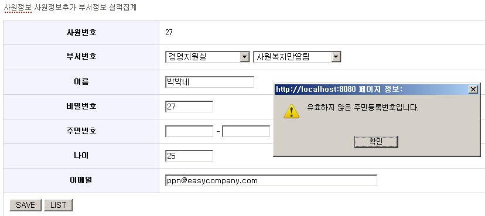

# Commons Validator에 validation rule 추가하기

## 개요 

Commons Validator는 primitive type, 필수값, 이메일등 흔히 사용되는 유형에 대한 validation rule을 template으로 제공하지만,
프로젝트의 특성에 따라 공통으로 사용되는 validation rule이 발생되고 이를 추가해야할 필요가 생길 수 있다.
공공프로젝트에서 흔히 사용되는 주민등록번호 validator를 추가해 봄으로써, validation rule을 추가하는 방법을 알아보고자 한다.  
예제는 easycompany를 이용했다.


## 설명

Spring Module을 이용해서 Commons Validator를 사용한다면 아래와 같은 내용을 validation rule 정의 파일(validator-rules.xml 같은)에서 보았을 것이다.

```xml
    <!--필수값 체크 validation rule-->
    <validator name="required"
          classname="org.springmodules.validation.commons.FieldChecks"
             method="validateRequired"
       methodParams="java.lang.Object,
                     org.apache.commons.validator.ValidatorAction,
                     org.apache.commons.validator.Field,
                     org.springframework.validation.Errors"
                msg="errors.required">
       <javascript><![CDATA[
          ...
          ]]>
       </javascript>
    </validator>
```

validator 태그의 각각의 attribute는 다음과 같은 의미를 같는다.

<table>
  <tr>
    <th>name</th>
    <td>validation rule(required,mask,integer,email…)</td>
  </tr>
  <tr>
    <th>classname</th>
    <td>validation check를 수행하는 클래스명</td>
  </tr>
  <tr>
    <th>method</th>
    <td>validation check를 수행하는 클래스의 메소드명</td>
  </tr>
  <tr>
    <th>methodParams</th>
    <td>validation check를 수행하는 클래스의 메소드의 파라미터</td>
  </tr>
  <tr>
    <th>msg</th>
    <td>에러 메시지 key</td>
  </tr>
  <tr>
    <th>javascript</th>
    <td>client-side validation을 위한 자바스크립트 코드</td>
  </tr>
</table>

주민등록번호 rule을 아래와 같이 추가한다고 하면,

```xml
    <validator name="ihidnum"
          classname="egovframework.rte.ptl.mvc.validation.RteFieldChecks"
             method="validateIhIdNum"
       methodParams="java.lang.Object,
                     org.apache.commons.validator.ValidatorAction,
                     org.apache.commons.validator.Field,
                     org.springframework.validation.Errors"                       
            depends=""
                msg="errors.ihidnum">
         <javascript><![CDATA[
          ...
          ]]>
       </javascript>
    </validator>
```

필요한 작업은 아래와 같다.

1. FieldCheck class(RteFieldChecks) 작성
2. Validator class(RteGenericValidator) 작성
3. validator-rules.xml 설정
4. validator.xml 설정
5. 에러메시지 설정
6. TEST

### FieldCheck class 작성

org.springmodules.validation.commons.FieldChecks를 상속 받는 RteFieldChecks 클래스를 생성한다.
그리고 주민등록번호 validation을 담당할 validateIhIdNum 메소드를 추가한다.
주민등록번호 validation 로직이 RteFieldChecks.validateIhIdNum() 안에 있어도 되지만, org.springmodules.validation.commons.FieldChecks와 같은 방식으로 다른 Validator에 위임했다.

```java
package egovframework.rte.ptl.mvc.validation;
 
import org.apache.commons.validator.Field;
import org.apache.commons.validator.ValidatorAction;
import org.springframework.validation.Errors;
import org.springmodules.validation.commons.FieldChecks;
 
public class RteFieldChecks extends FieldChecks{
 
	public static boolean validateIhIdNum(Object bean, ValidatorAction va,
            Field field, Errors errors){
		//bean에서 해당 field 값을 추출
		String ihidnum = FieldChecks.extractValue(bean, field); 
 
                //주민등록번호 유효성 검사 알고리즘은 RteGenericValidator가 가지고 있다.
		if(!RteGenericValidator.isValidIdIhNum(ihidnum)){ //유효한 주민등록번호가 아니면
			FieldChecks.rejectValue(errors, field, va); //에러 처리
			return false;
		}else{
			return true;
		}
	}
}
```

### Validator class 작성

주민등록번호 유효성체크 로직이 있는 RteGenericValidator 클래스를 작성해 보자.
유효성 체크 기준은

1. 값의 길이가 13자리이며, 7번째 자리가 1,2,3,4 중에 하나인가?
2. 앞 6자리의 값이 유효한 날짜인가?
3. 주민등록번호 마지막 자리를 이용한 check
   
로 했다.

```java
package egovframework.rte.ptl.mvc.validation;
import java.io.Serializable;
import org.apache.commons.validator.GenericTypeValidator;
 
public class RteGenericValidator implements Serializable {	
	public static boolean isValidIdIhNum(String value) {		
		//값의 길이가 13자리이며, 7번째 자리가 1,2,3,4 중에 하나인지 check.
		String regex = "\\d{6}[1234]\\d{6}";
		if (!value.matches(regex)) {
			return false;
		}
 
		//앞 6자리의 값이 유효한 날짜인지 check.
		try {
			String strDate = value.substring(0, 6);
			strDate = ((value.charAt(6) == '1' || value.charAt(6) == '2') ? "19":"20") + strDate;
			strDate = strDate.substring(0, 4) + "/" + strDate.substring(4, 6)
					+ "/" + strDate.substring(6, 8);
 
			SimpleDateFormat dateformat = new SimpleDateFormat("yyyy/MM/dd");
			Date date = dateformat.parse(strDate);
			String resultStr = dateformat.format(date);
 
			if (!resultStr.equalsIgnoreCase(strDate)) {
				return false;
			}
 
		} catch (ParseException e) {
			// TODO Auto-generated catch block
			e.printStackTrace();
			return false;
		}
 
		//주민등록번호 마지막 자리를 이용한 check.
		char[] charArray = value.toCharArray();
		long sum = 0;
		int[] arrDivide = new int[] { 2, 3, 4, 5, 6, 7, 8, 9, 2, 3, 4, 5 };
		for (int i = 0; i < charArray.length - 1; i++) {
			sum += Integer.parseInt(String.valueOf(charArray[i]))
					* arrDivide[i];
		}
 
		int checkdigit = (int) ((int) (11 - sum % 11)) % 10;
		return (checkdigit == Integer.parseInt(String.valueOf(charArray[12]))) ? true
				: false;
	}
}
```

### validator-rules.xml 설정

이제 주민등록번호 validation rule을 추가해 보자.
rule 이름은 ihidnum으로 하고 위에서 작성한 코드를 바탕으로 설정하면, (이미 위 개요에 나온 대로) 아래와 같다.
client-validation을 위해서 자바스크립트 코드도 추가했다.

```xml
      <validator name="ihidnum"
            classname="egovframework.rte.ptl.mvc.validation.RteFieldChecks"
               method="validateIhIdNum"
         methodParams="java.lang.Object,
                       org.apache.commons.validator.ValidatorAction,
                       org.apache.commons.validator.Field,
                       org.springframework.validation.Errors"                       
              depends=""
                  msg="errors.ihidnum">
           <javascript><![CDATA[
           function validateIhIdNum(form) {
                var bValid = true;
                var focusField = null;
                var i = 0;
                var fields = new Array();
                oIhidnum = new ihidnum();                
                for (x in oIhidnum) {
                	var field = form[oIhidnum[x][0]];
                	if (field.type == 'text' ||
                    	field.type == 'hidden' ||
                        field.type == 'textarea') {
                        if (trim(field.value).length==0 || !checkIhIdNum(field.value)) {
                            if (i == 0) {
                                focusField = field;
                            }
                            fields[i++] = oIhidnum[x][1];
                            bValid = false;
                        }
                    }
                }
                if (fields.length > 0) {
                    alert(fields.join('\n'));
                }
                return bValid;
            }
 
            /**
             * Reference: JS Guide
             * http://jsguide.net/ver2/articles/frame.php?artnum=002
             */             
            function checkIhIdNum(ihidnum){
 
            	fmt = /^\d{6}[1234]\d{6}$/;
            	if(!fmt.test(ihidnum)){
            		return false;
            	}
 
            	birthYear = (ihidnum.charAt(7) <= "2") ? "19" : "20";
				birthYear += ihidnum.substr(0, 2);
				birthMonth = ihidnum.substr(2, 2) - 1;
				birthDate = ihidnum.substr(4, 2);
				birth = new Date(birthYear, birthMonth, birthDate);
 
				if( birth.getYear() % 100 != ihidnum.substr(0, 2) ||
				    birth.getMonth() != birthMonth ||
				    birth.getDate() != birthDate) {
				    return false;
				}
 
            	var arrDivide = [2, 3, 4, 5, 6, 7, 8, 9, 2, 3, 4, 5];            	
            	var checkdigit = 0;            	
            	for(var i=0;i<ihidnum.length-1;i++){
            		checkdigit += parseInt(ihidnum.charAt(i)) * parseInt(arrDivide[i]);
            	}
            	checkdigit = (11 - (checkdigit%11))%10;
            	if(checkdigit != ihidnum.charAt(12)){
            		return false;
            	}else{
            		return true;
            	}
            }
            ]]>
         </javascript>
      </validator>
```

### validator.xml 설정

ihidnum이란 필드에 주민등록번호 validation 체크를 해보자.
validator.xml에 필요한 내용을 추가하고.

```xml
<form-validation>
    <formset>
        <form name="employee">
        	...
		<field property="ihidnum" depends="ihidnum"/>
                ... 
        </form>
    </formset>
</form-validation>
```

### 에러메시지 설정
messages 프로퍼티에 에러메시지를 추가하자.

```properties
errors.ihidnum=유효하지 않은 주민등록번호입니다.
```

### TEST

주민등록번호 server-side,client-side validatin을 위한 환경은 다 갖추어졌다.
이제 EmployeeController에 validation을 추가하고,(이미 추가되어 있다면 pass)

```java
package com.easycompany.controller.annotation;
...
import org.springmodules.validation.commons.DefaultBeanValidator;
...
 
@Controller
public class EmployeeController {	
	...
	@Autowired
	private DefaultBeanValidator beanValidator;
        ...
	@RequestMapping(value = "/updateEmployee.do", method = RequestMethod.POST)
	public String updateEmployee(@ModelAttribute("employee") Employee employee,			
			BindingResult bindingResult, Model model) {
 
		beanValidator.validate(employee, bindingResult); //validation 수행
		if (bindingResult.hasErrors()) { //만일 validation 에러가 있으면...
			.....
			return "modifyemployee";
		}
		employeeManageService.updateEmployee(employee);
		return "changenotify";
	}        
}
```

VO Class(com.easycompany.model.Employee.java)에 주민등록번호 필드를 추가하고,

```java
package com.easycompany.model;
public class Employee {
        ....
	private String ihidnum;
	private String ihidnum1;
	private String ihidnum2;
        ...
	public String getIhidnum() {
		return ihidnum1+ihidnum2;
	}
	public String getIhidnum1() {		
		return ihidnum1;
	}
	public void setIhidnum1(String ihidnum1) {
		this.ihidnum1 = ihidnum1;
	}
	public String getIhidnum2() {
		return ihidnum2;
	}
	public void setIhidnum2(String ihidnum2) {
		this.ihidnum2 = ihidnum2;
        }
}
```

JSP(/easycompany/webapp/jsp/modifyemployee.jsp)에 주민등록번호 입력 필드를 추가하자.

```jsp
...
	<tr>
		<th>주민번호</th>
		<td>
			<form:input path="ihidnum1" size="10"/> - <form:input path="ihidnum2" size="10"/><form:errors path="ihidnum" />
			<form:hidden path="ihidnum"/>
		</td>
	</tr>
...
```
주민등록번호를 입력하지 않거나, 틀린번호를 입력시엔 아래와 같은 경고창이 뜬다.



틀린 입력값으로 client를 통과하더라도 Controller에서 validation이 추가로 동작하므로, server-side에서 validation error가 일어날것이다.

## 참고자료

- Spring Modules Reference Documentation v 0.9, Chapter 17.Validation, P133~13
