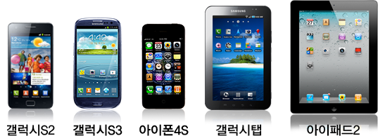
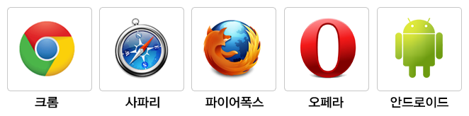
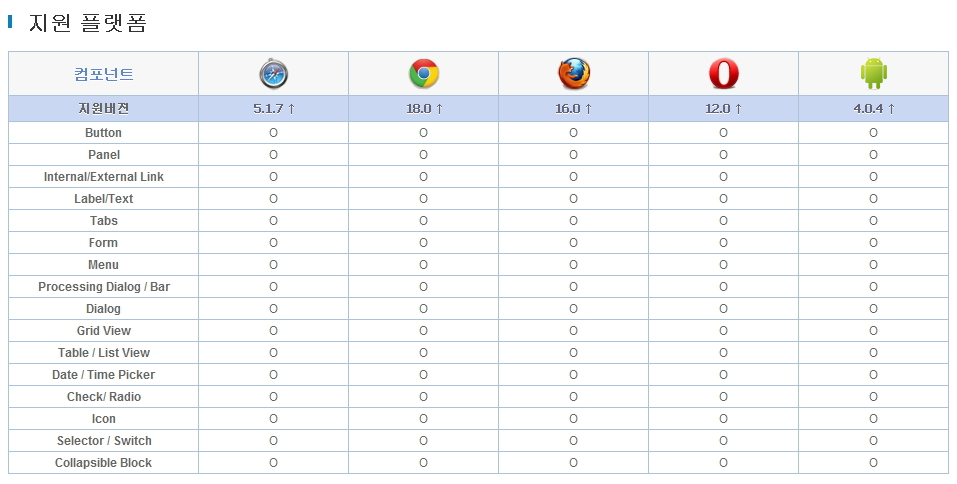

# UX/UI Controller Component

## 개요
전자정부에서 효율적인 스마트 전자정부 기반시스템의 구축•운영을 통해 전자정부의 서비스 품질 UX 레이어는 UI/UX Controller Component, JavaScript Module App Framework, HTML5, CSS3 서비스를 제공한다. 오픈소스는 JQuery Mobile을 채택하였으며 jQuery Mobile은 html5, CSS3, javascript를 제공한다. 오픈 소스를 Customizing 하여 UI레이어의 기능을 사용 하며 내용은 아래와 같다 UI/UX Controller Component 모바일 웹 사용자 환경(UX/UI)에 대한 유연한 대응을 위해 Touch Optimized 된 필수 UI 컨트롤러 컴포넌트를 제공한다. HTML5는 모바일 웹 페이지 구성 시 사용 할 수 있는 마크업 언어로서 모바일 특화 태그 밑 디바이스 API를 제공한다. CSS3는 모바일 기기 및 브라우저에 따라 적합한 컴포넌트가 보여지는 기능을 제공한다. 또한 JavaScript Module App Framework UX/UI controller component의 효율성을 보장하는 javascript 밑 Json 구조를 제공한다.

## 설명
UX 처리 레이어는 모바일 환경을 화면을 담당하는 레이어로 화면 구성을 위한 Button, Panel, Internal/Externel Link, Process Dialog/Bar, Menu, Date/Time Picker, Check, Radio, Label/Text, TABS, Form, Grid, List View ICon, Selector, Collapsible Block를 제공한다.모바일 화면에 특화된 16개의 컴포넌트를 제공한다

### 모바일 페이지 선언
jQuery Mobile 은 HTML5의 doctype 으로 선언하여야 하며, jQueryMobile에서 사용하는 CSS, JS(jQuery, jQueryMobile)를 Import 함으로서 사용 할 수 있다.

jQuery Mobile은 jQuery Core를 사용하고 있다.

#### 모바일 Page Header
Page의 Header 선언 부분에 모바일 실행환경을 import한다.

```html
<!DOCTYPE html>
<html>
 <head>
  <title>eGovFrame</title>
  <meta name="viewport" content="width=device-width, initial-scale=1.0, maximum-scale=1.0, user-scalable=no">
  <link rel="stylesheet" href="/css/egovframework/mbl/cmm/jquery.mobile-1.3.2.css"/>
  <link rel="stylesheet" href="/css/egovframework/mbl/cmm/EgovMobile-1.3.2.css" />
  <script src="/js/egovframework/mbl/cmm/jquery-1.9.1.min.js"></script>
  <script src="/js/egovframework/mbl/cmm/jquery.mobile-1.3.2.min.js"></script>
  <script src="/js/egovframework/mbl/cmm/EgovMobile-1.3.2.js"></script>
 </head>
 <body>
 ...
 </body>
</html>
```

#### 모바일 Page Body
jQuery Mobile 의 Page 구조는 div를 사용하여 표현하며 html5의 ‘data-*' 속성을 이용하여 구조를 구분한다.

```html
<div data-role=“page”>
 <div data-role=“header”>
 </div>
 <div data-role=“content”>
 </div>
 <div data-role=“footer”>
 </div>
</div>
````

#### 모바일 Page Link

jQuery Mobile 은 하나의 페이지를 \<div data-role=“page”> 단위로 관리 하며 한 HTML 내에 여러 \<div data-role=“page”> 가 있을 경우 제일 상단의 div page를 첫 화면으로 인식한다. 이들 내부 페이지 간 이동은 링크 속성에 #pageName을 사용해서 가능 하다. jQuery Mobile 은 외부 페이지 이동시 anchor 태그의 링크를 가로채서 Ajax 로 해당 URL 호출 후 호출 된 Page 의 \<div data-role=“page”> 영역만 가져와서 호출 한 HTML 페이지의 DOM 에 해당 내용을 추가 한다.

* Ajax 로 호출된 page 의 CSS, JS 는 가져 오지 않기 때문에 호출한 Page는 호출된 Page 의 JS, CSS를 포함하고 있어야 한다.
* 외부페이지 이동 시 ajax 통신을 하고 싶지 않은 경우에는 data-ajax=“false”를 사용한다.

### UX Component
| **컴포넌트**                    | **제공기능**                                                                                                                                                               |
|----------------------------------|--------------------------------------------------------------------------------------------------------------------------------------------------------------------------|
| **Button**                       | **설명**: 명령 수행, 옵션 선택, 다른 대화 상자 열기 등에 사용하는 컴포넌트 제공                                                                                             |
|                                  | **형태**: 둥근 형(radius: 1em), 사각형(radius: 0em)                                                                                                                      |
|                                  | **배치**: vertical group, horizontal group                                                                                                                               |
|                                  | **색상**: 검정, 파랑, 회색, 흰색, 노랑, 빨강, 초록                                                                                                                      |
|                                  | **높이**: normal(39px), small (28px)                                                                                                                                     |
|                                  | **넓이**: 화면에 맞게 , 텍스트에 맞게                                                                                                                                    |
| **Panel**                        | **설명**: Header/footer 와 함께 페이지를 구성하는 요소                                                                                                                    |
|                                  | **무늬**: 격자 형태 무늬 제공                                                                                                                                            |
|                                  | **색상**: 검정, 회색, 연한회색, 흰색, 노랑, 빨강, 초록                                                                                                                   |
| **Internal / External Link**      | **설명**: 표준 링크 기능을 제공하며 기본적으로 Ajax 를 사용한 링크 방식 제공                                                                                               |
|                                  | **링크**: 페이지 내부링크, 도메인 내부 링크, 외부 링크, 이메일 링크, 폰 링크, 에러 페이지 링크                                                                             |
| **Label / Text**                 | **설명**: 색상, 배치, 크기, 폰트를 지정 할 수 있는 가이드 제공                                                                                                           |
|                                  | **색상**: 초록, 빨강, 파랑                                                                                                                                                |
|                                  | **배치**: 왼쪽, 중간, 오른쪽                                                                                                                                             |
|                                  | **크기**: 15px, 25px, 30px                                                                                                                                               |
|                                  | **폰트**: helvetica, verdana, tahoma                                                                                                                                     |
| **Tabs**                         | **설명**: Header와 footer 에 사용되며 탭 버튼으로 문서간 이동 기능 제공                                                                                                   |
|                                  | **형태**: round tab(radius: 0.250em), normal tab(radius: 0em)                                                                                                            |
|                                  | **배치**: 1, 1/2, 1/3, 1/4, 1/5, 1/2 다중행 tab                                                                                                                          |
|                                  | **색상**: 검정, 파랑, 회색, 흰색, 노랑, 빨강, 초록                                                                                                                      |
| **Form**                         | **설명**: HTML Form 요소를 모바일 환경에 최적화하여 제공                                                                                                                  |
|                                  | **요소**: Text inputs, Search inputs, Sliders, Switches, Radio buttons, Check boxes, Selectors                                                                            |
|                                  | **색상**: 검정, 파랑, 회색, 흰색, 노랑, 빨강, 초록                                                                                                                      |
| **Menu**                         | **설명**: Dialog, Grid, List, Collapsible 컴포넌트를 사용하여 메뉴 구성 기능 제공                                                                                          |
|                                  | **효과**: slide, slideup, slidedown, pop, fade, flip, turn, flow, slidefade                                                                                               |
|                                  | **형태**: Dialog, Grid, List, Collapsible                                                                                                                                |
|                                  | **색상**: 검정, 파랑, 회색, 흰색, 노랑, 빨강, 초록                                                                                                                      |
| **Processing Dialog / Bar**      | **설명**: 페이지 전환 간 진행 상태를 확인 할 수 있는 Progress Dialog/Bar 제공                                                                                             |
|                                  | **형태**: Processing Dialog, Processing Bar                                                                                                                              |
|                                  | **색상**: 검정, 파랑, 회색, 흰색, 노랑, 빨강, 초록                                                                                                                      |
| **Dialog**                       | **설명**: 사용자와 상호작용할 수 있는 Dialog 기능 제공                                                                                                                   |
|                                  | **형태**: Dialog, Action Sheet, Overlay, Alert, Prompt, Confirm                                                                                                          |
|                                  | **색상**: 검정, 파랑, 회색, 흰색, 노랑, 빨강, 초록                                                                                                                      |
| **Grid View**                    | **설명**: Grid 형태로 컨텐츠를 배치할 수 있는 컴포넌트 제공                                                                                                              |
|                                  | **배치**: 1/2, 1/3, 1/4, 1/5, 가변 Grid View                                                                                                                             |
| **Table / List View**            | **설명**: Table/List 형태로 컨텐츠를 배치할 수 있는 컴포넌트 제공                                                                                                         |
|                                  | **형태**: Read-only list, Link list                                                                                                                                      |
|                                  | **기능**: Nested List, Numbered List, Split Button, List Divider, Count Bubble, Thumbnail, List icon, Content Formatting, Search Filter Bar, Change Mode List, Checked List |
|                                  | **색상**: 검정, 파랑, 회색, 흰색, 노랑, 빨강, 초록                                                                                                                      |
| **Date / Time Picker**           | **설명**: 날짜와 시간을 선택할 수 있는 Picker 제공                                                                                                                       |
|                                  | **형태**: Android Date Picker, Popup Calendar, Android Time Picker, Flip Picker(Date, Time)                                                                               |
| **Check/ Radio**                 | **설명**: Check/Radio 형태로 항목을 선택할 수 있는 기능 제공                                                                                                              |
|                                  | **배치**: vertical group, horizontal group                                                                                                                              |
|                                  | **색상**: 검정, 파랑, 회색, 흰색, 노랑, 빨강, 초록                                                                                                                      |
| **Icon**                         | **설명**: 모바일 어플리케이션에 가장 많이 사용되는 아이콘 제공                                                                                                           |
|                                  | **형태**: arrow-l, arrow-r, arrow-u, arrow-d, delete, plus, minus, check, gear, refresh, forward, back, grid, star, alert, info, search, home, phone, mail, gps, audio, camera, file, mic, explorer |
|                                  | **색상**: 검정, 파랑, 회색, 흰색, 노랑, 빨강, 초록                                                                                                                      |
| **Selector / Switch**            | **설명**: Selector/Switch 형태로 항목을 선택할 수 있는 기능 제공                                                                                                          |
|                                  | **효과**: pop-up, list                                                                                                                                                  |
|                                  | **기능**: 다중선택, 단일 선택                                                                                                                                            |
|                                  | **모양**: 둥근 형(radius: 1em), 사각형(radius: 0em)                                                                                                                     |
|                                  | **넓이**: 화면에 맞게, 텍스트에 맞게                                                                                                                                     |
|                                  | **효과**: Shadow 적용, Shadow 제거                                                                                                                                      |
|                                  | **형태**: 비그룹, 그룹                                                                                                                                                  |
|                                  | **색상**: 검정, 파랑, 회색, 흰색, 노랑, 빨강, 초록                                                                                                                      |
| **Collapsible Block**            | **설명**: 콘텐츠 영역을 접었다 펼 수 있는 컨트롤 기능 제공                                                                                                                |
|                                  | **형태**: normal, Group, Nested                                                                                                                                          |
|                                  | **색상**: 검정, 파랑, 회색, 흰색, 노랑, 빨강, 초록                                                                                                                      |

### UX 컴포넌트별 브라우저 호환성 준수 지침 기준

1. 근거 기준: 전자정부서비스 호환성 준수지침(행정안전부고시 제2010-40호, 2010. 6. 24) 
2. 개정 이유: 모바일 전자정부 서비스 제공시 접근성 제고등을 위하여 공공기관이 준수해야 할 사항을 규정
3. 주요 개정 내용
   * 국민들이 다양한 모바일 기기를 사용할 수 있도록 모바일 ‘앱’방식보다 모바일’웹’방식을 권고
   * 모바일 웹 방식 개발을 위한 기술 표준 지침
     * 최소3종 이상 웹 브라우저에서 동등한 서비스 제공
     * 국제 표준화 기구에서 제공하는 표준 사용 의무화
4. 전자정부 모바일 서비스 제공 원칙
   * 다양한 스마트폰 사용자들이 모두 혜택을 받을 수 있도록 모바일 웹 방식의 개발을 권장
   * 모바일 공통컴포넌트 별 지원 브라우저(호환성) 참조

### UX 컴포넌트 별 지원 브라우저 (호환성)

**테스트 디바이스**



**테스트 브라우저**



**모바일 표준프레임워크 사용자경험(UX)지원 브라우저 내용**



## 참고자료
[모바일 실행환경 사용자경험(UX)지원기능 가이드](http://m.egovframe.go.kr/mguide3.5/)