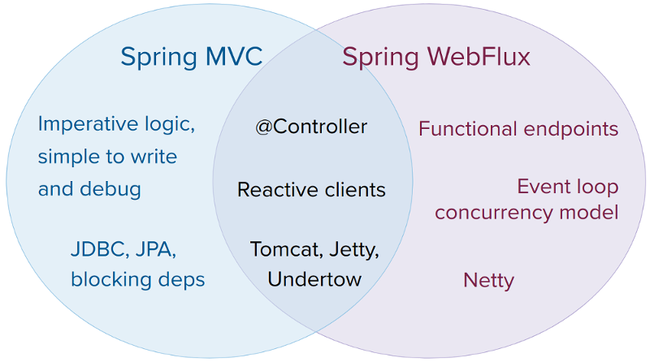

# Web Reactive

## 개요

스프링 프레임워크, 스프링 웹 MVC를 포함한 기존 웹 프레임워크는 서블릿 API와 서블릿 컨테이너를 위해 개발되었다. 스프링 WebFlux는 5.0 버전부터 추가된 리액티브 스택 웹 프레임워크로서, 서블릿 API와 서블릿 컨테이너를 개발하기 위한 스프링 프레임워크이다.
스프링 웹 MVC를 포함한 기존의 웹 프레임워크와 달리 완전한 논블로킹으로 동작하며 Reactive Streams back pressure를 지원하고 Netty, Undertow, 서블릿 3.1+ 컨테이너 서버에서 실행된다. 웹 프레임워크 모두 스프링 프레임워크에 포함되어 있으며, 원하는 모듈을 선택하여 개발할 수 있다.

## 설명

### Overview

스프링 WebFlux가 탄생한 이유 중 하나는 적은 쓰레드로 동시 처리를 제어하고 적은 하드웨어 리소스로 확장하기 위해 논블로킹 웹 스택이 필요했기 때문이다. 이전에도 서블릿 3.1은 논블로킹 I/O를 위한 API를 제공했지만 서블릿으로 논블로킹을 구현하려면 다른 동기 처리나(Filter, Servlet) 블로킹 방식(getParameter, getPart)을 쓰는 API를 사용하기 어려우므로 어떤 논블로킹과도 잘 동작하는 새로운 공통 API를 만들게 됐다. 또한 이미 비동기 논블로킹 환경에서 자리를 잡은 서버(e.g. Netty) 때문에라도 새 API가 필요했다.

또 다른 이유는 함수형 프로그래밍으로 자바 8에서 추가된 람다 표현식으로 자바에서도 함수형 API를 작성할 수 있게 되어 continuation-style API로 비동기 로직을 선언적으로 작성할 수 있다.


### 리액티브(Reactive) 정의

리액티브라는 용어는 변화에 반응하는 것을 중심에 두고 만든 프로그래밍 모델을 의미한다. 논블로킹은 작업을 기다리기보단 완료되거나 데이터를 사용할 수 있게 되면 반응하므로 논블로킹도 리액티브이다. 스프링은 리액티브와 관련한 중요한 메커니즘이 하나 더 있는데, 논블로킹 back pressure이다. 동기식 명령형 코드에서 블로킹 호출은 호출자가 대기하도록 하는 자연스러운 형태의 back pressure 역할을 한다. 논블로킹 코드에서는 프로듀서 속도가 컨슈머 속도롤 압도하지 않도록 이벤트 속도를 제어하는 것이 중요하다.

리액티브 스트림은 비동기 구성 요소 간의 상호 작용을 정의하는 간단한 사양(Java 9에서도 채택됨)으로, back pressure가 있는 비동기 구성 요소 간의 상호 작용을 정의한다. 예를 들어 데이터 저장소(Publisher 역할)가 데이터를 생성하면 HTTP 서버(Subscriber 역할)가 이 데이터로 요청을 처리할 수 있다. 리액티브 스트림의 주요 목적은 Subscriber가 Publisher의 데이터 생성 속도를 제어할 수 있도록 하는 것이다.

```
자주 묻는 질문 : Publisher 속도를 늦출 수 없으면 어떻게 할까?
리액티브 스트림의 목적은 메커니즘과 경계를 확립하는 것이다. Publisher가 속도를 늦출 수 없다면 데이터를 버퍼에 담을지(Buffer), 데이터를 삭제할지(Drop), 실패(Fail)로 처리할지를 결정해야 한다.
```

### 리액티브 API

리액티브 스트림은 상호 운용성을 위해 중요한 역할을 한다. 하지만 이건 라이브러리와 인프라 구조에 사용되는 컴포넌트에는 유용하지만 애플리케이션 API에서 다루기엔 너무 저수준이다. 애플리케이션은 컬렉션 뿐만 아니라 비동기 로직을 구성하기 위해 더 높은 수준의 더 풍부하고 기능적인 API가 필요하다. 이는 Java 8 Stream API와 유사하며 이것이 바로 리액티브 라이브러리가 하는 역할이다.

Reactor는 스프링 WebFlux가를 위해 선택된 리액티브 라이브러리이다. 이 라이브러리는 0…1(Mono) 및 0…N(Flux)의 데이터 시퀀스에서 작업할 수 있는 Mono 및 Flux API 유형을 제공하며, ReactiveX의 연산자 어휘와 일치하는 풍부한 연산자 집합을 통해 작동한다. Reactor는 리액티브 스트림 라이브러리이므로 모든 연산자는 논블로킹 back pressure를 지원한다. Reactor는 서버 측 Java에 중점을 두고 스프링과 긴밀히 협력하여 개발되었다.

WebFlux는 핵심 종속성으로 Reactor를 필요로 하지만, 리액티브 스트림를 통해 다른 리액티브 라이브러리와 상호 운용할 수 있다. 일반적으로 WebFlux API는 일반 Publisher를 입력으로 받아 내부적으로 Reactor 유형에 맞게 조정하고 이를 사용한 후 Flux 또는 Mono를 출력으로 반환한다. 따라서 모든 Publisher를 입력으로 전달할 수 있고 출력에 연산을 적용할 수 있지만 다른 리액티브 라이브러리와 함께 사용하려면 출력을 조정해야 한다. 가능한 경우(예: 주석이 달린 컨트롤러) WebFlux는 RxJava나 다른 리액티브 라이브러리에 맞게 바꿔준다. 자세한 내용은 리액티브 라이브러리를 참조하라.

### Programming Models

스프링 웹 모듈에 있는 WebFlux는 여러 서버를 지원하기 위한 HTTP 추상화와 리액티브 스트림 어댑터, 코덱, Servlet APT에 상응하는 핵심 웹 핸들러 API 등 스프링 WebFlux의 기반이 되는 리액트브 기반이 포함되어 있다. 이러한 기분 위에서 스프링 WebFlux는 두 가지 프로그래밍 모델 중 하나를 선택할 수 있다.

- Annotated Controllers : 스프링 MVC와 일치하며 스프링 웹 모듈의 동일한 주석을 기반으로 한다. 스프링 MVC와 WebFlux 컨트롤러는 모두 리액티브(Reactor 및 RxJava) 반환 유형을 지원하므로 구분하기가 쉽지 않다. 한 가지 주목할 만한 차이점은 WebFlux가 리액티브 @RequestBody 인수도 지원한다는 것이다.
- Functional Endpoints : 경량화된 람다 기반 함수형 프로그래밍 모델로 요청을 라우팅해주는 작은 라이브러리나 유틸리티 모음이라고 생각하면 된다. Annotated Controllsers와 다른 점은 애플리케이션이 처음부터 끝까지 요청 처리를 담당하고 어노테이션을 통해 의도를 선언한 후 다시 호출된다는 점이다.

### Applicability

스프링 MVC와 WebFlux 중 어떤 것을 적용할 것이냐는 이분법적 사고는 좋지 않다. 사실, 두 가지 모두 함께 작동하여 사용 가능한 옵션의 범위를 확장한다. 이 둘은 서로의 연속성과 일관성을 위해 설계되었으며, 나란히 사용할 수 있고, 각 측면의 피드백은 양쪽 모두에게 도움이 된다. 다음 다이어그램은 이 두 가지의 관계, 공통점, 그리고 각각 고유하게 지원하는 기능을 보여준다.

다음과 같은 구체적인 사항을 고려하는 것이 좋다.



- 정상적으로 작동하는 스프링 MVC 애플리케이션이 있다면 변경할 필요가 없다. 명령형 프로그래밍은 코드를 작성하고, 이해하고, 디버깅하는 가장 쉬운 방법이다. 역사적으로 대부분의 라이브러리가 차단되어 있기 때문에 라이브러리 선택의 폭이 넓습니다.
- 이미 논블로킹 웹 스택을 찾고 있다면, 스프링 WebFlux는 이 분야의 다른 제품과 동일한 실행 모델 이점을 제공하며 서버(Netty, Tomcat, Jetty, Undertow 및 Servlet 3.1+ 컨테이너), 프로그래밍 모델(Annotated Controllers and Functional Endpoints), 반응형 라이브러리(Reactor, RxJava 또는 기타) 선택도 제공한다.
- Java 8 람다 또는 Kotlin과 함께 사용하기 위한 가볍고 기능적인 웹 프레임워크에 관심이 있다면 스프링 WebFlux 함수형 웹 엔드포인트를 사용할 수 있다. 로직을 투명하게 제어할 수 있기 때문에 덜 복잡한 요구 사항을 가진 소규모 애플리케이션이나 마이크로서비스에도 좋은 선택이 될 수 있다.
- 마이크로서비스 아키텍처에서는 스프링 MVC 또는 스프링 WebFlux 컨트롤러를 사용하거나 스프링 WebFlux Functional Endpoints를 사용하는 애플리케이션을 혼합하여 사용할 수 있다. 두 프레임워크 모두에서 동일한 어노테이션 기반 프로그래밍 모델을 지원하므로 지식을 재사용하는 동시에 작업에 적합한 도구를 선택하기 쉽다.
- 애플리케이션을 평가하는 간단한 방법은 애플리케이션의 종속성을 확인하는 것이다. 블로킹 지속성 API(JPA, JDBC) 또는 네트워킹 API를 사용해야 하는 경우, 적어도 일반적인 아키텍처에서는 스프링 MVC가 가장 좋다. 별도의 스레드에서 블로킹 호출을 수행하는 것은 기술적으로 Reactor와 RxJava 모두에서 가능하지만 논블로킹 웹 스택을 활용하기 어렵다.
- 원격 서비스에 대한 호출이 있는 스프링 MVC 애플리케이션이 있는 경우 리액티브 WebClient를 사용하면 스프링 MVC 컨트롤러 메서드에서 직접 리액티브 유형(Reactor, RxJava 또는 기타)을 반환할 수 있다. 호출 당 지연 시간이 길거나 호출 간의 상호 의존성이 클수록 이 점은 더욱 극적으로 나타난다. 스프링 MVC 컨트롤러는 다른 리액티브 컴포넌트도 호출할 수 있다.
- 팀 규모가 크다면 논블로킹, 함수형, 선언적 프로그래밍은 러닝커브가 높다는 점도 고려해야 한다. 전면적인 전환없이 시작할 수 있는 실용적인 방법은 리액티브 웹클라이언트를 사용하는 것이다. 작은 것부터 시작해서 변화가 있는지 확인하면 전환이 불필요할 경우도 많을 것이다. 어떤 이점을 찾아야 할지 잘 모르겠다면 논블로킹 I/O의 작동 방식(예: 단일 스레드 Node.js의 동시 처리)과 그 효과에 대해 알아보는 것부터 시작해라.

### Servers

스프링 WebFlux는 Tomcat, Jetty, Servlet 3.1+ 컨테이너 뿐만 아니라 Netty 및 Undertow도 지원된다. 모든 서버는 낮은 수준의 공통 API에 맞춰 조정되므로 서버 전반에서 상위 수준의 프로그래밍 모델을 지원할 수 있다.

스프링 WebFlux에는 서버 기동이나 중단을 위한 내장 기능은 없다. 하지만 스프링 설정과 WebFlux를 조립해 구성한 코드로 쉽게 애플리케이션을 실행할 수 있다.

스프링 Boot에는 이러한 단계를 자동화하는 WebFlux 스타터가 있다. 기본적으로 스타터는 Netty를 사용하지만, Maven 또는 Gradle 종속성을 변경하여 Tomcat, Jetty 또는 Undertow로 쉽게 전환할 수 있다. 스프링 Boot가 Netty를 디폴트로 사용하는 이유는 보통 비동기 논블로킹에 많이 사용되기도 하고 클라이언트와 서버가 리소스를 공유할 수 있어서다.

Tomcat과 Jetty는 스프링 MVC와 WebFlux에 모두 사용할 수 있다. 하지만 동작방식은 다르다는 점에 주의해야 한다. 스프링 MVC는 Servlet 차단 I/O에 의존하며, 애플리케이션이 필요한 경우 Servlet API를 직접 사용할 수 있다. 스프링 WebFlux는 Servlet 3.1 논블로킹 I/O롤 동작하며 서블릿 API는 저수준 어댑터로 사용하기 때문에 노출되어 있지 않다.

스프링 WebFlux에서 Undertow를 사용할 때는 서블릿 API가 아닌 Undertow API를 사용한다.

### Performance

성능에는 많은 특징과 의미가 있다. 리액티브 및 논블로킹은 일반적으로 애플리케이션을 더 빠르게 실행하지 않는다. 일부 경우(예: 웹클라이언트를 사용하여 원격 호출을 병렬로 실행하는 경우)에는 그럴 수 있다. 전반적으로 논블로킹 방식으로 작업을 수행하려면 더 많은 작업이 필요하며 필요한 처리 시간이 약간 늘어날 수 있다.

리액티브 및 논블로킹 방식의 주요 이점은 적은 수의 고정된 스레드와 적은 메모리로 확장할 수 있다는 점이다. 따라서 애플리케이션이 보다 예측 가능한 방식으로 확장되므로 부하가 걸렸을 때 복원력이 향상된다. 그러나 이러한 이점을 누리려면 느리고 예측할 수 없는 네트워크 I/O가 혼합된 경우 등 지연 시간이 어느 정도 발생해야 한다. 바로 이 지점에서 리액티브 스택의 강점이 드러나기 시작하며, 그 차이는 극적일 수 있다.

### Concurrency Model

스프링 MVC와 스프링 WebFlux는 모두 Annotated Controller를 사용할 수 있다는 점은 동일해도 동시성 모델과 블로킹/스레드 기본 전략은 다르다.
스프링 MVC(그리고 일반적인 서블릿 애플리케이션)는 애플리케이션이 처리중인 스레드가 잠시 중단될 수 있다(예를 들어 원격 호출의 경우). 이러한 이유로 서블릿 컨테이너는 요청 처리 중에 잠재적인 차단을 흡수하기 위해 대규모 스레드 풀을 사용한다.
스프링 WebFlux(및 일반적으로 논블로킹 서버)에서는 실행되는 스레드가 중단되지 않는다는 전제가 있다. 따라서 논블로킹 서버는 작은 고정 크기의 스레드 풀(이벤트 루프 워커)을 사용하여 요청을 처리한다.

```
"확장"과 "적은 수의 스레드"는 모순적으로 들릴 수 있지만 현재 스레드를 차단하지 않고 대신 콜백에 의존한다는 것은 흡수할 차단 호출이 없기 때문에 추가 스레드가 필요하지 않다는 것을 의미한다.
```

#### Invoking a Blocking API

블로킹 라이브러리를 사용해야 한다면 어떻게 해야 할까? Reactor와 RxJava는 모두 다른 스레드에서 처리를 계속할 수 있는 PublishOn 연산자를 제공한다. 즉, 쉽게 빠져나갈 수 있는 탈출구가 있다는 뜻이다. 그러나 블로킹 API는 이 동시성 모델에 적합하지 않다는 점에 유의해야 한다.

#### Mutable State

Reactor와 RxJava에서는 연산자를 통해 로직을 선언한다. 런타임에 데이터가 별개의 단계에서 순차적으로 처리되는 리액티브 파이프라인이 형성된다. 이 파이프라인의 주요 이점은 해당 파이프라인 내의 애플리케이션 코드가 동시에 호출되지 않기 때문에 애플리케이션이 변경 가능한 상태를 보호할 필요가 없다는 것이다.

#### Threading Model

스프링 WebFlux를 사용하는 애플리케이션은 어떤 스레드를 얼마나 실행할까?

- 최소한의 설정으로 스프링 WebFlux 서버를 띄우면(예를 들어 데이터 접근이나 다른 의존성이 없는) 서버는 한 개의 스레드를 운영하고 소량의 스레드로 요청을 처리할 수 있다(보통은 CPU 코더 수만큼). 하지만 서블릿 컨테이너는 서블릿 블로킹 I/O와 서블릿 3.1 논블로킹 I/O를 모두 지원하기 때문에 더 많은 스레드(예들 들어 Tomcat의 경우 10개)를 실행할 것이다.
- 리액티브 WebClient는 이벤트 루프를 사용한다. 따라서 적은 스레드를 고정해 두고 쓴다(예를 들어 Reactor Nettry 커넥터를 쓴다면 reactor-http-nio-로 시작하는 스레드를 확인할 수 있다.). 단 클라이언트와 서버에서 모두 Reactor Netty를 사용하면 디폴트로 이벤트 루프 리소스를 공유한다.
- Reactor와 RXJava는 스케줄러 라는 추상화된 스레드 풀 전략을 제공한다. publishOn 연산자가 나머지 연산을 다른 스레드 풀로 전환할 때도 이 스케줄러를 사용한다. 스케줄러는 이름을 보면 동시 처리 전략을 알 수 있다. 예를 들어 제한된 스레드로 CPU 연산이 많은 처리를 할 때는 parallel, 여러 스레드로 I/O가 많은 처리를 할 때는 elastic이다. 이런 스레드를 본다면 코드 어딘가에서 그 이름에 해당하는 스레드 풀 스케줄러 전략을 사용하고 있다는 뜻이다.
- 데이터에 접근하는 라이브러리나 다른 외부 의존성에서 스레드를 따로 실행하는 경우도 있다.

#### Configuring

스프링 프레임워크에서 서버를 직접 실행하거나 중단할 수 없다. 서버의 스레딩 모델을 구성하려면 서버별 구성 API를 사용하거나 스프링 Boot를 사용하는 경우 각 서버에 대한 스프링 Boot 구성 옵션을 확인해야 한다. WebClient를 직접 구성할 수도 있다. 다른 라이브러리의 경우 해당 라이브러리 설명서를 참고하라.

## 참고 자료

- [The Spring Framework - Web Reactive](https://docs.spring.io/spring-framework/docs/5.3.27/reference/html/web-reactive.html#spring-webflux)