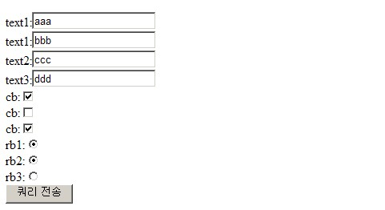

# AnnotationCommandmapArgumentResolver

## 개요

Controller에서 화면(JSP) 입력값을 받기 위해서 일반적으로 Command(Form Class) 객체를 사용하지만, Map 객체를 사용하는걸 선호할 수 있다.
전자정부프레임워크 버전 3.0이전에서는 CommandMapArgumentResolver를 통해 Map객체를 사용할 수 있었다. 그러나 3.0부터는 @CommandMap과 AnnotationCommandmapArgumentResolver를 통해 Map객체를 사용할 수 있다.
org.springframework.web.method.support.HandlerMethodArgumentResolver의 구현클래스인 AnnotationCommandMapArgumentResolver은 HTTP request 객체에 있는 파라미터이름과 값을 Map 객체에 담아 Controller에서 사용도록 제공한다.

## 설명

### HandlerMethodArgumentResolver

Sping MVC의 `@Controller`의 메소드의 argument로 사용할 수 있는 유형(이에 관한 정보는 이곳을 참조하라.)은 기존의 계층형 Controller보다 다양해 졌지만,
필요에 따라 기본 유형외의 custom argument를 사용해야 할때가 있을 것이다.
Sping MVC는 Controller의 argument 유형을 customizing 할 수 있는 HandlerMethodArgumentResolver라는 interface를 제공한다.
기존 Spring web 3.1이전 버전에서는 WebArgumentResolver를 구현하여 AnnotationMethodHandlerAdapter에 등록하여 ArgumentResolver를 적용하였으나,
3.1이후부터는 HandlerMethodArgumentResolver를 구현하여  RequestMappingHandlerAdapter에 등록하여 ArgumentResolver를 적용해야 한다.

아래와 같이 Controller의 메소드에서 MySpecialArg라는 custom argument를 argument로 사용하려 한다면,

```java
@Controller
public class HelloController {
    public String hello(MySpecialArg mySpecialArg,...) {
       ...
       return "...";
    }
}
```

인터페이스 HandlerMethodArgumentResolver를 구현한 클래스를 만든다. 구현해야 할 메소드는 아래와 같다.

```java
boolean supportsParameter(MethodParameter parameter);
 
Object resolveArgument(MethodParameter parameter,ModelAndViewContainer mavContainer, NativeWebRequest webRequest,WebDataBinderFactory binderFactory) throws Exception;
```

```java
public class MySpecialArgumentResolver implements HandlerMethodArgumentResolver{
 
	@Override
	public boolean supportsParameter(MethodParameter parameter) {
		if(MySpecialArg.class.isAssignableFrom(parameter.getParameterType())) {
			return true;
		}
		else {
			return false;
		}
	}
 
	@Override
	public Object resolveArgument(MethodParameter parameter,
			ModelAndViewContainer mavContainer, NativeWebRequest webRequest,
			WebDataBinderFactory binderFactory) throws Exception {
		return new MySpecialArg();		
	}
}
```

만들어진 ArgumentResolver클래스는 RequestMappingHandlerAdapter의 customArgumentResolvers 프로퍼티에 등록하도록 한다. list유형 프로퍼티이므로 여러개의 ArgumentResolver클래스를 등록할 수 있다.

```xml
<bean class="org.springframework.web.servlet.mvc.method.annotation.RequestMappingHandlerAdapter">
    <property name="customArgumentResolvers">
        <list>
            <bean class="... MySpecialArgumentResolver" />
        </list>
    </property>
</bean>
```

### AnnotationCommandMapArgumentResolver

HTTP request 객체에 있는 파라미터이름과 값을 특정 폼 빈에 담아서 사용하는 방식이 일반적이지만, Map 객체에 담아서 사용하는걸 선호하는 경우도 있다.
Controller에서 Map객체를 쓰기 위해 전자정부 프레임워크 3.0부터는 @CommandMap과 AnnotationCommandMapArgumentResolver를 쓰도록 한다.

```java
public String helloPost(@CommandMap Map commandMap, ModelMap model) {
...
}
```

Map commandMap에 파라미터의 이름과 값이 들어 있게 하려면 위에서 언급한 AnnotationCommandMapArgumentResolver를 이용해야 한다.
HandlerMethodArgumentResolver의 구현 클래스인 AnnotationCommandMapArgumentResolver는
Controller 메소드의 argument중에 @CommandMap이 붙은 Map 객체가 있다면, HTTP request 객체에 있는 파라미터이름과 값을 Map객체에 담는다.

```java
package egovframework.rte.ptl.mvc.bind;
...
public class AnnotationCommandMapArgumentResolver implements HandlerMethodArgumentResolver{
 
	@Override
	public boolean supportsParameter(MethodParameter parameter) {
		if(Map.class.isAssignableFrom(parameter.getParameterType()) 
				&& parameter.hasParameterAnnotation(CommandMap.class)) {
			return true;
		}
		else {
			return false;
		}
	}
 
	@Override
	public Object resolveArgument(MethodParameter parameter,
			ModelAndViewContainer mavContainer, NativeWebRequest webRequest,
			WebDataBinderFactory binderFactory) throws Exception {
 
		Map<String, Object> commandMap = new HashMap<String, Object>();
		HttpServletRequest request = (HttpServletRequest) webRequest.getNativeRequest();			
		Enumeration<?> enumeration = request.getParameterNames();
 
		while (enumeration.hasMoreElements()) {
			String key = (String) enumeration.nextElement();
			String[] values = request.getParameterValues(key);
			if (values!=null) {
				commandMap.put(key, (values.length > 1) ? values:values[0] );
			}
		}
		return commandMap;
	}
}
```

AnnotationCommandMapArgumentResolver를 사용하려면 EgovRequestMappingHandlerAdapter에 등록해야 한다. 보통의 경우는 RequestMappingHandlerAdapter를 등록하여 사용하면 되지만, Controller에 Map객체를 쓰기 위해 AnnotationCommandMapArgumentResolver를 등록하려면 egov3.0부터 제공하는 EgovRequestMappingHandlerAdapter를 사용해야 한다.
만약 RequestMappingHAndlerAdapter를 이용하거나 `<mvc:annotation-driven>`을 사용할 경우에는 AnnotationCommandMapArgumentResolver를 사용할 수 없으므로 주의해야 한다.

```xml
<bean class="egovframework.rte.ptl.mvc.bind.annotation.EgovRequestMappingHandlerAdapter">
	<property name="customArgumentResolvers">
		<list>
			<bean class="egovframework.rte.ptl.mvc.bind.AnnotationCommandMapArgumentResolver" />
		</list>
	</property>
</bean>
 
<bean class="org.springframework.web.servlet.mvc.method.annotation.RequestMappingHandlerMapping"/>
```

테스트를 위한 Form에 데이터를 아래와 같이 등록하고 폼을 제출했을때,



`@CommandMap` Map 객체의 데이터는 key, value 형태로 아래와 같이 들어 있다. 같은 파라미터 이름으로 여러값이 들어 있는 값은 배열로 들어 있다.

```
key:text1   value:{aaa,bbb}
key:text2   value:ccc
key:text3   value:ddd
key:cb   value:{on,on}
key:rb2   value:on
key:rb1   value:on
```

## 참고자료

- [new handler method controller processing](http://docs.spring.io/spring/docs/3.2.x/spring-framework-reference/html/new-in-3.1.html#new-in-3.1-handler-method-controller-processing)
