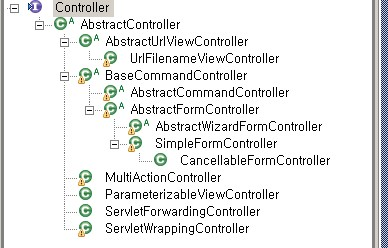
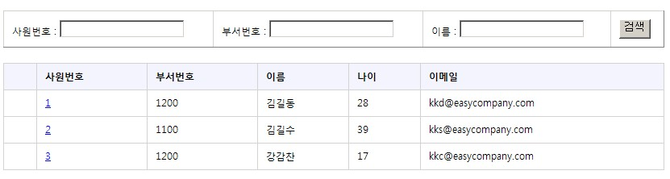
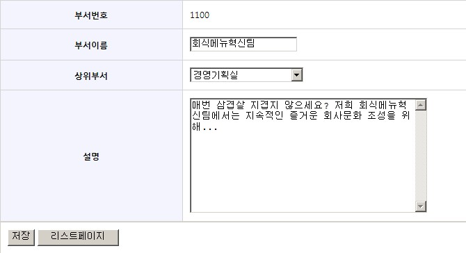

# Controller

## 개요

DispatcherServlet은 HandlerMapping를 이용해서 해당 요청을 처리할 Controller를 결정한다.
이 Controller는 요청에 대해서 처리를 하고 데이터를 Model 객체에 반영한다.
Spring MVC는 다양한 종류의 Controller를 제공하는데, 데이터 바인딩이나 폼 처리 또는 멀티 액션등의 편의 기능을 제공한다.
이 Controller들은 org.springframework.web.servlet.mvc.Controller 인터페이스를 구현한 클래스들이다.(@Controller는 예외다. 여기서는 @Controller에 대한 설명은 제외한다.)
eclipse에서 인터페이스 Controller를 Hierarchy View에서 열어보면 아래와 같은 구조를 보여준다.



이 중 주요 Controller의 용도 및 특징을 표로 나타내면 아래와 같다.

| 클래스                       | 용도 및 특징                                                                                                                                                                                                                                         |
|---------------------------|-------------------------------------------------------------------------------------------------------------------------------------------------------------------------------------------------------------------------------------------------|
| Controller                | 기본적인 Controller 인터페이스이다. Struts의 Action과 비교될 수 있다.<br> Spring에서는 Controller 작성시에 직접 Controller 인터페이스를 구현하지 말고, 아래의 구현 클래스를 확장해서 작성할것을 권장한다.                                                                                                     |
| AbstractController        | 웹 요청과 응답을 처리하는 기본적인 Controller이다.<br> WebContentGenerator를 상속받기 때문에, HTTP 메소드(POST,GET) 지정, 세션 필수 여부등의 편의기능을 추가로 받는다.                                                                                                                           |
| AbstractCommandController | HttpServletRequest의 파라미터를 동적으로 데이터 객체(Command)에 바인딩 할 수 있다.<br> 하지만 HTML 폼 처리시엔 SimpleFormController을 사용하라.                                                                                                                                     |
| SimpleFormController      | HTML 폼 처리시에 사용하는 Controller이다.<br> AbstractCommandController처럼 HttpServletRequest의 파라미터와 Command 객체를 바인딩할뿐 아니라,<br> 입력폼에 필요한 데이터를 채워 보여주거나(referenceData, formBackingObject), 일반적인 폼 처리 시나리오에 따른 view 분기(formView, successView) 등의 편의 기능을 제공한다. |
| MultiActionController     | 연관된 여러 액션을 한 Controller에서 처리할때 사용하는 Controller이다.                                                                                                                                                                                               |
| UrlFilenameViewController | Controller에서 처리 로직이 없이 바로 view로 이동하는 경우에 사용한다.                                                                                                                                                                                                  |

## 설명

### AbstractController

단순히 요청을 처리하고 그 결과를 ModelAndView 객체에 반영하는 작업을 할 때는 AbstractController을 상속한 Controller를 구현하면 된다.
구현 Controller에서는 AbstractController의 추상 메소드인 handleRequestInternal을 구현하면 된다.

```java
protected ModelAndView handleRequestInternal(HttpServletRequest request, HttpServletResponse response) throws Exception;
```

Controller를 작성할때 인터페이스 Controller를 바로 구현하는 대신, AbstractController를 상속받아 구현하면 특정 HTTP 메소드(GET,POST)에 대한 필터링이나 세션 필수 체크등의 편의 기능을 제공받는다.
AbstractController의 작업 흐름은 아래와 같다.

1. DispatcherServlet에 의해 handleRequest()가 호출된다.
2. 특정 HTTP 메소드(GET,POST)에 대한 필터링을 수행한다.
3. 세션필수여부값이 true이면 HttpServletRequest 객체에서 세션을 꺼낸다.
4. cacheSeconds 프로퍼티에 설정된 값에 따라 캐시 헤더를 설정한다.
5. 추상 메소드인 handleRequestInternal()을 호출한다. AbstractController를 상속받은 구현, Controller 클래스를 작성했다면 구현된 handleRequestInternal() 메소드가 실행된다.

관련 프로퍼티를 정리하면 아래와 같다.

| 이름                   | 기본값      | 설명                                                                                                                                        |
|----------------------|----------|-------------------------------------------------------------------------------------------------------------------------------------------|
| supportedMethods     | GET,POST | Controller가 지원하는 HTTP 메소드 리스트(GET, POST and PUT)로 콤마(,)로 구분한다.                                                                            |
| requireSession       | false    | Controller에서 요청 처리시에 session이 반드시 필요한지 여부이다. 값이 true인데 세션이 없다면 ServletException이 발생한다.                                                    |
| cacheSeconds         | -1       | 응답의 캐시 헤더에 설정하는 시간값으로 단위는 초단위이다.<br> 값이 0이면 캐시를 수행하지 않는 헤더를 갖게 되며, -1(기본값)이면 어떤 헤더도 생성하지 않으며, 양수값을 설정하면 설정한 값(초)만큼 내용을 캐싱을 수행하는 헤더를 생성한다. |
| synchronizeOnSession | false    | 메소드 handleRequestInternal()을 호출할때 세션(HttpSession)에 동기화(synchronized)해서 호출할지 여부이다. 만일 세션이 없다면 아무 영향이 없다.                                   |

#### 예제

사용자 인증처리를 위해 아이디와 패스워드를 입력받는 페이지 예제


```jsp
<%@ page contentType="text/html; charset=UTF-8"%>
<html>
	<head>
	<title>Login Page</title>
	<link type="text/css" rel="stylesheet" href="scripts/easycompany.css" />
</head>
<body>
	<form action="/easycompany/loginProcess.do" method="post">
		아이디 : <input type=text name="id"> 패스워드: <input type=password name="password"> <input type=submit value="로그인">
	</form>
</body>
</html>
```

로그인 처리를 하는 LoginController를 AbstractController를 확장해서 작성해 보자.
먼저 아래와 같이 빈설정을 하고

```xml
<bean name="/loginProcess.do" class="com.easycompany.controller.hierarchy.LoginController"
	p:loginService-ref="loginService"
	p:supportedMethods="POST"/> <!--HTTP 메소드가 POST일때만 처리한다-->
```

메소드 handleRequestInternal()에 실제 구현 로직을 넣어 준다.

```java
package com.easycompany.controller.hierarchy;
...
public class LoginController extends AbstractController{
 
	private LoginService loginService;
 
	public void setLoginService(LoginService loginService){
		this.loginService = loginService;
	}
 
	/**
	 *  AbstractController의 추상 메소드인 handleRequestInternal의 구현 메소드이다.
	 *  사용자로 부터 아이디, 패스워드를 입력받아 인증 성공이면 세션 객체에 계정정보를 담고 사원정보리스트 페이지로 포워딩한다.
	 *  인증에 실패하면 로그인 페이지로 다시 리턴한다.
	 */	
	@Override
	protected ModelAndView handleRequestInternal(HttpServletRequest request,
			HttpServletResponse response) throws Exception {
 
		String id = request.getParameter("id"); //아이디
		String password = request.getParameter("password"); //패스워드
 
		//로그인 인증을 처리한 후, 로그인 성공이면 Account 객체에 계정 관련정보를 리턴한다. 로그인 실패이면 null 리턴.  
		Account account = (Account) loginService.authenticate(id,password);
 
		if (account != null) { //로그인 성공
			request.getSession().setAttribute("UserAccount", account); //계정정보를 세션에 저장.
			return new ModelAndView("redirect:/employeeList.do"); //사원리스트 페이지로 이동.
		} else { //실패
			return new ModelAndView("login"); //로그인페이지로 이동
		}
	}
}
```

### AbstractCommandController

AbstractCommandController는 요청 파라미터값을 커맨드(Command) 클래스의 필드값과 자동으로 바인딩할 때 사용된다.
커맨드 클래스는 일반적인 JavaBean이면 되는데, ActionForm 같이 프레임워크에 종속적인 구조의 폼 클래스를 사용해야 하는 Struts와의 차이점이라 할 수 있다.
파라미터와 커맨드 클래스의 데이터 바인딩은 일반적으로 알려진 JavaBeans 프로퍼티 표시법을 따른다.
firstName 이란 이름의 파라미터가 있다면 커맨드 클래스의 setFirstName([value]) 메소드를 찾아 값을 바인딩한다.
파라미터 address.city 는 커맨드 클래스의 getAddress().setCity([value]) 메소드를 찾아 값을 바인딩한다.
이 기능은 HTML 폼 처리에 유용한 편의 기능이지만, 일반적으로 HTML 폼 처리에는 AbstractCommandController대신 SimpleFormController를 사용한다.
AbstractCommandController을 상속받는 구현 Controller에서는 추상메소드 handle()을 구현하면 된다.

```java
protected abstract ModelAndView handle(
			HttpServletRequest request, HttpServletResponse response, Object command, BindException errors) throws Exception;
```

#### 예제

사원번호,부서번호,사원이름등의 검색 조건에 따라 사원리스트를 보여주는 페이지 예제



검색 조건을 담는 빈은 아래와 같다.

```java
package com.easycompany.domain;
public class SearchCriteria {
 
	private String searchEid;
	private String searchDid;
	private String searchName;
 
    // 위의 변수들에 대한 getter/setter...
}
```

검색 조건을 화면으로 부터 입력받아 검색 조건 빈(bean)인 SearchCriteria에 담아서 서비스에 넘겨주고 리스트로 결과를 받아오는 EmployeeListController 작성해 보자.
EmployeeListController를 AbstractController를 이용해 만든다면, 파라미터의 값을 꺼내고 값을 객체에 담는 코드를 직접 작성해야 한다.

```java
package com.easycompany.controller.hierarchy;
...
public class EmployeeListController extends AbstractController{
	....
        protected ModelAndView handleRequestInternal(HttpServletRequest request,
			HttpServletResponse response) throws Exception {
 
		//request 객체의 파라미터값을 꺼내서
		String searchEid = request.getParameter("searchEid"); //사원번호
		String searchDid = request.getParameter("searchDid"); //부서번호
		String searchName = request.getParameter("searchName"); //사원이름
		//객체에 저장한다.
		SearchCriteria searchCriteria = new SearchCriteria();
		searchCriteria.setSearchEid(searchEid);
		searchCriteria.setSearchDid(searchDid);
		searchCriteria.setSearchName(searchName);
 
		List<Employee> employeelist = employeeService.getAllEmployees(searchCriteria);
 
		ModelAndView modelview = new ModelAndView();
		modelview.addObject("employeelist", employeelist);
		modelview.addObject("searchCriteria", searchCriteria);
		modelview.setViewName("employeelist");
 
		return modelview;
	}
}
```

맵핑해야할 파라미터가 많다면 상당히 번거로운 작업이고, 단순 작업 코드의 라인이 길어져 코드의 가독성도 떨어진다.
EmployeeListController를 AbstractCommandController을 상속받아 구현해 보면 아래와 같이 변경될 것이다.

```java
package com.easycompany.controller.hierarchy;
...
public class EmployeeListController extends AbstractCommandController{
	public EmployeeListController(){
		//Command 객체에 대한 선언. 빈 설정 파일에 Command 객체에 대한 선언이 있다면 이 코드는 필요없다.
		setCommandClass(SearchCriteria.class);
		setCommandName("searchCriteria");
	}
	....
 
	@Override
	protected ModelAndView handle(HttpServletRequest request,
			HttpServletResponse response, Object command, BindException errors)
			throws Exception {
		//이미 파라미터와 Command 객체의 바인딩이 되어 있다. 
		SearchCriteria searchCriteria = (SearchCriteria)command;
 
		List<Employee> employeelist = employeeService.getAllEmployees(searchCriteria);
 
		ModelAndView modelview = new ModelAndView();
		modelview.addObject("employeelist", employeelist);
		modelview.addObject("searchCriteria", searchCriteria);
		modelview.setViewName("employeelist");
 
		return modelview;
	}
}
```

커맨드 클래스 설정은 setCommandClass,setCommandName 메소드 대신에 빈 설정 파일에 정의할 수 있다.

```xml
<bean id="employeeListController" class="com.easycompany.controller.hierarchy.EmployeeListController"
	p:employeeService-ref="employeeService"
	p:commandName="searchCriteria"
	p:commandClass="com.easycompany.domain.SearchCriteria"/>
```

이 데이터 바인딩은 spring의 폼 태그 `<form:form>` 와 함께 쓰면 더욱 편리하게 사용할 수 있다.
폼 태그의 변수 **commandName은 커맨드 클래스의 이름과 일치**해야 한다.
커맨드 객체에 사원번호, 부서번호등의 값이 들어 있다면 JSP는 커맨드 객체의 필드값과 폼필드값을 자동으로 바인딩하여 보여주게 된다.

```jsp
<%@ taglib prefix="form" uri="http://www.springframework.org/tags/form" %>
...
<form:form commandName="searchCriteria" action="/easycompany/employeeList.do">
<table width="50%" border="1">
	<tr>
		<td>사원번호 : <form:input path="searchEid"/></td>
		<td>부서번호 : <form:input path="searchDid"/></td>
		<td>이름 : <form:input path="searchName"/></td>
		<td><input type="submit" value="검색" onclick="this.disabled=true,this.form.submit();" /></td>
	</tr>	
</table>
</form:form>
<table>
	<tr>
		<th></th>
		<th>사원번호</th>
		<th>부서번호</th>
		<th>이름</th>
		<th>나이</th>
		<th>이메일</th>
	</tr>	
<c:forEach items="${employeelist}" var="empinfo">	
	<tr>
		<td></td>
		<td><a href="javascript:getEmployeeInfo('${empinfo.employeeid}')">${empinfo.employeeid}</a></td>
		<td>${empinfo.departmentid}</td>
		<td>${empinfo.name}</td>
		<td>${empinfo.age}</td>
		<td>${empinfo.email}</td>
	</tr>
</c:forEach>
</table>
...
```

### SimpleFormController

HTML 폼을 보여주거나 전송(submission)하는 등에 폼처리를 다루는 Controller를 작성 한다면, SimpleFormController를 상속한 Controller를 구현하면 된다.
SimpleFormController는 상위 클래스인 BaseCommandController와 AbstractFormController가 제공하는 파라미터와 커맨드(폼) 클래스의 데이터 바인딩, 세션 폼 모드, 입력값 검증(validation), 입력폼에 초기 데이터 세팅등의 편의 기능을 그대로 사용하면서
폼 전송시에 결과에 따른 화면 분기(formView, successView)등 편의 기능을 추가로 제공한다.
폼을 보여주고 전송하는 Controller를 각각 만들지 않고 하나로 만들 수 있다.
SimpleFormController의 작업 흐름을 보려면 상위 클래스인 AbstractFormController의 handleRequestInternal() 메소드를 참고하면 되는데, 작업 흐름은 아래와 같다.

- GET 방식 호출
  - Controller가 폼 페이지에 대한 요청을 받는다. (GET 방식 호출)
  - formBackingObject() 메소드는 기본적으로 요청에 대한 커맨드 객체를 생성해서 반환한다. 일반적으로는 formBackingObject를 오버라이딩해서 GET 방식 호출시에 폼에 채우고자 하는 기본값을 가져오는 로직을 넣는다.
  - initBinder() 메소드가 실행되는데, 커맨드 클래스의 특정 필드에 대해서 커스텀 에디터를 사용할수 있도록 한다.
  - 프로퍼티 bindOnNewForm이 true이면, 초기 요청 파라미터들을 가지고 새로운 커맨드 객체에 값을 채우는데 ServletRequestDataBinder가 적용되며, onBindOnNewForm() 콜백 메소드가 호출된다.
  - showForm() 메소드는 referenceData()를 호출해서 폼 페이지에서 보여주고자 하는 참조 데이터(주로 셀렉트박스, 체크박스 같은 유형)를 ModelAndView에 저장한다.
  - formView에서는 Model 데이터를 바탕으로 폼에 필요한 데이터를 채워서 표시한다.

- POST 방식 호출
  - 사용자가 폼데이터를 전송한다(submit). (POST 방식 호출)
  - getCommand() 메소드가 커맨드 객체를 반환하는데,
만일 sessionForm이 false이면 formBackingObject() 메소드를 호출해서 커맨드 클래스의 인스턴스를 반환하고,
sessionForm이 true이면 세션에서 커맨드 객체를 꺼내서 반환한다. 만일 해당 객체를 세션에서 찾지 못하면 handleInvalidSubmit() 메소드를 호출한다. handleInvalidSubmit()는 새로운 커맨드 객체를 생성하고 다시 폼 전송을 시도한다.
  - 요청 파라미터들로 커맨드 객체를 채우기 위해 ServletRequestDataBinder가 사용된다.
  - onBind() 메소드를 호출한다. 유효성검사(validation) 수행전에 필요한 작업들을 수행할 수 있다.
  - 프로퍼티 validateOnBinding값이 true이면, 등록된 Validator가 호출된다. Validator는 커맨드 객체의 필드값에 대한 유효성을 검사한다.
  - onBindAndValidate() 메소드를 호출한다. 여기서 바인딩과 유효성 검사 이후 사용자 정의 작업을 수행할 수 있다.
  - processFormSubmission() 메소드에서 전송을 처리한다. 유효성검사 결과 에러가 있는 경우 showForm() 메소드가 호출되어 다시 formView로 이동하고 에러가 없으면 onSubmit() 메소드가 수행되면서 폼 제출이 된다.
  - 폼 제출이 성공하면 successView로 이동한다.

관련 프로퍼티는 아래와 같다.

| 이름                | 기본값     | 설명                                             | 해당클래스                  |
|-------------------|---------|------------------------------------------------|------------------------|
| commandName       | command | 커맨드 클래스의 이름(별칭)                                | BaseCommandController  |
| commandClass      | null    | 요청 파라미터와 데이터 바인딩하게 될 커맨드 클래스                   | BaseCommandController  |
| validators        | null    | 커맨드 객체의 데이터 유효성검사를 수행할 Validator 빈의 배열         | BaseCommandController  |
| validator         | null    | Validator가 한개인 경우 사용.                          | BaseCommandController  |
| validateOnBinding | true    | 유효성검사를 수행할지 여부. true이면 수행한다.                   | BaseCommandController  |
| bindOnNewForm     | false   | 새로운 폼이 보여지는 시점에서 데이터 바인딩을 할지 여부.               | AbstractFormController |
| sessionForm       | false   | 커맨드 객체를 세션에 저장하여 사용할지 여부.                      | AbstractFormController |
| formView          | null    | 사용자가 입력하는 폼페이지나 유효성검사시에 에러났을 경우에 사용하는 뷰를 표시한다. | SimpleFormController   |
| successView       | null    | 폼 제출이 성공했을때 보여줄 뷰를 표시한다.                       | SimpleFormController   |

#### 예제

부서 정보 수정 페이지(/easycompany/webapp/WEB-INF/jsp/modifydepartment.jsp) 예제
이 페이지의 처리 흐름은 아래와 같다.

- 사용자에게 입력폼페이지를 보여주되 기존의 부서정보를 채워서 보여준다. → 위에서 언급한 GET 방식 호출시의 프로세스에 따라 처리 된다.
- 사용자는 수정할 내용을 수정한 후에 저장 버튼을 누른다. → POST 방식 호출시의 프로세스에 따라 처리 된다.
  - 저장에 실패하거나 입력값 검증에 문제가 있으면 다시 초기 입력 폼페이지로 이동한다.
  - 저장에 성공하면 부서 정보 리스트페이지로 이동한다.



```jsp
<form:form commandName="department">
<table>
	<tr>
		<th>부서번호</th>
		<td><c:out value="${department.deptid}"/></td>
	</tr>
	<tr>
		<th>부서이름</th>
		<td><form:input path="deptname" size="20"/></td>
	</tr>
	<tr>
		<th>상위부서</th>
		<td>
			<form:select path="superdeptid">
				<option value="">상위부서를 선택하세요.</option>
				<form:options items="${deptInfoOneDepthCategory}" />
			</form:select>
		</td>
	</tr>
	<tr>
		<th>설명</th>
		<td><form:textarea path="description" rows="10" cols="40"/></td>
	</tr>	
</table>
<table width="80%" border="1">
	<tr>
		<td>
		<input type="submit" value="저장"/>		
		<input type="button" value="리스트페이지" onclick="location.href='/easycompany/departmentList.do?depth=1'"/>
		</td>
	</tr>
</table>
</form:form>
```

처리를 담당할 UpdateDepartmentController를 빈 설정 파일(xxx-servlet.xml)에 아래와 같이 등록한다.

```xml
<bean id="updateDepartmentController" class="com.easycompany.controller.hierarchy.UpdateDepartmentController"
        p:departmentService-ref="departmentService"
        p:commandName="department"
        p:commandClass="com.easycompany.domain.Department"
        p:formView="modifydepartment"
        p:successView="redirect:/departmentList.do?depth=1"/>
```

##### formBackingObject 메소드

```java
protected Object formBackingObject(HttpServletRequest request) throws Exception
```

일반적으로 수정 폼페이지는 기존의 데이터를 폼에 채우고 사용자가 원하는 부분을 수정한 후에 전송(submit)하는데,
기존 데이터를 불러와 폼에 채우는 역할을 formBackingObject 메소드가 담당한다.
formBackingObject 메소드는 커맨드 객체를 생성해서 리턴하는데, 필요에 따라 이 메소드를 오버라이드해서 필요한 데이터를 커맨드 객체에 채워 주면 된다.
부서 정보 수정 페이지에서 기존의 부서 정보를 채워서 보여 주는 부분을 먼저 작성해 보자.
오버라이드한 메소드에HTTP GET 메소드 요청이면 파라미터에 있는 부서 아이디로 부서 정보 테이블을 조회해서 결과를 객체 Department에 담아 반환하는 로직을 추가해 보자.

```java
package com.easycompany.controller.hierarchy;
...
 
public class UpdateDepartmentController extends SimpleFormController{
 
	private DepartmentService departmentService;
 
	public void setDepartmentService(DepartmentService departmentService){
		this.departmentService = departmentService;
	}
 
	@Override
	protected Object formBackingObject(HttpServletRequest request) throws Exception {
		if(!isFormSubmission(request)){	// GET 요청이면
			String deptid = request.getParameter("deptid");
			Department department = departmentService.getDepartmentInfoById(deptid);//부서 아이디로 DB를 조회한 결과가 커맨드 객체 반영.
			return department;
		}else{	// POST 요청이면
			//AbstractFormController의 formBackingObject을 호출하면 요청객체의 파라미터와 설정된 커맨드 객체간에 기본적인 데이터 바인딩이 이루어 진다.
			return super.formBackingObject(request);
		}
	}
        ...	
}
```

##### referenceData 메소드

```java
protected Map referenceData(HttpServletRequest request) throws Exception
protected Map referenceData(HttpServletRequest request, Object command, Errors errors) throws Exception
```

폼 페이지에 미리 보여 주어야 할 데이터중에 커맨드 객체에 포함하기 어려운 경우가 있다.
부서 정보 수정 페이지에 보면 상위 부서 정보가 셀렉트박스로 되어 있는데, 커맨드 객체인 부서(Department)객체에는 해당 부서의 상위부서번호만 있을 뿐 이 회사에 어떤 상위부서들이 있는 지에 대한 정보는 없다.
커맨드 객체에 없지만 페이지에 필요한 이런 참조성 데이터들을 사용하기 위해서 referenceData 메소드를 사용하면 된다.
referenceData 메소드는 맵 객체를 반환하는데 이 맵은 모델 객체에 담겨 ModelAndView에 저장된다.
우리는 그저 referenceData 메소드를 오버라이드해서 참조성 데이터를 맵 객체에 넣어 주면 된다.

```java
package com.easycompany.controller.hierarchy;
...
public class UpdateDepartmentController extends SimpleFormController{
 
	private DepartmentService departmentService;
 
	public void setDepartmentService(DepartmentService departmentService){
		this.departmentService = departmentService;
	}
 
	@Override
	protected Map referenceData(HttpServletRequest request, Object command, Errors errors) throws Exception{
 
		Map param = new HashMap();
		param.put("depth", "1");		
		Map referenceMap = new HashMap();
		referenceMap.put("deptInfoOneDepthCategory",departmentService.getDepartmentIdNameList(param));	//상위부서정보를 가져와서 Map에 담는다.
		return referenceMap;
	}
        ...
}
```

부서 정보 수정페이지를 열었을때 참조 데이터로 가져온 상위 부서 정보 리스트 중에 해당 부서의 상위 부서값이 셀렉트 박스에서 기본으로 선택(“selected”)되서 보여져야 한다면,
참조데이터 중에 커맨드 객체와 일치하는 값을 일일히 조건문을 사용해서 비교하는 로직을 넣어주는 중노동을 해야 하나,
스프링 폼태그를 사용하면 간단하게 해결된다.
referenceData 메소드가 반환한 상위 부서 정보 맵 데이터중에 해당 부서의 상위부서와 일치하는게 있으면 `<form:options>`은 해당 옵션을 선택(“selected”)으로 프린트한다.

```jsp
<form:select path="superdeptid">
	<option value="">상위부서를 선택하세요.</option>
	<form:options items="${deptInfoOneDepthCategory}" />
</form:select>
```

##### onSubmit 메소드

```java
protected ModelAndView onSubmit(Object command) throws Exception
protected ModelAndView onSubmit(Object command, BindException errors) throws Exception
protected ModelAndView onSubmit(HttpServletRequest request, HttpServletResponse response, Object command, BindException errors) throws Exception
```

onSubmit() 메소드를 오버라이드한 메소드를 만들어서 폼의 내용을 전송을 하는 로직을 넣어보자.
커맨드 객체인 부서 정보 객체(Department)의 내용을 DB에 반영하고, 처리가 성공했으면 successView로 이동하고 실패하면 showForm 메소드를 호출한다.
이 showForm 메소드는 폼페이지를 다시 보여주기 위해 필요한 데이터와 에러정보를 ModelAndView에 넣고 formView로 이동한다.

```java
package com.easycompany.controller.hierarchy;
...
public class UpdateDepartmentController extends SimpleFormController{
 
	private DepartmentService departmentService;
 
	public void setDepartmentService(DepartmentService departmentService){
		this.departmentService = departmentService;
	}
	...
	@Override
	protected ModelAndView onSubmit(HttpServletRequest request,
			HttpServletResponse response, Object command, BindException errors) throws Exception{
 
		Department department = (Department) command;
 
		try {
			departmentService.updateDepartment(department);
		} catch (Exception ex) {
			return showForm(request, response, errors);
		}
 
		return new ModelAndView(getSuccessView(), "department", department);
	}
	...
}
```

### MultiActionController

지금까지 살펴본 Controller들은 하나의 액션에 하나의 Controller를 만드는 방식이다. (SimpleFormController가 하나의 url에 대해 GET, POST 메소드에 따라 분기 처리를 하기는 하지만.)
연관있는 여러 액션들을 하나의 Controller에 모으고 싶다면 MultiActionController를 상속받아 Controller를 작성하면 되는데 하나의 액션을 하나의 메소드로 작성한다.
그 메소드는 아래의 형식을 갖는다.

```java
public (ModelAndView | Map | String | void) actionName(HttpServletRequest request, HttpServletResponse response);
```

그러면 어떤 액션(url)을 어떤 메소드가 처리 할지를 결정하는 일이 필요한데, 이때 도움을 주는 인터페이스가 MethodNameResolver이다.
MethodNameResolver은 요청에 대해서 어떤 메소드가 처리 할지 메소드 이름을 반환하는데, 스프링은 다음과 같은 3가지 MethodNameResolver 구현 클래스를 제공한다.

- ParameterMethodNameResolver : 특정 파라미터에 메소드 이름을 준다. 기본 파라미터는 action 이다.
- InternalPathMethodNameResolver : URL 경로의 마지막 부분중에 확장자를 제외한 부분이 메소드 이름이 된다.
- PropertiesMethodNameResolver : mapping 프로퍼티에 URL과 메소드 이름을 설정한다.

#### 예제

상위 부서 리스트를 가져오는 액션과 특정 상위 부서에 속한 하위 부서 리스트를 가져 오는 액션을 처리하는 DepartmentListController를 작성해 보자.

```java
package com.easycompany.controller.hierarchy;
...
public class DepartmentListController extends MultiActionController {
 
	...
	//상위 부서 리스트를 가져 온다.
	public ModelAndView departmentList(HttpServletRequest request, HttpServletResponse response){
 
		String depth = request.getParameter("depth");
 
		Map paramMap = new HashMap();
		paramMap.put("depth", depth);
 
		List<Department> departmentlist = departmentService.getDepartmentList(paramMap);
 
		ModelAndView mav = new ModelAndView("departmentlist");
		mav.addObject("departmentlist", departmentlist);
		return mav;
	}
 
	//특정 상위 부서에 속한 하위 부서 리스트를 가져 온다.	
	public ModelAndView subDepartmentList(HttpServletRequest request, HttpServletResponse response){
 
		String superdeptid = request.getParameter("superdeptid");
		String depth = request.getParameter("depth");
 
		Map paramMap = new HashMap();
		paramMap.put("depth", depth);
		paramMap.put("superdeptid", superdeptid);
 
		List<Department> departmentlist = departmentService.getDepartmentList(paramMap);
 
		ModelAndView mav = new ModelAndView("departmentsublist");
		mav.addObject("departmentlist", departmentlist);
		return mav;
	}
}
```

##### ParameterMethodNameResolver를 사용한 경우

```xml
<bean name="/departmentList.do" class="com.easycompany.controller.hierarchy.DepartmentListController"
	p:departmentService-ref="departmentService" 
	p:methodNameResolver-ref="paramResolver"/> <!-- ParameterMethodNameResolver를 MethodNameResolver로 사용-->
 
<bean id="paramResolver"
	class="org.springframework.web.servlet.mvc.multiaction.ParameterMethodNameResolver"
	p:paramName="method"/> <!--파라미터이름은 "method"-->
```

ParameterMethodNameResolver는 어떤 메소드를 호출할지에 대한 정보를 파라미터에 지정하는데, 파라미터 이름은 프로퍼티 “paramName”의 값이다.

- /easycompany/departmentList.do?depth=1&method=departmentList → departmentList()
- /easycompany/departmentList.do?superdeptid=1000&depth=2&method=subDepartmentList → subDepartmentList()

###### InternalPathMethodNameResolver를 사용한 경우

```xml
<bean id="departmentController" class="com.easycompany.controller.hierarchy.DepartmentListController"
	p:departmentService-ref="departmentService" 
	p:methodNameResolver-ref="pathResolver"/> <!-- InternalPathMethodNameResolver를 MethodNameResolver로 사용-->
 
<bean id="pathResolver"
	class="org.springframework.web.servlet.mvc.multiaction.InternalPathMethodNameResolver"/>
```

InternalPathMethodNameResolver를 사용하면 URL /abc/foo.do로 요청이 들어올때 public ModelAndView foo(HttpServletRequest, HttpServletResponse) 메소드로 맵핑된다.
예제에서 보면, URL과 메소드간에 맵핑이 아래와 같이 이루어 진다.

- /easycompany/departmentList.do?depth=1 → departmentList()
- /easycompany/subDepartmentList.do?superdeptid=1000&depth=2 → subDepartmentList()

###### PropertiesMethodNameResolver를 사용한 경우

```xml
<bean id="departmentController" class="com.easycompany.controller.hierarchy.DepartmentListController"
	p:departmentService-ref="departmentService" 
	p:methodNameResolver-ref="propResolver"/> <!-- InternalPathMethodNameResolver를 MethodNameResolver로 사용-->
 
<bean id="propResolver"
	class="org.springframework.web.servlet.mvc.multiaction.PropertiesMethodNameResolver">
        <property name="mappings">
            <props>
                <prop key="/departmentList.do">departmentList</prop>
                <prop key="/subDepartmentList.do">subDepartmentList</prop>
            </props>
        </property>
</bean>
```
PropertiesMethodNameResolver는 URL과 메소드의 매핑 관계를 “mappings” 프로퍼티에 명시해준다.

### UrlFilenameViewController
UrlFilenameViewController는 Controller에서 처리 로직이 없이 바로 view로 이동하는 경우에 사용하는 Controller이다.
DispatcherServlet을 거쳐야 하지만, html 위주의 static한 페이지를 보여줄때 사용한다.
아래와 같이 URL path가 곧 뷰이름이 되며, prefix와 suffix를 지정할수도 있다.

```
"/index" -> "index" 
"/index.html" -> "index" 
"/index.html" + prefix "pre_" and suffix "_suf" -> "pre_index_suf" 
"/products/view.html" -> "products/view"
```

Controller를 따로 만들 필요가 없으며, 아래와 같이 빈 설정 파일에서 url과 UrlFilenameViewController를 매핑만 해주면 된다.

```xml
<bean id="urlMapping" class="org.springframework.web.servlet.handler.SimpleUrlHandlerMapping">
    <property name="mappings">
        <props>
            <prop key="/login.do">urlFilenameViewController</prop>
            <prop key="/validator.do">urlFilenameViewController</prop>
        </props>
    </property>
</bean>
<bean id="urlFilenameViewController" class="org.springframework.web.servlet.mvc.UrlFilenameViewController" />
```
InternalResourceViewResolver가 아래와 같이 선언되어 있다면,

```xml
<bean class="org.springframework.web.servlet.view.InternalResourceViewResolver"
    p:prefix="/WEB-INF/jsp/" p:suffix=".jsp" />
```

URL http://localhost:8080/easycompany/login.do로 요청이 들어올때, /easycompany/webapp/WEB-INF/jsp/login.jsp을 찾아서 보여준다.

## 참고자료

- The Spring Framework - Reference Documentation 2.5.6
- Spring Framework API Documentation 2.5.6