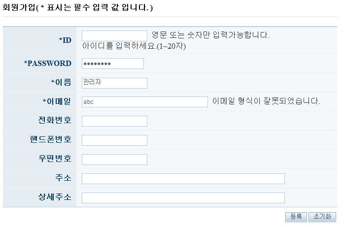

# Bean Validation (JSR-303)

## 개요

[화면처리: validation](web-servlet-validation.md)을 통해 검증방법을 알아보았다. 이전과는 다르게 JSR-303(Bean Validation) 스펙은 자동 검증 방식을 제공한다. @javax.validation.Valid애노테이션을 사용하여 내부적으로(자동으로) 검증이 수행된다.

또한, 최근에 표준 스펙으로 인증받은 JSR-303 빈 검증방식을 이용하여 모델 오브젝트 필드에서 애노테이션을 이용해 검증을 진행할 수 있다.

## 설명

### @Valid를 이용한 자동검증

기존의 검증 방식을 자동 검증 방식으로 변경하였으며, 방법은 컨트롤러 메소드의 `@ModelAttribute` 파라미터에 `@Valid` 애노테이션을 추가한다. 그러면 `validate()` 메소드를 실행하는 대신 바인딩 과정에서 자동으로 검증이 진행된다.

```java
@Controller
public class ExampleController {
 
	@Autowired ExampleValidator validator;
 
	@InitBinder
	public void initBinder(WebDataBinder dataBinder){
		dataBinder.setValidator(this.validator);
	}
 
 
	@RequestMapping("/insertMember.do")
	public String insertMember(@ModelAttribute("memberVO") @Valid MemberVO memberVO, BindingResult bindingResult, ..) {
		//..
	}
}
```

### JSR-303 빈 검증(bean validation) 기능

위의 방식은 기존의 검증방식을 자동 검증으로 변경한 방법이며 다음에 설명한 검증방법은 제약조건을 빈에 직접 설정하여 검증하는 방식이다.

먼저, 클래스패스에 의존 라이브러리를 추가해야 한다. 메이븐을 사용 중이라면 다음 의존 라이브러리를 프로젝트에 추가한다.

```xml
<dependency>
	<groupId>javax.validation</groupId>
	<artifactId>validation-api</artifactId>
	<version>1.0.0.GA</version>
</dependency>
<dependency>
	<groupId>org.hibernate</groupId>
	<artifactId>hibernate-validator</artifactId>
	<version>4.0.0.GA</version>
</dependency>
```

다음은 JSR-303 제약조건 애노테이션이 적용된 모델오브젝트 예제이다.

```java
public class MemberVO{
 
	@NotNull
	@Size(min = 1, max = 50, message="이름을 입력하세요.")
	private String name;
 
	@Pattern(regexp=".+@.+\\.[a-z]+", message= "이메일 형식이 잘못되었습니다.")
	private String email;
 
	//..
}
```

`@NotNull`은 빈문자열을 검증하지 못하기 때문에 `@Size(min=1)`을 사용하여 빈 문자열을 확인해야 한다.

위와같은 제약조건 애노테이션을 사용해 검증을 수행하기 위해서는 LocalValidatiorFactoryBean을 빈으로 등록해 줘야 한다. LocalValidatiorFactoryBean은 JSR-303의 검증기능을 스프링의 Validator처럼 사용할 수 있게 해주는 일종의 어댑터다. LocalValidatiorFactoryBean을 빈으로 등록하면 컨트롤러에서 Validator타입으로 DI 받아서 @InitBinder에서 WebDataBinder에 설정하거나 코드에서 직접 Validator처럼 사용할 수 있다.

```xml
<bean id="validator" class="org.springframework.validation.beanvalidation.LocalValidatorFactoryBean" />
```

빈 검증 기능을 validator로 사용하는 컨트롤러 예제이다.

```java
@Controller
public class ExampleController {
 
	@Resource
	Validator validator;
 
	@InitBinder
	public void initBinder(WebDataBinder dataBinder){
		dataBinder.setValidator(this.validator);
	}
 
	@RequestMapping("/insertMember.do")
	public String insertMember(@ModelAttribute("memberVO") @Valid MemberVO memberVO, BindingResult bindingResult, ..) {
		//..
	}
}
```



## 참고자료

- [Validator 예제](https://www.egovframe.go.kr/wiki/doku.php?id=egovframework:rte3.10:rex:validation_%EC%98%88%EC%A0%9C)
