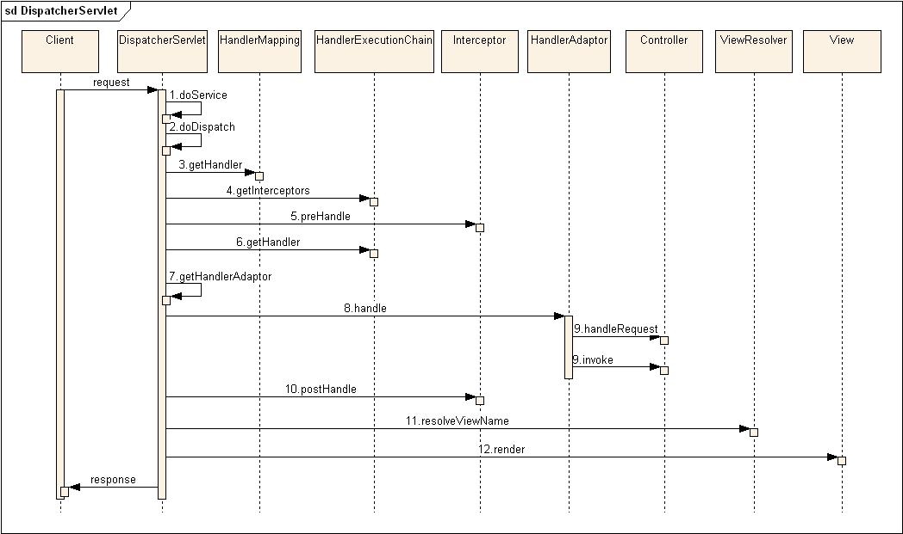
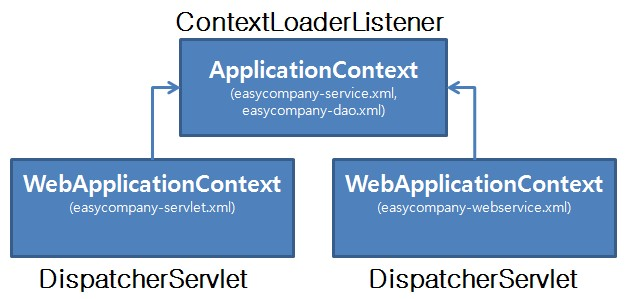

# DispatcherServlet

## 개요

Spring MVC Framework의 유일한 Front Controller인 DispatcherServlet은 Spring MVC의 핵심 요소이다.
DispatcherServlet은 Controller로 향하는 모든 웹요청의 진입점이며, 웹요청을 처리하며, 결과 데이터를 Client에게 응답 한다.
DispatcherServlet은 Spring MVC의 웹요청 Life Cycle을 주관한다 할 수 있다.

## 설명

### DispatcherServlet에서의 웹요청 흐름

Client의 웹요청시에 DispatcherServlet에서 이루어지는 처리 흐름은 아래와 같다.
좀더 자세한 처리 흐름을 알고 싶다면 디버깅모드로 과정을 추적해 보는 것을 권장한다.



1. doService 메소드에서부터 웹요청의 처리가 시작된다. DispatcherServlet에서 사용되는 몇몇 정보를 request 객체에 담는 작업을 한 후 doDispatch 메소드를 호출한다.
2. 아래 3번~13번 작업이 doDispatch 메소드안에 있다. Controller, View 등의 컴포넌트들을 이용한 실제적인 웹요청처리가 이루어 진다.
3. getHandler 메소드는 RequestMapping 객체를 이용해서 요청에 해당하는 Controller를 얻게 된다.
4. 요청에 해당하는 Handler를 찾았다면 Handler를 HandlerExecutionChain 객체에 담아 리턴하는데, 이때 HandlerExecutionChain는 요청에 해당하는 interceptor들이 있다면 함께 담아 리턴한다.
5. 실행될 interceptor들이 있다면 interceptor의 preHandle 메소드를 차례로 실행한다.
6. Controller의 인스턴스는 HandlerExecutionChain의 getHandler 메소드를 이용해서 얻는다.
7. HandlerMapping과 마찬가지로 여러개의 HanlderAdaptor를 설정할 수 있는데, getHandlerAdaptor 메소드는 Controller에 적절한 HanlderAdaptor 하나를 리턴한다.
8. 선택된 HanlderAdaptor의 handle 메소드가 실행되는데, 실제 실행은 파라미터로 넘겨 받은 Controller를 실행한다.
9. 계층형 Controller인 경우는 handleRequest 메소드가 실행된다. @Controller인 경우는 HanlderAdaptor(AnnotationMethodHandlerAdapter)가 HandlerMethodInvoker를 이용해 실행할 Controller의 메소드를 invoke()한다.
10. interceptor의 postHandle 메소드가 실행된다.
11. resolveViewName 메소드는 논리적 뷰 이름을 가지고 해당 View 객체를 반환한다.
12. Model 객체의 데이터를 보여주기 위해 해당 View 객체의 render 메소드가 수행된다.

### web.xml에 DispatcherServlet 설정하기

Spring MVC Framework을 사용하기 위해서는 web.xml에 DispatcherServlet을 설정하고, DispatcherServlet이 WebApplicationContext를 생성할수 있도록 빈(Bean) 정보가 있는 파일들도 설정해주어야 한다.

#### 기본 설정

```xml
<web-app>
        <!-- easycompnay라는 웹어플리케이션의 웹요청을 DispatcherServlet이 처리한다.-->
        <servlet>
		<servlet-name>easycompany</servlet-name>
		<servlet-class>org.springframework.web.servlet.DispatcherServlet</servlet-class>
	</servlet>
</web-app>
```

servlet-name은 DispatcherServlet이 기본(default)으로 참조할 빈 설정 파일 이름의 prefix가 되는데, (servlet-name)-servlet.xml 같은 형태이다.
위 예제와 같이 web.xml을 작성했다면 DispatcherServlet은 기본으로 /WEB-INF/easycompany-servlet.xml을 찾게 된다.

#### contextConfigLocation을 이용한 설정

빈 설정 파일을 하나 이상을 사용하거나, 파일 이름과 경로를 직접 지정해주고 싶다면 contextConfigLocation 라는 초기화 파라미터 값에 빈 설정 파일 경로를 설정해준다.

```xml
...
<servlet>
    <servlet-name>easycompany</servlet-name>
    <servlet-class>org.springframework.web.servlet.DispatcherServlet</servlet-class>
    <init-param>
        <param-name>contextConfigLocation</param-name>
        <param-value>
                        /WEB-INF/config/easycompany-web.xml
        </param-value>
    </init-param>
</servlet>
```

#### ContextLoaderListener를 이용한 설정

일반적으로 빈 설정 파일은 하나의 파일만 사용되기 보다는 persistance, service, web등 layer 단위로 나뉘게 된다.
또한, 같은 persistance, service layer의 빈을 2개 이상의 DispatcherServlet이 공통으로 사용할 경우도 있다.
이럴때는 공통빈(persistance, service)설정 정보는 ApplicationContext에, web layer의 빈들은 WebApplicationContext에 저장하는 아래와 같은 방법을 추천한다.
공통빈 설정 파일은 서블릿 리스너로 등록된 org.springframework.web.context.ContextLoaderListener로 로딩해서 ApplicationContext을 만들고,
web layer의 빈설정 파일은 DispatcherServlet이 로딩해서 WebApplicationContext을 만든다.

```xml
....
    <!-- ApplicationContext 빈 설정 파일-->
    <context-param>
            <param-name>contextConfigLocation</param-name>
            <param-value>
                        <!--빈 설정 파일들간에 구분은 줄바꿈(\n),컴마(,),세미콜론(;)등으로 한다.-->
                        /WEB-INF/config/easycompany-service.xml,/WEB-INF/config/easycompany-dao.xml 
                </param-value>
	</context-param>
	
    <!-- 웹 어플리케이션이 시작되는 시점에 ApplicationContext을 로딩하며, 로딩된 빈정보는 모든 WebApplicationContext들이 참조할 수 있다.-->
    <listener>
		<listener-class>org.springframework.web.context.ContextLoaderListener</listener-class>
	</listener>

	<servlet>
		<servlet-name>employee</servlet-name>
		<servlet-class>org.springframework.web.servlet.DispatcherServlet</servlet-class>
		<init-param>
			<param-name>contextConfigLocation</param-name>
			<param-value>
				/WEB-INF/config/easycompany-service.xml
			</param-value>
		</init-param>
	</servlet>
        
    <servlet>
		<servlet-name>webservice</servlet-name>
		<servlet-class>org.springframework.web.servlet.DispatcherServlet</servlet-class>
		<init-param>
			<param-name>contextConfigLocation</param-name>
			<param-value>
				/WEB-INF/config/easycompany-webservice.xml
			</param-value>
		</init-param>
	</servlet>
....
```

이 ApplicationContext의 빈 정보는 모든 WebApplicationContext들이 참조할 수 있다.
예를 들어, DispatcherServlet은 2개 사용하지만 같은 Service, DAO를 사용하는 web.xml을 아래와 같이 작성했다면,
easycompany-servlet.xml에 정의된 빈정보는 easycompany-webservice.xml가 참조할 수 없지만,
easycompany-service.xml, easycompany-dao.xml에 설정된 빈 정보는 easycompany-servlet.xml, easycompany-webservice.xml 둘 다 참조한다.
ApplicationContext과 WebApplicationContext과의 관계를 그림으로 나타내면 아래와 같다.



## 참고자료

- The Spring Framework - Reference Documentation 2.5.6
- Spring Framework API Documentation 2.5.6