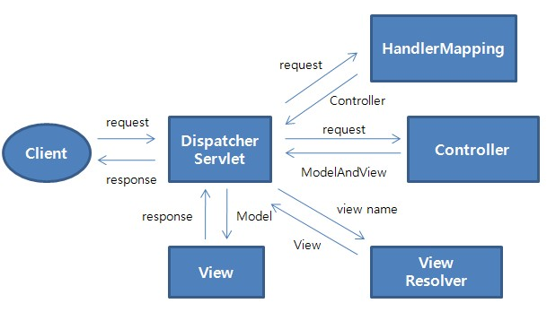

# Spring MVC Architecture

## 개요

Spring Framework은 간단한 설정만으로 Struts나 Webwork같은 Web Framework을 사용할 수 있지만, 자체적으로 MVC Web Framework을 가지고 있다.
Spring MVC는 기본요소인 Model, View, Controller 외에도, 아래와 같은 특성을 가지고 있다.

- DispatcherServlet, HandlerMapping, Controller, Interceptor, ViewResolver, View등 각 컴포넌트들의 역할이 명확하게 분리되어 있다.
- HandlerMapping, Controller, View등 컴포넌트들에 다양한 인터페이스 및 구현 클래스를 제공함으로써 경우에 따라 선택하여 사용할 수 있다.
- Controller(@MVC)나 폼 클래스(커맨드 클래스) 작성시에 특정 클래스를 상속받거나 참조할 필요 없이 POJO 나 POJO-style의 클래스를 작성함으로써 비지니스 로직에 집중한 코드를 작성할 수 있다.
- 웹요청 파라미터와 커맨드 클래스간에 데이터 매핑 기능을 제공한다.
- 데이터 검증을 할 수 있는, Validator와 Error 처리 기능을 제공한다.
- JSP Form을 쉽게 구성하도록 Tag를 제공한다.

## 설명

Spring MVC(Model-View-Controller)의 핵심 Component는 아래와 같다.

| Component         | 개요                                                                    |
|-------------------|-----------------------------------------------------------------------|
| DispatcherServlet | Spring MVC Framework의 Front Controller, 웹요청과 응답의 Life Cycle을 주관한다.    |
| HandlerMapping    | 웹요청시 해당 URL을 어떤 Controller가 처리할지 결정한다.                                |
| Controller        | 비지니스 로직을 수행하고 결과 데이터를 ModelAndView에 반영한다.                             |
| ModelAndView      | Controller가 수행 결과를 반영하는 Model 데이터 객체와 이동할 페이지 정보(또는 View객체)로 이루어져 있다. |
| ViewResolver      | 어떤 View를 선택할지 결정한다.                                                   |
| View              | 결과 데이터인 Model 객체를 display한다.                                          |

이들 컴포넌트간의 관계와 흐름을 그림으로 나타내면 아래와 같다.

1. Client의 요청이 들어오면 DispatchServlet이 가장 먼저 요청을 받는다.
2. HandlerMapping이 요청에 해당하는 Controller를 return한다.
3. Controller는 비지니스 로직을 수행(호출)하고 결과 데이터를 ModelAndView에 반영하여 return한다.
4. ViewResolver는 view name을 받아 해당하는 View 객체를 return한다.
5. View는 Model 객체를 받아 rendering한다.

이 가이드문서는 Spring 2.5.6 버젼을 기준으로 작성되었다.

## 참고자료

- The Spring Framework - Reference Documentation 2.5.6
- Spring Framework API Documentation 2.5.6