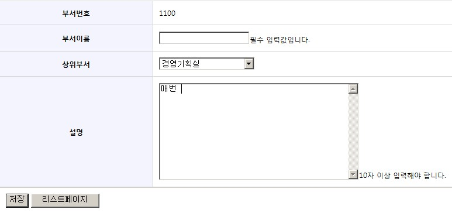

# Validation

## 개요

객체의 유효성 검증을 위해 스프링 프레임워크는 org.springframework.validation.Validator라는 인터페이스를 제공한다.
Validator는 특정 계층에 종속적인 구조가 아니라서, web이나 data-access등 어떤 계층의 객체라도 유효성 검증이 가능하게 한다.
Jakarta Commons Validator나 Valang 같은 외부 Validator들도 Spring 프레임워크에서 사용할 수 있다.
Spring Modules를 이용한 Jakarta Commons Validator 사용 방법에 대해서는 Spring Framework에서 Commons Validator 사용 을 참고하라.

## 설명

부서 정보를 수정하는 페이지에서 커맨드 객체인 부서 정보 클래스를 유효성 검증하는 코드를 작성해 보자.
부서 클래스인 Department 클래스는 아래와 같다.

```java
package com.easycompany.domain;
 
public class Department {
 
	private String deptid;   //부서아이디
	private String deptname;  //부서이름
	private String superdeptid;  //상위부서아이디
	private String superdeptname; //상위부서이름
	private String depth;  //부서레벨
	private String description;  //부서설명
 
	//위 프로퍼티들의 setter/getter
}
```

### Validator 구현

인터페이스 org.springframework.validation.Validator의 메소드는 다음과 같다.

- boolean supports(Class clazz) : 주어진 객체(clazz)에 대해 Validator가 지원 가능한가?
- void validate(Object target, Errors errors) : 주어진 객체(target)에 대해서 유효성 체크를 수행하고, 유효성 에러 발생시 주어진 Errors객체에 관련 정보가 저장된다.

구현 Validator 클래스를 만들때는 위 두 메소드를 구현해야 한다.

Department를 유효성 검증 하기 위한 DepartmentValidator를 만들어 보자.
Validation 조건은 부서이름(deptname) 프로퍼티는 반드시 값이 존재해야 하며, 부서설명(description) 프로퍼티는 입력값의 길이가 10 이상이어야 한다.

```java
package com.easycompany.validator;
 
import org.springframework.validation.Errors;
import org.springframework.validation.Validator;
import com.easycompany.domain.Department;
 
public class DepartmentValidator implements Validator {
 
	public boolean supports(Class clazz) {
		return Department.class.isAssignableFrom(clazz);
	}
 
	public void validate(Object target, Errors errors) {
 
		Department department = (Department)target;
 
		if (isEmptyOrWhitespace(department.getDeptname())) { //부서 이름 프로퍼티 값이 존재하는가? 
			errors.rejectValue("deptname", "required");
		}
 
		if (department.getDescription() == null || department.getDescription().length() < 10) { //부서설명 프로퍼티는 값의 길이가 10 이상인가?
			errors.rejectValue("description", "lengthsize", new Object[]{10}, "description's length must be larger than 10.");
		}		
	}	
 
	public boolean isEmptyOrWhitespace(String value){
		if (value == null || value.trim().length() == 0) {
			return true;
		} else {
			return false;
		}
	}
}
```

위 코드에서 처럼 유효성 검증이 실패한 경우 Errors 인터페이스의 rejectValue 메소드를 실행하는데, Errors 인터페이스에 대한 자세한 설명은 [여기](https://docs.spring.io/spring-framework/docs/2.5.x/javadoc-api/org/springframework/validation/Errors.html)를 참고하라.

**errors.rejectValue(“deptname”, “required”);**
- deptname 프로퍼티에 대해서 유효성 검증시 에러가 발생했고, 관련 메시지 key는 “required”란 의미이다.

**errors.rejectValue(“description”, “lengthsize”, new Object[]{10}, “description's length must be larger than 10.”);**
- description 프로퍼티에 대해서 유효성 검증시 에러가 발생했고, 관련 메시지 key는 “lengthsize” 이며 메시지에 전달될 argument는 10이며,
해당 메시지 key가 존재 하지 않으면 “description's length must be larger than 10.”란 메시지를 사용한다는 의미이다.

스프링에서는 유효성 검증을 위한 ValidationUtils라는 유틸 클래스를 제공한다.
부서 이름 프로퍼티(deptname) 값이 null또는 white space인지 체크하는 부분은 ValidationUtils의 rejectIfEmptyOrWhitespace 메소드를 사용해서 작성할 수 있다.

```java
package com.easycompany.validator;
 
import org.springframework.validation.Errors;
import org.springframework.validation.Validator;
import org.springframework.validation.ValidationUtils;
import com.easycompany.domain.Department;
 
public class DepartmentValidator implements Validator {
 
	public boolean supports(Class clazz) {
		return Department.class.isAssignableFrom(clazz);
	}
 
	public void validate(Object target, Errors errors) {
 
		Department department = (Department)target;
 
		ValidationUtils.rejectIfEmptyOrWhitespace(errors, "deptname", "required");
 
		if (department.getDescription() == null || department.getDescription().length()<10) { //부서설명 프로퍼티는 입력값의 길이가 10 이상인가?
			errors.rejectValue("description", "lengthsize", new Object[]{10}, "description's length must be larger than 10.");
		}		
	}
}
```

### 에러 메시지 설정

message 프로퍼티 파일에서 메시지 key인 “required”, “lengthsize”에 대한 메시지 설정을 한다.

```properties
required=필수 입력값입니다.
lengthsize={0}자 이상 입력해야 합니다.
```

### Controller에서 validation

Controller에서 validation을 수행하는 코드를 적용해 보자.
폼을 전송하는 순간에 유효성 검증을 하기 원한다면,
com.easycompany.controller.annotation.UpdateDepartmentController 에서 onSubmit 메소드에 validation 코드를 추가한다.

```java
package com.easycompany.controller.annotation;
...
import org.springframework.validation.BindingResult;
import com.easycompany.validator.DepartmentValidator;
 
@Controller
public class UpdateDepartmentController {
 
	//사용자가 데이터 수정을 끝내고 저장 버튼을 누르면 수정 데이터로 저장을 담당하는 서비스(DB)를 호출한다.
	//저장이 성공하면 부서리스트 페이지로 이동하고 에러가 있으면 다시 입력폼페이지로 이동한다.
	@RequestMapping(value = "/updateDepartment.do", method = RequestMethod.POST)
	public String onSubmit(@ModelAttribute("department") Department department, BindingResult bindingResult) {
 
		//validation code
		new DepartmentValidator().validate(department, bindingResult); //validation을 수행한다.
		if(bindingResult.hasErrors()){ //validation 에러가 있으면,
			return "modifydepartment";  //이 페이지로 이동.
		}
 
		try {
			departmentService.updateDepartment(department);
			return "redirect:/departmentList.do?depth=1";
		} catch (Exception e) {
			e.printStackTrace();
			return "modifydepartment";
		}
	}
}
```

### JSP

손쉬운 에러 메시지 표기를 위해 Spring 폼태그 `<form:errors/>`를 사용할 것을 권장한다.
/easycompany/webapp/jsp/annotation/modifydepartment.jsp

```jsp
<%@ taglib prefix="form" uri="http://www.springframework.org/tags/form" %>
...
<form:form commandName="department">
<table>
...
	<tr>
		<th>부서이름</th>
		<td><form:input path="deptname" size="20"/><form:errors path="deptname" /></td>
	</tr>
...
	<tr>
		<th>설명</th>
		<td><form:textarea path="description" rows="10" cols="40"/><form:errors path="description" /></td>
	</tr>	
</table>
</form:form>
...
```

### TEST

부서 이름값을 비우고, 부서설명 부분에 10자 이하로 입력한 후에 저장 버튼을 누르면, 다시 부서정보수정 페이지로 돌아와서 아래와 같이 에러 메시지가 출력될 것이다.



## 참고자료
- Spring Framework API Documentation 2.5.6