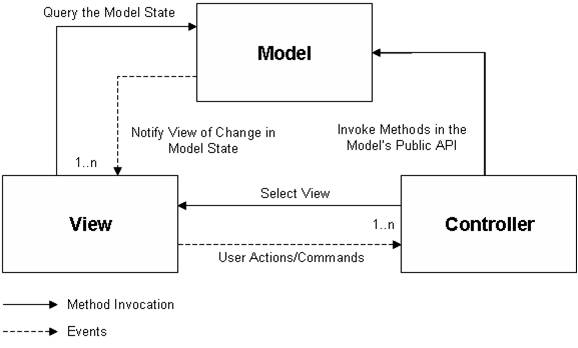

# Web Servlet

## 개요

**MVC(Model-View-Controller) 패턴**은 코드를 기능(역할)에 따라 **Model, View, Controller** 3가지 요소로 분리한다.
- **Model** : 애플리케이션의 데이터와 비즈니스 로직을 담는 객체이다.
- **View** : Model의 정보를 사용자에게 표시한다. 하나의 Model을 다양한 View에서 사용할 수 있다.
- **Controller** : Model과 View의 중계 역할을 한다. 사용자의 요청을 받아 Model에 변경된 상태를 반영하고, 응답을 위한 View를 선택한다.

MVC 패턴은 **UI 코드와 비즈니스 코드를 분리**함으로써 <u>종속성을 줄이고, 재사용성을 높이고, 보다 쉬운 변경이 가능</u>하도록 한다.

MVC 패턴이 Web Framework에만 사용되는 단어는 아니지만, 표준프레임워크에서 “MVC 서비스”란 MVC 패턴을 활용한 Web MVC Framework를 의미한다.

## 설명
오픈소스 Web MVC Framework에는 Spring MVC, Struts, Webwork, JSF 등이 있으며, 각각의 장점을 가지고 사용되고 있다.
 기능상에서 큰 차이는 없으나, 아래와 같은 장점을 고려 **표준프레임워크에서는 Spring Web MVC를 MVC 서비스의 기반 오픈 소스로 채택**하였다.

- Framework 내의 특정 클래스를 상속하거나, 참조, 구현해야 하는 등의 제약사항이 비교적 적다.
   Controller(Spring 2.5 @MVC)나 Form 클래스 등이 좀 더 POJO-style에 가까워 비즈니스 로직에 집중된 코드를 작성할 수 있다.
- IOC Container가 Spring이라면 (간단한 설정으로 Struts나 Webwork 같은 Web Framework을 사용할 수 있겠지만) 연계를 위한 추가 설정 없이 Spring MVC를 사용할 수 있다.
   **표준프레임워크의 IOC Container는 Spring**이다.
- 오픈소스 프로젝트가 활성화(꾸준한 기능 추가, 빠른 bug fix와 Q&A) 되어 있으며 로드맵이 신뢰할만하다.
- 국내 커뮤니티 활성화 정도, 관련 참고 문서나 도서를 쉽게 구할 수 있다.

### Spring MVC
Spring MVC에 대한 설명은 아래 상세 페이지를 참고하라.

- [Spring MVC Architecture](web-servlet-spring-mvc-architecture.md)
- [DispatcherServlet](./web-servlet-dispatcherservlet.md)
- [HandlerMapping](./web-servlet-handlermapping.md)
- [Controller](./web-servlet-controller.md)
- [Annotation-based Controller](web-servlet-annotation-based-controller.md)
- [Validation](./web-servlet-validation.md)
- [Declarative Validation](./web-servlet-declarative-validation.md)
- [View](./web-servlet-view.md)

### 예제 실행
- [easycompany 설치 가이드](../../runtime-example/individual-example/presentation-layer/easycompany-example.md) : MVC와 Ajax Support, Security의 예제 코드인 easycompany 설치와 실행 방법을 가이드 한다.

## 참고 자료
- 🌏 [SUN Java BluePrints, Model-View-Controller](https://web.archive.org/web/20090227080302/http://java.sun.com/blueprints/patterns/MVC-detailed.html)

## 서블릿 개발과 동작과정.png

