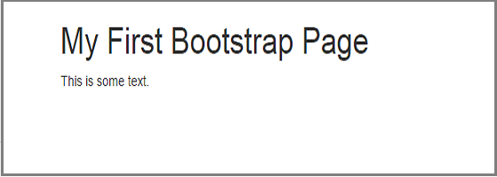
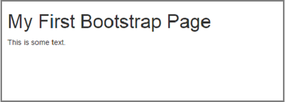
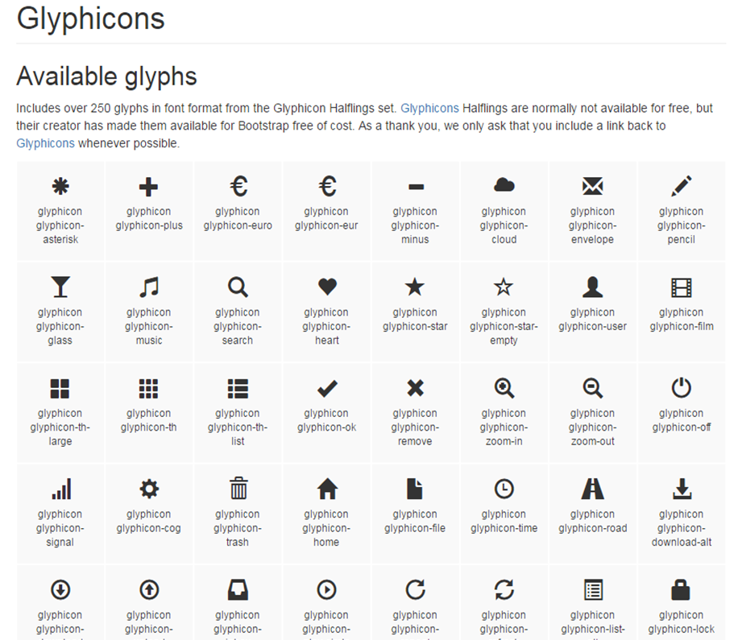
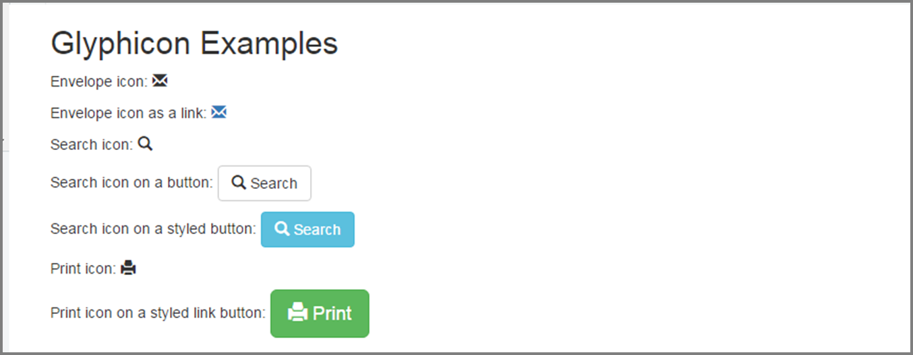

# 실행환경 UI - bootstrap

## 개요
부트스트랩(Bootstrap)은 웹디자인을 쉽게하기 위해 트위터에서 오픈 소스로 공개한 프런트 엔드 프레임워크로, 유연한 HTML, CSS, JavaScript 템플릿과 UI컴포넌트, 인터렉션을 제공하여 손 쉽게 웹 사이트를 구축할 수 있는 시작점이 된다.

부트스트랩의 장점은 크게 다음과 같다.

부트스트랩 3 이후부터 모바일 중심의 프레임워크이다
다양한 브라우저들을 지원한다.
반응형 웹에 최적화 되어있다. 부트스트랩은 스마트폰, 태블릿, 데스크탑에 최적화 되어 css가 조정이 된다.
시작이 용이하다. HTML, CSS만 알고 있어도 부트스트랩의 사용이 가능하다.
이러한 장점들로 인해 표준프레임워크에서는 실행환경 UI로 bootstrap을 선정하였다.

본 위키가이드에서는 부트스트랩의 기본적인 소개와 몇 가지의 예제를 제공한다.
자세한 내용은 부트스트랩 사이트의 가이드나 (http://getbootstrap.com/) w3schools의 튜토리얼(http://www.w3schools.com/bootstrap/bootstrap_get_started.asp)을 참조하도록 한다.

## 시작하기
부트스트랩을 사용하기 위해서는 부트스트랩 관련 CSS와 JavaScript를 추가해 주어야 한다. 추가하는 방법은 두가지로 부트스트랩을 다운로드 하여 사용하거나, 다운로드 하지 않을 경우 CDN 링크를 추가하여 사용 한다.
※ 주의사항 : 부트스트랩을 사용하려면 jQuery가 필요하므로 반드시 별도로 추가하여 주어야 한다.

다운로드
부트스트랩 사이트(http://getbootstrap.com/getting-started/#download)의 메뉴 중 시작하기 > 다운로드 항목에서 원하는 종류의 다운로드를 진행한다.
부트스트랩 사이트에서는 여러가지 다운로드를 제공하는데, 본 가이드에서는 프리컴파일 된 부트스트랩1)을 다운로드하여 진행하였다.
부트스트랩 CDN
MaxCDN에서 부트스트랩의 CSS 와 자바스크립트를 CDN으로 지원한다. 이를 사용하려면, 아래의 부트스트랩 CDN 링크들을 추가하면 사용할 수 있다. 자세한 내용은 다음 링크(download-cdn)를 확인 한다.

```javascript
<!-- 최신 컴파일 및 최소화된 최신 CSS -->
	<link rel="stylesheet" href="https://maxcdn.bootstrapcdn.com/bootstrap/3.3.6/css/bootstrap.min.css" 
         integrity="sha384-1q8mTJOASx8j1Au+a5WDVnPi2lkFfwwEAa8hDDdjZlpLegxhjVME1fgjWPGmkzs7" crossorigin="anonymous">
 
	<!-- 옵션 테마 -->
	<link rel="stylesheet" href="https://maxcdn.bootstrapcdn.com/bootstrap/3.3.6/css/bootstrap-theme.min.css" 
         integrity="sha384-fLW2N01lMqjakBkx3l/M9EahuwpSfeNvV63J5ezn3uZzapT0u7EYsXMjQV+0En5r" crossorigin="anonymous">
 
 
	<!-- jQuery library 부트스트랩을 사용하려면 jQuery가 필요함-->
	<script src="https://ajax.googleapis.com/ajax/libs/jquery/1.12.2/jquery.min.js"></script>
 
 
	<!-- 최신 컴파일 및 최소화된 자바스크립트 -->
	<script src="https://maxcdn.bootstrapcdn.com/bootstrap/3.3.6/js/bootstrap.min.js" 
         integrity="sha384-0mSbJDEHialfmuBBQP6A4Qrprq5OVfW37PRR3j5ELqxss1yVqOtnepnHVP9aJ7xS" crossorigin="anonymous"></script>
```

### 파일구조
프리 컴파일 된 부트스트랩을 다운로드하고, 압축을 해제하면 다음과 같은 구조를 볼 수 있다.

```
bootstrap/
├── css/
│   ├── bootstrap.css
│   ├── bootstrap.css.map
│   ├── bootstrap.min.css
│   ├── bootstrap-theme.css
│   ├── bootstrap-theme.css.map
│   └── bootstrap-theme.min.css
├── js/
│   ├── bootstrap.js
│   └── bootstrap.min.js
└── fonts/
    ├── glyphicons-halflings-regular.eot
    ├── glyphicons-halflings-regular.svg
    ├── glyphicons-halflings-regular.ttf
    ├── glyphicons-halflings-regular.woff
    └── glyphicons-halflings-regular.woff2
```
위의 구조는 어느 웹프로젝트에도 쉽게 적용하기 위한 가장 기본적인 형태다. 컴파일 된 CSS와 JavaScript(bootstrap.*)를 제공하고, 컴파일 되고 최소화된 CSS와 JavaScript(bootstrap.min.*) 도 제공한다.
그리고 Glyphicons 의 폰트 파일들과 부가적인 부트스트랩 테마 파일들도 같이 존재한다.

## 부트스트랩의 특징
### HTML5
부트스트랩은 HTML5의 HTML요소와 CSS속성을 요구하기 때문에 HTML5 doctype을 사용해야 한다. 항상 페이지의 시작부분에 HTML5 doctype과 <head>내에 lang 속성과 character set을 추가해 주어야한다.

```html
<!DOCTYPE html>
<html lang="ko">
  <head>
    <meta charset="utf-8"> 
  </head>
</html>
```

### 모바일 친화적
부트스트랩2 에서는 모바일 친화적인 스타일을 프레임워크의 core로 추가했었는데. 부트스트랩3 부터는 시작부터 모바일 친화적으로 설계 되었다.
다음은 페이지의 렌더링과 확대/축소를 사용하기 위한 것으로, <head> 내에 viewport 메타 태그를 추가한다.

```html
<meta name="viewport" content="width=device-width, initial-scale=1">
```
* “width=device-width” : device의 화면 폭(width)에 따라 페이지의 화면 폭을 설정한다.(device마다 달라짐)
* “initial-scale=1” : 페이지가 처음 브라우저에 로드 될 때 초기 zoom level을 설정한다.
* “user-scalable=no” 를 추가할 경우 모바일 기기의 Zoom기능을 끌 수 있다.

### 컨테이너 
부트스트랩은 사이트 전체의 콘텐츠를 감싸는 콘테이너 요소가 필요하다.

다음의 두 예제는 컨테이너에 대한 예제이다.
※ jsfiddle.net을 이용하여 아래의 예제코드를 실행 결과를 링크로 제공.

#### 예제 1 : container
```html
 
<!DOCTYPE html>
<html lang="ko">
<head>
  <title>Bootstrap Example</title>
  <meta charset="utf-8">
  <meta name="viewport" content="width=device-width, initial-scale=1">
	<link rel="stylesheet" href="https://maxcdn.bootstrapcdn.com/bootstrap/3.3.6/css/bootstrap.min.css" 
         integrity="sha384-1q8mTJOASx8j1Au+a5WDVnPi2lkFfwwEAa8hDDdjZlpLegxhjVME1fgjWPGmkzs7" crossorigin="anonymous">
	<script src="https://ajax.googleapis.com/ajax/libs/jquery/1.12.2/jquery.min.js"></script>
	<script src="https://maxcdn.bootstrapcdn.com/bootstrap/3.3.6/js/bootstrap.min.js" 
         integrity="sha384-0mSbJDEHialfmuBBQP6A4Qrprq5OVfW37PRR3j5ELqxss1yVqOtnepnHVP9aJ7xS" crossorigin="anonymous"></script>
</head>
<body>
 
<div class="container">
  <h1>My First Bootstrap Page</h1>
  <p>This is some text.</p> 
</div>
 
</body>
</html>
```
결과 보기 : https://jsfiddle.net/ymxvbzo7/?utm_source=website&utm_medium=embed&utm_campaign=ymxvbzo7

#### 예제 2 : container-fluid

```html
 <!DOCTYPE html>
<html lang="ko">
<head>
  <title>Bootstrap Example</title>
  <meta charset="utf-8">
  <meta name="viewport" content="width=device-width, initial-scale=1">
	<link rel="stylesheet" href="https://maxcdn.bootstrapcdn.com/bootstrap/3.3.6/css/bootstrap.min.css" 
         integrity="sha384-1q8mTJOASx8j1Au+a5WDVnPi2lkFfwwEAa8hDDdjZlpLegxhjVME1fgjWPGmkzs7" crossorigin="anonymous">
	<script src="https://ajax.googleapis.com/ajax/libs/jquery/1.12.2/jquery.min.js"></script>
	<script src="https://maxcdn.bootstrapcdn.com/bootstrap/3.3.6/js/bootstrap.min.js" 
         integrity="sha384-0mSbJDEHialfmuBBQP6A4Qrprq5OVfW37PRR3j5ELqxss1yVqOtnepnHVP9aJ7xS" crossorigin="anonymous"></script>
</head>
<body>
 
<div class="container-fluid">
  <h1>My First Bootstrap Page</h1>
  <p>This is some text.</p> 
</div>
 
</body>
</html>  
```
결과 보기 : https://jsfiddle.net/y1hL9vqd/1/?utm_source=website&utm_medium=embed&utm_campaign=y1hL9vqd
 

위의 그림처럼 두 예제의 결과보기의 화면의 폭을 좌우로 늘려보면, 두 예제의 차이점을 알 수 있다.
첫번째 예제는 고정폭 콘테이너(<div class=“container”>)를 사용하였고, 두번째 예제는 최대폭 콘테이너(<div class=“container-fluid”>)를 사용한 예제이다.
그밖에 세부 내용은 링크(http://getbootstrap.com/css/#overview-container)를 참조하도록 한다.

### 그리드 시스템 
부트스트랩은 반응형, 페이지 레이아웃을 위해 자체적인 그리드 레이아웃 시스템을 제공한다.
부트스트랩의 그리드 시스템은 12열의 그리드(12-column grid)로 구성되어 있으며, device나 viewport의 크기에 따라 자동으로 열이 적절한 크기로 배열되게 한다.

**고려사항**
* 행(row)은 반드시 .container(고정폭) 나 .container-fluid(전체폭) 안에 위치해야 한다.
* 열(column)들은 수평그룹을 만드는데 행을 이용한다.
* 콘텐츠는 열 안에 위치해야 한다. 그리고 열 들만이 행의 바로 아래에 올 수 있다.
* .row와 .col-xs-4 같은 사전 정의된 그리드 클래스들을 통해 간편하게 그리드 레이아웃 만들 수 있다.
* 열은 padding 으로 여백을 줄 수 있다. 패딩은 행 내에서 첫열과 마지막열을 위해 .row 내에 음수 마진으로 offset 되어 있다.
* 그리드 열은 12개의 가능한 열들을 원하는 만큼 명시하는 것으로 만들어진다.( ex) 같은 크기의 3개 열 : .col-xs-4 를 3개 사용)

기타사항은 링크(http://getbootstrap.com/css/#grid-intro) 내용을 참조하도록 한다.

**그리드 옵션**
|                            | 매우 작은 기기 모바일폰 (< 768px) | 작은 기기 태블릿 (≥ 768px) | 중간 기기 데스크탑 (≥ 992px) | 큰 기기 데스크탑 (≥ 1200px) |
|----------------------------|----------------------------------|----------------------------|------------------------------|-----------------------------|
| **그리드 적용**             | 항상                             | 분기점보다 크면 적용         | 분기점보다 크면 적용           | 분기점보다 크면 적용          |
| **콘테이너 너비**           | 없음 (auto)                      | 750px                      | 970px                        | 1170px                      |
| **클래스 접두사**           | .col-xs-                         | .col-sm-                   | .col-md-                     | .col-lg-                    |
| **컬럼 수**                 | 12                               | 12                         | 12                           | 12                          |
| **컬럼 너비**               | Auto                             | ~62px                      | ~81px                        | ~97px                       |
| **사이 너비**               | 30px (컬럼의 양쪽에 15px 씩)      | 30px (컬럼의 양쪽에 15px 씩) | 30px (컬럼의 양쪽에 15px 씩)  | 30px (컬럼의 양쪽에 15px 씩) |

세부내용은 링크(http://getbootstrap.com/css/#grid-options)의 표를 참조한다.

**기본적인 부트스트랩 그리드 구조**

```html
<div class="row">
  <div class="col-sm-4">.col-sm-4</div>
  <div class="col-sm-4">.col-sm-4</div>
  <div class="col-sm-4">.col-sm-4</div>
</div>
```
* 행(row)를 생성해야 한다.(<div class=“row”>)
* 행안에 적절한 수의 열(column)을 추가한다. (<div class=“col-sm-4”>.col-sm-4</div>)
* 행안의 열의 수는 항상 12열을 맞춰야 한다.

**그리드 예제 : Stacked-to-horizontal**
```html
 <!DOCTYPE html>
<html lang="ko">
<head>
  <title>Bootstrap Example</title>
  <meta charset="utf-8">
  <meta name="viewport" content="width=device-width, initial-scale=1">
  	<link rel="stylesheet" href="https://maxcdn.bootstrapcdn.com/bootstrap/3.3.6/css/bootstrap.min.css" 
         integrity="sha384-1q8mTJOASx8j1Au+a5WDVnPi2lkFfwwEAa8hDDdjZlpLegxhjVME1fgjWPGmkzs7" crossorigin="anonymous">
	<script src="https://ajax.googleapis.com/ajax/libs/jquery/1.12.2/jquery.min.js"></script>
	<script src="https://maxcdn.bootstrapcdn.com/bootstrap/3.3.6/js/bootstrap.min.js" 
         integrity="sha384-0mSbJDEHialfmuBBQP6A4Qrprq5OVfW37PRR3j5ELqxss1yVqOtnepnHVP9aJ7xS" crossorigin="anonymous"></script>
</head>
<body>
 
<div class="container">
  <h1>Grid</h1>
  <p>This example demonstrates a 50%/50% split on small, medium and large devices. On extra small devices, it will stack (100% width).</p>      
  <p>Resize the browser window to see the effect.</p>      
  <div class="row">
    <div class="col-sm-6" style="background-color:yellow;">
      Lorem ipsum dolor sit amet, consectetur adipisicing elit, sed do eiusmod tempor incididunt ut labore et dolore magna aliqua.<br>
      Ut enim ad minim veniam, quis nostrud exercitation ullamco laboris nisi ut aliquip ex ea commodo consequat.
    </div>
    <div class="col-sm-6" style="background-color:pink;">
      Sed ut perspiciatis unde omnis iste natus error sit voluptatem accusantium doloremque laudantium, totam rem aperiam, eaque ipsa quae ab illo inventore veritatis et quasi architecto.    
    </div>
  </div>
</div>
 
</body>
</html>
```

결과 보기 : https://jsfiddle.net/eh5kmtt9/1/?utm_source=website&utm_medium=embed&utm_campaign=eh5kmtt9


결과창의 좌우폭을 확대 및 축소를 해보면, 화면 사이즈에 맞춰서 열(column)이 쌓이거나(stack) 수평이 되게 늘어나는 것을 확인 할 수 있다.이와 같이 손 쉽게 반응형을 지원하고, 페이지 레이아웃을 구성할 수 있다.
그 밖의 예제들은 부트스트랩 사이트 그리드 부분(http://getbootstrap.com/css/#grid)에서 내용을 확인하도록 한다.

## 다양한 스타일의 CSS
부트스트랩은 깔끔하고 잘 정돈된 느낌의 다양한 스타일의 CSS를 제공한다. 자세한 내용은 링크(http://getbootstrap.com/css/)의 내용을 확인하도록 한다.

**테이블**
다음은 부트스트랩에서 제공하는 클래스를 적용한 테이블 예제이다.
```html
<!DOCTYPE html>
<html lang="ko">
<head>
  <title>Bootstrap Example</title>
  <meta charset="utf-8">
  <meta name="viewport" content="width=device-width, initial-scale=1">
  <link rel="stylesheet" href="https://maxcdn.bootstrapcdn.com/bootstrap/3.3.6/css/bootstrap.min.css" 
  integrity="sha384-1q8mTJOASx8j1Au+a5WDVnPi2lkFfwwEAa8hDDdjZlpLegxhjVME1fgjWPGmkzs7" crossorigin="anonymous">
  <script src="https://ajax.googleapis.com/ajax/libs/jquery/1.12.2/jquery.min.js"></script>
  <script src="https://maxcdn.bootstrapcdn.com/bootstrap/3.3.6/js/bootstrap.min.js" 
   integrity="sha384-0mSbJDEHialfmuBBQP6A4Qrprq5OVfW37PRR3j5ELqxss1yVqOtnepnHVP9aJ7xS" crossorigin="anonymous"></script>
</head>
<body>
 
<div class="container">
  <h2>Contextual Classes</h2>
  <p>Contextual classes can be used to color table rows or table cells. The classes that can be used are: .active, .success, .info, .warning, and .danger.</p>            
  <table class="table">
    <thead>
      <tr>
        <th>Firstname</th>
        <th>Lastname</th>
        <th>Email</th>
      </tr>
    </thead>
    <tbody>
      <tr class="success">
        <td>John</td>
        <td>Doe</td>
        <td>example1@example.com</td>
      </tr>
      <tr class="danger">
        <td>Mary</td>
        <td>Moe</td>
        <td>example2@example.com</td>
      </tr>
      <tr class="info">
        <td>July</td>
        <td>Dooley</td>
        <td>example3@example.com</td>
      </tr>
    </tbody>
  </table>
</div>
 
</body>
</html>
```
결과보기 : https://jsfiddle.net/r60oymr2/3/?utm_source=website&utm_medium=embed&utm_campaign=r60oymr2


부트스트랩에서 기본적으로 제공하는 테이블 디자인 중 하나이다.

**폼**
다음은 부트스트랩에서 제공하는 폼의 예제이다.

```html
<!DOCTYPE html>
<html lang="ko">
<head>
  <title>Bootstrap Example</title>
  <meta charset="utf-8">
  <meta name="viewport" content="width=device-width, initial-scale=1">
  <link rel="stylesheet" href="https://maxcdn.bootstrapcdn.com/bootstrap/3.3.6/css/bootstrap.min.css" 
   integrity="sha384-1q8mTJOASx8j1Au+a5WDVnPi2lkFfwwEAa8hDDdjZlpLegxhjVME1fgjWPGmkzs7" crossorigin="anonymous">
  <script src="https://ajax.googleapis.com/ajax/libs/jquery/1.12.2/jquery.min.js"></script>
  <script src="https://maxcdn.bootstrapcdn.com/bootstrap/3.3.6/js/bootstrap.min.js" 
  integrity="sha384-0mSbJDEHialfmuBBQP6A4Qrprq5OVfW37PRR3j5ELqxss1yVqOtnepnHVP9aJ7xS" crossorigin="anonymous"></script>
</head>
<body>
 
<div class="container">
  <h2>Inline form</h2>
  <p>Make the viewport larger than 768px wide to see that all of the form elements are inline, left aligned, and the labels are alongside.</p>
  <form class="form-inline" role="form">
    <div class="form-group">
      <label for="email">Email:</label>
      <input type="email" class="form-control" id="email" placeholder="Enter email">
    </div>
    <div class="form-group">
      <label for="pwd">Password:</label>
      <input type="password" class="form-control" id="pwd" placeholder="Enter password">
    </div>
    <div class="checkbox">
      <label><input type="checkbox"> Remember me</label>
    </div>
    <button type="submit" class="btn btn-default">Submit</button>
  </form>
</div>
 
</body>
</html>
```
결과보기 : https://jsfiddle.net/4006oqs0/1/?utm_source=website&utm_medium=embed&utm_campaign=4006oqs0


위의 예제는 인라인 폼(inline form)이 적용 된 예제로, 화면의 폭에 따라 입력창의 위치가 변화한다.


**버튼**
다음은 부트스트랩에서 제공하는 버튼 디자인이다.

```html
<!DOCTYPE html>
<html lang="ko">
<head>
  <title>Bootstrap Example</title>
  <meta charset="utf-8">
  <meta name="viewport" content="width=device-width, initial-scale=1">
  <link rel="stylesheet" href="https://maxcdn.bootstrapcdn.com/bootstrap/3.3.6/css/bootstrap.min.css" 
   integrity="sha384-1q8mTJOASx8j1Au+a5WDVnPi2lkFfwwEAa8hDDdjZlpLegxhjVME1fgjWPGmkzs7" crossorigin="anonymous">
  <script src="https://ajax.googleapis.com/ajax/libs/jquery/1.12.2/jquery.min.js"></script>
  <script src="https://maxcdn.bootstrapcdn.com/bootstrap/3.3.6/js/bootstrap.min.js" 
  integrity="sha384-0mSbJDEHialfmuBBQP6A4Qrprq5OVfW37PRR3j5ELqxss1yVqOtnepnHVP9aJ7xS" crossorigin="anonymous"></script>
 
</head>
<body>
 
<div class="container">
  <h2>Button</h2>
  <!-- Standard button -->
  <button type="button" class="btn btn-default">Default</button>
  <!-- Provides extra visual weight and identifies the primary action in a set of buttons -->
  <button type="button" class="btn btn-primary">Primary</button>
  <!-- Indicates a successful or positive action -->
  <button type="button" class="btn btn-success">Success</button>
  <!-- Contextual button for informational alert messages -->
  <button type="button" class="btn btn-info">Info</button>
  <!-- Indicates caution should be taken with this action -->
  <button type="button" class="btn btn-warning">Warning</button>
  <!-- Indicates a dangerous or potentially negative action -->
  <button type="button" class="btn btn-danger">Danger</button>
  <!-- Deemphasize a button by making it look like a link while maintaining button behavior -->
  <button type="button" class="btn btn-link">Link</button>
</div>
 
</body>
</html>
```
결과보기 : https://jsfiddle.net/ysohpdqh/5/?utm_source=website&utm_medium=embed&utm_campaign=ysohpdqh


### 컴포넌트 
부트스트랩에서는 iconography, dropdown, input group, navigation, alerts 등의 재사용 가능한 컴포넌트를 제공하고 있다. 본 가이드에서는 몇 가지 컴포넌트만 소개한다.
그 밖의 다른 컴포넌트 들은 링크(http://getbootstrap.com/components/)를 통해 확인 하도록 한다.

#### Glyphicons
250개 이상의 기호가 Glyphicon Halflings 세트로 폰트 포멧에 포함되어 있다.



**사용방법**
사용할 부분에 다음 구문을 삽입한다.

```html
<span class="glyphicon glyphicon-search" aria-hidden="true"></span>
```
위의 구문에서 원하는 Glyphicon의 class를 교체하여 사용한다.

다음은 Glyphicon을 사용한 예제이다.

```html
<!DOCTYPE html>
<html lang="ko">
<head>
  <title>Bootstrap Example</title>
  <meta charset="utf-8">
  <meta name="viewport" content="width=device-width, initial-scale=1">
    	<link rel="stylesheet" href="https://maxcdn.bootstrapcdn.com/bootstrap/3.3.6/css/bootstrap.min.css" 
         integrity="sha384-1q8mTJOASx8j1Au+a5WDVnPi2lkFfwwEAa8hDDdjZlpLegxhjVME1fgjWPGmkzs7" crossorigin="anonymous">
	<script src="https://ajax.googleapis.com/ajax/libs/jquery/1.12.2/jquery.min.js"></script>
	<script src="https://maxcdn.bootstrapcdn.com/bootstrap/3.3.6/js/bootstrap.min.js" 
         integrity="sha384-0mSbJDEHialfmuBBQP6A4Qrprq5OVfW37PRR3j5ELqxss1yVqOtnepnHVP9aJ7xS" crossorigin="anonymous"></script>
</head>
<body>
 
<div class="container">
  <h2>Glyphicon Examples</h2>
  <p>Envelope icon: <span class="glyphicon glyphicon-envelope"></span></p>    
  <p>Envelope icon as a link:
    <a href="#"><span class="glyphicon glyphicon-envelope"></span></a>
  </p>
  <p>Search icon: <span class="glyphicon glyphicon-search"></span></p>
  <p>Search icon on a button:
    <button type="button" class="btn btn-default">
      <span class="glyphicon glyphicon-search"></span> Search
    </button>
  </p>
  <p>Search icon on a styled button:
    <button type="button" class="btn btn-info">
      <span class="glyphicon glyphicon-search"></span> Search
    </button>
  </p>
  <p>Print icon: <span class="glyphicon glyphicon-print"></span></p>      
  <p>Print icon on a styled link button:
    <a href="#" class="btn btn-success btn-lg">
      <span class="glyphicon glyphicon-print"></span> Print 
    </a>
  </p> 
</div>
</body>
</html>
```
결과보기 : https://jsfiddle.net/t1tresaj/1/?utm_source=website&utm_medium=embed&utm_campaign=t1tresaj



**페이지네이션(Pagination)**
페이지네이션 컴퍼넌트로 사이트나 앱을 위한 페이지네이션 링크를 제공한다.

**사용법**
페이지네이션의 경우 순서가 없는 목록(unordered list, <ul> )에 .pagination class 클래스를 추가한다.

다음은 페이지네이션을 사용한 예제이다.
```html
 
<!DOCTYPE html>
<html lang="ko">
<head>
  <title>Bootstrap Example</title>
  <meta charset="utf-8">
  <meta name="viewport" content="width=device-width, initial-scale=1">
  <link rel="stylesheet" href="https://maxcdn.bootstrapcdn.com/bootstrap/3.3.6/css/bootstrap.min.css" 
   integrity="sha384-1q8mTJOASx8j1Au+a5WDVnPi2lkFfwwEAa8hDDdjZlpLegxhjVME1fgjWPGmkzs7" crossorigin="anonymous">
  <script src="https://ajax.googleapis.com/ajax/libs/jquery/1.12.2/jquery.min.js"></script>
  <script src="https://maxcdn.bootstrapcdn.com/bootstrap/3.3.6/js/bootstrap.min.js" 
   integrity="sha384-0mSbJDEHialfmuBBQP6A4Qrprq5OVfW37PRR3j5ELqxss1yVqOtnepnHVP9aJ7xS" crossorigin="anonymous"></script>
</head>
<body>
 
<div class="container">
  <h2>Pagination - Active State</h2>
  <p>Add class .active to let the user know which page he/she is on:</p>
  <ul class="pagination">
    <li><a href="#">1</a></li>
    <li class="active"><a href="#">2</a></li>
    <li><a href="#">3</a></li>
    <li><a href="#">4</a></li>
    <li><a href="#">5</a></li>
  </ul>
</div>
 
</body>
</html>
```
결과보기 : https://jsfiddle.net/L860z1cy/1/?utm_source=website&utm_medium=embed&utm_campaign=L860z1cy


위의 예제에서 리스트 아이템(list item, <li>)에 .active class를 추가하면, 해당 링크는 활성 상태가 된다. 클릭할 수 없는 링크일 경우 .disable을 사용하면 비활성 상태로 된다.

### 자바스크립트
부트스트랩 내에 존재하는 UI 컴포넌트에 동적인 인터랙션이 필요한 컴포넌트는 12개가 넘는 jQuery plugin을 통하여 컨트롤 할 수 있도록 되어있다.
단 컴포넌트를 주의할 점은 모든 플러그인은 jQuery에 의존하기 때문에 jQuery는 반드시 플러그인 파일 전에 포함되어야 한다.
본 가이드에서는 모달(modal)에 대한 가이드만 제공한다.

**모달(Modal)**
모달 플러그인은 현재 페이지의 상단에 표시되는 대화 상자 / 팝업 창이다.

* 다른 모달이 보이는 동안에 모달은 열리지 않는다.
* 다른 콤포넌트가 모달의 모습이나 기능에 영향을 끼치지 않도록 항상 모달의 HTML 코드를 문서 상단에 위치한다.
* 모바일 기기에서는 제약사항이 있다.
* 플러그인 사용 시 개별적(“modal.js”)으로 include하거나, 전체( “bootstrap.js” 또는 “bootstrap.min.js”)를 include하여 사용할 수 있다.

**사용법**
다음은 기본적인 modal을 만드는 방법을 보여주는 예제이다.

```html
<!DOCTYPE html>
<html lang="ko">
<head>
  <title>Bootstrap Example</title>
  <meta charset="utf-8">
  <meta name="viewport" content="width=device-width, initial-scale=1">
    <link rel="stylesheet" href="https://maxcdn.bootstrapcdn.com/bootstrap/3.3.6/css/bootstrap.min.css" 
     integrity="sha384-1q8mTJOASx8j1Au+a5WDVnPi2lkFfwwEAa8hDDdjZlpLegxhjVME1fgjWPGmkzs7" crossorigin="anonymous">
    <script src="https://ajax.googleapis.com/ajax/libs/jquery/1.12.2/jquery.min.js"></script>
    <script src="https://maxcdn.bootstrapcdn.com/bootstrap/3.3.6/js/bootstrap.min.js" 
     integrity="sha384-0mSbJDEHialfmuBBQP6A4Qrprq5OVfW37PRR3j5ELqxss1yVqOtnepnHVP9aJ7xS" crossorigin="anonymous"></script>
</head>
 
<body>
<div class="container">
  <h2>Modal Example</h2>
  <!-- Trigger the modal with a button -->
  <button type="button" class="btn btn-info btn-lg" data-toggle="modal" data-target="#myModal">Open Modal</button>
 
  <!-- Modal -->
  <div class="modal fade" id="myModal" role="dialog">
    <div class="modal-dialog">
 
      <!-- Modal content-->
      <div class="modal-content">
        <div class="modal-header">
          <button type="button" class="close" data-dismiss="modal">&times;</button>
          <h4 class="modal-title">Modal Header</h4>
        </div>
        <div class="modal-body">
          <p>Some text in the modal.</p>
        </div>
        <div class="modal-footer">
          <button type="button" class="btn btn-default" data-dismiss="modal">Close</button>
        </div>
      </div>
 
    </div>
  </div>
 
</div>
 
</body>
</html>
```
결과보기 : https://jsfiddle.net/eqfmxd3e/1/?utm_source=website&utm_medium=embed&utm_campaign=eqfmxd3e


위의 예제의 구조를 보면 크게 “Triger”, “Modal”, “Modal content”로 구성된 것을 확인할 수 있다.

“Trigger” 부분
모달 윈도우를 호출하려면 트리거가 필요하다. 보통 버튼이나 링크를 트리거로 사용한다.
그리고 두개의 “data-*” 속성을 include 해야한다.

* data-toggle=“modal” : 모달 윈도우를 연다.
* data-target=”#myModal” : 모달 윈도우를 열 id
  
“Modal” 부분

* 모달의 부모 <div>에는 모달(“myModal”)을 트리거하기 위해 사용되는 “data-target의 속성 값과 동일한 ID를 가져야한다.
* .modal 클래스는 content에서 modal의 <div>를 식별하고, 그것을 focus로 가져온다.
* .fade 클래스는 모달 안과 밖으로 fade 전환 효과를 추가해 준다. 만약 효과를 사용하지 않으면 이 클래스를 삭제한다.
* role=“dialog” 속성은 스크린 리더를 사용하는 사람들에 대한 접근성을 향상시킨다.
* .modal-dialog 클래스는 모달의 적절한 폭과 여백을 설정한다.

“Modal content” 부분

* “modal-content” 클래스의 <div>는 모달의 스타일(border, background-color 등…)을 지정한다. 여기에 모달의 header, body, footer를 추가한다.
* .modal-header 클래스는 모달의 header 스타일을 정의하는데 사용한다.
* header 안의 <button>에는 data-dismiss=“modal” 속성이 정의되어 있는데 이는 클릭하면 모달을 닫는 기능을 수행한다.
* .close 클래스는 닫기버튼의 스타일이다.
* .modal-title 클래스는 header의 적절한 라인 높이의 스타일이다.
* .modal-body 클래스는 모달의 body 스타일을 정의하는데 사용한다. 여기에 다른 HTML markup(paragraphs, images, videos, 등…)들을 추가한다.
* .modal-footer 클래스는 모달의 footer 스타일을 정의하는데 사용한다. 기본적으로 우측정렬로 되어있다.

### 참고자료 
* [부트스트랩 사이트](https://getbootstrap.com/)
* [부트스트랩 한글번역 사이트](https://getbootstrap.kr/)
* [w3schools bootstrap Tutorial](https://www.w3schools.com/bootstrap/default.asp)
