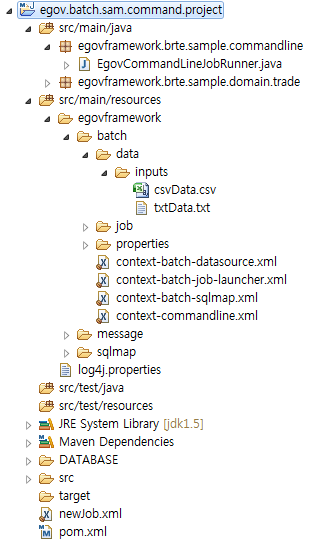
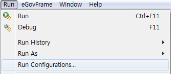
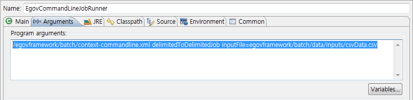
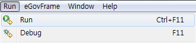
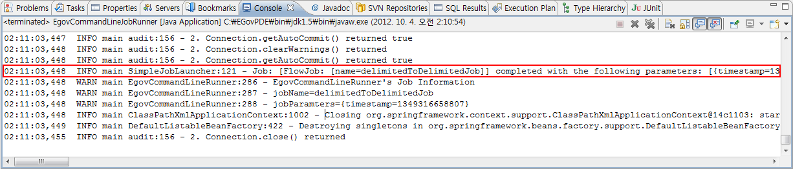

# 배치 템플릿을 이용한 EgovCommandLineRunner 예제

## 개요

CommandLine 배치 템플릿 프로젝트를 이용하여 EgovCommandLineRunner의 사용법을 보여주는 예제이다.

## 설명

### 설정

#### CommandLine 배치 템플릿 프로젝트 생성

**아래를 참고하여 File(SAM) / DB 타입의 CommandLine 배치 템플릿 프로젝트 를 생성한다.**

1. [File(SAM)타입](https://www.egovframe.go.kr/wiki/doku.php?id=egovframework:dev2:bdev:imp:batch_template_wizard:sam_commandline_template_mgmt)
2. [DB타입](./https://www.egovframe.go.kr/wiki/doku.php?id=egovframework:dev2:bdev:imp:batch_template_wizard:db_commandline_template_mgmt)

#### CommandLine 배치 템플릿 전체 설정

**CommandLine 배치 템플릿 설정 파일인 context-commandline.xml을 확인한다.**

✔ CommandLine 배치 템플릿 실행에 필요한 xml 정보가 기술되어 있다.  
✔ Job 관련 xml의 경우 특정 폴더 밑에 Job당 하나의 xml 파일로 나누어져 있다.  

```xml
    <import resource="classpath:/egovframework/batch/context-batch-datasource.xml" />
	<import resource="classpath:/egovframework/batch/context-batch-job-launcher.xml" />
	<import resource="classpath:/egovframework/batch/context-batch-sqlmap.xml" />
	<import resource="classpath:/egovframework/batch/job/*.xml" />
```

**CommandLine 배치 템플릿 설정 파일인 context-batch-datasource.xml을 확인한다.**

✔ datasource 관련 정보가 기술되어 있다.

```xml
    <bean id="egov.propertyConfigurer" class="org.springframework.beans.factory.config.PropertyPlaceholderConfigurer">
        <property name="locations">
            <list>
                <value>classpath:/egovframework/batch/properties/globals.properties</value>
            </list>
        </property>
    </bean>
 
	...
	DBMS별 설정
         ...
    <bean id="transactionManager" class="org.springframework.jdbc.datasource.DataSourceTransactionManager" lazy-init="true">
		<property name="dataSource" ref="egov.dataSource" />
	</bean>
 
	<bean id="lobHandler" class="org.springframework.jdbc.support.lob.DefaultLobHandler"/>
 
	<bean id="customEditorConfigurer" class="org.springframework.beans.factory.config.CustomEditorConfigurer">
		<property name="customEditors">
			<map>
				<entry key="int[]" value="org.springframework.batch.support.IntArrayPropertyEditor" />
			</map>
		</property>
	</bean>
```

**CommandLine 배치 템플릿 설정 파일인 context-batch-job-launcher.xml을 확인한다.**

✔ JobLauncher, JobOperator, JobRepository, JobRegistry, JobExplorer 정보가 기술되어 있다.

```xml
    <bean id="jobLauncher"
		class="org.springframework.batch.core.launch.support.SimpleJobLauncher">
		<property name="jobRepository" ref="jobRepository" />
	</bean>
 
	<bean class="org.springframework.batch.core.configuration.support.JobRegistryBeanPostProcessor">
		<property name="jobRegistry" ref="jobRegistry"/>
	</bean>
 
	<bean id="jobRepository"
		class="org.springframework.batch.core.repository.support.JobRepositoryFactoryBean"
		p:dataSource-ref="egov.dataSource" p:transactionManager-ref="transactionManager" p:lobHandler-ref="lobHandler"/>
 
	<bean id="jobOperator"
		class="org.springframework.batch.core.launch.support.SimpleJobOperator"
		p:jobLauncher-ref="jobLauncher" p:jobExplorer-ref="jobExplorer"
		p:jobRepository-ref="jobRepository" p:jobRegistry-ref="jobRegistry" />
 
	<bean id="jobExplorer"
		class="org.springframework.batch.core.explore.support.JobExplorerFactoryBean"
		p:dataSource-ref="egov.dataSource" />
 
	<bean id="jobRegistry"
		class="org.springframework.batch.core.configuration.support.MapJobRegistry" />
```

**CommandLine 배치 템플릿 설정 파일인 context-batch-sqlmap.xml을 확인한다.**

✔ SQLMapClient 정보가 기술되어 있다.

```xml
    <bean id="sqlMapClient" class="org.springframework.orm.ibatis.SqlMapClientFactoryBean">
		<property name="dataSource" ref="egov.dataSource" />
		<property name="configLocation" value="classpath:/egovframework/sqlmap/brte/sql-map-config.xml" />	
	</bean>
```

### EgovCommandLineJobRunner 구성 및 수행

#### EgovCommandLineJobRunner 구성

**EgovCommandLineJobRunner는 CommandLine 상에서 실행되어야 하기 때문에 main() 메소드를 지니고 있다. 이 메소드 안에서 EgovCommandLineRunner를 이용하여 Job을 실행한다.**

CommandLine상에서 실행하기 위해서는 jobPath와 jobIdentifier을 인수로 받아야 하며, 추가적으로 jobParameter를 인수로 전달 받아서 실행 가능하다.  

✔ EgovCommandLineJobRunner의 main() 메소드내에는 main() 메소드가 받아들인 args에서 jobPath, jobIdentifier, jobParameters, option을 분리하는 기능이 구현되어 있다

```java
	public static void main(String[] args) throws Exception {
		EgovCommandLineRunner command = new EgovCommandLineRunner();
 
                ... 중략 ...
 
        if (jobPath == null || jobIdentifier == null) {
			String message = "At least 2 arguments are required: JobPath and jobIdentifier.";
			logger.error(message);
			command.setMessage(message);
			command.exit(1);
		}
 
		String[] parameters = params.toArray(new String[params.size()]);
 
		int result = command.start(jobPath, jobIdentifier, parameters, opts);
		command.exit(result);
    }
```

#### EgovCommandLineJobRunner 수행

1. CommandLine 배치 템플릿 프로젝트를 선택한다.



2. 메뉴 표시줄에서 Run > Run Configuration 을 선택한다.



3. Argument 탭을 선택하여 아래와 같이 **jobPath**와 **jobIdentifier**를 입력한다. **jobIdentifier** 뒤에 붙은 Argument는 **Job Parameter**로 사용되며, 여러 개의 Argument를 넣을 수 있다.

/egovframework/batch/context-commandline.xml delimitedToDelimitedJob inputFile=egovframework/batch/data/inputs/csvData.csv




✔ 위 화면처럼 Argument와 Argument 사이는 반드시 스페이스로 구분해야 한다.  
✔ CommandLine 배치 템플릿 프로젝트에서 기본적으로 제공하는 jobIdentifier(**Job의 이름**)는 [File(SAM) 타입에서 제공하는 Job의 종류](https://www.egovframe.go.kr/wiki/doku.php?id=egovframework:dev2:bdev:imp:batch_template_wizard:sam_commandline_template_mgmt#%EC%B0%B8%EA%B3%A0%EC%82%AC%ED%95%AD) 와 [DB 타입에서 제공하는 Job의 종류](https://www.egovframe.go.kr/wiki/doku.php?id=egovframework:dev2:bdev:imp:batch_template_wizard:sam_commandline_template_mgmt#%EC%B0%B8%EA%B3%A0%EC%82%AC%ED%95%AD) 를 참고한다.  

4. 메뉴 표시줄에서 **Run** > **Run** 을 선택한다.



### 결과 확인
Console 창에서 Job이 실행되어 **Completed**로 종료되었음을 확인한다.


