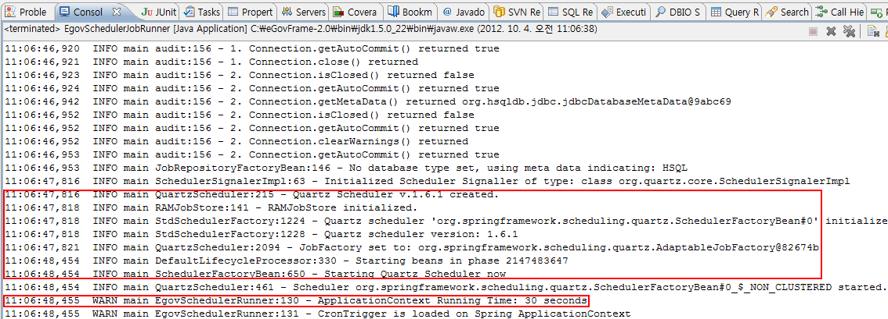
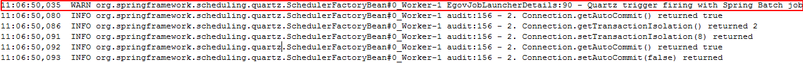
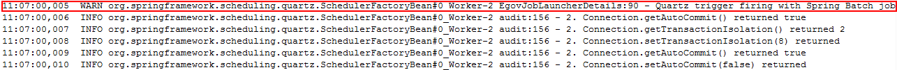
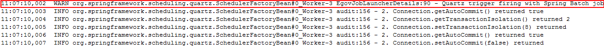

# 배치 템플릿을 이용한 EgovSchedulerRunner 예제

## 개요

Scheduler 기반의 배치 템플릿 프로젝트를 이용하여 EgovSchedulerRunner의 사용법을 보여주는 예제이다.

## 설명

### 설정

#### Scheduler 배치 템플릿 프로젝트 생성

**아래를 참고하여 File(SAM) / DB 타입의 Scheduler 배치 템플릿 프로젝트 를 생성한다.**

1. [File(SAM)타입](https://www.egovframe.go.kr/wiki/doku.php?id=egovframework:dev2:bdev:imp:batch_template_wizard:sam_scheduler_template_mgmt)
2. [DB타입](https://www.egovframe.go.kr/wiki/doku.php?id=egovframework:dev2:bdev:imp:batch_template_wizard:db_scheduler_template_mgmt)

#### Scheduler 배치 템플릿 전체 설정

**Scheduler 배치 템플릿 설정 파일인 context-scheduler.xml을 확인한다.**

✔ Scheduler 배치 템플릿 실행에 필요한 xml 정보와 Scheduler의 Trigger 정보가 기술되어 있다.  
✔ Trigger에 jobDetail(JobDetailBean)과 cronExpression를 설정한다. 기본적으로 매 10초 주기로 jobDetail을 실행하도록 설정되어 있다.  
✔ 다른 Trigger의 사용방법을 알기 위해서는 [Scheduling 서비스](../foundation-layer/scheduling-service.md) 를 참고한다. 

```xml
    <import resource="context-batch-datasource.xml" />
	<import resource="context-batch-job-launcher.xml" />
	<import resource="context-batch-sqlmap.xml"/>
 
	<bean class="org.springframework.scheduling.quartz.SchedulerFactoryBean">
		<property name="triggers">
			<bean id="cronTrigger" class="org.springframework.scheduling.quartz.CronTriggerBean">
				<property name="jobDetail" ref="jobDetail" />
				<property name="cronExpression" value="0/10 * * * * ?" />
			</bean>
		</property>
	</bean>
```

**Scheduler 배치 템플릿 설정 파일인 context-scheduler-job.xml을 확인한다.**

✔ context-scheduler.xml에서 사용한 jobDetail의 클래스(EgovJobLauncherDetails) 정보가 기술되어 있다.  
✔ jobDetail의 jobDataAsMap에 필수적으로 jobName, jobLocator, jobLauncher 등의 세가지 정보를 기술한다.  
✔ 위에 기술한 세가지 정보 외에 jobDataAsMap에 기술하는 값은 Job Parameter를 생성하는데 이용된다.  

예) Input File 경로 , Output File 경로

```xml
    <bean id="jobDetail" class="org.springframework.scheduling.quartz.JobDetailBean">
		<property name="jobClass" value="egovframework.brte.sample.scheduler.support.EgovJobLauncherDetails" />
		<property name="group" value="quartz-batch" />
		<property name="jobDataAsMap">
			<map>
				<entry key="jobName" value="fixedToIbatisJob"/>
				<entry key="jobLocator" value-ref="jobRegistry"/>
				<entry key="jobLauncher" value-ref="jobLauncher"/>
				<entry key="inputFile" value="classpath:/egovframework/batch/data/inputs/txtData.txt"/>
				<entry key="outputFile" value="file:./src/main/resources/egovframework/batch/data/outputs/txtOutput.txt"/>
			</map>
		</property>
	</bean>
```

**Scheduler 배치 템플릿 설정 파일인 context-batch-datasource.xml을 확인한다.**

✔ datasource 관련 정보가 기술되어 있다.

```xml
    <bean id="egov.propertyConfigurer" class="org.springframework.beans.factory.config.PropertyPlaceholderConfigurer">
        <property name="locations">
            <list>
                <value>classpath:/egovframework/batch/properties/globals.properties</value>
            </list>
        </property>
    </bean>
 
	...
	DBMS별 설정
         ...
    <bean id="transactionManager" class="org.springframework.jdbc.datasource.DataSourceTransactionManager" lazy-init="true">
		<property name="dataSource" ref="egov.dataSource" />
	</bean>
 
	<bean id="lobHandler" class="org.springframework.jdbc.support.lob.DefaultLobHandler"/>
 
	<bean id="customEditorConfigurer" class="org.springframework.beans.factory.config.CustomEditorConfigurer">
		<property name="customEditors">
			<map>
				<entry key="int[]" value="org.springframework.batch.support.IntArrayPropertyEditor" />
			</map>
		</property>
	</bean>
```

**Scheduler 배치 템플릿 설정 파일인 context-batch-job-launcher.xml을 확인한다.**

✔ JobLauncher, JobOperator, JobRepository, JobRegistry, JobExplorer 정보가 기술되어 있다.

```xml
    <bean id="jobLauncher"
		class="org.springframework.batch.core.launch.support.SimpleJobLauncher">
		<property name="jobRepository" ref="jobRepository" />
	</bean>
 
	<bean class="org.springframework.batch.core.configuration.support.JobRegistryBeanPostProcessor">
		<property name="jobRegistry" ref="jobRegistry"/>
	</bean>
 
	<bean id="jobRepository"
		class="org.springframework.batch.core.repository.support.JobRepositoryFactoryBean"
		p:dataSource-ref="egov.dataSource" p:transactionManager-ref="transactionManager" p:lobHandler-ref="lobHandler"/>
 
	<bean id="jobOperator"
		class="org.springframework.batch.core.launch.support.SimpleJobOperator"
		p:jobLauncher-ref="jobLauncher" p:jobExplorer-ref="jobExplorer"
		p:jobRepository-ref="jobRepository" p:jobRegistry-ref="jobRegistry" />
 
	<bean id="jobExplorer"
		class="org.springframework.batch.core.explore.support.JobExplorerFactoryBean"
		p:dataSource-ref="egov.dataSource" />
 
	<bean id="jobRegistry"
		class="org.springframework.batch.core.configuration.support.MapJobRegistry" />
```

**Scheduler 배치 템플릿 설정 파일인 context-batch-sqlmap.xml을 확인한다.**

✔ SQLMapClient 정보가 기술되어 있다.

```xml
    <bean id="sqlMapClient" class="org.springframework.orm.ibatis.SqlMapClientFactoryBean">
		<property name="dataSource" ref="egov.dataSource" />
		<property name="configLocation" value="classpath:/egovframework/sqlmap/brte/sql-map-config.xml" />	
	</bean>

```

### EgovSchedulerJobRunner 구성 및 수행

#### EgovSchedulerJobRunner 구성

EgovSchedulerJobRunner의 main() 메소드에서 Scheduler의 jobDetail 클래스(EgovJobLauncherDetails)를 실행하기 위한 순서는 아래와 같다.

1. 실행할 Job이 기술된 xml 파일 경로를 jobPaths 변수에 지정한다.
2. Scheduler 정보가 기술된 xml파일(context-scheduler.xml)의 경로, jobDetail 클래스가 정의된 xml 파일(context-scheduler-job.xml)의 경로, jobPaths 그리고 지연시간(기본: 30초)을 지정한다.
3. start() 메소드를 이용하여 Scheduler를 실행한다.

```java
	public static void main(String[] args) {
 
		List<String> jobPaths = new ArrayList<String>();
 
		/*
		 * 1. SAM 실행 예제(File To File)에서 사용 할 Batch Job이 기술 된 xml파일 경로들((jobPaths)
		 */
		jobPaths.add("/egovframework/batch/job/delimitedToDelimitedJob.xml");
		jobPaths.add("/egovframework/batch/job/fixedToFixedJob.xml");
 
		/*
		 * 2. SAM 실행 예제(File To DB)에서 사용 할 Batch Job이 기술 된 xml파일 경로들((jobPaths)
		 */
		jobPaths.add("/egovframework/batch/job/fixedToIbatisJob.xml");
		jobPaths.add("/egovframework/batch/job/fixedToJdbcJob.xml");
 
		/*
		 * EgovSchedulerRunner에 contextPath, schedulerJobPath, jobPaths를 인수로 넘겨서 실행한다.
		 * contextPath: Batch Job 실행에 필요한 context 정보가 기술된 xml파일 경로
		 * schedulerJobPath: Scheduler의 Trigger가 수행할 SchedulerJob(ex: QuartzJob)이 기술된 xml파일 경로
		 * jobPaths: Batch Job이 기술 된 xml 파일 경로들
		 * delayTime: Scheduler 실행을 위해 ApplicationContext를 종료를 지연시키는 시간(실행시간)
		 *            (기본 30000 milliseconds: 30초) 
		 */
		EgovSchedulerRunner egovSchedulerRunner = new EgovSchedulerRunner(
				"/egovframework/batch/context-batch-scheduler.xml",
				"/egovframework/batch/context-scheduler-job.xml",					
				jobPaths, 30000);	
		egovSchedulerRunner.start();
	}
```

실행된 Scheduler는 context-scheduler.xml에서 설정한 주기, 시간에 맞추어 jobDetail 클래스(EgovJobLauncherDetails)의 executeInternal() 메소드를 호출한다. 메소드 내의 동작은 아래와 같다.

1. jobDataMap에서 jobName, jobParameters(jobDataMap에 설정된 key중 jobName, jobLocator, jobLauncher를 제외한 나머지)를 분리한다.
2. 주기적으로 실행되는 Job의 Job Parameter 유일성을 보장하기 위해 Job Parameter의 timestamp 값을 갱신한다.
3. jobLauncher를 통해 Job을 실행한다.

```java
	@SuppressWarnings("unchecked")
	protected void executeInternal(JobExecutionContext context) {
		Long timestamp = null;
		Map<String, Object> jobDataMap = context.getMergedJobDataMap();
		String jobName = (String) jobDataMap.get(JOB_NAME);
 
		/* 
		 * 주기적으로 실행가능하도록 하기 위해, JobParamter의 timestamp 값을 갱신한다. 
		 */
		if(jobDataMap.containsKey("timestamp")) {
			jobDataMap.remove("timestamp");
		}
		timestamp = new Date().getTime();
		jobDataMap.put("timestamp", timestamp);
 
		log.warn("Quartz trigger firing with Spring Batch jobName="+jobName);
 
		JobParameters jobParameters = getJobParametersFromJobMap(jobDataMap);
		try {
			jobLauncher.run(jobLocator.getJob(jobName), jobParameters);
		}
		catch (JobExecutionException e) {
			log.error("Could not execute job.", e);
		}
	}
```

#### EgovSchedulerJobRunner 수행

메뉴 표시줄에서 **Run** > **Run** 을 선택한다.


### 결과 확인

Console 창에서 Scheduler가 생성되었고, Scheduler의 실행 시간이 30초 임을 확인한다.



Scheduler가 매 10초 간격으로 jobDetail을 실행하여, Spring 배치 Job이 실행되었음을 확인한다.

**11시 6분 50초**



**11시 7분 00초초**



**11시 7분 10초**


