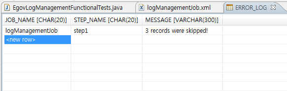

# 배치 실행로그 예제

## 개요
배치 수행 시, 처리되는 배치관련 정보들에 대한 기록(Log)을 Registry 와 DB에 저장되고 이를 확인하는 과정을 보여주는 예제이다.

## 설명
### 설정
#### Job 설정
<b>배치 실행로그 예제의 Job 설정 파일인 logManagementJob.xml을 확인한다.</b>

배치 실행로그 예제를 위해 특별히 Job을 설정하는 내용은 없다. 이 예제에서 제공하는 Job의 상세 내용은 [건너뛰기(Skip)기능 예제](./batch-example-skip_mgmt.md)의 Job 설정과 같으므로 이를 참고한다.

```xml
<job id="logManagementJob" incrementer="incrementer" xmlns="http://www.springframework.org/schema/batch">
    <step id="step1" parent="baseStep">
        <tasklet>
            <chunk reader="fileItemReader" processor="tradeProcessor" writer="tradeWriter" commit-interval="3" skip-limit="10">
                <skippable-exception-classes>
                    <include class="org.springframework.batch.item.file.FlatFileParseException" />
                    <include class="org.springframework.batch.item.WriteFailedException" />
                </skippable-exception-classes>
            </chunk>
        </tasklet>
        <next on="COMPLETED WITH SKIPS" to="errorPrint" />
        <fail on="FAILED" exit-code="FAILED" />
    </step>
    <step id="errorPrint">
        <tasklet ref="errorLogTasklet" />
    </step>
</job>
```

### JunitTest 구성 및 수행
#### JunitTest 구성
<b>logManagementJob 설정과 관련 클래스들로 Junit Test를 수행한다. 이 때 배치가 수행되고, 관련된 내용을 확인할 수 있다.</b>

✔ JunitTest 클래스의 구조는 [배치실행환경 예제 Junit Test 설명](./batch-example-run_junit_test.md)을 참고한다.

✔ assertEquals(BatchStatus.COMPLETED, jobExecution.getStatus()) : 배치수행결과가 COMPLETED 인지 확인한다.

✔ assertEquals(”[logManagementJob]”, jobRegistry.getJobNames().toString()) : Registry에 저장된 JobName 확인한다.

✔ assertEquals(“3 records were skipped!”, simpleJdbcTemplate.queryForObject(“SELECT MESSAGE from ERROR_LOG where JOB_NAME = ?”, String.class, “logManagementJob”)): DB에 저장된 ERROR_LOG 테이블 정보 확인한다.

```java
@ContextConfiguration(locations = {"/egovframework/batch/simple-job-launcher-context.xml",
        "/egovframework/batch/jobs/logManagementJob.xml",
        "/egovframework/batch/job-runner-context.xml" })
public class EgovLogManagementFunctionalTests {
	...
    @Test
    public void testUpdateCredit() throws Exception {
        JobExecution jobExecution = jobLauncherTestUtils.launchJob();
        assertEquals(BatchStatus.COMPLETED, jobExecution.getStatus());

        // Registry : Job 정보에 대한 로그기록
        assertEquals("[logManagementJob]", jobRegistry.getJobNames().toString());

        // DB : ERROR_LOG 테이블의 로그 수
        assertEquals(1, SimpleJdbcTestUtils.countRowsInTable(	simpleJdbcTemplate, "ERROR_LOG"));
        // DB : ERROR_LOG 테이블의 로그 데이터
        assertEquals("3 records were skipped!",simpleJdbcTemplate.queryForObject(
                "SELECT MESSAGE from ERROR_LOG where JOB_NAME = ?",String.class, "logManagementJob"));
    }
}
```

#### JunitTest 수행
수행방법은 [JunitTest 실행](https://www.egovframe.go.kr/wiki/doku.php?id=egovframework:dev2:tst:test_case)을 참고한다. 
### 결과 확인
DB의 ERROR_LOG 테이블을 보면 데이터를 실제로 확인할 수 있다.



## 참고자료
- [JobRegsitry](../../../egovframe-runtime/batch-layer/batch-core-job_registry.md)
- [JobRepository](../../../egovframe-runtime/batch-layer/batch-execution-job-repository.md)