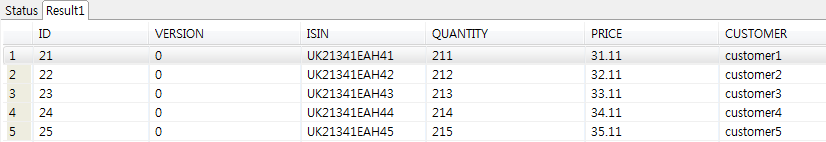

# CompositItem 예제

## 개요
서로 다른 유형으로 업무 처리하는 예제로 스프링 배치에서는 CompositeItemProcessor와 CompositeItemWriter를 제공한다. CompositeItemWriter를 사용하여 서로 다른 타입의 writer로 업무를 처리하는 기능을 예제로 제공한다.

## 설명
### 설정
#### Job 설정
<b>CompositeItem 예제의 Job 설정파일인 compositeItemWriterSampleJob.xml을 확인한다.</b>

CompositeItemWriter는 Item을 delegetes으로 정의된 writer에게 각각 전달하여 처리하도록 한다. 아래의 예제에서는 tradeDao, fileItemWriter1, fileItemWriter2 총 3개의 writer로 설정되어 있다.

✔CompositeItemWriter 사용시에는 step에 delegetes으로 정의된 writer들은 streams로 설정하여야 한다.

```xml
<job id="compositeItemWriterJob" xmlns="http://www.springframework.org/schema/batch" >
	<step id="compositeItemWriterStep1">
		<tasklet>
			<chunk reader="fileItemReader" processor="processor" writer="compositeWriter" commit-interval="1">
				<streams>
					<stream ref="fileItemReader"/>
					<stream ref="fileItemWriter1"/>
					<stream ref="fileItemWriter2"/>
				</streams>
			</chunk>
		</tasklet>
	</step>
</job>
 
<bean id="compositeWriter" class="org.springframework.batch.item.support.CompositeItemWriter">
	<property name="delegates">
		<list>
			<bean class="egovframework.brte.sample.common.domain.trade.TradeWriter">
				<property name="dao" ref="tradeDao" />
			</bean>
			<ref bean="fileItemWriter1" />
			<ref bean="fileItemWriter2" />
		</list>
	</property>
	</bean>
<bean id="tradeDao" class="egovframework.brte.sample.common.domain.trade.JdbcTradeDao">
	<property name="dataSource" ref="dataSource" />
	<property name="incrementer">
		<bean parent="incrementerParent">
			<property name="incrementerName" value="TRADE_SEQ" />
		</bean>
	</property>
</bean>
<bean id="fileItemWriter1" class="org.springframework.batch.item.file.FlatFileItemWriter">
	<property name="name" value="fw1" />
	<property name="resource" value="file:target/test-outputs/CustomerReport1.txt" />
	<property name="lineAggregator">
		<bean class="org.springframework.batch.item.file.transform.PassThroughLineAggregator" />
	</property>
</bean>
 
<bean id="fileItemWriter2" class="org.springframework.batch.item.file.FlatFileItemWriter">
	<property name="name" value="fw2" />
	<property name="resource" value="file:target/test-outputs/CustomerReport2.txt" />
	<property name="lineAggregator">
	       <bean class="org.springframework.batch.item.file.transform.PassThroughLineAggregator" />
	</property>
</bean>
```

### JunitTest 구성 및 수행
#### JunitTest 구성
<b>CompositeItem 설정과 관련 클래스들로 Junit Test를 수행한다. 이 때 배치가 수행되고, 관련된 내용을 확인할 수 있다.</b>

✔ JunitTest 클래스의 구조는 [배치실행환경 예제 Junit Test 설명](../../runtime-example/individual-example/batch-layer/batch-example-run_junit_test.md)을 참고한다.

✔ assertEquals(“COMPLETED”, jobExecution.getExitStatus().getExitCode()) : 배치수행결과가 COMPLETED 인지 확인한다.

✔ checkOutputFile,checkOutputTable 메소드: 배치 수행후 compositeItemWriter에 설정된 writer들이 배치를 실행하였는지 확인한다.

```java
@RunWith(SpringJUnit4ClassRunner.class)
@ContextConfiguration(locations = { "/egovframework/batch/simple-job-launcher-context.xml", "/egovframework/batch/jobs/compositeItemWriterSampleJob.xml",
                               "/egovframework/batch/job-runner-context.xml" })
public class EgovCompositeItemWriterSampleFunctionalTests {
 
	//Trade 테이블의 데이트를 가져오는 쿼리 
	private static final String GET_TRADES = "SELECT isin, quantity, price, customer FROM TRADE order by isin";
 
	//파일에 예상되는 결과값
	private static final String EXPECTED_OUTPUT_FILE = "Trade: [isin=UK21341EAH41,quantity=211,price=31.11,customer=customer1]"
			+ "Trade: [isin=UK21341EAH42,quantity=212,price=32.11,customer=customer2]"
			+ "Trade: [isin=UK21341EAH43,quantity=213,price=33.11,customer=customer3]"
			+ "Trade: [isin=UK21341EAH44,quantity=214,price=34.11,customer=customer4]"
			+ "Trade: [isin=UK21341EAH45,quantity=215,price=35.11,customer=customer5]";
        ...
 
	@Test
	public void testJobLaunch() throws Exception {
 
 
               int before = simpleJdbcTemplate.queryForInt("SELECT COUNT(*) from TRADE");
 
		JobExecution jobExecution =jobLauncherTestUtils.launchJob();
		assertEquals(BatchStatus.COMPLETED, jobExecution.getStatus());
		checkOutputFile("target/test-outputs/CustomerReport1.txt");
		checkOutputFile("target/test-outputs/CustomerReport2.txt");
		checkOutputTable(before);
 
	}
 
	/**
	 * 배치작업 후 Trade 테이블의 데이터 확인
	 * @param 배치작업 전 Trade의 데이터 갯수
	 */
	private void checkOutputTable(int before) {
		final List<Trade> trades = new ArrayList<Trade>() {
			{
				add(new Trade("UK21341EAH41", 211, new BigDecimal("31.11"), "customer1"));
				add(new Trade("UK21341EAH42", 212, new BigDecimal("32.11"), "customer2"));
				add(new Trade("UK21341EAH43", 213, new BigDecimal("33.11"), "customer3"));
				add(new Trade("UK21341EAH44", 214, new BigDecimal("34.11"), "customer4"));
				add(new Trade("UK21341EAH45", 215, new BigDecimal("35.11"), "customer5"));
			}
		};
 
		int after = simpleJdbcTemplate.queryForInt("SELECT COUNT(*) from TRADE");
 
		assertEquals(before + 5, after);
 
 
		simpleJdbcTemplate.getJdbcOperations().query(GET_TRADES, new RowCallbackHandler() {
			private int activeRow = 0;
			public void processRow(ResultSet rs) throws SQLException {
				Trade trade = trades.get(activeRow++);
 
				assertEquals(trade.getIsin(), rs.getString(1));
				assertEquals(trade.getQuantity(), rs.getLong(2));
				assertEquals(trade.getPrice(), rs.getBigDecimal(3));
				assertEquals(trade.getCustomer(), rs.getString(4));
			}
		});
 
	}
   /**
    * 배치작업 후 file의 데이터 확인
    * @param fileName
    * @throws IOException
    */
	private void checkOutputFile(String fileName) throws IOException {
		@SuppressWarnings("unchecked")
		List<String> outputLines = IOUtils.readLines(new FileInputStream(fileName));
 
		String output = "";
		for (String line : outputLines) {
			output += line;
		}
 
		assertEquals(EXPECTED_OUTPUT_FILE, output);
	}
 
}
```

#### JunitTest 수행
수행방법은 [JunitTest 실행](https://www.egovframe.go.kr/wiki/doku.php?id=egovframework:dev2:tst:test_case)을 참고한다.

### 결과 확인
위의 테스트의 결과인 DB의 Trade테이블과 파일들이 생성되었는지를 확인한다.



## 참고자료
- [multidata_process](../../egovframe-runtime/batch-layer/batch-core-multidata_process.md)
- http://static.springsource.org/spring-batch/reference/html/readersAndWriters.html#delegatePatternAndRegistering
