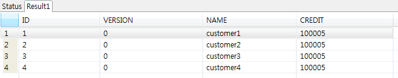

# Ibatis 예제

## 개요
iBatis를 사용하여 Database의 데이터를 읽고 쓰는 기능에 대한 예제를 제공한다. 스프링 배치에서는 IbatisPagingItemReader와 IbatisBatchItemWriter를 제공한다.

## 설명
### 설정
#### Job 설정
**Ibatis 예제의 Job 설정파일인 ibatisIoJob.xml을 확인한다.**

Ibatis 를 연동을 위해 Spring의 SqlMapClientFactoryBean을 통해 sql-map-config 설정 파일과 Ibatis 에 제공될 dataSource 설정한다.  IbatisPagingItemReader와 IbatisBatchItemWriter는 sqlMapClient의 value값으로 정의된 설정파일을 통해 각각 queryId와 statementId의 value값으로 정의된 ID와 동일한 쿼리를 수행한다.

```xml
<bean id="itemReader"class="org.springframework.batch.item.database.IbatisPagingItemReader">
    <property name="queryId" value="getAllCustomerCredits" />
    <property name="sqlMapClient" ref="sqlMapClient" />
</bean>

<bean id="itemWriter" class="org.springframework.batch.item.database.IbatisBatchItemWriter">
<property name="statementId" value="updateCredit" />
<property name="sqlMapClient" ref="sqlMapClient" />
</bean>

<bean id="sqlMapClient" class="org.springframework.orm.ibatis.SqlMapClientFactoryBean">
<property name="dataSource" ref="dataSource" />
<property name="configLocation" value="ibatis-config.xml" />
</bean>
```

#### Ibatis 설정
**Ibatis사용을 위한 기본 설정을 확인한다.**

**sql-map-config**

ibatis-config.xml

```xml
<sqlMapConfig>
 
  <sqlMap resource="ibatis-customer-credit.xml"/>
 
</sqlMapConfig>
```

**sql-map**

ibatis-customer-credit.xml

```xml
<resultMap id="result" class="egovframework.brte.sample.common.domain.trade.CustomerCredit">
    <result property="name" column="NAME" />
    <result property="credit" column="CREDIT" />
</resultMap>

<select id="getAllCustomerCredits" resultMap="result">
    select ID, NAME, CREDIT from CUSTOMER
</select>
...
```

### JunitTest 구성 및 수행
#### JunitTest 구성
**ibatisIo예제를 수행하고 배치작업 결과에 대한 검증을 위해 다음과 같이 @Test를 구성하였다.**

✔ JunitTest 클래스의 구조는 [배치실행환경 예제 Junit Test 설명](../../runtime-example/individual-example/batch-layer/batch-example-run_junit_test.md)을 참고한다.

✔ EgovAbstractIoSampleTests에서 배치작업을 수행하고 배치작업 전후의 데이터를 비교확인한다.

✔ assertEquals(BatchStatus.COMPLETED, jobExecution.getStatus()): 배치수행결과가 COMPLETED 인지 확인한다.

```java
@RunWith(SpringJUnit4ClassRunner.class)
@ContextConfiguration(locations = "/egovframework/batch/jobs/ibatisIoJob.xml")
public class EgovIbatisFunctionalTests extends EgovAbstractIoSampleTests {

    @Before
    public void setUp() {
        simpleJdbcTemplate.update("DELETE from CUSTOMER");

        simpleJdbcTemplate.update("INSERT INTO CUSTOMER (ID, VERSION, NAME, CREDIT) VALUES  (1, 0, 'customer1', 100000)");
        simpleJdbcTemplate.update("INSERT INTO CUSTOMER (ID, VERSION, NAME, CREDIT) VALUES  (2, 0, 'customer2', 100000)");
        simpleJdbcTemplate.update("INSERT INTO CUSTOMER (ID, VERSION, NAME, CREDIT) VALUES  (3, 0, 'customer3', 100000)");
        simpleJdbcTemplate.update("INSERT INTO CUSTOMER (ID, VERSION, NAME, CREDIT) VALUES  (4, 0, 'customer4', 100000)");

    }

    /**
     * 배치결과를 다시 읽을 때  reader 설정하는 메소드
     */
    @Override
    protected void pointReaderToOutput(ItemReader<CustomerCredit> reader) {
        // no-op
    }

}
```

```java
@ContextConfiguration(locations = { "/egovframework/batch/simple-job-launcher-context.xml", "/egovframework/batch/job-runner-context.xml"})
@TestExecutionListeners( { DependencyInjectionTestExecutionListener.class, StepScopeTestExecutionListener.class })
public abstract class EgovAbstractIoSampleTests {

    //배치작업을  test하기 위한 JobLauncherTestUtils
    @Autowired
    @Qualifier("jobLauncherTestUtils")
    private JobLauncherTestUtils jobLauncherTestUtils;

    //배치작업의  reader
    @Autowired
    private ItemReader<CustomerCredit> reader;

    /**
     * 배치작업 테스트
     */
    @Test
    public void testUpdateCredit() throws Exception {

        open(reader);
        List<CustomerCredit> inputs = getCredits(reader);
        close(reader);

        JobExecution jobExecution = jobLauncherTestUtils.launchJob(getUniqueJobParameters());
        assertEquals(BatchStatus.COMPLETED, jobExecution.getStatus());

        pointReaderToOutput(reader);
        open(reader);
        List<CustomerCredit> outputs = getCredits(reader);
        close(reader);

        assertEquals(inputs.size(), outputs.size());
        int itemCount = inputs.size();
        assertTrue(itemCount > 0);

        for (int i = 0; i < itemCount; i++) {
            assertEquals(inputs.get(i).getCredit().add(CustomerCreditIncreaseProcessor.FIXED_AMOUNT).intValue(),
                    outputs.get(i).getCredit().intValue());
        }

    }
 
   ...
}
```

#### JunitTest 수행
수행방법은 [JunitTest 실행](https://www.egovframe.go.kr/wiki/doku.php?id=egovframework:dev2:tst:test_case)을 참고한다.

### 결과 확인
DB의 Customer 테이블의 credit의 값을 살펴보면 Job이 실행되면서 수정된 것을 확인 할 수 있다.



## 참고자료
- [iBATIS Configuration](../../../egovframe-runtime/persistence-layer/dataaccess-configuration_xml.md)
- [Data Access](../persistence-layer/dataaccess-ibatis.md)
- [http://static.springsource.org/spring-batch/reference/html/readersAndWriters.html#IbatisPagingItemReader](http://static.springsource.org/spring-batch/reference/html/readersAndWriters.html#IbatisPagingItemReader)