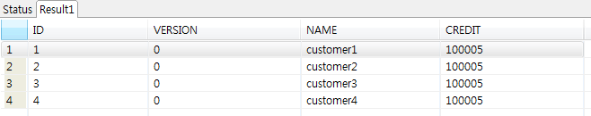

# JdbcCursor 예제

## 개요
DB를 한 행씩 읽어서 데이터처리를 수행하는 기능을 예제로 제공한다. 스프링 배치에서는 JdbcCursorItemReader, HibernateCursorItemReader를 제공한다.

## 설명
### 설정
#### Job 설정
<b>JdbcCursor 예제의 Job 설정파일인 jdbcCursorIoJob.xml을 확인한다.</b>

JdbcCursorItemReader는 아래와 같은 설정들을 포함한다.

- dataSource : 데이터베이스
- sql : 실행할 쿼리
- verifyCursorPosition : 커서위치 확인여부
- rowMapper : SQL의 실행 결과인 ResultSet와 객체를 매핑 시키는 역할

```xml
<bean id="itemReader" class="org.springframework.batch.item.database.JdbcCursorItemReader">
    <property name="dataSource" ref="dataSource"/>
    <property name="sql" value="select ID, NAME, CREDIT from CUSTOMER"/>
    <property name="verifyCursorPosition" value="true"/>
    <property name="rowMapper">
        <bean class="egovframework.brte.sample.common.domain.trade.CustomerCreditRowMapper"/>
    </property>
</bean>
```

### JunitTest 구성 및 수행
#### JunitTest 구성
<b>JdbcCursor 예제를 수행하고 배치작업 결과에 대한 검증을 위해 다음과 같이 @Test를 구성하였다.</b>

✔ JunitTest 클래스의 구조는 [배치실행환경 예제 Junit Test 설명](./batch-example-run_junit_test.md)을 참고한다.

✔ EgovAbstractIoSampleTests에서 배치작업을 수행하고 배치작업 전후의 데이터를 비교확인한다.

✔ assertEquals(BatchStatus.COMPLETED, jobExecution.getStatus()): 배치수행결과가 COMPLETED 인지 확인한다.

```java
@ContextConfiguration(locations = { "/egovframework/batch/simple-job-launcher-context.xml", "/egovframework/batch/job-runner-context.xml"})
@TestExecutionListeners( { DependencyInjectionTestExecutionListener.class, StepScopeTestExecutionListener.class })
public abstract class EgovAbstractIoSampleTests {

  //배치작업을  test하기 위한 JobLauncherTestUtils
  @Autowired
  @Qualifier("jobLauncherTestUtils")
  private JobLauncherTestUtils jobLauncherTestUtils;

  //배치작업의  reader
  @Autowired
  private ItemReader<CustomerCredit> reader;

  /**
   * 배치작업 테스트
   */
  @Test
  public void testUpdateCredit() throws Exception {

    open(reader);
    List<CustomerCredit> inputs = getCredits(reader);
    close(reader);

    JobExecution jobExecution = jobLauncherTestUtils.launchJob(getUniqueJobParameters());
    assertEquals(BatchStatus.COMPLETED, jobExecution.getStatus());

    pointReaderToOutput(reader);
    open(reader);
    List<CustomerCredit> outputs = getCredits(reader);
    close(reader);

    assertEquals(inputs.size(), outputs.size());
    int itemCount = inputs.size();
    assertTrue(itemCount > 0);

    for (int i = 0; i < itemCount; i++) {
      assertEquals(inputs.get(i).getCredit().add(CustomerCreditIncreaseProcessor.FIXED_AMOUNT).intValue(),
              outputs.get(i).getCredit().intValue());
    }

  }
 
   ...
}
```

```java
@ContextConfiguration(locations = { "/egovframework/batch/simple-job-launcher-context.xml", "/egovframework/batch/job-runner-context.xml"})
@TestExecutionListeners( { DependencyInjectionTestExecutionListener.class, StepScopeTestExecutionListener.class })
public abstract class EgovAbstractIoSampleTests {
 
	//배치작업을  test하기 위한 JobLauncherTestUtils
	@Autowired
	@Qualifier("jobLauncherTestUtils")
	private JobLauncherTestUtils jobLauncherTestUtils;
 
	//배치작업의  reader
	@Autowired
	private ItemReader<CustomerCredit> reader;
 
	/**
	 * 배치작업 테스트
	 */
	@Test
	public void testUpdateCredit() throws Exception {
 
		open(reader);
		List<CustomerCredit> inputs = getCredits(reader);
		close(reader);
 
		JobExecution jobExecution = jobLauncherTestUtils.launchJob(getUniqueJobParameters());
		assertEquals(BatchStatus.COMPLETED, jobExecution.getStatus());
 
		pointReaderToOutput(reader);
		open(reader);
		List<CustomerCredit> outputs = getCredits(reader);
		close(reader);
 
		assertEquals(inputs.size(), outputs.size());
		int itemCount = inputs.size();
		assertTrue(itemCount > 0);
 
		for (int i = 0; i < itemCount; i++) {
			assertEquals(inputs.get(i).getCredit().add(CustomerCreditIncreaseProcessor.FIXED_AMOUNT).intValue(),
					outputs.get(i).getCredit().intValue());
		}
 
	}
 
   ...
}
```

#### JunitTest 수행
수행방법은 [JunitTest 실행](https://www.egovframe.go.kr/wiki/doku.php?id=egovframework:dev2:tst:test_case)을 참고한다.

### 결과 확인
1.DB의 cursor 처리는 콘솔로그의 쿼리를 통해 확인할 수 있다. reader가 DB로 부터 데이터를 읽을 때 하나의 데이터를 읽어온다.


2.DB의 Customer 테이블의 credit의 값을 살펴보면 Job이 실행되면서 수정된 것을 확인 할 수 있다.



## 참고자료
- [JDBCCursorItemReader](../../../egovframe-runtime/batch-layer/batch-core-item_reader.md)