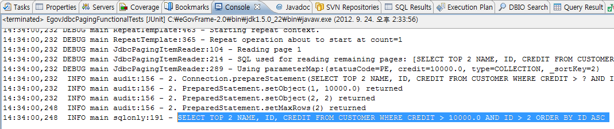
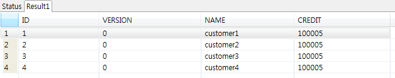

# JdbcPaging 예제

## 개요
DB를 페이지단위로 읽어서 데이터처리를 수행하는 기능을 예제로 제공한다. 스프링 배치에서는 JdbcPagingItemReader,JpaPagingItemReader등을 제공한다.또한 paging쿼리를 제공하는 인터페이스 PagingQueryProvider를 제공하며 각 DB종류별로 OraclePagingQueryProvider, HsqlPagingQueryProvider, MySqlPagingQueryProvider, SqlServerPagingQueryProvider, SybasePagingQueryProvider 등의 구현클래스를 제공한다.

## 설명
### 설정
#### Job 설정
<b>JdbcPaging 예제의 Job 설정파일인 jdbcPagingIoJob.xml을 확인한다.</b>

JdbcPagingItemReader는 아래와 같은 설정들을 포함한다.

- dataSource : 데이터베이스
- rowMapper : SQL의 실행 결과인 ResultSet와 객체를 매핑 시키는 역할
- queryProvider : 페이징 처리를 위한 쿼리를 제공하는 역할
- pageSize : 한 페이지의 DATA 수
- parameterValues : 쿼리의 파라미터 값을 Map으로 지정

```xml
<bean id="itemReader" class="org.springframework.batch.item.database.JdbcPagingItemReader" scope="step">
    <property name="dataSource" ref="dataSource" />
    <property name="rowMapper">
        <bean class="egovframework.brte.sample.common.domain.trade.CustomerCreditRowMapper" />
    </property>
    <property name="queryProvider">
        <bean class="org.springframework.batch.item.database.support.SqlPagingQueryProviderFactoryBean">
            <property name="dataSource" ref="dataSource" />
            <property name="sortKey" value="ID" />
            <!-- Intentionally put sort key second in the query list as a test -->
            <property name="selectClause" value="select NAME, ID, CREDIT" />
            <property name="fromClause" value="FROM CUSTOMER" />
            <property name="whereClause" value="WHERE CREDIT > :credit" />
        </bean>
    </property>
    <property name="pageSize" value="2" />
    <property name="parameterValues">
        <map>
            <entry key="statusCode" value="PE" />
            <entry key="credit" value="#{jobParameters[credit]}" />
            <entry key="type" value="COLLECTION" />
        </map>
    </property>
</bean>
```

### JunitTest 구성 및 수행
#### JunitTest 구성
<b>Delimited 예제를 수행하고 배치작업 결과에 대한 검증을 위해 다음과 같이 @Test를 구성하였다.</b>

✔ JunitTest 클래스의 구조는 [배치실행환경 예제 Junit Test 설명](../../runtime-example/individual-example/batch-layer/batch-example-run_junit_test.md)을 참고한다.

✔ getUniqueJobParameters에서 JobParameter에 쿼리에 필요한 파라미터 정보를 넘긴다.

✔ EgovAbstractIoSampleTests에서 배치작업을 수행하고 배치작업 전후의 데이터를 비교확인한다.

✔ assertEquals(BatchStatus.COMPLETED, jobExecution.getStatus()): 배치수행결과가 COMPLETED 인지 확인한다.

✔ altibase를 사용 할 경우, altibase 버전이 6.1.1일경우에만 정상동작한다.

```java
@RunWith(SpringJUnit4ClassRunner.class)
@ContextConfiguration(locations = "/egovframework/batch/jobs/jdbcPagingIoJob.xml")
public class EgovJdbcPagingFunctionalTests extends EgovAbstractIoSampleTests {
    // SimpleJdbcTemplate
    private SimpleJdbcTemplate simpleJdbcTemplate;

    /**
     * 배치작업 테스트 전에 DB관련 작업
     */
    @Before
    public void setUp() {
        simpleJdbcTemplate.update("DELETE from CUSTOMER");

        simpleJdbcTemplate.update("INSERT INTO CUSTOMER (ID, VERSION, NAME, CREDIT) VALUES  (1, 0, 'customer1', 100000)");
        simpleJdbcTemplate.update("INSERT INTO CUSTOMER (ID, VERSION, NAME, CREDIT) VALUES  (2, 0, 'customer2', 100000)");
        simpleJdbcTemplate.update("INSERT INTO CUSTOMER (ID, VERSION, NAME, CREDIT) VALUES  (3, 0, 'customer3', 100000)");
        simpleJdbcTemplate.update("INSERT INTO CUSTOMER (ID, VERSION, NAME, CREDIT) VALUES  (4, 0, 'customer4', 100000)");

    }

    @Override
    protected JobParameters getUniqueJobParameters() {
        return new JobParametersBuilder(super.getUniqueJobParameters())
                .addDouble("credit", 10000.).toJobParameters();
    }

}
```

```java
@ContextConfiguration(locations = { "/egovframework/batch/simple-job-launcher-context.xml", "/egovframework/batch/job-runner-context.xml"})
@TestExecutionListeners( { DependencyInjectionTestExecutionListener.class, StepScopeTestExecutionListener.class })
public abstract class EgovAbstractIoSampleTests {

    //배치작업을  test하기 위한 JobLauncherTestUtils
    @Autowired
    @Qualifier("jobLauncherTestUtils")
    private JobLauncherTestUtils jobLauncherTestUtils;

    //배치작업의  reader
    @Autowired
    private ItemReader<CustomerCredit> reader;

    /**
     * 배치작업 테스트
     */
    @Test
    public void testUpdateCredit() throws Exception {

        open(reader);
        List<CustomerCredit> inputs = getCredits(reader);
        close(reader);

        JobExecution jobExecution = jobLauncherTestUtils.launchJob(getUniqueJobParameters());
        assertEquals(BatchStatus.COMPLETED, jobExecution.getStatus());

        pointReaderToOutput(reader);
        open(reader);
        List<CustomerCredit> outputs = getCredits(reader);
        close(reader);

        assertEquals(inputs.size(), outputs.size());
        int itemCount = inputs.size();
        assertTrue(itemCount > 0);

        for (int i = 0; i < itemCount; i++) {
            assertEquals(inputs.get(i).getCredit().add(CustomerCreditIncreaseProcessor.FIXED_AMOUNT).intValue(),
                    outputs.get(i).getCredit().intValue());
        }

    }
 
   ...
}
```

#### JunitTest 수행
수행방법은 [JunitTest 실행](https://www.egovframe.go.kr/wiki/doku.php?id=egovframework:dev2:tst:test_case)을 참고한다.

### 결과 확인
1.DB의 페이징 처리는 콘솔로그의 쿼리를 통해 확인할 수 있다. 위의 설정에서 pagesize가 2이므로, reader가 DB로 부터 데이터를 읽을 때 하나의 데이터가 아닌 2개의 데이터를 읽어온다.



2.DB의 Customer 테이블의 credit의 값을 살펴보면 Job이 실행되면서 수정된 것을 확인 할 수 있다.



## 참고자료
- [JdbcPagingItemReader](./batch-core-item_reader.md)