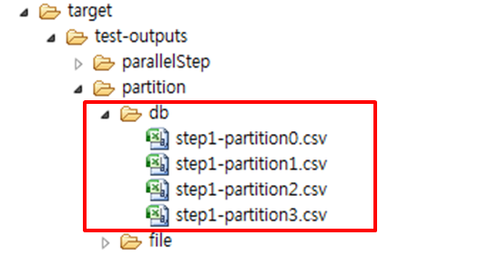

# DB 파티셔닝 예제

## 설명

### 설정

#### Job 설정

**DB 파티셔닝 예제의 Job 설정 파일인 partitionJdbcJob.xml을 확인한다.**

- partitioner : gridSize 수 만큼 Master Step을 파티셔닝하는 EgovColumnRangePartitioner
- grid-size : 생성할 Context 수
- fileNameListener : 입력 리소스명과 같은 이름의 출력리소스명을 설정하고, 입력 리소스가 없다면 설정된 기본값을 이용해 출력위치 및 출력파일명을 지정한다.

```xml
<job id="partitionJdbcJob" xmlns="http://www.springframework.org/schema/batch">
	<step id="step">
		<partition step="step1" partitioner="partitioner">
			<handler grid-size="4" task-executor="taskExecutor"/>
		</partition>
	</step>
</job>
```

```xml
<bean id="partitioner" class="egovframework.brte.sample.example.support.EgovColumnRangePartitioner">
	<property name="dataSource" ref="dataSource" />
	<property name="table" value="CUSTOMER" />
	<property name="column" value="ID" />
</bean>
```

```xml
<step id="step1" xmlns="http://www.springframework.org/schema/batch">
	<tasklet>
		<chunk writer="itemWriter" reader="itemReader"  commit-interval="5" />
		<listeners>
			<listener ref="fileNameListener" />
		</listeners>
	</tasklet>
</step>
 
<bean id="fileNameListener" class="egovframework.brte.sample.example.listener.EgovOutputFileListener" scope="step">
	<property name="path" value="file:./target/test-outputs/partition/db/" />
</bean>
```

#### 클래스 설정

##### Partitioner

EgovColumnRangePartitioner는 gridSize 만큼 테이블 영역을 나누고 영역 수 만큼 Context를 생성하여, 각 영역의 시작열(min)과 마지막열 (max)을 구해 각 Context에 셋팅하는 역할을 한다.   
(결론적으로, gridSize 만큼 Context가 생성되어 여러 Slave Step 들을 사용할 수 있게 됨)

- gridSize : Job 설정파일에서 프로퍼티로 받아온다.

```java
public class EgovColumnRangePartitioner implements Partitioner {
	...
 
	public Map<String, ExecutionContext> partition(int gridSize) {
		// 테이블의 특정컬럼의 가장 작은 값
		int min = jdbcTemplate.queryForInt("SELECT MIN(" + column + ") from " + table);
 
		//  테이블의 특정컬럼의 가장 큰 값
		int max = jdbcTemplate.queryForInt("SELECT MAX(" + column + ") from " + table);
 
		// 하나의 Execution에서 지정될 Data의 범위(크기)
		int targetSize = (max - min) / gridSize + 1;
 
		Map<String, ExecutionContext> result = new HashMap<String, ExecutionContext>();
		int number = 0;
		int start = min;
		// targetSize 만큼 의 Data
		int end = start + targetSize - 1;
 
		// 파티션된 범위의 수만큼 ExecutionContext를 생성하고 minVlaue 와 maxValue를 셋팅 
		while (start <= max) {
 
			ExecutionContext value = new ExecutionContext();
			result.put("partition" + number, value);
 
			if (end >= max) {
				end = max;
			}
			value.putInt("minValue", start);
			value.putInt("maxValue", end);
			start += targetSize;
			end += targetSize;
			number++;
		}
		return result;
	}
}
```

##### EgovOutputFileListener

EgovOutputFileListener 는 [File Partitioner 의 관련 클래스]()에서 상세히 설명되어 있으므로 참조한다.

### JunitTest 구성 및 수행

#### JunitTest 구성

**partitionJdbcJob 설정과 관련 클래스들로 Junit Test를 수행한다. 이 때 배치가 수행되고, 관련된 내용을 확인할 수 있다.**

✔ JunitTest 클래스의 구조는 배치실행환경 예제 Junit Test 설명을 참고한다.  
✔ assertEquals(“COMPLETED”, jobExecution.getExitStatus().getExitCode()) : 배치수행결과가 COMPLETED 인지 확인한다.  
✔ 데이터처리 결과를 확인하기 위해, 배치수행과 개별적으로 배치수행전 후의 inputs, outputs을 생성하여 비교한다.  

```java
@Test
public void testUpdateCredit() throws Exception {
 
	open(inputReader);
	List<CustomerCredit> inputs = new ArrayList<CustomerCredit>(getCredits(inputReader));
	close(inputReader);
 
	JobExecution jobExecution = jobLauncherTestUtils.launchJob();
	assertEquals(BatchStatus.COMPLETED, jobExecution.getStatus());
 
	@SuppressWarnings("unchecked")
	ItemReader<CustomerCredit> outputReader = 
		(ItemReader<CustomerCredit>) applicationContext.getBean("outputTestReader");
	open(outputReader);
	List<CustomerCredit> outputs = new ArrayList<CustomerCredit>(getCredits(outputReader));
	close(outputReader);
 
	assertEquals(inputs.size(), outputs.size());
	int itemCount = inputs.size();
	assertTrue(itemCount > 0);
 
	inputs.iterator();
	for (int i = 0; i < itemCount; i++) {
		assertEquals(inputs.get(i).getCredit().intValue(),outputs.get(i).getCredit().intValue());
	}
}
```

#### JunitTest 수행

수행방법은 [JunitTest 실행](https://www.egovframe.go.kr/wiki/doku.php?id=egovframework:dev2:tst:test_case)을 참고한다.


### 결과확인

생성된 파일의 결과를 확인한다.
배치 수행 결과, DB 데이터를 gridSize로 나뉘어 처리된 결과를 확인할 수 있다.

 


