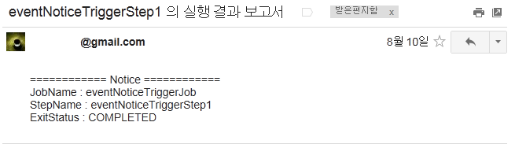

# 이벤트알림 템플릿(Template) 예제

## 개요
전자정부 표준프레임워크의 배치 수행중 특정시점에 이벤트가 발생하는 경우 EventNoticeTrigger를 활용하여 SMS, Email 등을 통해 사용자가 설정한 관련정보를 발신하는 과정을 보여주는 예제이다. EgovEventNoticeTriggerFunctionalTests 예제는 일반 파일을 처리하는 과정에서 특정시점(Step 수행 시)에 배치수행과 관련한 내용을 Email로 보내주는 과정을 보여주는 과정을 보여준다.

## 설명
### 설정
#### Job 설정
<b>이벤트알림 템플릿(Template) 예제의 Job 설정 파일인 eventNoticeTriggerJob.xml을 확인한다.</b>

Job 의 구성을 보면 기본적인 <tasklet> 설정 외에 <listener> 를 통해 EgovEventNoticeCallListener를 호출하도록 설정되어 있고, 관련 클래스인 EgovEventNoticeCallProcessor와 EgovEmailEventNoticeTrigger는 빈으로 등록되어 있다.

```xml
<job id="eventNoticeTriggerJob" xmlns="http://www.springframework.org/schema/batch">
    <step id="eventNoticeTriggerStep1">
        <tasklet>
            <chunk reader="itemReader" writer="itemWriter" commit-interval="2" />
        </tasklet>
        <listeners>
            <listener ref="EventNoticeCallListener" />
        </listeners>
    </step>
</job>
```

```xml
<bean id="EventNoticeCallListener"
      class="egovframework.brte.sample.example.listener.EgovEventNoticeCallProcessor" />
```

```xml
<bean id="EmailEventNoticeTrigger"
	class="egovframework.brte.sample.example.event.EgovEmailEventNoticeTrigger" />
```

####  클래스 설정
<b>Email 전송을 위한 EgovEmailEventNoticeTrigger 클래스의 설정을 확인한다.</b>

Job 수행시 관련정보를 알리기 위한 설정은 [EgovEventNoticeTrigger](../../../egovframe-runtime/batch-layer/batch-core-event_notice_template_mgmt.md)를 상속받은 EgovEmailEventNoticeTrigger에 구현되어 있고, 크게 세 부분으로 구성되어 있다.

1. EgovEmailEventNoticeTrigger 클래스 Email 송수신을 위한 정보를 입력한다

```
수신자 : 복수로 셋팅할 수 있으며 String 배열 형태로 입력한다.
송신자 : 송신자의 메일 주소를 String 형태로 입력한다.
```

```java
public class EgovEmailEventNoticeTrigger extends EgovEventNoticeTrigger {
 
	// 전자우편 수신자 셋팅(배열형태로 입력)
	String[] emailList = { "****@*****" };
 
	// 전자우편 송신자 셋팅
	String emailFromAddress = "****@*****";
 
}
```

2. Email 내용구성은 invoke()의 파라미터로 받아온 정보를 활용한다. 예제에서는 JobExecution를 이용하여 Job이름과 종료상태의 정보로 얻어와 Email 내용을 구성한다.

```java
public void invoke(JobExecution jobExecution) {
	try {
 
		// 전자우편 제목
		String emailSubjectTxt = jobExecution.getJobInstance().getJobName()	+ " 의 실행 결과 보고서"; 
 
		// 전자우편 내용
		String emailMsgTxt = "============ Notice ============"
				+ "\nJobName : " + jobExecution.getJobInstance().getJobName() 
				+ "\nExitStatus : " + jobExecution.getExitStatus().getExitCode();
 
		postMail(emailList, emailSubjectTxt, emailMsgTxt, emailFromAddress);
	} 
}
```

3. Email 전송을 위해 사용할 SMTP서버 정보를 입력한다. 예제에서는 postMail()에 SMTP서버 정보가 설정되어 있고, SMTPAuthenticator 클래스에서 해당 SMTP서버의 username과 password 등 사용자의 계정정보를 입력해야 정상적인 메일발송이 가능하다.

✔ SMTP서버는 사용자의 편의에 따라 변경할 수 있다.

```
username : 해당 메일서버 계정의 메일주소를 입력한다.
password : 해당 메일서버 계정의 패스워드를 입력한다.
```

```java
public class EgovEmailEventNoticeTrigger extends EgovEventNoticeTrigger {
 
	private class SMTPAuthenticator extends javax.mail.Authenticator {
 
		public PasswordAuthentication getPasswordAuthentication() {
 
			String username = "****@****";
			String password = "********"; 
			return new PasswordAuthentication(username, password);
		}
	}
}
```

<b>EgovEventNoticeCallProcessor 클래스를 확인한다.</b>

이 클래스는 전자정부 표준프레임워크에서 제공하는 [프로세서](../../../egovframe-runtime/batch-layer/batch-core-listener.md#작업-전후처리-관리-egovprepostprocessor) 중 EgovStepPostProcessor 클래스를 상속받아 구현되었으며, afterStep 메소드를 통해 리스너가 Step수행 후에 Job과 관련된 정보(StepExecution)를 파라미터로 넘겨주며 EgovEmailEventNoticeTrigger.invoke 메소드를 호출한다.

EgovEventNoticeCallProcessor 내에서 호출되는 EgovEmailEventNoticeTrigger 클래스는 Job 설정에서 Bean으로 등록되어 있다. (Job 설정 참고)

```java
public class EgovEventNoticeCallProcessor<T,S> extends EgovStepPostProcessor<T,S> {
	@Autowired
	EgovEmailEventNoticeTrigger egovEmailEventNoticeTrigger;
 
	public ExitStatus afterStep(StepExecution stepExecution) {
 
		egovEmailEventNoticeTrigger.invoke(stepExecution);
		return stepExecution.getExitStatus();
	}
}
```

✔ 예제에서는 Job 설정파일에서 Step 내부에 Listener 를 설정하고, 여기에 해당하는 프로세서를 상속받아 사용하였으므로 Step과 관련된 작업만 수행되지만, 프로세서 상속 없이 사용자가 별도로 스프링에서 제공하는 [리스너 관련 어노테이션](../../../egovframe-runtime/batch-layer/batch-core-listener.md)과 전자정부에서 제공하는 [이벤트알림 트리거 메소드](../../../egovframe-runtime/batch-layer/batch-core-event_notice_template_mgmt#egoveventnoticetrigger)를 조합해 확장하여 사용하는 방법도 있다. 이는 아래 EventNoticeListener 클래스 예시를 참고한다. (마찬가지로 Job 설정에서 EventNoticeListener 가 빈으로 등록되어야 함)

```java
public class EventNoticeListener {
	@Autowired
	EgovEmailEventNoticeTrigger egovEmailEventNoticeTrigger;
 
 
	// Job 수행완료 후, 전자우편을 전송하기 위한 invoke를 수행
	@AfterJob
	public ExitStatus sendJobNotice(JobExecution jobExecution) {
 
		// 전자우편서비스이용
		egovEmailEventNoticeTrigger.invoke(jobExecution);
		return jobExecution.getExitStatus();
	}
 
	 // Step 수행 완료 후, 전자우편을 전송하기 위한 invoke를 수행
	@AfterStep
	public ExitStatus sendStepNotice(StepExecution stepExecution) {
 
		// 전자우편서비스이용
		egovEmailEventNoticeTrigger.invoke(stepExecution);
		return stepExecution.getExitStatus();
	}
 
	// Read 중 Error 발생시, 전자우편을 전송하기 위한 invoke를 수행
	@OnReadError
	public void sendErrorNotice(Exception e) {
 
		// 전자우편서비스이용
		egovEmailEventNoticeTrigger.invoke(e);
	}
}
```

### JunitTest 구성 및 수행
#### JunitTest 구성
<b>이벤트알림 템플릿(Template) 예제를 수행하고 배치작업 결과에 대한 검증을 위해 다음과 같이 @Test를 구성하였다.</b>

✔ JunitTest 클래스의 구조는 [배치실행환경 예제 Junit Test 설명](./batch-example-run_junit_test.md)을 참고한다.

✔ assertEquals(“COMPLETED”, jobExecution.getExitStatus().getExitCode()) : 배치수행결과가 COMPLETED 인지 확인한다.

```java
@ContextConfiguration(locations = { "/egovframework/batch/jobs/eventNoticeTriggerJob.xml" })
public class EgovEventNoticeTriggerFunctionalTests extends EgovAbstractIoSampleTests {

    @Test
    public void testUpdateCredit() throws Exception {
        JobExecution jobExecution = jobLauncherTestUtils.launchJob(getUniqueJobParameters());

        // 실제 웹페이지에서 메일 수신여부로 성공여부 판단 할 것
        assertEquals("COMPLETED", jobExecution.getExitStatus().getExitCode());
    }
}
```

#### JunitTest 수행
수행방법은 [JunitTest 실행](https://www.egovframe.go.kr/wiki/doku.php?id=egovframework:dev2:tst:test_case)을 참고한다.

### 결과 확인
이 예제의 테스트 결과는 배치수행 결과만 반영하므로, 이벤트알림의 성공여부는 실제 메일계정에 접속하여 Email 수신여부로 판단한다.



## 참고자료
- [이벤트알림 템플릿 관리](/egovframe-runtime/batch-layer/batch-core-event_notice_template_mgmt.md)
- SMTP 서버
  - naver SMTP 서버 : smtp.naver.com
  - daum SMTP 서버 : smtp.hanmail.net
  - Google SMTP 서버 : smtp.google.com