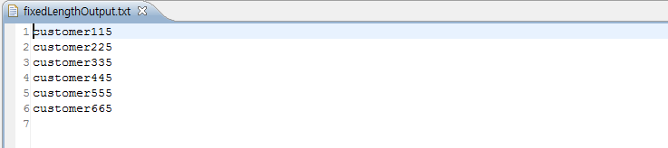

# FixedLength 예제

## 개요
플랫 파일의 데이터를 고정된 길이만큼 처리하는 기능을 예제로 제공한다. 스프링 배치에서는 플랫 파일을 처리하기 위해 FlatFileItemReader와 FlatFileItemWriter를 제공한다.


## 설명
### 설정
#### Job 설정
<b>FixedLength 예제의 Job 설정파일인 fixedLengthIoJob.xml을 확인한다.</b>

FlatFileItemReader는 아래와 같은 설정들을 포함한다.

- resource : 처리해야 할 파일
- lineMapper : 파일의 한 Line씩 처리하는 역할. lineTokenizer와 fieldSetMapper로 구성
  - lineTokenizer : FixedLengthTokenizer을 통해 각 Line을 읽어 고정된 위치로 분리하여 fieldSet객체로 만들어 줌
  - fieldSetMapper : FieldSet을 다시 객체로 매핑시켜줌

```xml
<bean id="itemReader" class="org.springframework.batch.item.file.FlatFileItemReader" scope="step">
	<property name="resource" value="#{jobParameters[inputFile]}" />
	<property name="lineMapper">
		<bean class="org.springframework.batch.item.file.mapping.DefaultLineMapper">
			<property name="lineTokenizer">
				<bean class="org.springframework.batch.item.file.transform.FixedLengthTokenizer">
					<property name="names" value="name,credit" />
					<property name="columns" value="1-9,10-11" />
				</bean>
			</property>
			<property name="fieldSetMapper">
				<bean class="org.springframework.batch.item.file.mapping.BeanWrapperFieldSetMapper">
					<property name="targetType" value="egovframework.brte.sample.common.domain.trade.CustomerCredit" />
				</bean>
			</property>
		</bean>
	</property>
</bean>
```

추가로 FlatFileItemWriter설정에 대해서 설명하면 아래와 같다.

- resource : 결과파일
- lineAggregator : 객체를 파일에 쓸 String으로 변환함. FieldSetCreator에서 객체를 FieldSet으로 변환하고 FormatterLineAggregator를 통해 정의된 format에 따라 String으로 변환함.

```xml
<bean id="itemWriter" class="org.springframework.batch.item.file.FlatFileItemWriter" scope="step">
	<property name="resource" value="#{jobParameters[outputFile]}" />
	<property name="lineAggregator">
		<bean class="org.springframework.batch.item.file.transform.FormatterLineAggregator">
			<property name="fieldExtractor">
				<bean class="org.springframework.batch.item.file.transform.BeanWrapperFieldExtractor">
					<property name="names" value="name,credit" />
				</bean>
			</property>
			<property name="format" value="%-9s%-2.0f" />
		</bean>
	</property>
</bean>
```

### JunitTest 구성 및 수행
#### JunitTest 구성
<b>FixedLength 예제를 수행하고 배치작업 결과에 대한 검증을 위해 다음과 같이 @Test를 구성하였다.</b>

✔ JunitTest 클래스의 구조는 [배치실행환경 예제 Junit Test 설명](../../runtime-example/individual-example/batch-layer/batch-example-run_junit_test.md)을 참고한다.

✔ getUniqueJobParameters에서 JobParameter에 쿼리에 필요한 파라미터 정보를 넘긴다.

✔ EgovAbstractIoSampleTests에서 배치작업을 수행하고 배치작업 전후의 데이터를 비교확인한다.

✔ assertEquals(BatchStatus.COMPLETED, jobExecution.getStatus()): 배치수행결과가 COMPLETED 인지 확인한다.

```java
@RunWith(SpringJUnit4ClassRunner.class)
@ContextConfiguration(locations = "/egovframework/batch/jobs/fixedLengthIoJob.xml")
public class EgovFixedLengthFunctionalTests extends EgovAbstractIoSampleTests {
 
        ...

    @Override
    protected JobParameters getUniqueJobParameters() {
        return new JobParametersBuilder(super.getUniqueJobParameters()).addString("inputFile",
                "/egovframework/data/input/fixedLength.txt").addString("outputFile",
                "file:./target/test-outputs/fixedLengthOutput.txt").toJobParameters();
    }

}
```

```java
@ContextConfiguration(locations = { "/egovframework/batch/simple-job-launcher-context.xml", "/egovframework/batch/job-runner-context.xml"})
@TestExecutionListeners( { DependencyInjectionTestExecutionListener.class, StepScopeTestExecutionListener.class })
public abstract class EgovAbstractIoSampleTests {
 
	//배치작업을  test하기 위한 JobLauncherTestUtils
	@Autowired
	@Qualifier("jobLauncherTestUtils")
	private JobLauncherTestUtils jobLauncherTestUtils;
 
	//배치작업의  reader
	@Autowired
	private ItemReader<CustomerCredit> reader;
 
	/**
	 * 배치작업 테스트
	 */
	@Test
	public void testUpdateCredit() throws Exception {
 
		open(reader);
		List<CustomerCredit> inputs = getCredits(reader);
		close(reader);
 
		JobExecution jobExecution = jobLauncherTestUtils.launchJob(getUniqueJobParameters());
		assertEquals(BatchStatus.COMPLETED, jobExecution.getStatus());
 
		pointReaderToOutput(reader);
		open(reader);
		List<CustomerCredit> outputs = getCredits(reader);
		close(reader);
 
		assertEquals(inputs.size(), outputs.size());
		int itemCount = inputs.size();
		assertTrue(itemCount > 0);
 
		for (int i = 0; i < itemCount; i++) {
			assertEquals(inputs.get(i).getCredit().add(CustomerCreditIncreaseProcessor.FIXED_AMOUNT).intValue(),
					outputs.get(i).getCredit().intValue());
		}
 
	}
 
   ...
}
```

#### JunitTest 수행
수행방법은 [JunitTest 실행](https://www.egovframe.go.kr/wiki/doku.php?id=egovframework:dev2:tst:test_case)을 참고한다.

### 결과 확인
fixedlengthJob의 결과로 아래의 파일이 생성되었는지를 확인한다. Job이 실행되면서 데이터가 수정된 것을 확인 할 수 있다.



## 참고자료
- [FlatFileItemReader](../../egovframe-runtime/batch-layer/batch-core-item_reader.md)
- [FlatFileItemWriter](../../egovframe-runtime/batch-layer/batch-core-item_writer.md)