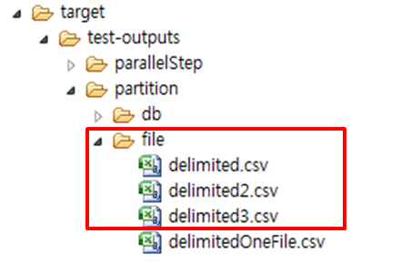

# N:N 파일 Partition 예제

## 설명

### 설정

#### Job 설정

**File 파티셔닝 예제의 Job 설정 파일인 partitionFileJob.xml을 확인한다.**

- ppartitioner : 입력리소스 수 만큼 Master Step을 파티셔닝하는 MultiResourcePartitioner
- grid-size : 생성할 Context 수
- fileNameListener : 입력 리소스명과 같은 이름의 출력리소스명을 설정하고, 입력 리소스가 없다면 설정된 기본값을 이용해 출력위치 및 출력파일명을 지정한다.

```xml
<job id="partitionJob" restartable="true" xmlns="http://www.springframework.org/schema/batch">
	<step id="step">
		<partition step="step1" partitioner="partitioner">
			<handler grid-size="4" task-executor="taskExecutor" />
		</partition>
	</step>
</job>
```

```xml
<bean id="partitioner" class="org.springframework.batch.core.partition.support.MultiResourcePartitioner">
	<property name="resources" value="classpath:egovframework/data/input/delimited*.csv" />
</bean>
```

```xml
<step id="step1" xmlns="http://www.springframework.org/schema/batch">
	<tasklet transaction-manager="transactionManager">
		<chunk writer="itemWriter" reader="itemReader" commit-interval="5" />
		<listeners>
			<listener ref="fileNameListener" />
		</listeners>
	</tasklet>
</step>
```

```xml
<bean id="fileNameListener" class="egovframework.brte.sample.example.listener.EgovOutputFileListener" scope="step">
	<property name="path" value="file:./target/test-outputs/partition/file/" />
</bean>
```

#### 클래스 설정

##### MultiResourcePartitioner

스프링에서 제공하는 MultiResourcePartitioner 를 사용하며 입력리소스의 수(입력파일 수)만큼 Context를 생성하고 출력위치를 셋팅하는 역할을 한다.(Context 생성으로 여러 Slave Step들을 사용할 수 있게 됨)

- gridSize : Job 설정파일에서 프로퍼티로 받아온다. (예제에서는 4로 지정되어 있지만, 입력리소스의 수(3개)를 기준으로 Context가 생기므로 총 3개의 SalveStep이 생긴다.)

```java
public class MultiResourcePartitioner implements Partitioner {
	...
	public Map<String, ExecutionContext> partition(int gridSize) {
		Map<String, ExecutionContext> map = new HashMap<String, ExecutionContext>(gridSize);
		int i = 0;
		for (Resource resource : resources) {
			ExecutionContext context = new ExecutionContext();
			Assert.state(resource.exists(), "Resource does not exist: "+resource);
			try {
				context.putString(keyName, resource.getURL().toExternalForm());
			}
			catch (IOException e) {
				throw new IllegalArgumentException("File could not be located for: "+resource, e);
			}
			map.put(PARTITION_KEY + i, context);
			i++;
		}
		return map;
	}
}
```

##### EgovOutputFileListener

Step 수행 이전에 호출이 되며, 입력리소스의 정보를 이용하여 출력파일에 대한 정보를 생성 및 저장한다.
✔ 출력은 path의 기본값인 “file:./target/output/” 이하에 생성이 되며, 이 경로는 Job 설정파일(path 프로퍼티)에서 변경할 수 있다.

```java
public class EgovOutputFileListener {
	// outputKeyName
	private String outputKeyName = "outputFile";
	// inputKeyName
	private String inputKeyName = "fileName";
	// path
	private String path = "file:./target/output/";
	...
	@BeforeStep
	public void createOutputNameFromInput(StepExecution stepExecution) {
		ExecutionContext executionContext = stepExecution.getExecutionContext();
		String inputName = stepExecution.getStepName().replace(":", "-");
		if (executionContext.containsKey(inputKeyName)) {
			inputName = executionContext.getString(inputKeyName);
		}
		if (!executionContext.containsKey(outputKeyName)) {
			executionContext.putString(outputKeyName, path + FilenameUtils.getBaseName(inputName) + ".csv");
		}
	}
}
```

### JunitTest 구성 및 수행

#### JunitTest 구성

**partitionFileJob 설정과 관련 클래스들로 Junit Test를 수행한다. 이 때 배치가 수행되고, 관련된 내용을 확인할 수 있다.**

✔ JunitTest 클래스의 구조는 [배치실행환경 예제 Junit Test 설명](./batch-example-run_junit_test.md)을 참고한다.  
✔ assertEquals(“COMPLETED”, jobExecution.getExitStatus().getExitCode()) : 배치수행결과가 COMPLETED 인지 확인한다.  
✔ 데이터처리 결과를 확인하기 위해, 배치수행과 개별적으로 배치수행전 후의 inputs, outputs을 생성하여 비교한다.  

```java
@Test
public void testUpdateCredit() throws Exception {
 
	//Job 의 output 자료들을 얻음
	open(inputReader);
	List<CustomerCredit> inputs = new ArrayList<CustomerCredit>(getCredits(inputReader));
	close(inputReader);
 
	//Job 수행
	JobExecution jobExecution = jobLauncherTestUtils.launchJob();
	assertEquals(BatchStatus.COMPLETED, jobExecution.getStatus());
 
	//Job 의 output 자료들을 얻음
	@SuppressWarnings("unchecked")
	ItemReader<CustomerCredit> outputReader = (ItemReader<CustomerCredit>) applicationContext.getBean("outputTestReader");
 
	open(outputReader);
	List<CustomerCredit> outputs = new ArrayList<CustomerCredit>(getCredits(outputReader));
	close(outputReader);
 
	//input과 output 의 자료중 credit 의 값 비교
	assertEquals(inputs.size(), outputs.size());
	int itemCount = inputs.size();
 
	inputs.iterator();
	for (int i = 0; i < itemCount; i++) {
		assertEquals(inputs.get(i).getCredit().intValue(), outputs.get(i).getCredit().intValue());
	}
}
```

#### JunitTest 수행

수행방법은 [JunitTest 실행](https://www.egovframe.go.kr/wiki/doku.php?id=egovframework:dev2:tst:test_case)을 참고한다.


### 결과확인

생성된 파일의 결과를 확인한다. 배치 수행 결과, 세개의 입력파일을 읽고 처리해 각각의 새로운 파일에 쓰여진 것을 확인할 수 있다.

 


